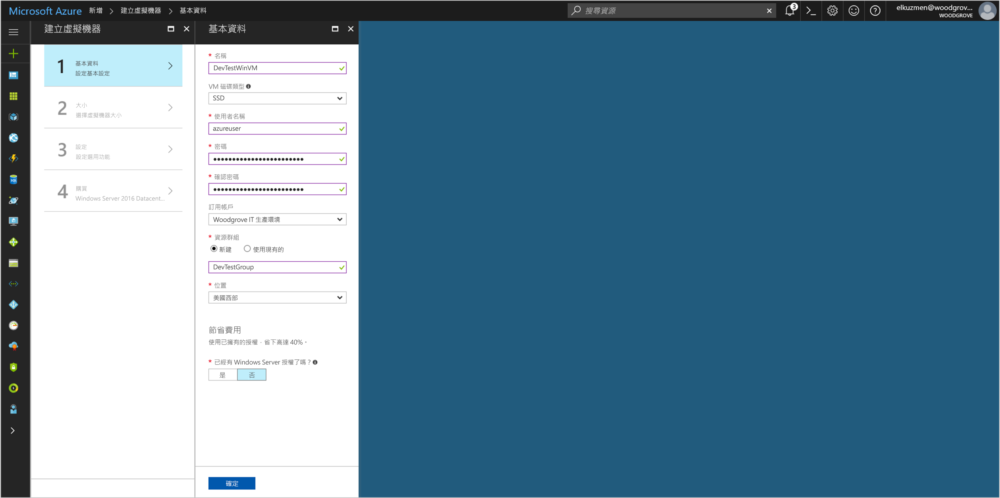

# <a name="tutorial-use-a-windows-vm-managed-identity-to-access-azure-storage"></a>教學課程：使用 Windows VM 受控身分識別來存取 Azure 儲存體

[!INCLUDE[preview-notice](../../../includes/active-directory-msi-preview-notice.md)]

本教學課程會示範如何為 Windows 虛擬機器啟用受控身分識別，並使用該身分識別來存取 Azure 儲存體。  您會了解如何：

> [!div class="checklist"]
> * 在新的資源群組中建立 Windows 虛擬機器 
> * 在 Windows 虛擬機器 (VM) 上啟用受控身分識別
> * 在儲存體帳戶中建立 Blob 容器
> * 將您 Windows VM 的受控身分識別存取權授與儲存體帳戶 
> * 取得存取權，並用來呼叫 Azure 儲存體 

> [!NOTE]
> Azure 儲存體的 Azure Active Directory 驗證處於公開預覽狀態。

## <a name="prerequisites"></a>先決條件

[!INCLUDE [msi-qs-configure-prereqs](../../../includes/active-directory-msi-qs-configure-prereqs.md)]

[!INCLUDE [msi-tut-prereqs](../../../includes/active-directory-msi-tut-prereqs.md)]

## <a name="sign-in-to-azure"></a>登入 Azure

在 [https://portal.azure.com](https://portal.azure.com) 登入 Azure 入口網站。

## <a name="create-a-windows-virtual-machine-in-a-new-resource-group"></a>在新的資源群組中建立 Windows 虛擬機器

在本節中您會建立 Windows VM，稍後會對其授與受控身分識別。

1.  按一下 Azure 入口網站左上角的 [+/建立新服務] 按鈕。
2.  選取 [計算]，然後選取 [Windows Server 2016 Datacenter]。 
3.  輸入虛擬機器資訊。 在此建立的**使用者名稱**和**密碼**是您登入虛擬機器要使用的認證。
4.  在下拉式清單中選擇適用於虛擬機器的適當**訂用帳戶**。
5.  若要選取要在其中建立虛擬機器的新 [資源群組]，請選擇 [新建]。 完成時，按一下 [確定]。
6.  選取 VM 的大小。 若要查看更多大小，請選取 [檢視全部] 或變更 [支援的磁碟類型] 篩選條件。 在 [設定] 刀鋒視窗上，保留預設值並按一下 [確定]。

    

## <a name="enable-managed-identity-on-your-vm"></a>啟用您虛擬機器上的受控身分識別

虛擬機器受控身分識別可讓您從 Azure AD 取得存取權杖，而不需要將憑證放入您的程式碼。 實際上，透過 Azure 入口網站在虛擬機器上啟用受控身分識別會執行兩項工作：向 Azure AD 註冊您的虛擬機器以建立受控身分識別，以及在虛擬機器上設定身分識別。 

1. 巡覽 至新虛擬機器的資源群組，並選取您在上一個步驟中建立的虛擬機器。
2. 在 [設定] 分類下，按一下 [組態]。
3. 若要啟用受控身分識別，請選取 [是]。
4. 按一下 [儲存] 以套用組態。 

## <a name="create-a-storage-account"></a>建立儲存體帳戶 

在本節中，您會建立儲存體帳戶。 

1. 按一下 Azure 入口網站左上角的 [+ 建立資源] 按鈕。
2. 按一下 [儲存體]，然後按一下 [儲存體帳戶 - Blob、檔案、資料表、佇列]。
3. 在 [名稱] 下，輸入儲存體帳戶的名稱。  
4. [部署模型] 和 [帳戶類型] 應該設定為**資源管理員**和儲存體 (一般用途 v1)。 
5. 確定 [訂用帳戶] 和 [資源群組] 符合您在上一個步驟中建立 VM 時指定的值。
6. 按一下頁面底部的 [新增] 。

    

## <a name="create-a-blob-container-and-upload-a-file-to-the-storage-account"></a>建立 Blob 容器，並將檔案上傳至儲存體帳戶

檔案需要 Blob 儲存體，因此您必須建立 Blob 容器，用來儲存檔案。 然後，您可以在新的儲存體帳戶中，將檔案上傳到 Blob 容器。

1. 巡覽回到您新建立的儲存體帳戶。
2. 在 [Blob 服務] 下，按一下 [容器]。
3. 按一下頁面頂端的 [+ 容器]。
4. 在 [新增容器] 下，輸入容器的名稱，然後在 [公用存取層級] 下保留預設值。

    

5. 使用您選擇的編輯器，在本機電腦上建立標題為 hello world.txt 的檔案。  開啟檔案並新增以下文字 (不含引號)："Hello world! :)" 然後加以儲存。 
6. 按一下容器名稱，然後按一下 [上傳]，即可將檔案上傳至新建立的容器
7. 在 [上傳 blob] 窗格的 [檔案] 下，按一下資料夾圖示，然後在本機電腦瀏覽至檔案 **hello_world.txt**、選取檔案，然後按一下 [上傳]。
    

## <a name="grant-your-vm-access-to-an-azure-storage-container"></a>將您的虛擬機器存取權授與 Azure 儲存體容器 

您可以使用 VM 的受控身分識別來擷取 Azure 儲存體 Blob 中的資料。   

1. 巡覽回到您新建立的儲存體帳戶。  
2. 按一下左側面板中的 [存取控制 (IAM)] 連結。  
3. 按一下頁面頂端的 [+ 新增] 以新增虛擬機器的新角色指派。
4. 在 [角色] 下，從下拉式清單中，選取 [儲存體 Blob 資料讀取器 (預覽)]。 
5. 在下一個下拉式清單的 [將存取權指派給] 下，選取 [虛擬機器]。  
6. 接下來，請確保 [訂用帳戶] 下拉式清單中已列出適當的訂用帳戶，然後將 [資源群組] 設定為 [所有資源群組]。  
7. 在 [選取] 下，選擇您的虛擬機器，然後按一下 [儲存]。 

    

## <a name="get-an-access-token-and-use-it-to-call-azure-storage"></a>取得存取權杖，並用來呼叫 Azure 儲存體 

Azure 儲存體原生支援 Azure AD 驗證，因此可以直接接受使用受控身分識別取得的存取權杖。 這是 Azure AD 與 Azure 儲存體整合的一部分，與在連接字串上提供認證不同。

以下 .Net 程式碼範例，是使用存取權杖開啟與 Azure 儲存體的連線，然後再讀取您稍早所建立檔案的內容。 此程式碼必須在虛擬機器上執行，才能夠存取虛擬機器的受控身分識別端點。 需使用 .Net Framework 4.6 或更高版本，才可使用存取權杖方法。 據以取代 `<URI to blob file>` 的值。 您可以瀏覽至您建立並上傳至 Blob 儲存體的檔案，並複製 [概觀] 頁面 [屬性] 下的 [URL]，即可取得此值。

```csharp
using System;
using System.Collections.Generic;
using System.Linq;
using System.Text;
using System.Threading.Tasks;
using System.IO;
using System.Net;
using System.Web.Script.Serialization; 
using Microsoft.WindowsAzure.Storage.Auth;
using Microsoft.WindowsAzure.Storage.Blob;

namespace StorageOAuthToken
{
    class Program
    {
        static void Main(string[] args)
        {
            //get token
            string accessToken = GetMSIToken("https://storage.azure.com/");
           
            //create token credential
            TokenCredential tokenCredential = new TokenCredential(accessToken);

            //create storage credentials
            StorageCredentials storageCredentials = new StorageCredentials(tokenCredential);

            Uri blobAddress = new Uri("<URI to blob file>");

            //create block blob using storage credentials
            CloudBlockBlob blob = new CloudBlockBlob(blobAddress, storageCredentials);
        
            //retrieve blob contents
            Console.WriteLine(blob.DownloadText());
            Console.ReadLine();
        }

        static string GetMSIToken(string resourceID)
        {
            string accessToken = string.Empty;
            // Build request to acquire MSI token
            HttpWebRequest request = (HttpWebRequest)WebRequest.Create("http://169.254.169.254/metadata/identity/oauth2/token?api-version=2018-02-01&resource=" + resourceID);
            request.Headers["Metadata"] = "true";
            request.Method = "GET";

            try
            {
                // Call /token endpoint
                HttpWebResponse response = (HttpWebResponse)request.GetResponse();

                // Pipe response Stream to a StreamReader, and extract access token
                StreamReader streamResponse = new StreamReader(response.GetResponseStream());
                string stringResponse = streamResponse.ReadToEnd();
                JavaScriptSerializer j = new JavaScriptSerializer();
                Dictionary<string, string> list = (Dictionary<string, string>)j.Deserialize(stringResponse, typeof(Dictionary<string, string>));
                accessToken = list["access_token"];
                return accessToken;
            }
            catch (Exception e)
            {
                string errorText = String.Format("{0} \n\n{1}", e.Message, e.InnerException != null ? e.InnerException.Message : "Acquire token failed");
                return accessToken;
            }
        }            
    }
}
```

回應會包含檔案的內容：

`Hello world! :)`

## <a name="next-steps"></a>後續步驟

在此教學課程中，您已學習如何啟用 Windows 虛擬機器受控身分識別來存取 Azure 儲存體。  若要深入了解 Azure 儲存體，請參閱：

> [!div class="nextstepaction"]
> [Azure 儲存體](/azure/storage/common/storage-introduction)


