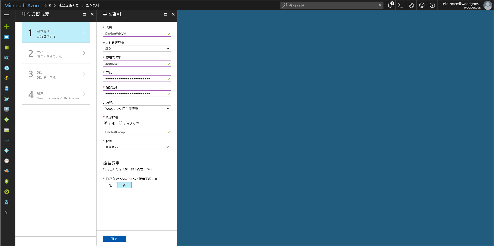
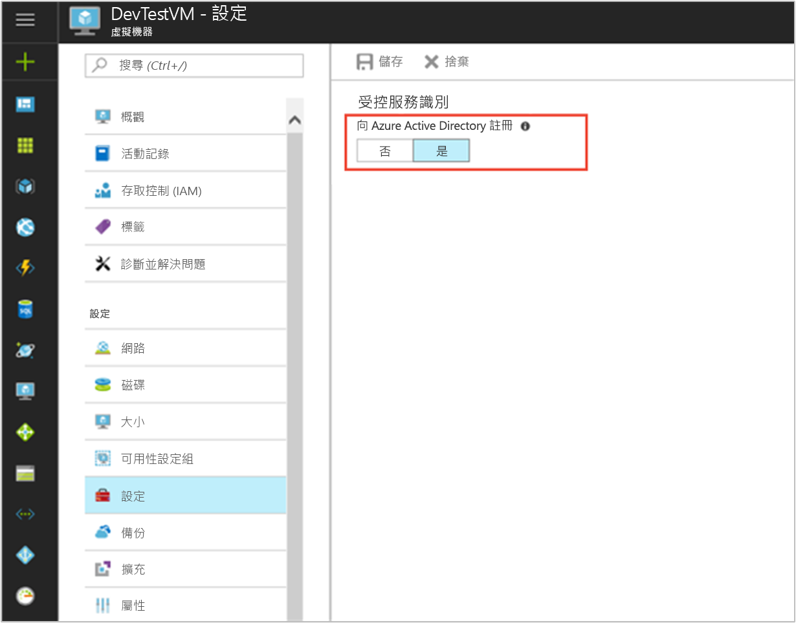

# <a name="tutorial-use-a-windows-vm-msi-to-access-azure-cosmos-db"></a>教學課程：使用 Windows VM MSI 存取 Azure Cosmos DB

[!INCLUDE[preview-notice](../../../includes/active-directory-msi-preview-notice.md)]

本教學課程會示範如何建立和使用 Windows VM MSI 存取 Cosmos DB。 您會了解如何：

> [!div class="checklist"]
> * 建立已啟用 MSI 的 Windows VM 
> * 建立 Cosmos DB 帳戶
> * 將 Windows VM MSI 存取權授與 Cosmos DB 帳戶存取金鑰
> * 使用 Windows VM 的 MSI 來取得存取權杖，並使用它來呼叫 Azure Resource Manager
> * 從 Azure Resource Manager 取得存取金鑰以進行 Cosmos DB 呼叫

## <a name="prerequisites"></a>必要條件

[!INCLUDE [msi-qs-configure-prereqs](../../../includes/active-directory-msi-qs-configure-prereqs.md)]

[!INCLUDE [msi-tut-prereqs](../../../includes/active-directory-msi-tut-prereqs.md)]


## <a name="sign-in-to-azure"></a>登入 Azure

在 [https://portal.azure.com](https://portal.azure.com) 登入 Azure 入口網站。

## <a name="create-a-windows-virtual-machine-in-a-new-resource-group"></a>在新的資源群組中建立 Windows 虛擬機器

此教學課程中，我們會建立新的 Windows VM。  您也可以在現有的 VM 中啟用 MSI。

1. 按一下 Azure 入口網站左上角的 [建立資源] 按鈕。
2. 選取 [計算]，然後選取 [Windows Server 2016 Datacenter]。 
3. 輸入虛擬機器資訊。 在此建立的**使用者名稱**和**密碼**是您登入虛擬機器要使用的認證。
4. 在下拉式清單中選擇適用於虛擬機器的適當**訂用帳戶**。
5. 若要選取要在其中建立虛擬機器的新 [資源群組]，請選擇 [新建]。 完成時，按一下 [確定]。
6. 選取 VM 的大小。 若要查看更多大小，請選取 [檢視全部] 或變更 [支援的磁碟類型] 篩選條件。 在 [設定] 頁面上，保留預設值並按一下 [確定]。

   

## <a name="enable-msi-on-your-vm"></a>在您的 VM 上啟用 MSI 

虛擬機器 MSI 可讓您從 Azure AD 取得存取權杖，而不需要將憑證放入您的程式碼。 實際上，透過 Azure 入口網站在虛擬機器上啟用 MSI 會執行兩項工作：向 Azure AD 註冊您的 VM 以建立受控身分識別，以及在 VM 上設定身分識別。

1. 選取您想要在其中啟用 MSI 的 [虛擬機器]。  
2. 在左側的導覽列上，按一下 [設定] 。 
3. 您會看到**受控服務識別**。 若要註冊並啟用 MSI，請選取 [是]，如果您想要將它停用，則請選擇 [否]。 
4. 按一下 [儲存] 確認儲存設定。  
   

## <a name="create-a-cosmos-db-account"></a>建立 Cosmos DB 帳戶 

如果您還沒有 Cosmos DB 帳戶，請加以建立。 您可以跳過此步驟，直接使用現有的 Cosmos DB 帳戶。 

1. 按一下 Azure 入口網站左上角的 [+/建立新服務] 按鈕。
2. 按一下 [資料庫]，然後按 [Azure Cosmos DB]，新的 [新增帳戶] 面板隨即顯示。
3. 輸入 Cosmos DB 帳戶的 [識別碼]，您稍後將會用到。  
4. **API** 應設定為 "SQL"。 本教學課程中所述的方法可用於其他可用的 API 類型，但本教學課程中的步驟適用於 SQL API。
5. 確定 [訂用帳戶] 和 [資源群組] 符合您在上一個步驟中建立 VM 時指定的值。  選取有可用 Cosmos DB 的 [位置]。
6. 按一下頁面底部的 [新增] 。

## <a name="create-a-collection-in-the-cosmos-db-account"></a>在 Cosmos DB 帳戶中建立集合

接下來，在 Cosmos DB 帳戶中新增您可以在後續步驟中查詢的資料收集。

1. 導覽至您新建立的 Cosmos DB 帳戶。
2. 在 [概觀] 索引標籤上按一下 [+/新增集合] 按鈕，[新增集合] 面板隨即顯示。
3. 為集合指定資料庫識別碼和集合識別碼、選取儲存容量、輸入分割區索引鍵、輸入輸送量值，然後按一下 [確定]。  在本教學課程中，以 "Test" 作為資料庫識別碼和集合識別碼，並選取固定的儲存容量和最小輸送量 (400 RU/s)，即足堪使用。  

## <a name="grant-windows-vm-msi-access-to-the-cosmos-db-account-access-keys"></a>將 Windows VM MSI 存取權授與 Cosmos DB 帳戶存取金鑰

Cosmos DB 原生並不支援 Azure AD 驗證。 不過，您可以使用 MSI 從資源管理員中擷取 Cosmos DB 存取金鑰，然後使用該金鑰來存取 Cosmos DB。 在此步驟中，您會將 MSI 存取權授與 Cosmos DB 帳戶的金鑰。

若要在 Azure Resource Manager 中使用 PowerShell 將 MSI 識別存取權授與 Cosmos DB 帳戶，請更新您環境的 `<SUBSCRIPTION ID>`、`<RESOURCE GROUP>` 和 `<COSMOS DB ACCOUNT NAME>` 值。 將 `<MSI PRINCIPALID>` 取代為[擷取 Linux VM MSI 的 principalID](#retrieve-the-principalID-of-the-linux-VM's-MSI) 時，`az resource show` 命令所傳回的 `principalId` 屬性。  使用存取金鑰時，Cosmos DB 支援兩種層級的資料細微性：對帳戶的讀取/寫入存取，以及對帳戶的唯讀存取。  如果您想要取得帳戶的讀取/寫入金鑰，請指派 `DocumentDB Account Contributor` 角色；如果要取得帳戶的唯讀金鑰，請指派 `Cosmos DB Account Reader Role` 角色：

```azurepowershell
$spID = (Get-AzureRMVM -ResourceGroupName myRG -Name myVM).identity.principalid
New-AzureRmRoleAssignment -ObjectId $spID -RoleDefinitionName "Reader" -Scope "/subscriptions/<mySubscriptionID>/resourceGroups/<myResourceGroup>/providers/Microsoft.Storage/storageAccounts/<myStorageAcct>"
```

## <a name="get-an-access-token-using-the-windows-vms-msi-to-call-azure-resource-manager"></a>使用 Windows VM 的 MSI 來取得存取權杖，並使用它來呼叫 Azure Resource Manager

其餘課程要從稍早建立的 VM 繼續進行。 

在這部分的課程中，需要用到 Azure Resource Manager PowerShell Cmdlet。  如果您沒有安裝它，請[下載最新版本](https://docs.microsoft.com/powershell/azure/overview)之後再繼續。

您也必須在您的 Windows VM 上安裝最新版的 [Azure CLI 2.0](https://docs.microsoft.com/cli/azure/install-azure-cli)。

1. 在 Azure 入口網站中，瀏覽至 [虛擬機器]，移至您的 Windows 虛擬機器，然後在 [概觀] 頁面中，按一下頂端的 [連線]。 
2. 輸入您建立 Windows VM 時新增的**使用者名稱**和**密碼**。 
3. 現在您已經建立虛擬機器的**遠端桌面連線**，請在遠端工作階段中開啟 PowerShell。
4. 使用 Powershell 的 Invoke-WebRequest，向本機 MSI 端點提出要求來取得 Azure Resource Manager 的存取權杖。

    ```powershell
        $response = Invoke-WebRequest -Uri 'http://169.254.169.254/metadata/identity/oauth2/token?api-version=2018-02-01&resource=https%3A%2F%2Fmanagement.azure.com%2F' -Method GET -Headers @{Metadata="true"}
    ```

    > [!NOTE]
    > 「資源」參數的值必須完全符合 Azure AD 的預期。 當使用 Azure Resource Manager 資源 ID 時，必須在 URI 中包含結尾的斜線。
    
    接下來，擷取「Content」元素，該元素會儲存為 $response 物件中的 JavaScript 物件標記法 (JSON) 格式字串。 
    
    ```powershell
    $content = $response.Content | ConvertFrom-Json
    ```
    再來，從回應中擷取存取權杖。
    
    ```powershell
    $ArmToken = $content.access_token
    ```

## <a name="get-access-keys-from-azure-resource-manager-to-make-cosmos-db-calls"></a>從 Azure Resource Manager 取得存取金鑰以進行 Cosmos DB 呼叫

現在，請使用在上一節中擷取的存取權杖，利用 PowerShell 來呼叫 Resource Manager，以擷取 Cosmos DB 帳戶存取金鑰。 取得存取金鑰後，我們即可查詢 Cosmos DB。 別忘了以您自己的值取代 `<SUBSCRIPTION ID>`、`<RESOURCE GROUP>` 和 `<COSMOS DB ACCOUNT NAME>` 參數的值。 將 `<ACCESS TOKEN>` 值取代為您先前擷取的存取權杖。  如果您想要擷取讀取/寫入金鑰，請使用金鑰作業類型 `listKeys`。  如果您想要擷取唯讀金鑰，請使用金鑰作業類型 `readonlykeys`：

```powershell
Invoke-WebRequest -Uri https://management.azure.com/subscriptions/<SUBSCRIPTION-ID>/resourceGroups/<RESOURCE-GROUP>/providers/Microsoft.DocumentDb/databaseAccounts/<COSMOS DB ACCOUNT NAME>/listKeys/?api-version=2016-12-01 -Method POST -Headers @{Authorization="Bearer $ARMToken"}
```
回應會提供金鑰清單。  例如，如果您取得唯讀金鑰：

```powershell
{"primaryReadonlyMasterKey":"bWpDxS...dzQ==",
"secondaryReadonlyMasterKey":"38v5ns...7bA=="}
```
現在，您已有 Cosmos DB 帳戶的存取金鑰，您可以將其傳至 Cosmos DB SDK，並進行呼叫以存取帳戶。  如需快速範例，您可以將存取金鑰傳至 Azure CLI。  您可以透過 Azure 入口網站，從 Cosmos DB 帳戶刀鋒視窗上的 [概觀] 索引標籤取得 <COSMOS DB CONNECTION URL>。  請將 <ACCESS KEY> 取代為您先前取得的值：

```bash
az cosmosdb collection show -c <COLLECTION ID> -d <DATABASE ID> --url-connection "<COSMOS DB CONNECTION URL>" --key <ACCESS KEY>
```

此 CLI 命令會傳回集合的詳細資料：

```bash
{
  "collection": {
    "_conflicts": "conflicts/",
    "_docs": "docs/",
    "_etag": "\"00006700-0000-0000-0000-5a8271e90000\"",
    "_rid": "Es5SAM2FDwA=",
    "_self": "dbs/Es5SAA==/colls/Es5SAM2FDwA=/",
    "_sprocs": "sprocs/",
    "_triggers": "triggers/",
    "_ts": 1518498281,
    "_udfs": "udfs/",
    "id": "Test",
    "indexingPolicy": {
      "automatic": true,
      "excludedPaths": [],
      "includedPaths": [
        {
          "indexes": [
            {
              "dataType": "Number",
              "kind": "Range",
              "precision": -1
            },
            {
              "dataType": "String",
              "kind": "Range",
              "precision": -1
            },
            {
              "dataType": "Point",
              "kind": "Spatial"
            }
          ],
          "path": "/*"
        }
      ],
      "indexingMode": "consistent"
    }
  },
  "offer": {
    "_etag": "\"00006800-0000-0000-0000-5a8271ea0000\"",
    "_rid": "f4V+",
    "_self": "offers/f4V+/",
    "_ts": 1518498282,
    "content": {
      "offerIsRUPerMinuteThroughputEnabled": false,
      "offerThroughput": 400
    },
    "id": "f4V+",
    "offerResourceId": "Es5SAM2FDwA=",
    "offerType": "Invalid",
    "offerVersion": "V2",
    "resource": "dbs/Es5SAA==/colls/Es5SAM2FDwA=/"
  }
}
```

## <a name="next-steps"></a>後續步驟

在本教學課程中，您已學習如何建立 Windows 受控服務識別以存取 Cosmos DB。  若要深入了解 Cosmos DB，請參閱：

> [!div class="nextstepaction"]
>[Azure Cosmos DB 概觀](/azure/cosmos-db/introduction)


