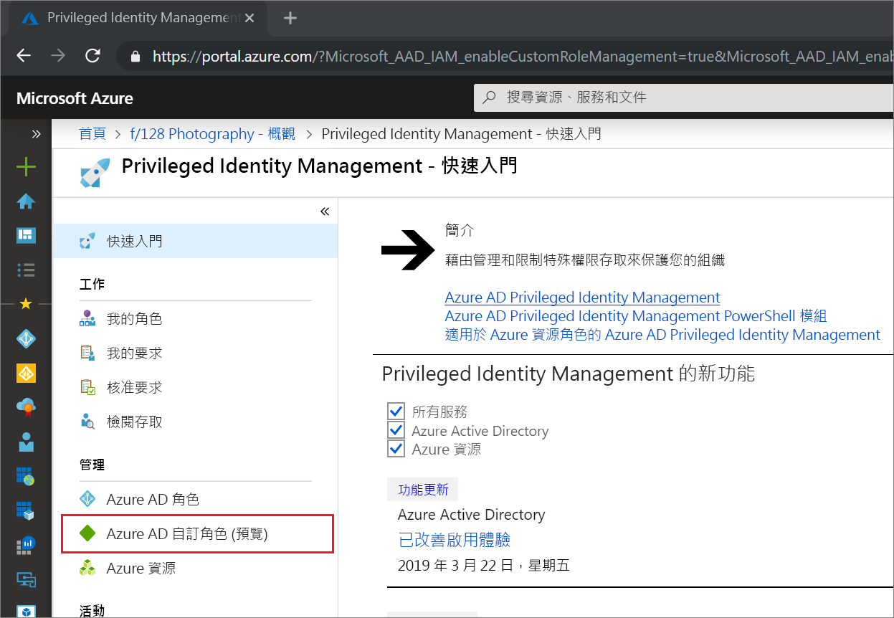
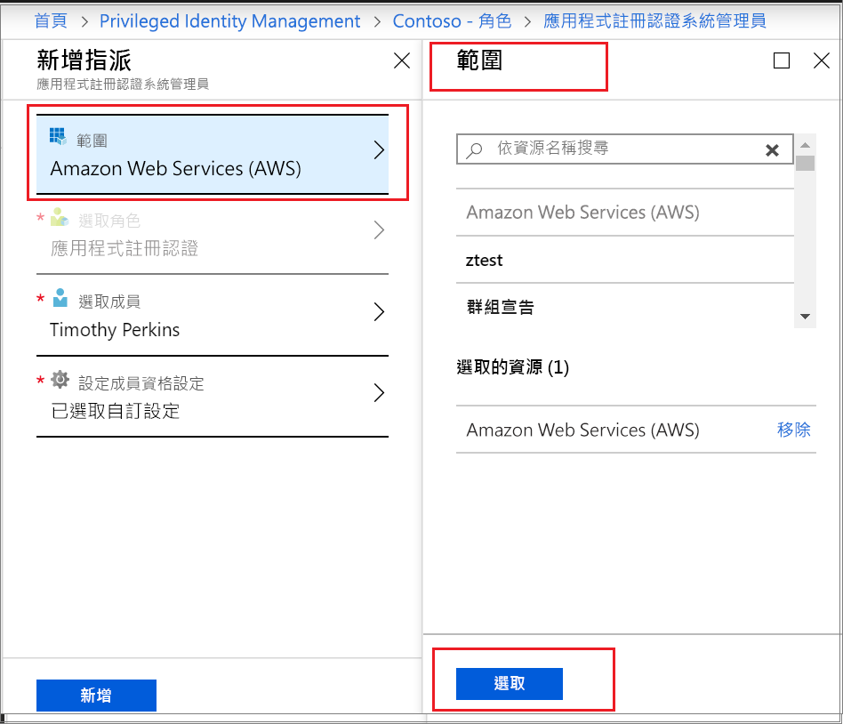

# 在 Privileged Identity Management (PIM) 中啟用 Azure AD 自訂角色

Azure Active Directory (Azure AD) 中的 Privileged Identity Management 現在支援對為了在「身分識別與存取管理」管理體驗中管理應用程式而建立的自訂角色進行 Just-In-Time 和有時限的指派。 如需關於在 Azure AD 中建立自訂角色以委派應用程式管理的詳細資訊，請參閱 [Azure Active Directory 中的自訂系統管理員角色 (預覽)](../users-groups-roles/roles-custom-overview.md)。

> [!NOTE]
> 在預覽期間，Azure AD 自訂角色不會與內建目錄角色整合。 在功能正式推出後，角色管理就會在內建角色體驗中進行。

## 啟用角色

當您需要啟動 Azure AD 自訂角色時，請選取 Privileged Identity Management 中的 [我的角色] 導覽選項來要求啟用。

1. 登入 [Azure 入口網站](https://portal.azure.com)。
1. 開啟 Azure AD [Privileged Identity Management](https://portal.azure.com/?Microsoft_AAD_IAM_enableCustomRoleManagement=true&Microsoft_AAD_IAM_enableCustomRoleAssignment=true&feature.rbacv2roles=true&feature.rbacv2=true&Microsoft_AAD_RegisteredApps=demo#blade/Microsoft_Azure_PIMCommon/CommonMenuBlade/quickStart)。

1. 選取[Azure AD 自訂角色]，以查看您符合資格的 Azure AD 自訂角色指派清單。

   

1. 在 [Azure AD 自訂角色 (預覽)] 頁面上，尋找您需要的指派。
1. 選取 [啟用您的角色]，以開啟 [啟用] 頁面。
1. 如果您的角色需要多重要素驗證，請選取 [先驗證您的身分識別後再繼續]。 您的每個工作階段只需驗證一次。
1. 選取 [驗證我的身分識別]，並依照指示提供任何其他安全性驗證。
1. 若要指定自訂應用程式範圍，請選取 [範圍] 以開啟篩選窗格。 您應在所需的最小範圍內要求角色的存取權。 如果您的指派是在應用程式範圍內，則只能在該範圍內啟用。

   

1. 如有需要，請指定自訂的啟用開始時間。 使用時，角色成員會在指定的時間啟用。
1. 在 [原因] 方塊中輸入此啟用要求的原因。 這在角色設定中可以是必要或非必要的項目。
1. 選取 [ **啟用**]。

如果角色不需要核准，則會根據您的設定加以啟用，並新增至作用中角色的清單。 如果您想要使用已啟用的角色，請從[在 Privileged Identity Management 中指派 Azure AD 自訂角色](azure-ad-custom-roles-assign.md)中的步驟開始操作。

如果角色需要核准才能啟用，您將會收到 Azure 通知，告知您要求正在等待核准。

## 後續步驟

- [指派 Azure AD 自訂角色](azure-ad-custom-roles-assign.md)
- [移除或更新 Azure AD 自訂角色指派](azure-ad-custom-roles-update-remove.md)
- [設定 Azure AD 自訂角色指派](azure-ad-custom-roles-configure.md)
- [Azure AD 中的角色定義](../users-groups-roles/directory-assign-admin-roles.md)
