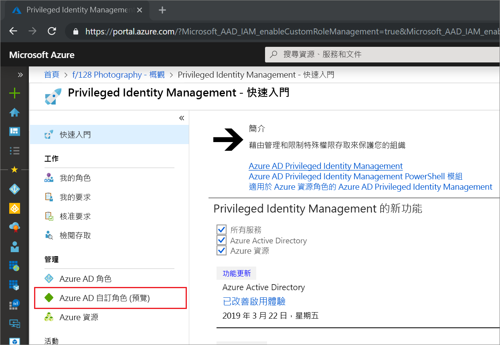

# 在 Privileged Identity Management 中更新或移除已指派的 Azure AD 自訂角色

本文說明如何使用 Privileged Identity Management (PIM) 對為了在 Azure Active Directory (Azure AD) 管理體驗中管理應用程式而建立的自訂角色更新或移除 Just-In-Time 和有時限的指派。 

- 如需關於在 Azure AD 中建立自訂角色以委派應用程式管理的詳細資訊，請參閱 [Azure Active Directory 中的自訂系統管理員角色 (預覽)](../users-groups-roles/roles-custom-overview.md)。 
- 如果您尚未使用 Privileged Identity Management，請在[開始使用 Privileged Identity Management](pim-getting-started.md) 中取得詳細資訊。

> [!NOTE]
> 在預覽期間，Azure AD 自訂角色不會與內建目錄角色整合。 在功能正式推出後，角色管理就會在內建角色體驗中進行。

## 更新或移除指派

請依照下列步驟來更新或移除現有的角色指派。

1. 使用指派給「特殊權限角色管理員」角色的使用者帳戶，在 Azure 入口網站中登入 [Privileged Identity Management](https://portal.azure.com/?Microsoft_AAD_IAM_enableCustomRoleManagement=true&Microsoft_AAD_IAM_enableCustomRoleAssignment=true&feature.rbacv2roles=true&feature.rbacv2=true&Microsoft_AAD_RegisteredApps=demo#blade/Microsoft_Azure_PIMCommon/CommonMenuBlade/quickStart)。
1. 選取 [Azure AD 自訂角色 (預覽)]。

    

1. 選取 [角色]，以查看 Azure AD 應用程式自訂角色的 [指派] 清單。

    ![選取 [角色] 查看合格角色指派的清單](./media/azure-ad-custom-roles-update-remove/assignments-list.png)

1. 選取要更新或移除的角色。
1. 在 [合格角色] 或 [有效角色] 索引標籤上尋找角色指派。
1. 選取 [更新] 或 [移除] 以更新或移除角色指派。

    ![在合格角色指派中選取 [移除] 或 [更新]](./media/azure-ad-custom-roles-update-remove/remove-update.png)

## 後續步驟

- [啟用 Azure AD 自訂角色](azure-ad-custom-roles-assign.md)
- [指派 Azure AD 自訂角色](azure-ad-custom-roles-assign.md)
- [設定 Azure AD 自訂角色指派](azure-ad-custom-roles-configure.md)
