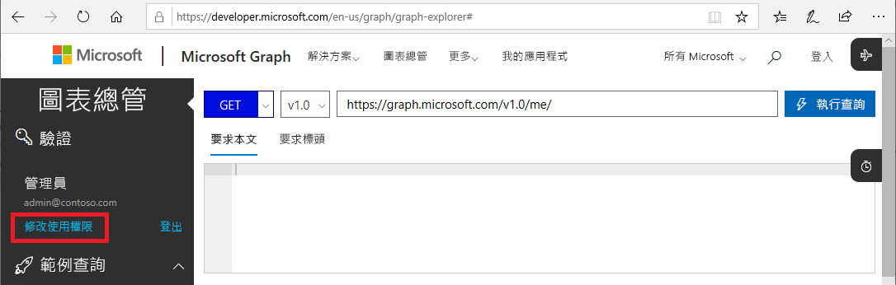
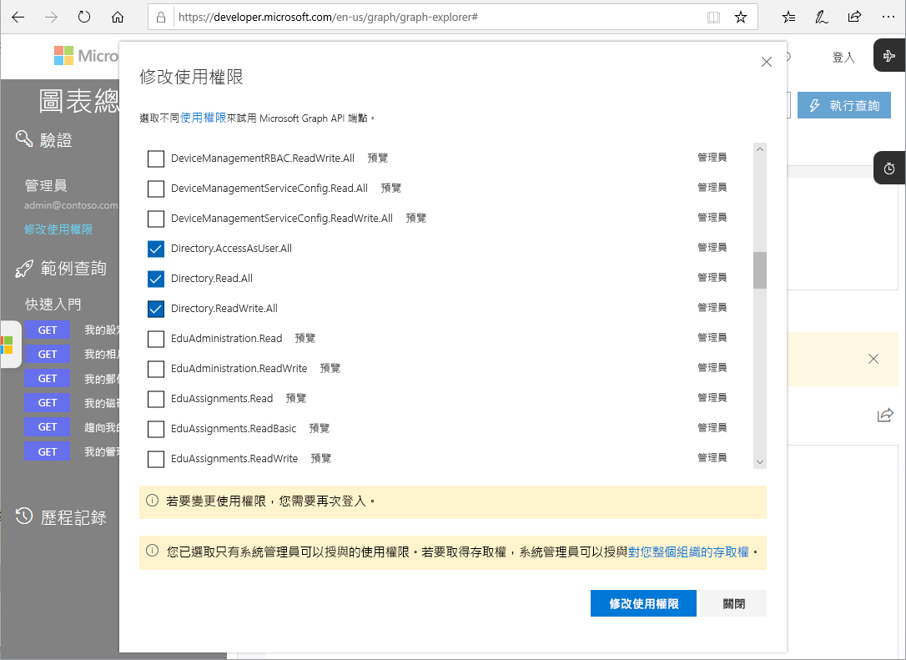

# 適用於 PIM 的 Microsoft Graph API (預覽)

對於大部分可使用 Azure 入口網站在 Azure Active Directory (Azure AD) Privileged Identity Management (PIM) 中執行的工作，您也可以使用 [Microsoft Graph API](https://developer.microsoft.com/graph/docs/concepts/overview) 來執行。 本文將說明使用適用於 PIM 的 Microsoft Graph AP 時，應了解的一些重要概念。 如需有關 Microsoft Graph API 的詳細資訊，請參閱 [Azure AD Privileged Identity Management API 參考](https://developer.microsoft.com/graph/docs/api-reference/beta/resources/privilegedidentitymanagement_root)。

> [!IMPORTANT]
> Microsoft Graph 中 /beta 版本底下的 API 皆處於預覽階段，可能會有所變更。 不支援在生產應用程式中使用這些 API。

## 所需的權限

若要呼叫適用於 PIM 的 Microsoft Graph API，您必須擁有下列**一個或多個**權限：

- `Directory.AccessAsUser.All`
- `Directory.Read.All`
- `Directory.ReadWrite.All`
- `PrivilegedAccess.ReadWrite.AzureAD`

### 設定權限

應用程式若要呼叫適用於 PIM 的 Microsoft Graph API，則一定要有必要權限。 指定必要權限的最簡單方式是使用 [Azure AD 同意架構](../develop/consent-framework.md)。

### 在 Graph 總管中的設定權限

如果您使用 Graph 總管來測試呼叫，您可以在工具中指定權限。

1. 以全域管理員的身分登入 [Graph 總管](https://developer.microsoft.com/graph/graph-explorer)。

1. 按一下 [修改權限]  。

    

1. 在您想要包含的權限旁新增核取記號。 Graph 總管中尚無法使用 `PrivilegedAccess.ReadWrite.AzureAD`。

    

1. 按一下 [修改權限]  以套用權限變更。

## 後續步驟

- [Azure AD Privileged Identity Management API 參考](https://developer.microsoft.com/graph/docs/api-reference/beta/resources/privilegedidentitymanagement_root)
