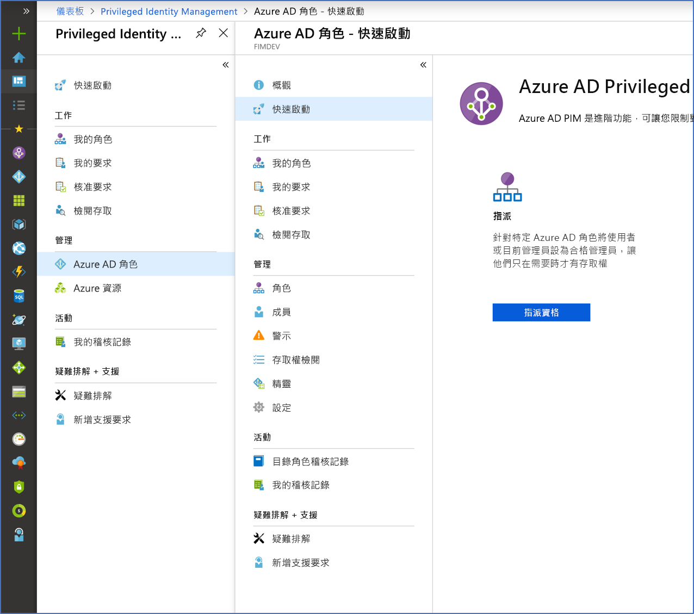

# 什麼是 Azure AD Privileged Identity Management？

Azure Active Directory (Azure AD) Privileged Identity Management (PIM) 是一項服務，可供您管理、控制和監視組織內重要資源的存取。 這包括存取 Azure AD、Azure 資源與其他 Microsoft 線上服務 (如 Office 365 或 Microsoft Intune) 中的資源。

## 為什麼應該使用 PIM？

組織想要將能夠存取安全資訊或資源的人數降到最低，因為這樣可以降低惡意執行者取得該存取權，或者授權使用者無意中影響到敏感資源的機率。 不過，使用者仍然需要在 Azure AD、Azure、Office 365 或 SaaS 應用程式中執行特殊權限作業。 組織可以將 Azure 資源和 Azure AD 的 Just-In-Time (JIT) 特殊存取權限提供給使用者。 需要針對這些使用者使用其系統管理員權限的方式進行監督。 PIM 可協助減少過多、不必要或誤用的存取權限風險。

## PIM 有何用途？

PIM 基本上可協助您管理您所關切資源的五個 W (何人、何事、何時、何地及何因)。 以下是 PIM 的一些主要功能：

- 提供 Azure AD 和 Azure 資源的 **Just-In-Time** 特殊存取權限
- 使用開始和結束日期指派**有時限**的資源存取權
- 需要**核准**才能啟用特殊權限角色
- 強制**多重要素驗證**以啟用任何角色
- 使用**理由**來了解使用者啟用的原因
- 在特殊權限角色啟用時取得**通知**
- 進行**存取權檢閱**以確保使用者仍然需要角色
- 下載**稽核歷程記錄**以供內部或外部稽核

## 必要條件

若要使用 PIM，您必須具有下列其中一個付費或試用授權。 如需詳細資訊，請參閱[什麼是 Azure Active Directory？](../fundamentals/active-directory-whatis.md)。

- Azure AD Premium P2
- Enterprise Mobility + Security (EMS) E5

如需使用者的授權相關資訊，請參閱[使用 PIM 的授權需求](subscription-requirements.md)。

## 術語

若要深入了解 PIM 及其文件，請檢閱下列詞彙。

| 詞彙或概念 | 角色指派類別 | 說明 |
| --- | --- | --- |
| 合格 | 類型 | 需要使用者執行一或多個動作才能使用角色的角色指派。 如果使用者已有資格使用角色，即表示他們可以在需要執行特殊權限工作時啟用該角色。 使用者不論是具有永久角色指派還是合格角色指派，獲得的存取權並無差異。 唯一的差異在於有些使用者並不一直需要該存取權。 |
| 作用中 | 類型 | 不要求使用者執行任何動作即可使用角色的角色指派。 指派為有效的使用者具有指派給角色的權限。 |
| 啟用 |  | 此程序會執行一或多個動作，讓使用者使用有資格使用的角色。 動作可能包含執行多重要素驗證 (MFA) 檢查、提供業務理由，或是向指定的核准者要求核准。 |
| 已指派 | State | 具有作用中角色指派的使用者。 |
| 已啟用 | State | 具有合格角色指派、已執行動作來啟用角色，且目前為作用中的使用者。 |
| 永久合格 | Duration | 使用者一律有資格啟用角色的角色指派。 |
| 永久有效 | Duration | 使用者一律可以使用角色而不需執行任何動作的角色指派。 |
| 合格過期 | Duration | 使用者有資格在指定的開始和結束日期內啟用角色的角色指派。 |
| 有效過期 | Duration | 使用者可以在指定的開始和結束日期內使用角色而不需執行任何動作的角色指派。 |

## PIM 的外觀

設定 PIM 後，您會在左側導覽功能表中看到 [工作]、[管理] 和 [活動] 選項。 身為系統管理員，您會在管理 **Azure AD 角色**和 **Azure 資源**角色之間做選擇。 當您選擇要管理的角色類型時，您會看到該角色類型適用的一組類似選項。

## PIM 中的角色與角色權限

如果您是使用 PIM 的第一人，則會自動獲指派目錄中的[安全性系統管理員](../users-groups-roles/directory-assign-admin-roles.md#security-administrator)和[特殊權限角色管理員](../users-groups-roles/directory-assign-admin-roles.md#privileged-role-administrator)角色。

對於 Azure AD 角色，只有具特殊權限角色系統管理員角色的使用者可以管理 PIM 中其他系統管理員的指派。 您可以[授與其他系統管理員存取權以管理 PIM](pim-how-to-give-access-to-pim.md)。 全域管理員、安全性系統管理員和安全性讀取者可以在 PIM 中檢視 Azure AD 角色指派。

對於 Azure 資源角色，只有訂用帳戶管理員、資源擁有者、或資源使用者存取系統管理員可以管理 PIM 中其他系統管理員的指派。 作為特殊權限角色系統管理員、安全性系統管理員或安全性讀取者的使用者，依預設沒有存取權限可檢視 PIM 中的 Azure 資源角色指派。

## 案例

PIM 支援下列案例：

**身為特殊權限角色管理員，您可以：**

- 啟用特定角色的核准
- 指定核准者使用者和/或群組來核准要求
- 檢視所有特殊權限角色的要求和核准歷程記錄

**身為核准者，您可以：**

- 檢視待決的核准 (要求)
- 核准或拒絕提高角色權限 (單一和/或大量) 的要求
- 提供我的核准/拒絕理由 

**身為合格角色使用者，您可以：**

- 要求啟用需要核准的角色
- 檢視要啟用之要求的狀態
- 如果已核准啟用，在 Azure AD 中完成您的工作

## 後續步驟

- [開始使用 PIM](pim-getting-started.md)
- [使用 PIM 的授權需求](subscription-requirements.md)
- [在 Azure AD 中保護混合式部署和雲端部署的特殊權限存取](../users-groups-roles/directory-admin-roles-secure.md?toc=%2fazure%2factive-directory%2fprivileged-identity-management%2ftoc.json)
