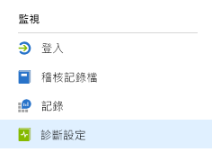
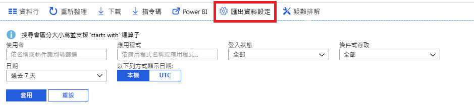

# 什麼是 Azure Active Directory 監視？ (預覽)

透過 Azure Active Directory (Azure AD) 監視，您現在可以將 Azure AD 活動記錄路由傳送至不同的端點。 您可以保留它以供長期使用，或將它與第三方安全性資訊與事件管理 (SIEM) 工具整合，以深入了解您的環境。

目前，您可以將記錄路由傳送至：

- 一個 Azure 儲存體帳戶。
- Azure 事件中樞，因此您可以與 Splunk 和 Sumologic 執行個體整合。
- Azure Log Analytics 工作區，您可在其中分析資料、建立儀表板以及特定事件的警示

## 診斷設定組態

若要設定 Azure AD 活動記錄的監視設定，請先登入 [Azure 入口網站](https://portal.azure.com)，然後選取 **Azure Active Directory**。 在此，您有兩種方式可存取診斷設定組態頁面：

* 從 [監視] 區段選取 [診斷設定]。

    
    
* 選取 [稽核記錄] 或 [登入]，然後選取 [匯出設定]。 

    

## 將記錄路由傳送至儲存體帳戶

將記錄路由傳送至 Azure 儲存體帳戶，您可以將它保留超過[保留原則](reference-reports-data-retention.md)中所述的預設保留期。 了解如何[將資料路由傳送至儲存體帳戶](quickstart-azure-monitor-route-logs-to-storage-account.md)。

## 將記錄串流至事件中樞

將記錄路由傳送至 Azure 事件中樞，可讓您與 Sumologic 和 Splunk 等第三方 SIEM 工具整合。 此整合可讓您結合 Azure AD 活動記錄資料與 SIEM 所管理的其他資料，進而更深入了解您的環境。 了解如何[將記錄串流至事件中樞](tutorial-azure-monitor-stream-logs-to-event-hub.md)。

## 將記錄傳送至 Log Analytics

[Log Analytics](https://docs.microsoft.com/azure/log-analytics/log-analytics-overview) 解決方案可合併不同來源的監視資料，並提供查詢語言和分析引擎，可讓您深入解析應用程式和資源的作業。 將 Azure AD 活動記錄傳送到 Log Analytics，您即可快速擷取、監視及警示所收集的資料。 了解如何[將資料傳送至 Log Analytics](howto-integrate-activity-logs-with-log-analytics.md)。

您也可以安裝預先建立的 Azure AD 活動記錄檢視，以監視有關登入和稽核事件的常見案例。 了解如何[安裝與使用適用於 Azure AD 活動記錄的 Log Analytics 檢視](howto-install-use-log-analytics-views.md)。

## 後續步驟

* [Azure 監視器中的活動記錄](concept-activity-logs-azure-monitor.md)
* [將記錄串流至事件中樞](tutorial-azure-monitor-stream-logs-to-event-hub.md)
* [將記錄傳送至 Log Analytics](howto-integrate-activity-logs-with-log-analytics.md)