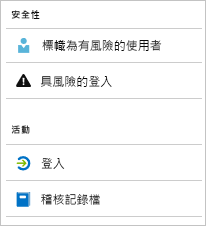

# Azure Active Directory 報告是什麼？

使用 Azure Active Directory 報告時，您可以取得您的環境所執行工作的見解。  
提供的資料可讓您：

- 判斷使用者如何利用您的應用程式和服務
- 偵測會影響環境健康情況的潛在風險
- 針對會阻止使用者完成其工作的問題進行疑難排解  

報告架構依賴兩大主要支柱：

- 安全性報告
- 活動報告

## 安全性報告

Azure Active Directory 中的安全性報告可協助您保護貴組織的身分識別。  
Azure Active Directory 中有兩種安全性報告：

- **標幟為有風險的使用者** - 從[有風險的使用者安全性報告](concept-user-at-risk.md)，取得可能受危害之使用者帳戶的概觀。

- **有風險的登入** - 透過[有風險的登入安全性報告](concept-risky-sign-ins.md)，取得非使用者帳戶合法擁有者的某人嘗試登入的指示器。 

**您需要哪個 Azure AD 授權才能存取安全性報告？**  

所有 Azure Active Directory 版本都可提供標幟為有風險的使用者和有風險的登入報告。  
不過，報告細微性層級因版本而異： 

- 在 [Azure Active Directory Free 和 Basic 版本] 中，您已取得標幟為有風險的使用者和有風險的登入清單。 

- **Azure Active Directory Premium 1** 版本也可讓您檢查每份報告部分已偵測到的基礎風險事件，藉此擴充此模型。 

- **Azure Active Directory Premium 2** 版本可提供有關基礎風險事件的最詳細資訊，也可讓您設定安全性原則，自動回應已設定的風險層級。

## 活動報告

Azure Active Directory 中有兩種活動報告：

- **稽核記錄** - [稽核記錄活動報告](concept-audit-logs.md)可供您存取在租用戶中執行之每個工作的歷程記錄。

- **登入** - 透過[登入活動報告](concept-sign-ins.md)，您可以判斷已執行稽核記錄報告所報告之工作的人員。

**稽核記錄報告**會提供系統活動記錄以達到合規性。 此資料可讓您解決常見的案例，例如：

- 我的租用戶中有人已取得系統管理員群組的存取權。 誰提供存取權給他們？ 

- 我想要知道登入特定應用程式的使用者清單，因為我最近將應用程式上架而且想知道其運作情況

- 我想要知道我的租用戶中發生多少次密碼重設

**您需要哪個 Azure AD 授權才能存取稽核記錄報告？**  

稽核記錄報告可用於您擁有授權的功能。 如果您有特定功能的授權，也可以存取其稽核記錄資訊。

如需詳細資訊，請參閱 [Azure Active Directory 功能](https://www.microsoft.com/cloud-platform/azure-active-directory-features)中的**比較 Free、Basic 和 Premium 版本的正式推出功能**。   

**登入活動報告**可讓您尋找以下問題的解答，例如：

- 使用者的登入模式為何？
- 一週內有多少使用者登入？
- 這些登入的狀態為何？

**您需要哪個 Azure AD 授權才能存取登入活動報告？**  

若要存取登入活動報告，租用戶必須有相關聯的 Azure AD Premium 授權。

## 以程式設計方式存取

除了使用者介面，Azure Active Directory 報告也提供[以程式設計方式存取](concept-reporting-api.md)報告資料。 這些報告的資料對您的應用程式 (例如 SIEM 系統、稽核和商業智慧工具) 可能非常有用。 Azure AD 報告 API 透過一組以 REST 為基礎的 API 提供資料的程式設計方式存取。 您可以從各種程式設計語言和工具呼叫這些 API。 

## 後續步驟

- [有風險的登入報告](concept-risky-sign-ins.md)
- [稽核記錄報告](concept-audit-logs.md)
- [登入記錄報告](concept-sign-ins.md)