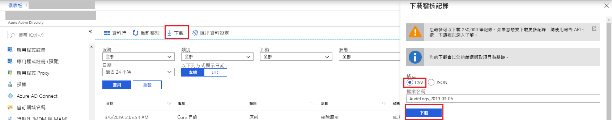

# 快速入門：使用 Azure 入口網站下載稽核報告

在此快速入門中，您將學到如何下載租用戶過去 24 小時內的稽核記錄 CSV 檔。 您可以從 Azure 入口網站最多下載 250,000 筆記錄。 這些記錄會依「最近期」方式排序，因此根據預設，您會取得最近的 250,000 筆記錄。 

## 必要條件

您需要：

* Azure Active Directory 租用戶。 
* 所擔任的租用戶角色為**安全性系統管理員**、**安全性讀取者**或**全域系統管理員**的使用者。 此外，租用戶中的任何使用者都可以存取自己的稽核記錄。

## 快速入門：下載稽核報告

1. 瀏覽至 [Azure 入口網站](https://portal.azure.com)。
2. 從左側瀏覽窗格選取 [Azure Active Directory] 並使用 [切換目錄] 按鈕來選取您的 Active Directory。
3. 從儀表板選取 [Azure Active Directory]，然後選取 [稽核記錄]。 
4. 在 [日期範圍] 篩選下拉式清單中選擇 [過去 24 小時]，然後選取 [套用] 以檢視過去 24 小時的稽核記錄。 
5. 選取 [下載] 按鈕、選取 **CSV** 作為檔案格式，並指定檔案名稱，以下載包含篩選記錄的 CSV 檔案。 

## 後續步驟

* [Azure Active Directory 入口網站中的登入活動報告](concept-sign-ins.md)
* [Azure Active Directory 報告保留期](reference-reports-data-retention.md)
* [Azure Active Directory 報告延遲](reference-reports-latencies.md)
