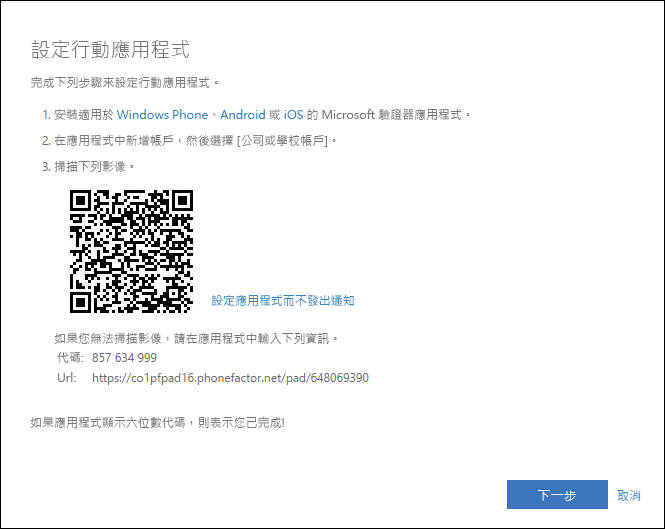

# 將驗證器應用程式設定為雙因素驗證方法

您可以設定驗證器應用程式來將通知傳送至行動裝置，或將作為安全性驗證方法的驗證碼傳送給您。 如果沒有一定要使用 Microsoft Authenticator 應用程式，您可以在設定期間選取不同的應用程式。 不過，本文是使用 Microsoft Authenticator 應用程式。

>[!Important]
>您必須先下載並安裝 Microsoft Authenticator 應用程式，才可新增帳戶。 如果尚未這麼做，請依照[下載並安裝應用程式](user-help-auth-app-download-install.md)文章中的步驟。

>[!Note]
> 如果行動應用程式選項呈現灰色，很可能您的組織不允許您使用驗證器應用程式進行驗證。 在這種情況下，您將必須選取其他方法，或連絡您的系統管理員以取得更多協助。

## 設定 Microsoft Authenticator 應用程式來傳送通知

1. 在 [其他安全性驗證]  頁面上，選取 [行動應用程式]  作為 **[步驟 1：我們應該如何聯繫您]** 區域的內容。

2. 在 [您要如何使用行動應用程式]  區域中，選取 [接收驗證通知]  ，然後選取 [設定]  。

    ![包含 [行動應用程式] 和 [通知] 選項的 [其他安全性驗證] 頁面](media/multi-factor-authentication-verification-methods/multi-factor-authentication-auth-app-notification.png)

    [設定行動應用程式]  頁面隨即出現。

    

3. 開啟 Microsoft Authenticator 應用程式、從右上角的 [自訂和控制]  圖示中選取 [新增帳戶]  ，然後選取 [公司或學校帳戶]  。

    >[!Note]
    >如果這是您第一次設定 Microsoft Authenticator 應用程式，系統可能會顯示提示詢問您是否允許應用程式存取您的相機 (iOS)，或是否允許應用程式拍攝相片和錄製影片 (Android)。 您必須選取 [允許]  ，讓驗證器應用程式能夠存取您的相機，以在下一個步驟中拍攝 QR 代碼的相片。 如果您不允許存取相機，您仍可設定驗證器應用程式，但必須手動新增代碼資訊。 如需如何手動新增代碼的相關資訊，請參閱[手動新增帳戶至應用程式](user-help-auth-app-add-account-manual.md)。

4. 使用裝置相機掃描電腦的 [設定行動應用程式]  畫面中顯示的 QR 代碼，然後選擇 [下一步]  。

5. 返回您的電腦和 [其他安全性驗證]  頁面，確定您收到的訊息中指出設定已成功完成，然後選取 [下一步]  。

    ![包含成功訊息的 [其他安全性驗證] 頁面](media/multi-factor-authentication-verification-methods/multi-factor-authentication-auth-app-notification-confirm.png)

    驗證器應用程式會將通知傳送至您的行動裝置作為測試。

6. 在您的行動裝置上，選取 [核准]  。

7. 在您的電腦上，將您的行動裝置電話號碼新增至 **[步驟 3：如果您無法存取行動應用程式]** 區域，然後選取 [下一步]  。

    我們強烈建議您新增行動裝置電話號碼作為備份，以免您因為任何原因而無法存取或使用行動應用程式。

8. 從 **[步驟 4：繼續使用現有的應用程式]** 區域中，複製所提供的應用程式密碼，並將其貼到安全的位置。

    

    >[!Note]
    >如需如何搭配舊有應用程式使用應用程式密碼的詳細資訊，請參閱[管理應用程式密碼](multi-factor-authentication-end-user-app-passwords.md)。 只有在您要繼續使用的舊有應用程式不支援雙因素驗證時，您才需要使用應用程式密碼。

9. 選取 [完成]  。

## 將 Microsoft Authenticator 應用程式設定為使用驗證碼

1. 在 [其他安全性驗證]  頁面上，選取 [行動應用程式]  作為 **[步驟 1：我們應該如何聯繫您]** 區域的內容。

2. 在 [您要如何使用行動應用程式]  區域中，選取 [使用驗證碼]  ，然後選取 [設定]  。

    ![包含 [行動應用程式] 和 [通知] 選項的 [其他安全性驗證] 頁面](media/multi-factor-authentication-verification-methods/multi-factor-authentication-auth-app-verification-code.png)

    [設定行動應用程式]  頁面隨即出現。

    

3. 開啟 Microsoft Authenticator 應用程式、從右上角的 [自訂和控制]  圖示中選取 [新增帳戶]  ，然後選取 [公司或學校帳戶]  。

    >[!Note]
    >如果這是您第一次設定 Microsoft Authenticator 應用程式，系統可能會顯示提示詢問您是否允許應用程式存取您的相機 (iOS)，或是否允許應用程式拍攝相片和錄製影片 (Android)。 您必須選取 [允許]  ，讓驗證器應用程式能夠存取您的相機，以在下一個步驟中拍攝 QR 代碼的相片。 如果您不允許存取相機，您仍可設定驗證器應用程式，但必須手動新增代碼資訊。 如需如何手動新增代碼的相關資訊，請參閱[手動新增帳戶至應用程式](user-help-auth-app-add-account-manual.md)。

4. 使用裝置相機掃描電腦的 [設定行動應用程式]  畫面中顯示的 QR 代碼，然後選擇 [下一步]  。

5. 返回您的電腦和 [其他安全性驗證]  頁面，確定您收到的訊息中指出設定已成功完成，然後選取 [下一步]  。

    ![包含成功訊息的 [其他安全性驗證] 頁面](media/multi-factor-authentication-verification-methods/multi-factor-authentication-auth-app-verification-confirm.png)

    驗證器應用程式會要求驗證碼以作為測試。

6. 在 Microsoft Authenticator 應用程式中，向下捲動至您的公司或學校帳戶，從應用程式中複製 6 位數的代碼並貼到電腦上的 **[步驟 2：輸入行動應用程式中的驗證碼]** 方塊，然後選取 [驗證]  。

    ![包含驗證碼測試的 [其他安全性驗證] 頁面](media/multi-factor-authentication-verification-methods/multi-factor-authentication-auth-app-verification-test.png)

7. 在您的電腦上，將您的行動裝置電話號碼新增至 **[步驟 3：如果您無法存取行動應用程式]** 區域，然後選取 [下一步]  。

    我們強烈建議您新增行動裝置電話號碼作為備份，以免您因為任何原因而無法存取或使用行動應用程式。

8. 從 **[步驟 4：繼續使用現有的應用程式]** 區域中，複製所提供的應用程式密碼，並將其貼到安全的位置。

    

    >[!Note]
    >如需如何搭配舊有應用程式使用應用程式密碼的詳細資訊，請參閱[管理應用程式密碼](multi-factor-authentication-end-user-app-passwords.md)。 只有在您要繼續使用的舊有應用程式不支援雙因素驗證時，您才需要使用應用程式密碼。

9. 選取 [完成]  。

## 後續步驟

設定您的雙因素驗證方法之後，您可以新增其他方法、管理設定和應用程式密碼、登入，或取得一些常見雙因素驗證相關問題的協助。

- [管理您的雙因素驗證方法設定](multi-factor-authentication-end-user-manage-settings.md)

- [管理應用程式密碼](multi-factor-authentication-end-user-app-passwords.md)

- [使用雙因素驗證來登入](multi-factor-authentication-end-user-signin.md)

- [取得雙因素驗證的協助](multi-factor-authentication-end-user-troubleshoot.md)
