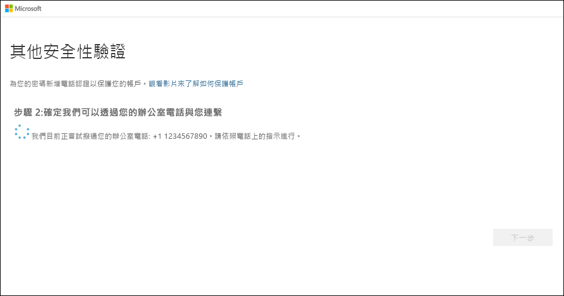
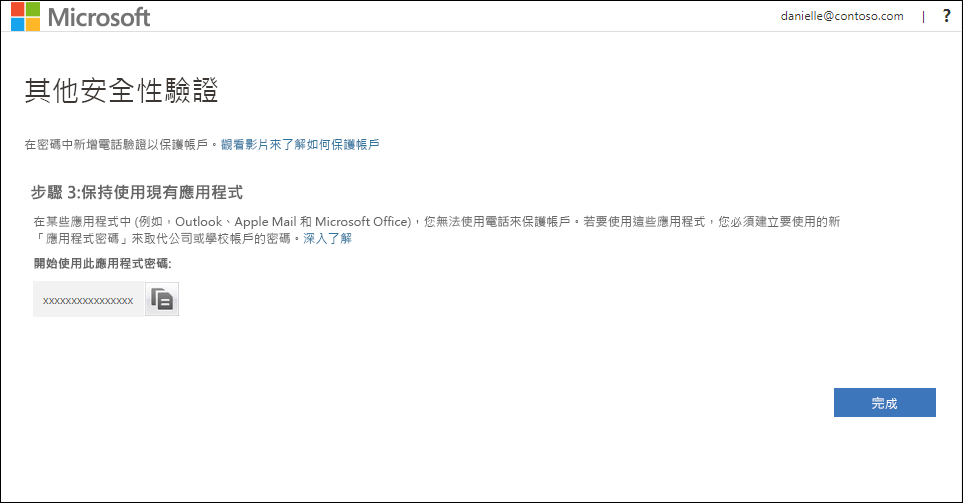

# 將公司電話設定為您的雙因素驗證方法

您可以將公司電話設定為您的雙因素驗證方法。

>[!Note]
> 如果公司電話選項呈現灰色，很可能您的組織不允許您使用公司電話號碼進行驗證。 在這種情況下，您將必須選取其他方法，或連絡您的系統管理員以取得更多協助。

## 將公司電話設定為您的驗證方法

1. 在 [其他安全性驗證]  頁面上，選取 [公司電話]  作為 **[步驟 1：我們應該如何聯繫您]** 區域的內容，從下拉式清單中選取您的國家或地區，輸入公司的電話號碼，然後輸入您的分機號碼 (如果有的話)。

    ![包含驗證電話和撥打電話的 [其他安全性驗證] 頁面](media/multi-factor-authentication-verification-methods/multi-factor-authentication-office-phone.png)

2. 您會收到來自 Microsoft 的電話，要求您按下公司電話上的井字號 (#) 來驗證您的身分識別。

    

3. 從 **[步驟 3：繼續使用現有的應用程式]** 區域中，複製所提供的應用程式密碼，並將其貼到安全的位置。

    

    >[!Note]
    >如需如何搭配舊有應用程式使用應用程式密碼的詳細資訊，請參閱[管理應用程式密碼](multi-factor-authentication-end-user-app-passwords.md)。 只有在您要繼續使用的舊有應用程式不支援雙因素驗證時，您才需要使用應用程式密碼。

4. 選取 [完成]  。

## 後續步驟

設定您的雙因素驗證方法之後，您可以新增其他方法、管理設定和應用程式密碼、登入，或取得一些常見雙因素驗證相關問題的協助。

- [管理您的雙因素驗證方法設定](multi-factor-authentication-end-user-manage-settings.md)

- [管理應用程式密碼](multi-factor-authentication-end-user-app-passwords.md)

- [使用雙因素驗證來登入](multi-factor-authentication-end-user-signin.md)

- [取得雙因素驗證的協助](multi-factor-authentication-end-user-troubleshoot.md)
