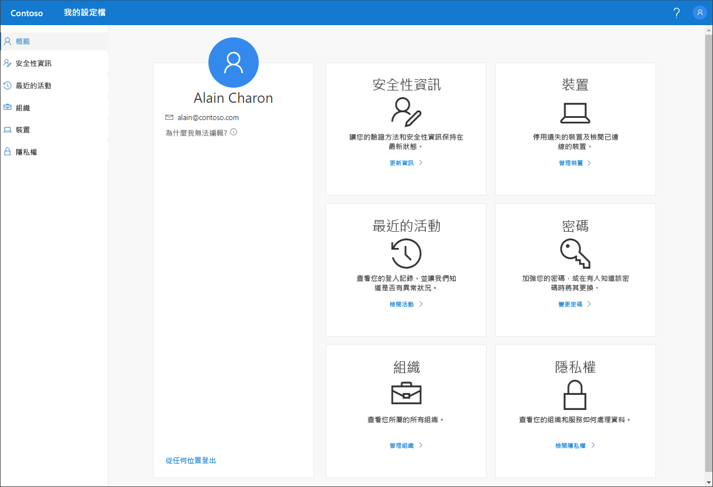

# 我的設定檔 (預覽) 入口網站概觀

[!INCLUDE [preview-notice](../../../includes/active-directory-end-user-preview-notice-myprofile.md)]

您可以使用**我的設定檔** (預覽) 入口網站來管理您的公司或學校帳戶，以：

- 設定和管理雙步驟驗證和密碼重設的安全性資訊。

- 檢視登入活動。

- 管理您已連線的組織和裝置。

- 檢視組織如何使用您的資料。

>[!Important]
>本內容適用於使用者。 I如果您是系統管理員，可以在 [Azure Active Directory 文件](https://docs.microsoft.com/azure/active-directory)中找到更多關於如何設定和管理 Azure Active Directory (Azure AD) 環境的資訊。

## 存取我的設定檔入口網站
您可以從下列任何瀏覽器的最新版本前往 https://myprofile.microsoft.com，以存取**我的設定檔**入口網站：

- Chrome
- Microsoft Edge
- Safari
- Firefox
- Internet Explorer 11

    

## 本節內容
您可以在下列文章中找到更多關於**我的設定檔**入口網站及其頁面的資訊。

|文章 |說明 |
|------|------------|
|[管理您的安全性資訊 (預覽)](user-help-security-info-overview.md)|說明如何設定和管理您的安全性資訊。|
|[檢視您最近的登入活動](myprofile-portal-recent-activity-page.md)|說明如何檢視公司或學校帳戶最近的登入活動。|
|[管理您的組織](myprofile-portal-organizations-page.md)|說明如何管理連線至公司或學校帳戶的組織。|
|[管理您已連線的裝置](myprofile-portal-devices-page.md)| 說明如何管理您已連線至公司或學校帳戶的裝置。|
|[檢視您的隱私權相關資訊](myprofile-portal-privacy-page.md)|說明如何檢視組織使用您資料的情形。|