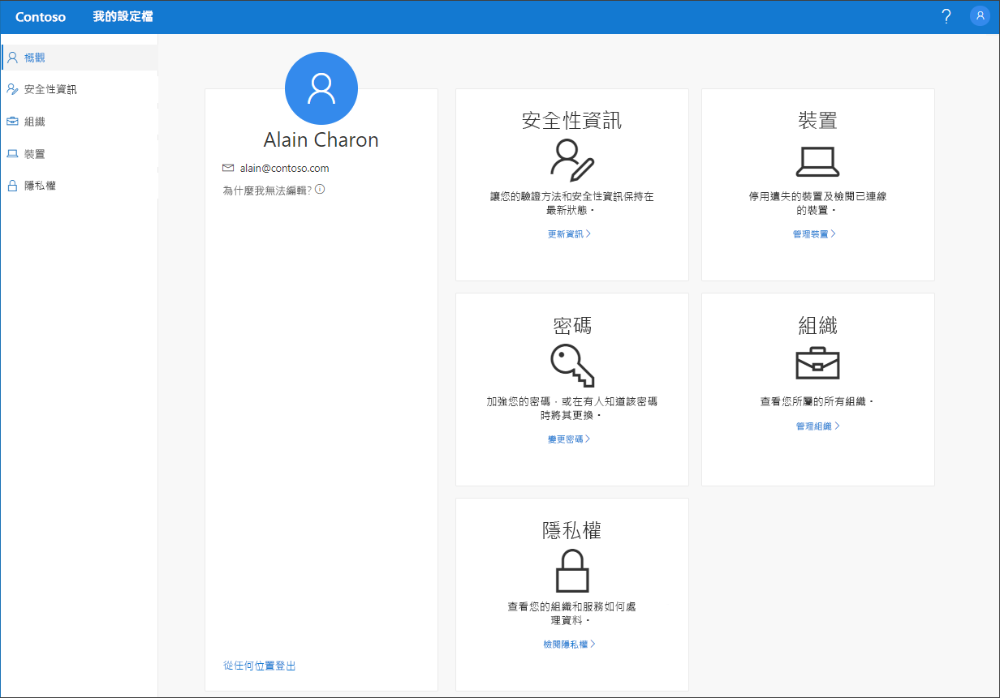

# 我的設定檔 (預覽) 入口網站概觀

[!INCLUDE [preview-notice](../../../includes/active-directory-end-user-preview-notice-myprofile.md)]

[我的設定檔]  (預覽) 入口網站可，可讓您設定和管理安全性資訊、管理已連線的組織和裝置，以及檢視貴組織使用資料的方式，協助您管理您的公司或學校帳戶。

>[!Important]
>本內容適用於使用者。 I如果您是系統管理員，可以在 [Azure Active Directory 文件](https://docs.microsoft.com/azure/active-directory)中找到更多關於如何設定和管理 Azure Active Directory (Azure AD) 環境的資訊。

## 移至我的設定檔入口網站

您可以從下列任何瀏覽器的最新版本前往 [我的設定檔]  入口網站 (https://myprofile.microsoft.com) )：

- Chrome
- Microsoft Edge
- Safari
- Firefox
- Internet Explorer 11

## 我的設定檔入口網站文章

如需 [我的設定檔]  入口網站中可用項目的詳細資訊與指示，請參閱下列文章：

|文章 |說明 |
|------|------------|
| [新增您的安全性資訊](user-help-security-info-overview.md) | 包含相關指示的數篇文章，說明如何設定 Microsoft Authenticator 應用程式、文字簡訊或撥打電話作為您的驗證方法。 此外也包含相關文章，說明如何新增電子郵件地址或預先定義的安全性問題，以便您重設自己遺忘的密碼 (如有必要)。|
| [檢視或離開您已組織的連線](myprofile-portal-organizations-page.md) | 相關指示，說明如何檢視和離開已連線至公司或學校帳戶的組織。|
| [檢視或停用已連線的裝置](myprofile-portal-devices-page.md) | 相關指示，說明如何檢視和停用已連線至公司或學校帳戶的裝置。|
| [檢視您的隱私權相關資訊](myprofile-portal-privacy-page.md) | 相關指示，說明如何檢視哪些線上服務已連線到公司或學校帳戶，以及貴組織的使用規定陳述。|
