# 經由登入頁面的提示設定您的安全性資訊 (預覽)

如果您在登入公司或學校帳戶後隨即看見設定安全性資訊的提示，您可以依照下列步驟進行設定。

只有在您尚未設定組織所要求的安全性資訊時，才會看到此提示。 如果您先前已設定安全性資訊，但想要進行變更，您可以參考以方法歸類的操作說明文章，並依照其中的步驟操作。 如需詳細資訊，請參閱[新增或更新安全性資訊概觀](security-info-add-update-methods-overview.md)。

[!INCLUDE [preview-notice](../../../includes/active-directory-end-user-preview-notice-security-info.md)]

## 登入您的公司或學校帳戶

在您登入公司或學校帳戶後，您會看到一則提示，要求您必須提供更多資訊才能存取帳戶。

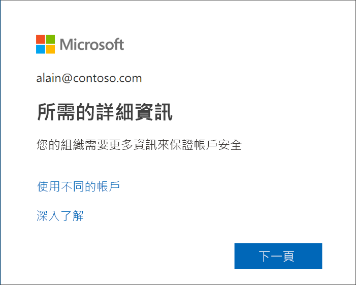

## 使用精靈設定您的安全性資訊

依照下列步驟，從提示中為您的工作或學校帳戶設定安全性資訊。

>[!Important]
>此處提供的只是程序的範例。 依組織需求的不同，您的系統管理員可能已設定您在進行此程序時必須設定的不同驗證方法。 在此範例中，我們將要求兩個方法：使用 Microsoft Authenticator 應用程式和手機號碼撥打驗證電話或發送簡訊。

1. 當您在提示字元中選取 [下一步]  後，會出現「保護帳戶精靈」  ，其中顯示您的系統管理員和組織要求您設定的第一種方法。 在此範例中，此方法為 Microsoft Authenticator 應用程式。

   > [!Note]
   > 如果您想要使用 Microsoft Authenticator 應用程式以外的驗證器應用程式，請選取 [我想要使用其他驗證器應用程式]  連結。
   >
   > 如果您的組織允許您選擇驗證器應用程式以外的方法，您可以選取 [我想要設定其他方法]  連結。

    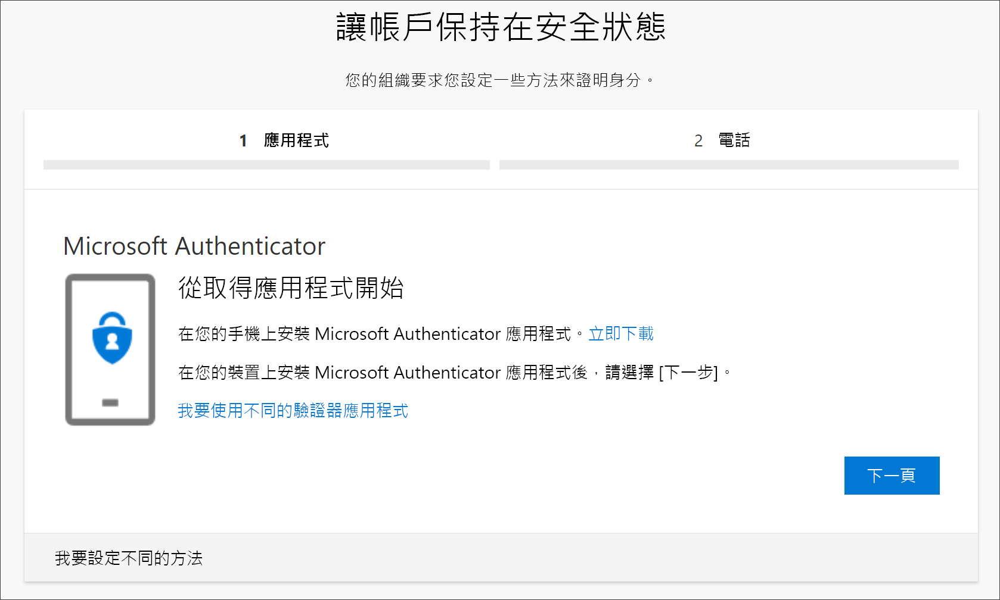

2. 選取 [立即下載]  ，以在您的行動裝置下載並安裝 Microsoft Authenticator 應用程式，然後選取 [下一步]  。 如需關於下載並安裝應用程式的詳細資訊，請參閱[下載並安裝 Microsoft Authenticator 應用程式](user-help-auth-app-download-install.md)。

    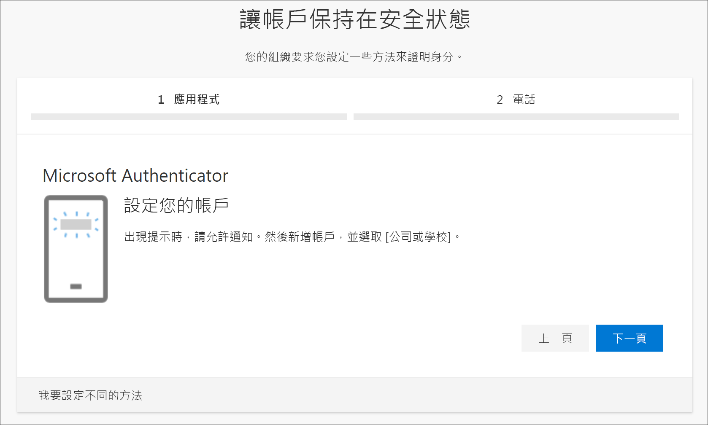

3. 在行動裝置上設定 Microsoft Authenticator 應用程式時，請讓 [設定帳戶]  頁面保持開啟。

4. 開啟 Microsoft Authenticator 應用程式、選取要允許通知 (若出現提示)、從右上角的 [自訂和控制]  圖示中選取 [新增帳戶]  ，然後選取 [公司或學校帳戶]  。

    >[!Note]
    >如果這是您第一次設定 Microsoft Authenticator 應用程式，系統可能會顯示提示詢問您是否允許應用程式存取您的相機 (iOS)，或是否允許應用程式拍攝相片和錄製影片 (Android)。 您必須選取 [允許]  ，讓驗證器應用程式能夠存取您的相機，以在下一個步驟中拍攝 QR 代碼的相片。 如果您不允許存取相機，您仍可設定驗證器應用程式，但必須手動新增代碼資訊。 如需如何手動新增代碼的相關資訊，請參閱[手動新增帳戶至應用程式](user-help-auth-app-add-account-manual.md)。

5. 返回電腦上的 [設定帳戶]  頁面，然後選取 [下一步]  。

    [掃描 QR 代碼]  頁面隨即出現。

    ![使用驗證器應用程式的 [掃描 QR 代碼]](media/security-info/securityinfo-prompt-auth-app-qrcode.png)

6. 使用 Microsoft Authenticator 應用程式 QR 代碼讀取器，掃描您在步驟 5 建立工作或學校帳戶後顯示在行動裝置上的代碼。

    驗證器應用程式應會成功新增您的工作或學校帳戶，而不需要您提供任何額外的資訊。 不過，如果您的 QR 代碼讀取器無法讀取代碼，您可以選取 [無法掃描 QR 影像]  ，然後以手動方式將代碼和 URL 輸入到 Microsoft Authenticator 應用程式。 如需手動新增代碼的詳細資訊，請參閱[手動新增帳戶至應用程式](user-help-auth-app-add-account-manual.md)。

7. 在電腦的 [掃描 QR 代碼]  頁面上選取 [下一步]  。

    此時會有通知傳送到您行動裝置上的 Microsoft Authenticator 應用程式，用以測試您的帳戶。

    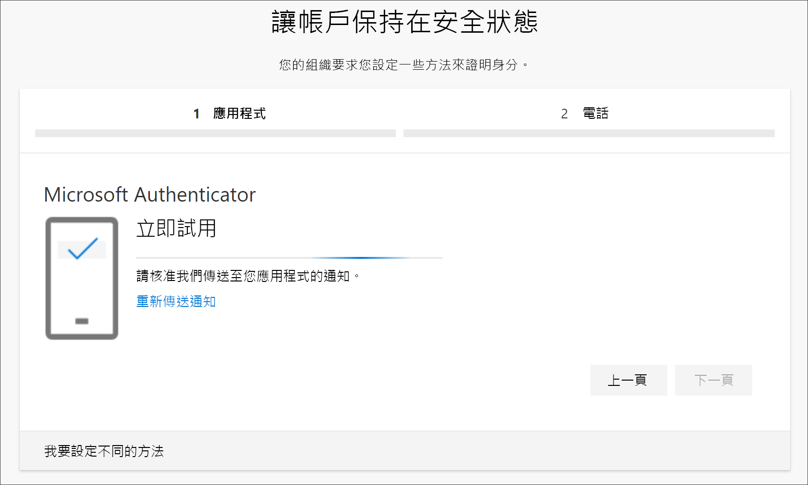

8. 在 Microsoft Authenticator 應用程式中核准通知，然後選取 [下一步]  。

    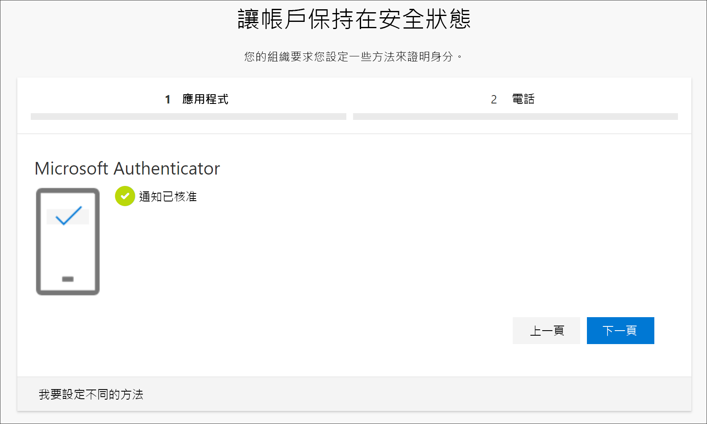

    您的安全性資訊會更新為使用 Microsoft Authenticator 應用程式作為預設方法，在使用雙步驟驗證或密碼重設時驗證您的身分識別。

9. 在 [電話]  設定頁面上，選擇您要接收簡訊還是通話，然後選取 [下一步]  。 此範例使用簡訊，因此您必須使用可接受簡訊之裝置的電話號碼。

    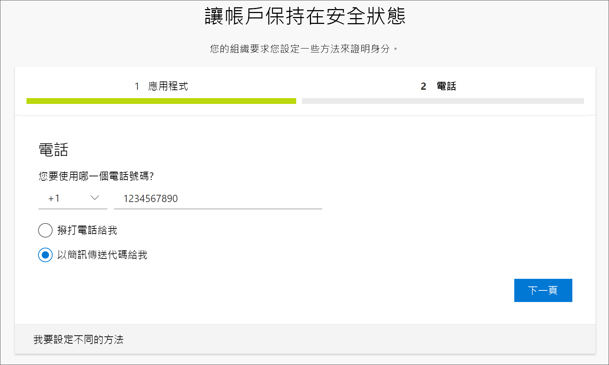

    簡訊會傳送到您的電話號碼。 如果想要接收通話，程序亦相同。 不過，您會收到含有操作指示的通話，而不是簡訊。

10. 輸入傳送至行動裝置的簡訊中提供的代碼，然後選取 [下一步]  。

    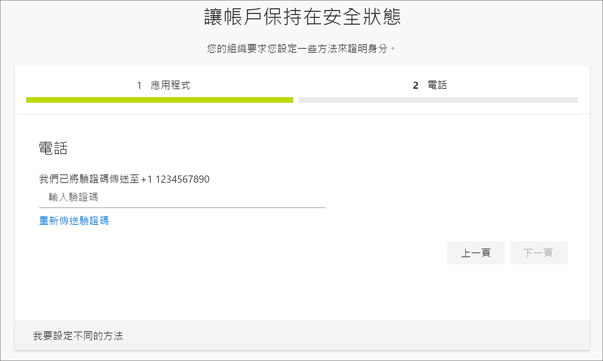

11. 檢閱成功通知，然後選取 [完成]  。

    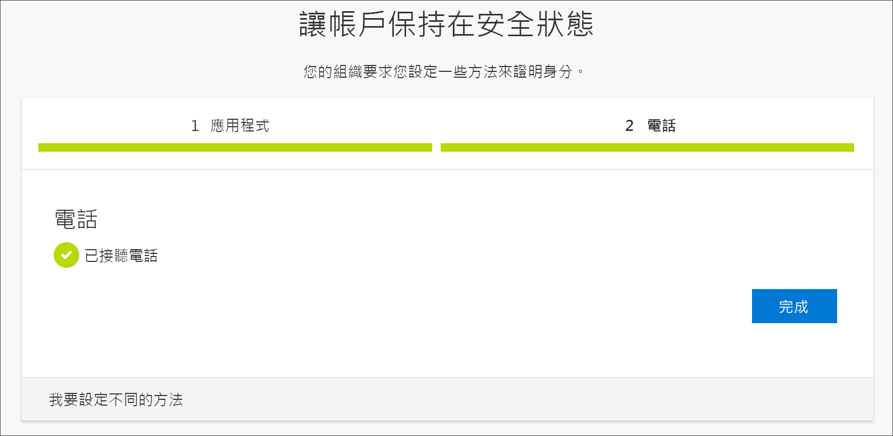

    您的安全性資訊會更新為使用簡訊作為備用方法，在使用雙步驟驗證或密碼重設時驗證您的身分識別。

12. 檢閱 [成功]  頁面，確認您已為安全性資訊成功設定 Microsoft Authenticator 應用程式和電話 (簡訊或通話) 方法，然後選取 [完成]  。

    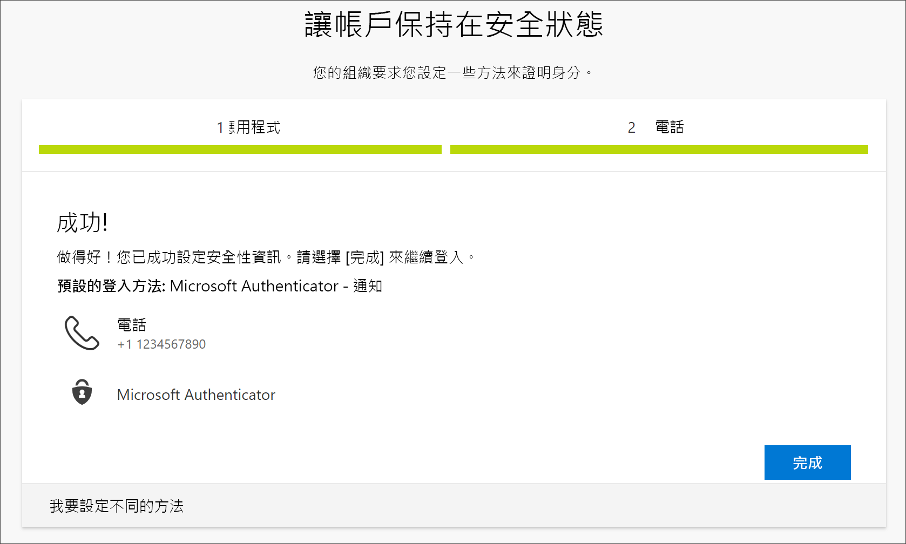

    >[!Note]
    >如果您的組織要求您使用應用程式密碼，您可能會在此精靈中看到用於設定該密碼的額外區段。 如果您看到名為 [應用程式密碼]  的第三個區段，您必須先加以填寫，才能夠完成精靈。 如需有關如何新增應用程式密碼的步驟，請參閱本文的[管理應用程式密碼](#manage-your-app-passwords)一節。

### 管理您的應用程式密碼

某些應用程式 (例如 Outlook 2010) 不支援雙步驟驗證。 缺乏支援的意思就是，如果您在組織中使用雙步驟驗證，應用程式會無法運作。 若要解決此問題，您可以建立自動產生的密碼來與每個非瀏覽器應用程式搭配使用，此密碼與您的一般密碼不同。

>[!Note]
>如果您在精靈中看不到此選項，表示您的系統管理員尚未設定此選項。 如果未設定，但您知道您需要使用應用程式密碼，則可以遵循[從安全性資訊設定應用程式密碼 (預覽) 頁面](security-info-app-passwords.md)中的步驟。

使用應用程式密碼時，請務必記住：

- 應用程式密碼會自動產生，而且每個應用程式只能輸入一次。

- 每位使用者的密碼以 40 組為限。 如果您在到達該限制之後嘗試建立一個密碼，系統就會提示您先刪除現有的密碼，然後才能建立新密碼。

- 為每個裝置 (而非每個應用程式) 使用一個應用程式密碼。 例如，針對膝上型電腦上的所有應用程式建立單一密碼，然後針對桌上型電腦上的所有應用程式建立另一個單一密碼。

#### 在登入精靈中新增應用程式密碼

1. 完成精靈的前述區段之後，請選取 [下一步]  並完成 [應用程式密碼]  區段。

2. 輸入需要密碼的應用程式名稱 (例如 `Outlook 2010`)，然後選取 [下一步]  。

    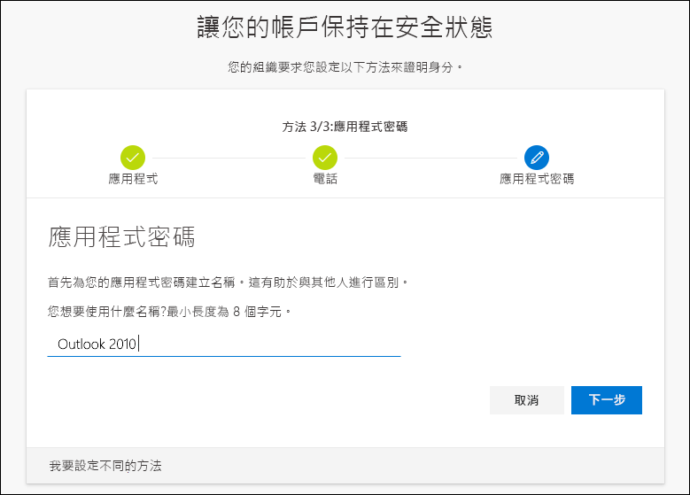

3. 從 [應用程式密碼]  畫面複製密碼，並將其貼入應用程式的 [密碼]  區域 (此範例使用 Outlook 2010)。

    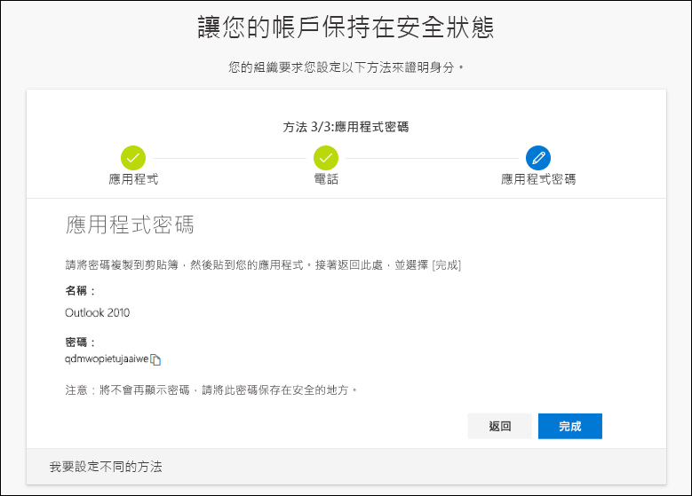

4. 在您複製密碼並將其貼入應用程式之後，請返回此精靈來確定所有登入方法資訊都正確無誤，然後選取 [完成]  。

    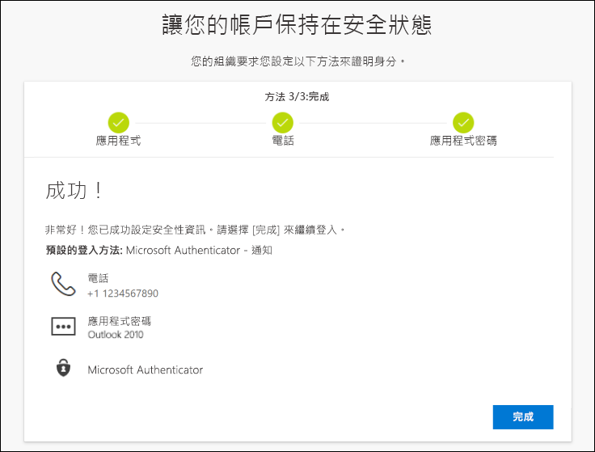

## 後續步驟

- 若要變更、刪除或更新預設的安全性資訊方法，請參閱：

    - [將安全性資訊設定為使用驗證器應用程式](security-info-setup-auth-app.md)。

    - [將安全性資訊設定為使用簡訊](security-info-setup-text-msg.md)。

    - [將安全性資訊設定為使用電話](security-info-setup-phone-number.md)。

    - [將安全性資訊設定為使用電子郵件](security-info-setup-email.md)。

    - [將安全性資訊設定為使用預先定義的安全性問題](security-info-setup-questions.md)。

- 如需如何使用您的指定方法進行登入的相關資訊，請參閱[如何登入](user-help-sign-in.md)。

- 如果您遺失或忘記密碼，請從[密碼重設入口網站](https://passwordreset.microsoftonline.com/)或遵循[重設公司或學校密碼](user-help-reset-password.md)一文中的步驟來重設密碼。

- 在[無法登入 Microsoft 帳戶](https://support.microsoft.com/help/12429/microsoft-account-sign-in-cant)一文中，取得登入問題的疑難排解秘訣和說明。
