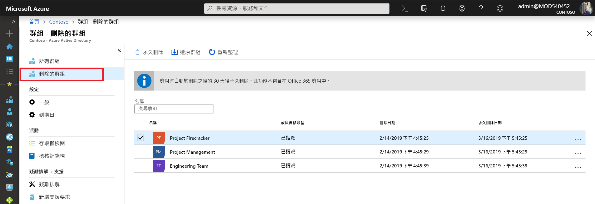

# <a name="restore-a-deleted-office-365-group-in-azure-active-directory"></a>在 Azure Active Directory 中還原已刪除的 Office 365 群組

當您在 Azure Active Directory (Azure AD) 中刪除 Office 365 群組時，從刪除日起算，仍會保留已刪除的群組 30 天，但您看不見該群組。 此行為便能讓您視需要還原該群組及其內容。 此功能專屬於 Azure AD 中的 Office 365 群組。 無法針對安全性群組和發佈群組使用。 請注意，您無法自訂 30 天的群組還原期間。

> [!NOTE]
> 請勿使用 `Remove-MsolGroup`，因為它會永久清除群組。 一律使用 `Remove-AzureADMSGroup` 來刪除 Office 365 群組。

還原群組所需的權限可以是下列任一項：

角色 | 權限
--------- | ---------
全域管理員、合作夥伴第 2 層支援，以及 Intune 管理員 | 可以還原任何已刪除的 Office 365 群組
使用者管理員和合作夥伴第 1 層支援 | 可以還原任何已刪除的 Office 365 群組，但指派給公司系統管理員角色的群組除外
使用者 | 可以還原他們擁有的任何已刪除的 Office 365 群組

## <a name="view-and-manage-the-deleted-office-365-groups-that-are-available-to-restore"></a>檢視及管理可供還原的已刪除 Office 365 群組

1. 使用使用者管理員帳戶登入 [Azure AD 系統管理中心](https://aad.portal.azure.com)。

2. 選取 [群組]，然後選取 [已刪除的群組] 以檢視可供還原的已刪除群組。

    

3. 在 [已刪除的群組] 刀鋒視窗上，您可以：

   - 選取 [還原群組]，以還原已刪除的群組及其內容。
   - 選取 [永久刪除] 可永久移除已刪除的群組。 若要永久移除群組，您必須是系統管理員。

## <a name="view-the-deleted-office-365-groups-that-are-available-to-restore-using-powershell"></a>使用 Powershell 檢視可供還原的已刪除 Office 365 群組

您可以使用下列 Cmdlet 來檢視已刪除的群組，以確認您感興趣的一或多個群組尚未被永久清除。 這些 Cmdlet 屬於 [Azure AD PowerShell 模組](https://www.powershellgallery.com/packages/AzureAD/)。 如需此模組的詳細資訊，請參閱 [Azure Active Directory PowerShell 第 2 版](/powershell/azure/install-adv2?view=azureadps-2.0)一文。

1.  執行下列 Cmdlet，以顯示租用戶中所有已刪除但仍可供還原的 Office 365 群組。
   

    ```powershell
    Get-AzureADMSDeletedGroup
    ```

2.  或者，如果您知道特定群組的 objectID (而且可從步驟 1 中的 Cmdlet 取得)，請執行下列 Cmdlet 來確認該特定已刪除的群組尚未被永久清除。

    ```
    Get-AzureADMSDeletedGroup –Id <objectId>
    ```

## <a name="how-to-restore-your-deleted-office-365-group-using-powershell"></a>如何使用 Powershell 還原已刪除的 Office 365 群組

一旦確認群組仍可供還原，即可使用下列其中一個步驟來還原已刪除的群組。 如果群組包含文件、SP 網站或其他持續物件，則可能需要 24 小時，才能完全還原群組及其內容。

1. 執行下列 Cmdlet 來還原的群組及其內容。
 

   ```
    Restore-AzureADMSDeletedDirectoryObject –Id <objectId>
    ``` 

2. 或者，可以執行下列 Cmdlet，永久移除已刪除的群組。
    

    ```
    Remove-AzureADMSDeletedDirectoryObject –Id <objectId>
    ```

## <a name="how-do-you-know-this-worked"></a>如何知道此動作已完成？

若要確認您已順利還原 Office 365 群組，請執行 `Get-AzureADGroup –ObjectId <objectId>` Cmdlet 來顯示群組的相關資訊。 完成還原要求之後：

- 群組會出現在 Exchange 上的左側導覽列中
- 群組的計劃將出現在 Planner 中
- 任何 SharePoint 網站及其所有內容都將可供使用
- 您可以從任何 Exchange 端點和支援 Office 365 群組的其他 Office 365 工作負載存取該群組

## <a name="next-steps"></a>後續步驟

這些文章提供有關 Azure Active Directory 群組的其他資訊。

* [查看現有的群組](../fundamentals/active-directory-groups-view-azure-portal.md)
* [管理群組的設定](../fundamentals/active-directory-groups-settings-azure-portal.md)
* [管理群組的成員](../fundamentals/active-directory-groups-members-azure-portal.md)
* [管理群組的成員資格](../fundamentals/active-directory-groups-membership-azure-portal.md)
* [管理群組中使用者的動態規則](groups-dynamic-membership.md)