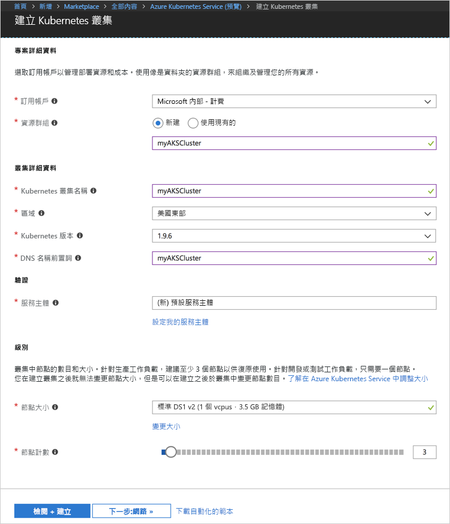
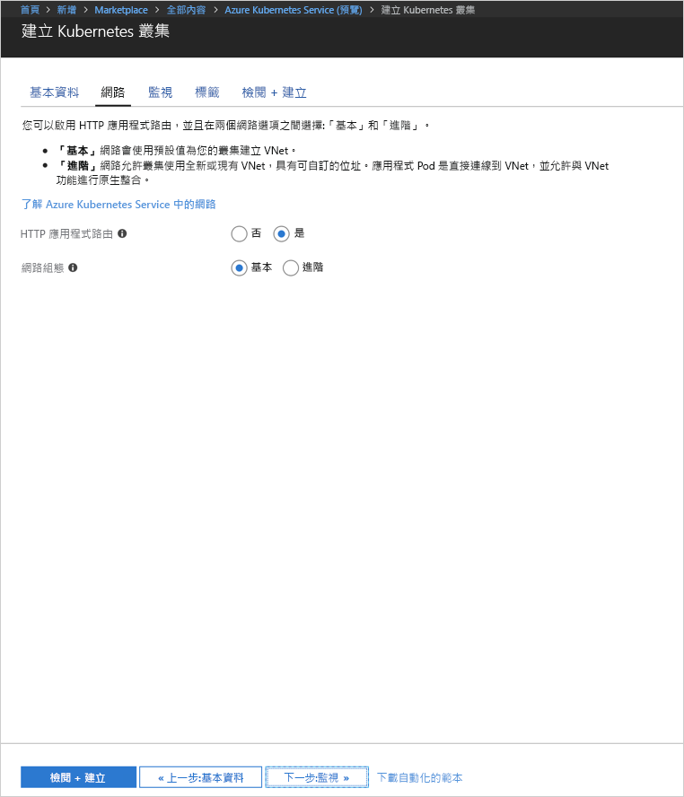
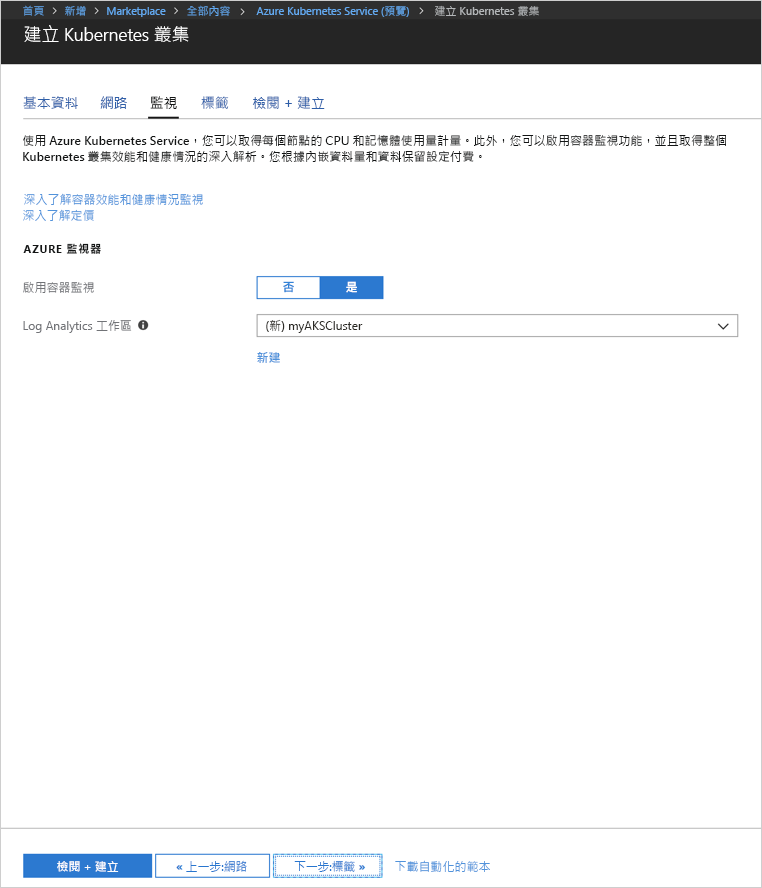
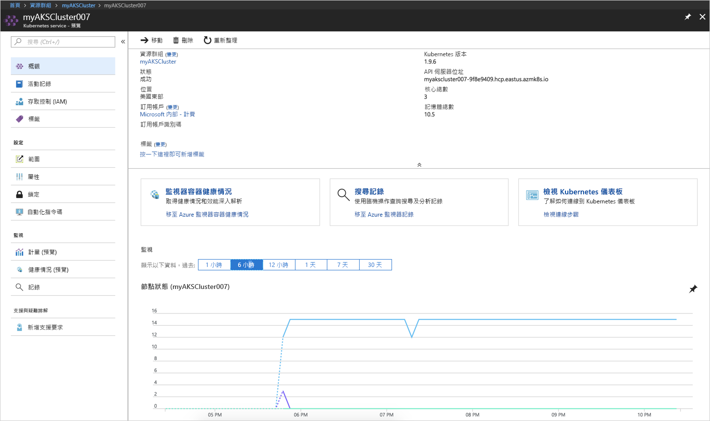
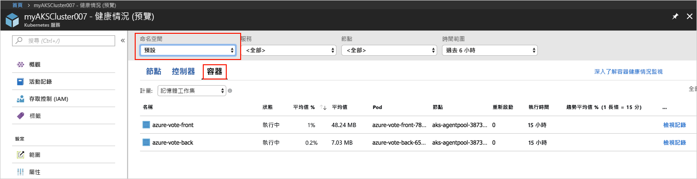
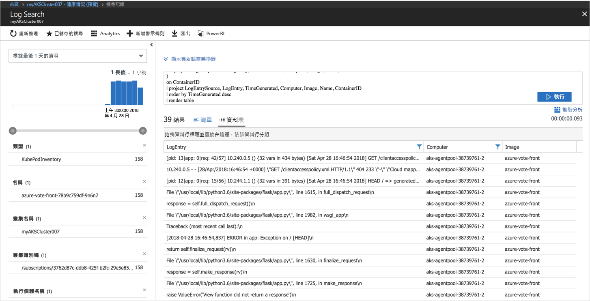

# <a name="quickstart-deploy-an-azure-kubernetes-service-aks-cluster"></a>快速入門：部署 Azure Kubernetes Service (AKS) 叢集

在本快速入門中，您會使用 Azure 入口網站來部署 AKS 叢集。 接著，在叢集上執行包含 Web 前端和 Redis 執行個體的多容器應用程式。 完成後，即可透過網際網路來存取應用程式。


本快速入門假設您已有 Kubernetes 概念的基本知識。 如需有關 Kubernetes 的詳細資訊，請參閱 [Kubernetes 文件][kubernetes-documentation]。

## <a name="sign-in-to-azure"></a>登入 Azure

在 http://portal.azure.com 登入 Azure 入口網站。


## <a name="create-aks-cluster"></a>建立 AKS 叢集

選擇 [建立資源] > 選取 [Kubernetes Service] > [建立]。

完成建立 AKS 叢集表單中每個標題底下的下列步驟。

- **專案詳細資料**：選取 Azure 訂用帳戶，以及新的或現有的 Azure 資源群組。
- **叢集詳細資料**：輸入 AKS 叢集的名稱、地區、版本及 DNS 名稱前置詞。
- **驗證**：建立新的服務主體，或使用現有服務主體。 使用現有的 SPN 時，您需要提供 SPN 用戶端識別碼和祕密。
- **級別**：選取 AKS 節點的 VM 大小。 VM 大小**無法**在 AKS 叢集部署完畢後變更。 此外，選取要部署到叢集的節點數目。 節點計數**可以**在叢集部署完畢後調整。

完成時，請選取 [下一步: 網路功能]。



設定下列網路功能選項：

- **HTTP 應用程式路由**：設定具有自動公用 DNS 名稱建立的整合式輸入控制站。 如需 HTTP 路由的詳細資訊，請參閱 [AKS HTTP 路由和 DNS][http-routing]。
- **網路設定**：選擇使用 [kubenet][kubenet] Kubernetes 外掛程式的基本網路設定，或是使用 [Azure CNI][azure-cni] 的進階網路設定。 如需有關網路功能選項的詳細資訊，請參閱 [AKS 網路功能概觀][aks-network]。

完成時，選取 [下一步: 監視]。



部署 AKS 叢集時，可以設定 Azure Container Insights 來監視 AKS 叢集及在該叢集上所執行 Pod 的健康情況。 如需容器健康情況監視的詳細資訊，請參閱[監視 Azure Kubernetes 服務健康情況][aks-monitor]。

選取 [是] 來啟用容器監視，並選取現有的 Log Analytics 工作區，或是建立新的工作區。

選取 [檢閱 + 建立]，然後在完成時選取 [建立]。



短暫的等候之後，AKS 叢集已完成部署且可供使用。 瀏覽至 AKS 叢集資源群組，選取 AKS 資源，您應該會看到 AKS 叢集儀表板。



## <a name="connect-to-the-cluster"></a>連接到叢集

若要管理 Kubernetes 叢集，請使用 Kubernetes 命令列用戶端：[kubectl][kubectl]。 Kubectl 用戶端會預先安裝在 Azure Cloud Shell 中。

使用 Azure 入口網站右上角上的按鈕開啟 Cloud Shell。


若要設定 kubectl 來連線到 Kubernetes 叢集，請使用 [az aks get-credentials][az-aks-get-credentials] 命令。

複製以下命令並貼到 Cloud Shell 中。 視需要修改資源群組與叢集名稱。

```azurecli-interactive
az aks get-credentials --resource-group myAKSCluster --name myAKSCluster
```

若要驗證叢集的連線，請使用 [kubectl get][kubectl-get] 命令來傳回叢集節點的清單。

```azurecli-interactive
kubectl get nodes
```

輸出：

```
NAME                       STATUS    ROLES     AGE       VERSION
aks-agentpool-11482510-0   Ready     agent     9m        v1.9.6
aks-agentpool-11482510-1   Ready     agent     8m        v1.9.6
aks-agentpool-11482510-2   Ready     agent     9m        v1.9.6
```

## <a name="run-the-application"></a>執行應用程式

Kubernetes 資訊清單檔會定義叢集應有的狀態，包括應該執行的容器映像。 例如，資訊清單可用來建立執行 Azure 投票應用程式所需的所有物件。 這些物件包含兩個 [Kubernetes 部署][kubernetes-deployment]，一個適用於 Azure Vote 前端，另一個則適用於 Redis 執行個體。 此外，還會建立兩個 [Kubernetes 服務][kubernetes-service]，內部服務用於 Redis 執行個體，而外部服務用於從網際網路存取 Azure 投票應用程式。

建立名為 `azure-vote.yaml` 的檔案，然後將下列 YAML 程式碼複製到其中。 如果您在 Azure Cloud Shell 中作業，請使用 vi 或 Nano 建立檔案，如同在虛擬或實體系統上運作一般。

```yaml
apiVersion: apps/v1beta1
kind: Deployment
metadata:
  name: azure-vote-back
spec:
  replicas: 1
  template:
    metadata:
      labels:
        app: azure-vote-back
    spec:
      containers:
      - name: azure-vote-back
        image: redis
        ports:
        - containerPort: 6379
          name: redis
---
apiVersion: v1
kind: Service
metadata:
  name: azure-vote-back
spec:
  ports:
  - port: 6379
  selector:
    app: azure-vote-back
---
apiVersion: apps/v1beta1
kind: Deployment
metadata:
  name: azure-vote-front
spec:
  replicas: 1
  template:
    metadata:
      labels:
        app: azure-vote-front
    spec:
      containers:
      - name: azure-vote-front
        image: microsoft/azure-vote-front:v1
        ports:
        - containerPort: 80
        env:
        - name: REDIS
          value: "azure-vote-back"
---
apiVersion: v1
kind: Service
metadata:
  name: azure-vote-front
spec:
  type: LoadBalancer
  ports:
  - port: 80
  selector:
    app: azure-vote-front
```

使用 [kubectl apply][kubectl-apply] 命令來執行應用程式。

```azurecli-interactive
kubectl apply -f azure-vote.yaml
```

輸出：

```
deployment "azure-vote-back" created
service "azure-vote-back" created
deployment "azure-vote-front" created
service "azure-vote-front" created
```

## <a name="test-the-application"></a>測試應用程式

當應用程式執行時，系統會建立 [Kubernetes 服務][kubernetes-service]，以將應用程式公開至網際網路。 此程序需要數分鐘的時間完成。

若要監視進度，請使用 [kubectl get service][kubectl-get] 命令搭配 `--watch` 引數。

```azurecli-interactive
kubectl get service azure-vote-front --watch
```

一開始，azure-vote-front 服務的 *EXTERNAL-IP* 會顯示為 pending。

```
NAME               TYPE           CLUSTER-IP   EXTERNAL-IP   PORT(S)        AGE
azure-vote-front   LoadBalancer   10.0.37.27   <pending>     80:30572/TCP   6s
```

當 *EXTERNAL-IP* 位址從 *pending* 變成一個 *IP 位址*之後，請使用 `CTRL-C` 來停止 kubectl 監看式流程。

```
azure-vote-front   LoadBalancer   10.0.37.27   52.179.23.131   80:30572/TCP   2m
```

現在可以瀏覽至外部 IP 位址來查看 Azure 投票應用程式。


## <a name="monitor-health-and-logs"></a>監視健康情況和記錄檔

如果已啟用容器深入解析監視，則 AKS 叢集和在叢集上執行的 Pod 二者的健康情況測量值都會在 AKS 叢集儀表板上提供。 如需容器健康情況監視的詳細資訊，請參閱[監視 Azure Kubernetes 服務健康情況][aks-monitor]。

若要查看 Azure Vote Pod 的目前狀態、執行時間及資源使用情況，請瀏覽回 AKS 資源，選取 [監視容器健康情況] > 選取**預設**的命名空間 > 然後選取 [容器]。 可能需要幾分鐘，此資料才會填入至 Azure 入口網站。



若要查看 `azure-vote-front` Pod 的記錄檔，請選取 [檢視記錄檔] 連結。 這些記錄檔包含來自容器的 stdout 和 stderr 資料流。



## <a name="delete-cluster"></a>刪除叢集

不再需要叢集時，請刪除叢集資源，這將會刪除所有相關的資源。 此操作可以在 Azure 入口網站中選取 AKS 叢集儀表板上的刪除按鈕來完成。 或者，您可以在 Cloud Shell 中使用 [az aks delete][az-aks-delete] 命令。

```azurecli-interactive
az aks delete --resource-group myAKSCluster --name myAKSCluster --no-wait
```

## <a name="get-the-code"></a>取得程式碼

在本快速入門中，已使用預先建立的容器映像來建立 Kubernetes 部署。 相關的應用程式程式碼、Dockerfile 和 Kubernetes 資訊清單檔案，都可以在 GitHub 上取得。

[https://github.com/Azure-Samples/azure-voting-app-redis][azure-vote-app]

## <a name="next-steps"></a>後續步驟

在本快速入門中，您已部署 Kubernetes 叢集，並將多容器應用程式部署到此叢集。

若要深入了解 AKS，並逐步完成部署範例的完整程式碼，請繼續 Kubernetes 叢集教學課程。

> [!div class="nextstepaction"]
> [AKS 教學課程][aks-tutorial]

<!-- LINKS - external -->
[azure-vote-app]: https://github.com/Azure-Samples/azure-voting-app-redis.git
[azure-cni]: https://github.com/Azure/azure-container-networking/blob/master/docs/cni.md
[kubectl]: https://kubernetes.io/docs/user-guide/kubectl/
[kubectl-apply]: https://kubernetes.io/docs/reference/generated/kubectl/kubectl-commands#apply
[kubectl-get]: https://kubernetes.io/docs/reference/generated/kubectl/kubectl-commands#get
[kubenet]: https://kubernetes.io/docs/concepts/cluster-administration/network-plugins/#kubenet
[kubernetes-deployment]: https://kubernetes.io/docs/concepts/workloads/controllers/deployment/
[kubernetes-documentation]: https://kubernetes.io/docs/home/
[kubernetes-service]: https://kubernetes.io/docs/concepts/services-networking/service/

<!-- LINKS - internal -->
[az-aks-get-credentials]: /cli/azure/aks?view=azure-cli-latest#az_aks_get_credentials
[az-aks-delete]: /cli/azure/aks#az-aks-delete
[aks-monitor]: ../monitoring/monitoring-container-health.md
[aks-network]: ./networking-overview.md
[aks-tutorial]: ./tutorial-kubernetes-prepare-app.md
[http-routing]: ./http-application-routing.md
