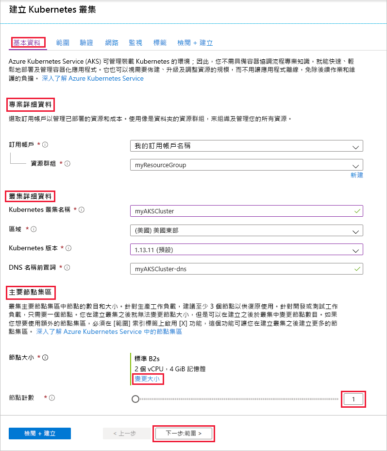
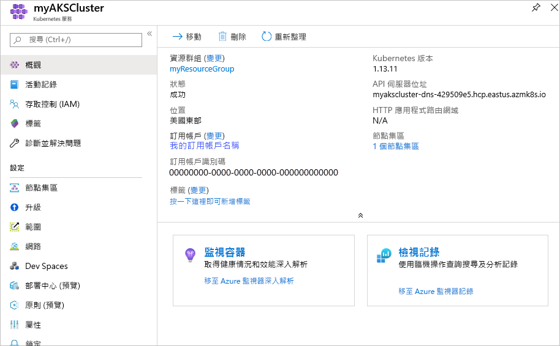
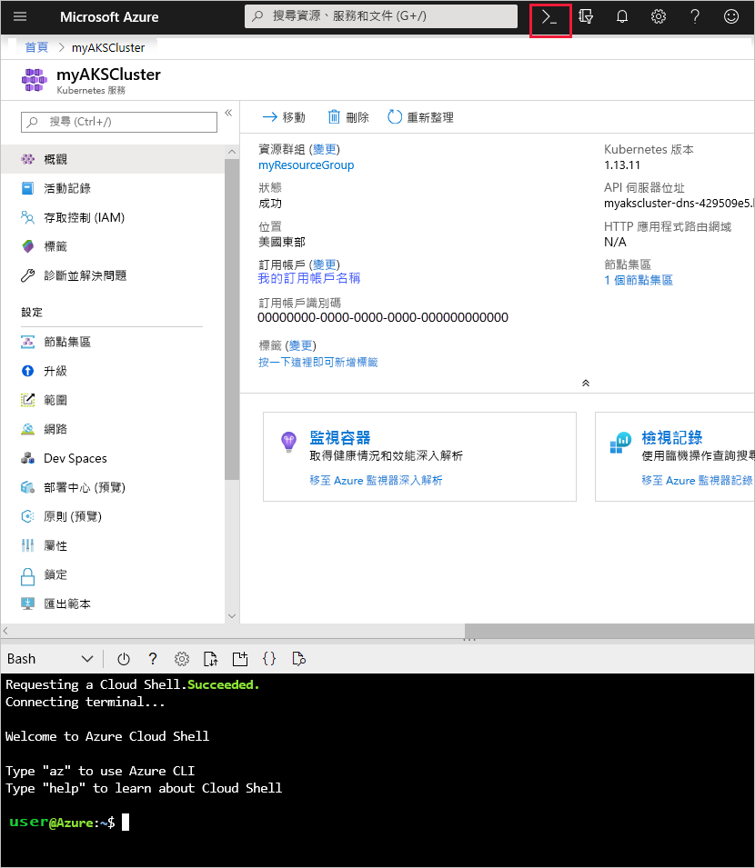
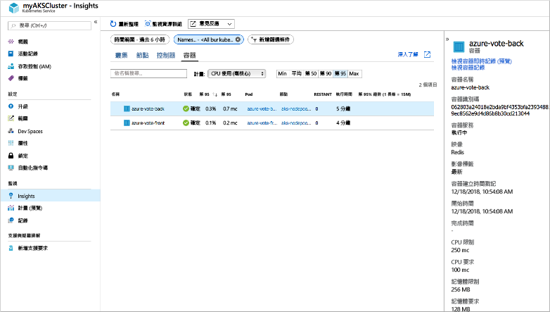
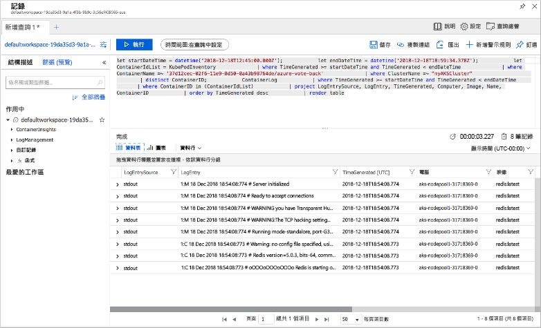

# <a name="quickstart-deploy-an-azure-kubernetes-service-aks-cluster"></a>快速入門：部署 Azure Kubernetes Service (AKS) 叢集

在本快速入門中，您會使用 Azure 入口網站來部署 AKS 叢集。 接著，在叢集上執行包含 Web 前端和 Redis 執行個體的多容器應用程式。 完成後，即可透過網際網路來存取應用程式。


本快速入門假設您已有 Kubernetes 概念的基本知識。 如需有關 Kubernetes 的詳細資訊，請參閱 [Kubernetes 文件][kubernetes-documentation]。

## <a name="sign-in-to-azure"></a>登入 Azure

在 http://portal.azure.com 登入 Azure 入口網站。

## <a name="create-an-aks-cluster"></a>建立 AKS 叢集

在 Azure 入口網站的左上角，選取 [建立資源] > [Kubernetes 服務]。

若要建立 AKS 叢集，請完成下列步驟：

1. **基本** - 設定下列選項：
    - 專案詳細資料：選取 Azure 訂用帳戶，然後選取或建立 Azure 資源群組，例如 myResourceGroup。 輸入 **Kubernetes 叢集名稱**，例如 myAKSCluster。
    - 叢集詳細資料：選取 AKS 叢集的地區、Kubernetes 版本及 DNS 名稱前置詞。
    - 級別：選取 AKS 節點的 VM 大小。 VM 大小**無法**在 AKS 叢集部署完畢後變更。
        - 選取要部署到叢集的節點數目。 本快速入門將 [節點計數] 設為「1」。 節點計數**可以**在叢集部署完畢後調整。
    
    

    完成時，選取 [下一步: 驗證]。

1. **驗證** - 設定下列選項：
    - 建立新的服務主體，或「設定」為使用現有服務主體。 使用現有的 SPN 時，您需要提供 SPN 用戶端識別碼和祕密。
    - 啟用 Kubernetes 角色型存取控制 (RBAC) 的選項。 這些控制項可針對 AKS 叢集中部署的 Kubernetes 資源提供更細部的存取控管。

    完成時，請選取 [下一步: 網路功能]。

1. **網路**：設定下列網路功能選項，建議您保留這些選項的預設值：
    
    - **HTTP 應用程式路由** - 選取 [是]，設定可自動建立公用 DNS 名稱的整合式輸入控制站。 如需 HTTP 路由的詳細資訊，請參閱 [AKS HTTP 路由和 DNS][http-routing]。
    - **網路設定** - 選取使用 [kubenet][kubenet] Kubernetes 外掛程式的**基本**網路設定，而不是使用 [Azure CNI][azure-cni] 的進階網路設定。 如需有關網路功能選項的詳細資訊，請參閱 [AKS 網路功能概觀][aks-network]。
    
    完成時，選取 [下一步: 監視]。

1. 部署 AKS 叢集時，可以設定適用於容器的 Azure 監視器來監視 AKS 叢集及在該叢集上所執行 Pod 的健康情況。 如需容器健康情況監視的詳細資訊，請參閱[監視 Azure Kubernetes 服務健康情況][aks-monitor]。

    選取 [是] 來啟用容器監視，並選取現有的 Log Analytics 工作區，或是建立新的工作區。
    
    選取 [檢閱 + 建立]，然後在就緒時選取 [建立]。

從建立 AKS 叢集到可供使用需要幾分鐘的時間。 瀏覽至 AKS 叢集資源群組，例如 myResourceGroup ，然後選取 AKS 資源，例如 myAKSCluster。 AKS 叢集儀表板會隨即顯示，如下列範例螢幕擷取畫面所示：



## <a name="connect-to-the-cluster"></a>連接到叢集

若要管理 Kubernetes 叢集，請使用 Kubernetes 命令列用戶端：[kubectl][kubectl]。 `kubectl` 用戶端會預先安裝在 Azure Cloud Shell 中。

使用 Azure 入口網站右上角上的按鈕開啟 Cloud Shell。



若要設定 `kubectl` 來連線到 Kubernetes 叢集，請使用 [az aks get-credentials][az-aks-get-credentials] 命令。 下列範例會針對 myResourceGroup 資源群組中的叢集名稱 myAKSCluster 取得認證：

```azurecli-interactive
az aks get-credentials --resource-group myResourceGroup --name myAKSCluster
```

若要驗證叢集的連線，請使用 [kubectl get][kubectl-get] 命令來傳回叢集節點的清單。

```azurecli-interactive
kubectl get nodes
```

下列輸出範例會顯示上一個步驟中建立的單一節點。

```
NAME                       STATUS    ROLES     AGE       VERSION
aks-agentpool-14693408-0   Ready     agent     10m       v1.11.2
```

## <a name="run-the-application"></a>執行應用程式

Kubernetes 資訊清單檔會定義叢集應有的狀態，包括應該執行的容器映像。 在本快速入門中，資訊清單可用來建立執行 Azure 投票應用程式範例所需的所有物件。 這些物件包含兩個 [Kubernetes 部署][kubernetes-deployment] - 一個適用於 Azure 投票應用程式前端，另一個則適用於 Redis 執行個體。 此外，還會建立兩個 [Kubernetes 服務][kubernetes-service] - 內部服務用於 Redis 執行個體，而外部服務用於從網際網路存取 Azure 投票應用程式。

建立名為 `azure-vote.yaml` 的檔案，然後將下列 YAML 程式碼複製到其中。 如果您在 Azure Cloud Shell 中作業，請使用 `vi` 或 `Nano` 建立檔案，如同在虛擬或實體系統上運作一般。

```yaml
apiVersion: apps/v1
kind: Deployment
metadata:
  name: azure-vote-back
spec:
  replicas: 1
  selector:
    matchLabels:
      app: azure-vote-back
  template:
    metadata:
      labels:
        app: azure-vote-back
    spec:
      containers:
      - name: azure-vote-back
        image: redis
        resources:
          requests:
            cpu: 100m
            memory: 128Mi
          limits:
            cpu: 250m
            memory: 256Mi
        ports:
        - containerPort: 6379
          name: redis
---
apiVersion: v1
kind: Service
metadata:
  name: azure-vote-back
spec:
  ports:
  - port: 6379
  selector:
    app: azure-vote-back
---
apiVersion: apps/v1
kind: Deployment
metadata:
  name: azure-vote-front
spec:
  replicas: 1
  selector:
    matchLabels:
      app: azure-vote-front
  template:
    metadata:
      labels:
        app: azure-vote-front
    spec:
      containers:
      - name: azure-vote-front
        image: microsoft/azure-vote-front:v1
        resources:
          requests:
            cpu: 100m
            memory: 128Mi
          limits:
            cpu: 250m
            memory: 256Mi
        ports:
        - containerPort: 80
        env:
        - name: REDIS
          value: "azure-vote-back"
---
apiVersion: v1
kind: Service
metadata:
  name: azure-vote-front
spec:
  type: LoadBalancer
  ports:
  - port: 80
  selector:
    app: azure-vote-front
```

使用 [kubectl apply][kubectl-apply] 命令來執行應用程式。

```azurecli-interactive
kubectl create -f azure-vote.yaml
```

下列輸出範例會顯示 AKS 叢集上建立的 Kubernetes 資源：

```
deployment "azure-vote-back" created
service "azure-vote-back" created
deployment "azure-vote-front" created
service "azure-vote-front" created
```

## <a name="test-the-application"></a>測試應用程式

當應用程式執行時，系統會建立 [Kubernetes 服務][kubernetes-service]，以將應用程式公開至網際網路。 此程序需要數分鐘的時間完成。

若要監視進度，請使用 [kubectl get service][kubectl-get] 命令搭配 `--watch` 引數。

```azurecli-interactive
kubectl get service azure-vote-front --watch
```

一開始，azure-vote-front 服務的 *EXTERNAL-IP* 會顯示為 pending。

```
NAME               TYPE           CLUSTER-IP   EXTERNAL-IP   PORT(S)        AGE
azure-vote-front   LoadBalancer   10.0.37.27   <pending>     80:30572/TCP   6s
```

當 *EXTERNAL-IP* 位址從 *pending* 變成一個 *IP 位址*之後，請使用 `CTRL-C` 來停止 kubectl 監看式流程。

```
azure-vote-front   LoadBalancer   10.0.37.27   52.179.23.131   80:30572/TCP   2m
```

開啟網頁瀏覽器並瀏覽至您服務的外部 IP 位址，以查看 Azure 投票應用程式，如下列範例所示：


## <a name="monitor-health-and-logs"></a>監視健康情況和記錄檔

當您建立叢集時，容器的深入解析監視功能就已啟用。 此監視功能可針對 AKS 叢集和叢集上執行的 Pod 提供健康情況計量。 如需容器健康情況監視的詳細資訊，請參閱[監視 Azure Kubernetes 服務健康情況][aks-monitor]。

可能需要幾分鐘，此資料才會填入至 Azure 入口網站。 若要查看 Azure 投票應用程式 Pod 的目前狀態、執行時間及資源使用量，請往回瀏覽到 Azure 入口網站中的 AKS 資源，例如 myAKSCluster。 然後，您可以存取健康狀態，如下所示：

1. 在左側的 [監視] 底下，選擇 [深入解析 (\預覽)\]
1. 在頂端選擇 [+ 新增篩選器]
1. 選取 [命名空間] 作為屬性，然後選擇 \<除了 kube-system 以外的所有項目\>
1. 選擇檢視**容器**。

系統會顯示 azure-vote-back 和 azure-vote-front 容器，如下列範例所示：



若要查看 `azure-vote-front` Pod 的記錄，請選取容器清單右側的 [檢視容器記錄] 連結。 這些記錄包含來自容器的 stdout 和 stderr 資料流。



## <a name="delete-cluster"></a>刪除叢集

不再需要叢集時，請刪除叢集資源，這將會刪除所有相關的資源。 此操作可以在 Azure 入口網站中選取 AKS 叢集儀表板上的 [刪除] 按鈕來完成。 或者，您可以在 Cloud Shell 中使用 [az aks delete][az-aks-delete] 命令：

```azurecli-interactive
az aks delete --resource-group myResourceGroup --name myAKSCluster --no-wait
```

> [!NOTE]
> 當您刪除叢集時，不會移除 AKS 叢集所使用的 Azure Active Directory 服務主體。 如需有關如何移除服務主體的步驟，請參閱[AKS 服務主體的考量和刪除][sp-delete]。

## <a name="get-the-code"></a>取得程式碼

在本快速入門中，已使用預先建立的容器映像來建立 Kubernetes 部署。 相關的應用程式程式碼、Dockerfile 和 Kubernetes 資訊清單檔案，都可以在 GitHub 上取得。

[https://github.com/Azure-Samples/azure-voting-app-redis][azure-vote-app]

## <a name="next-steps"></a>後續步驟

在本快速入門中，您已部署 Kubernetes 叢集，並將多容器應用程式部署到此叢集。

若要深入了解 AKS，並逐步完成部署範例的完整程式碼，請繼續 Kubernetes 叢集教學課程。

> [!div class="nextstepaction"]
> [AKS 教學課程][aks-tutorial]

<!-- LINKS - external -->
[azure-vote-app]: https://github.com/Azure-Samples/azure-voting-app-redis.git
[azure-cni]: https://github.com/Azure/azure-container-networking/blob/master/docs/cni.md
[kubectl]: https://kubernetes.io/docs/user-guide/kubectl/
[kubectl-apply]: https://kubernetes.io/docs/reference/generated/kubectl/kubectl-commands#apply
[kubectl-get]: https://kubernetes.io/docs/reference/generated/kubectl/kubectl-commands#get
[kubenet]: https://kubernetes.io/docs/concepts/cluster-administration/network-plugins/#kubenet
[kubernetes-deployment]: https://kubernetes.io/docs/concepts/workloads/controllers/deployment/
[kubernetes-documentation]: https://kubernetes.io/docs/home/
[kubernetes-service]: https://kubernetes.io/docs/concepts/services-networking/service/

<!-- LINKS - internal -->
[az-aks-get-credentials]: /cli/azure/aks?view=azure-cli-latest#az-aks-get-credentials
[az-aks-delete]: /cli/azure/aks#az-aks-delete
[aks-monitor]: ../monitoring/monitoring-container-health.md
[aks-network]: ./concepts-network.md
[aks-tutorial]: ./tutorial-kubernetes-prepare-app.md
[http-routing]: ./http-application-routing.md
[sp-delete]: kubernetes-service-principal.md#additional-considerations
