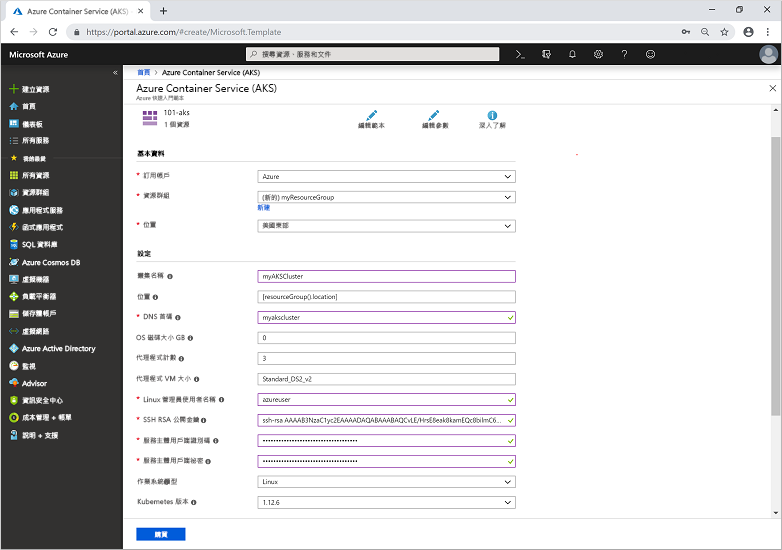

# <a name="quickstart-deploy-an-azure-kubernetes-service-aks-cluster-using-an-azure-resource-manager-template"></a>快速入門：使用 Azure Resource Manager 範本部署 Azure Kubernetes Service (AKS) 叢集

Azure Kubernetes Service (AKS) 是受控 Kubernetes 服務，可讓您快速部署及管理叢集。 在本快速入門中，您將使用 Azure Resource Manager 範本部署 AKS 叢集。 在叢集上執行包含 Web 前端和 Redis 執行個體的多容器應用程式。


本快速入門假設您已有 Kubernetes 概念的基本知識。 如需詳細資訊，請參閱 [Azure Kubernetes Services (AKS) 的 Kubernetes 核心概念][kubernetes-concepts]。

如果您沒有 Azure 訂用帳戶，請在開始前建立 [免費帳戶](https://azure.microsoft.com/free/?WT.mc_id=A261C142F) 。

[!INCLUDE [cloud-shell-try-it.md](../../includes/cloud-shell-try-it.md)]

如果您選擇在本機安裝和使用 CLI，本快速入門會要求您執行 Azure CLI 2.0.61 版或更新版本。 執行 `az --version` 以尋找版本。 如果您需要安裝或升級，請參閱[安裝 Azure CLI][azure-cli-install]。

## <a name="prerequisites"></a>必要條件

若要使用 Resource Manager 範本建立 AKS 叢集，您必須提供 SSH 公開金鑰與 Azure Active Directory 服務主體。 如果您需要其中一個資源，請參閱下一節；否則請跳至[建立 AKS 叢集](#create-an-aks-cluster)一節。

### <a name="create-an-ssh-key-pair"></a>建立 SSH 金鑰組

若要存取 AKS 節點，您可以使用 SSH 金鑰組進行連線。 使用 `ssh-keygen` 命令來產生 SSH 公開和私密金鑰檔案。 根據預設，這些檔案會建立在 *~/.ssh* 目錄中。 如果指定位置中存在相同名稱的 SSH 金鑰組，則系統會覆寫那些檔案。

下列命令會使用 RSA 加密建立 SSH 金鑰組，位元長度為 2048：

```azurecli-interactive
ssh-keygen -t rsa -b 2048
```

如需建立 SSH 金鑰的詳細資訊，請參閱[在 Azure 中建立及管理驗證的 SSH 金鑰][ssh-keys]。

### <a name="create-a-service-principal"></a>建立服務主體

為了允許 AKS 叢集與其他 Azure 資源互動，則會使用 Azure Active Directory 服務主體。 使用 [az ad sp create-for-rbac][az-ad-sp-create-for-rbac] 命令建立服務主體。 `--skip-assignment` 參數會限制指派任何其他權限。 根據預設，此服務主體的有效期限為一年。

```azurecli-interactive
az ad sp create-for-rbac --skip-assignment
```

輸出類似於下列範例：

```json
{
  "appId": "8b1ede42-d407-46c2-a1bc-6b213b04295f",
  "displayName": "azure-cli-2019-04-19-21-42-11",
  "name": "http://azure-cli-2019-04-19-21-42-11",
  "password": "27e5ac58-81b0-46c1-bd87-85b4ef622682",
  "tenant": "73f978cf-87f2-41bf-92ab-2e7ce012db57"
}
```

記下 appId  和密碼  。 下列步驟中會使用這些值。

## <a name="create-an-aks-cluster"></a>建立 AKS 叢集

本快速入門中使用的範本會[部署 Azure Kubernetes 服務叢集](https://azure.microsoft.com/resources/templates/101-aks/)。 如需更多 AKS 範例，請參閱 [AKS 快速入門範本][aks-quickstart-templates]站台。

1. 選取以下影像來登入 Azure 並開啟範本。

    [](https://portal.azure.com/#create/Microsoft.Template/uri/https%3A%2F%2Fraw.githubusercontent.com%2FAzure%2Fazure-quickstart-templates%2Fmaster%2F101-aks%2Fazuredeploy.json)

2. 選取或輸入下列值。  

    在本快速入門中，請保留 [OS 磁碟大小 GB]  、[代理程式計數]  、[代理程式 VM 大小]  、[OS 類型]  和 [Kubernetes 版本]  的預設值。 請針對下列範本參數提供您自己的值︰

    * 訂用帳戶  ：選取 Azure 訂用帳戶。
    * **資源群組**：選取 [建立新的]  。 輸入資源群組的唯一名稱 (例如 *myResourceGroup*)，然後選擇 [確定]  。
    * **位置**：選取一個位置，例如 [美國東部]  。
    * **叢集名稱**：輸入 AKS 叢集的唯一名稱，例如 *myAKSCluster*。
    * **DNS 前置詞**：為您的叢集輸入唯一的 DNS 前置詞，例如 *myakscluster*。
    * **Linux 管理員使用者名稱**：輸入使用 SSH 連線的使用者名稱，例如 *azureuser*。
    * **SSH RSA 公開金鑰**：複製並貼上 SSH 金鑰組的*公開*部分 (預設為 *~/.ssh/id_rsa.pub* 的內容)。
    * **服務主體用戶端識別碼**：從 `az ad sp create-for-rbac` 命令中複製並貼上您服務主體的*應用程式識別碼*。
    * **服務主體用戶端密碼**：從 `az ad sp create-for-rbac` 命令中複製並貼上您服務主體的*密碼*。
    * **我同意上方所述的條款及條件**：核取此方塊以表示同意。

    

3. 選取 [購買]  。

建立 AKS 叢集需要幾分鐘的時間。 請等到叢集成功部署後，再移至下一個步驟。

## <a name="connect-to-the-cluster"></a>連接到叢集

若要管理 Kubernetes 叢集，請使用 Kubernetes 命令列用戶端：[kubectl][kubectl]。 如果您使用 Azure Cloud Shell，則 `kubectl` 已安裝。 若要在本機安裝 `kubectl`，請使用 [az aks install-cli][az-aks-install-cli] 命令：

```azurecli
az aks install-cli
```

若要設定 `kubectl` 以連線到 Kubernetes 叢集，請使用 [az aks get-credentials][az-aks-get-credentials] 命令。 此命令會下載憑證並設定 Kubernetes CLI 以供使用。

```azurecli-interactive
az aks get-credentials --resource-group myResourceGroup --name myAKSCluster
```

若要驗證叢集的連線，請使用 [kubectl get][kubectl-get] 命令來傳回叢集節點的清單。

```azurecli-interactive
kubectl get nodes
```

下列輸出範例會顯示上一個步驟中建立的節點。 請確定所有節點的狀態皆為 *Ready*：

```
NAME                       STATUS   ROLES   AGE     VERSION
aks-agentpool-41324942-0   Ready    agent   6m44s   v1.12.6
aks-agentpool-41324942-1   Ready    agent   6m46s   v1.12.6
aks-agentpool-41324942-2   Ready    agent   6m45s   v1.12.6
```

## <a name="run-the-application"></a>執行應用程式

Kubernetes 資訊清單檔會定義所需的叢集狀態，例如要執行哪些容器映像。 在本教學課程中，資訊清單可用來建立執行 Azure 投票應用程式所需的所有物件。 此資訊清單包含兩個 [Kubernetes 部署][kubernetes-deployment]：一個適用於範例 Azure 投票 Python 應用程式，而另一個適用於 Redis 執行個體。 還會建立兩個 [Kubernetes 服務][kubernetes-service]：內部服務用於 Redis 執行個體，而外部服務用於從網際網路存取 Azure 投票應用程式。

> [!TIP]
> 在本快速入門中，您會以手動方式建立應用程式資訊清單，並將其部署至 AKS 叢集。 在更貼近現實的案例中，您可以使用 [Azure Dev Spaces][azure-dev-spaces] 快速地逐一查看程式碼，並直接在 AKS 叢集中進行偵錯。 您可以跨作業系統平台和開發環境來使用 Dev Spaces，並與小組中的其他人一起工作。

建立名為 `azure-vote.yaml` 的檔案，然後將下列 YAML 定義複製進來。 如果您使用 Azure Cloud Shell，可以使用 `vi` 或 `nano` 建立這個檔案，猶如使用虛擬或實體系統：

```yaml
apiVersion: apps/v1
kind: Deployment
metadata:
  name: azure-vote-back
spec:
  replicas: 1
  selector:
    matchLabels:
      app: azure-vote-back
  template:
    metadata:
      labels:
        app: azure-vote-back
    spec:
      nodeSelector:
        "beta.kubernetes.io/os": linux
      containers:
      - name: azure-vote-back
        image: redis
        resources:
          requests:
            cpu: 100m
            memory: 128Mi
          limits:
            cpu: 250m
            memory: 256Mi
        ports:
        - containerPort: 6379
          name: redis
---
apiVersion: v1
kind: Service
metadata:
  name: azure-vote-back
spec:
  ports:
  - port: 6379
  selector:
    app: azure-vote-back
---
apiVersion: apps/v1
kind: Deployment
metadata:
  name: azure-vote-front
spec:
  replicas: 1
  selector:
    matchLabels:
      app: azure-vote-front
  template:
    metadata:
      labels:
        app: azure-vote-front
    spec:
      nodeSelector:
        "beta.kubernetes.io/os": linux
      containers:
      - name: azure-vote-front
        image: microsoft/azure-vote-front:v1
        resources:
          requests:
            cpu: 100m
            memory: 128Mi
          limits:
            cpu: 250m
            memory: 256Mi
        ports:
        - containerPort: 80
        env:
        - name: REDIS
          value: "azure-vote-back"
---
apiVersion: v1
kind: Service
metadata:
  name: azure-vote-front
spec:
  type: LoadBalancer
  ports:
  - port: 80
  selector:
    app: azure-vote-front
```

使用 [kubectl apply][kubectl-apply] 命令來部署應用程式並指定 YAML 資訊清單的名稱：

```azurecli-interactive
kubectl apply -f azure-vote.yaml
```

下列範例輸出會顯示已成功建立的部署和服務：

```
deployment "azure-vote-back" created
service "azure-vote-back" created
deployment "azure-vote-front" created
service "azure-vote-front" created
```

## <a name="test-the-application"></a>測試應用程式

執行應用程式時，Kubernetes 服務會向網際網路公開前端應用程式。 此程序需要數分鐘的時間完成。

若要監視進度，請使用 [kubectl get service][kubectl-get] 命令搭配 `--watch` 引數。

```azurecli-interactive
kubectl get service azure-vote-front --watch
```

一開始，*azure-vote-front* 服務的 *EXTERNAL-IP* 會顯示為 *pending*。

```
NAME               TYPE           CLUSTER-IP   EXTERNAL-IP   PORT(S)        AGE
azure-vote-front   LoadBalancer   10.0.37.27   <pending>     80:30572/TCP   6s
```

當 *EXTERNAL-IP* 位址從 *pending* 變成實際的公用 IP 位址時，請使用 `CTRL-C` 停止 `kubectl` 監看式流程。 下列範例輸出會顯示已指派給服務的有效公用 IP 位址：

```
azure-vote-front   LoadBalancer   10.0.37.27   52.179.23.131   80:30572/TCP   2m
```

若要查看 Azure 投票應用程式的實際運作情況，請開啟網頁瀏覽器並瀏覽至服務的外部 IP 位址。


## <a name="delete-cluster"></a>刪除叢集

若不再需要叢集，可使用 [az group delete][az-group-delete] 命令來移除資源群組、容器服務和所有相關資源。

```azurecli-interactive
az group delete --name myResourceGroup --yes --no-wait
```

> [!NOTE]
> 當您刪除叢集時，不會移除 AKS 叢集所使用的 Azure Active Directory 服務主體。 如需有關如何移除服務主體的步驟，請參閱 [AKS 服務主體的考量和刪除][sp-delete]。

## <a name="get-the-code"></a>取得程式碼

在本快速入門中，預先建立的容器映像已用來建立 Kubernetes 部署。 相關的應用程式程式碼、Dockerfile 和 Kubernetes 資訊清單檔案，都可以在 GitHub 上取得。

[https://github.com/Azure-Samples/azure-voting-app-redis][azure-vote-app]

## <a name="next-steps"></a>後續步驟

在本快速入門中，您已部署 Kubernetes 叢集，並將多容器應用程式部署到此叢集。 [存取 Kubernetes Web 儀表板][kubernetes-dashboard]，以使用您已建立的叢集。

若要深入了解 AKS，並逐步完成部署範例的完整程式碼，請繼續 Kubernetes 叢集教學課程。

> [!div class="nextstepaction"]
> [AKS 教學課程][aks-tutorial]

<!-- LINKS - external -->
[azure-vote-app]: https://github.com/Azure-Samples/azure-voting-app-redis.git
[kubectl]: https://kubernetes.io/docs/user-guide/kubectl/
[kubectl-apply]: https://kubernetes.io/docs/reference/generated/kubectl/kubectl-commands#apply
[kubectl-get]: https://kubernetes.io/docs/reference/generated/kubectl/kubectl-commands#get
[azure-dev-spaces]: https://docs.microsoft.com/azure/dev-spaces/
[aks-quickstart-templates]: https://azure.microsoft.com/resources/templates/?term=Azure+Kubernetes+Service

<!-- LINKS - internal -->
[kubernetes-concepts]: concepts-clusters-workloads.md
[aks-monitor]: https://aka.ms/coingfonboarding
[aks-tutorial]: ./tutorial-kubernetes-prepare-app.md
[az-aks-browse]: /cli/azure/aks?view=azure-cli-latest#az-aks-browse
[az-aks-create]: /cli/azure/aks?view=azure-cli-latest#az-aks-create
[az-aks-get-credentials]: /cli/azure/aks?view=azure-cli-latest#az-aks-get-credentials
[az-aks-install-cli]: /cli/azure/aks?view=azure-cli-latest#az-aks-install-cli
[az-group-create]: /cli/azure/group#az-group-create
[az-group-delete]: /cli/azure/group#az-group-delete
[azure-cli-install]: /cli/azure/install-azure-cli
[sp-delete]: kubernetes-service-principal.md#additional-considerations
[azure-portal]: https://portal.azure.com
[kubernetes-deployment]: concepts-clusters-workloads.md#deployments-and-yaml-manifests
[kubernetes-service]: concepts-network.md#services
[kubernetes-dashboard]: kubernetes-dashboard.md
[ssh-keys]: ../virtual-machines/linux/create-ssh-keys-detailed.md
[az-ad-sp-create-for-rbac]: /cli/azure/ad/sp#az-ad-sp-create-for-rbac
