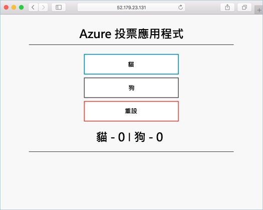

# <a name="tutorial-prepare-an-application-for-azure-kubernetes-service-aks"></a>教學課程：準備 Azure Kubernetes Service (AKS) 的應用程式

在此教學課程 (七個章節的第一部分) 中，多容器應用程式已準備好用於 Kubernetes。 使用現有的開發工具 (例如 Docker Compose) 在本機建置和測試應用程式。 您會了解如何：

> [!div class="checklist"]
> * 從 GitHub 複製範例應用程式來源
> * 從範例應用程式來源建立容器映像
> * 在本機 Docker 環境中測試多容器應用程式

完成後，就可在本機開發環境中執行下列應用程式：



在後續的教學課程中，此容器映像會上傳至 Azure Container Registry，然後部署到 AKS 叢集中。

## <a name="before-you-begin"></a>開始之前

此教學課程假設使用者對核心 Docker 概念有基本認識，例如容器、容器映像和 `docker` 命令。 如需容器基本概念的入門參考資料，請參閱[開始使用 Docker][docker-get-started]。

若要完成此教學課程，您需要一個執行 Linux 容器的本機 Docker 開發環境。 Docker 提供可在 [Mac][docker-for-mac]、[Windows][docker-for-windows] 或 [Linux][docker-for-linux] 系統上設定 Docker 的套件。

Azure Cloud Shell 不含完成這些教學課程中各個步驟所需的 Docker 元件。 因此，我們建議使用完整的 Docker 開發環境。

## <a name="get-application-code"></a>取得應用程式程式碼

此教學課程中使用的範例應用程式是基本投票應用程式。 應用程式是由前端 Web 元件和後端 Redis 執行個體所組成。 Web 元件會封裝至自訂容器映像。 Redis 執行個體會從 Docker Hub 使用未修改的映像。

使用 [git][] 將範例應用程式複製到您的開發環境：

```console
git clone https://github.com/Azure-Samples/azure-voting-app-redis.git
```

變更目錄以從複製的目錄操作。

```console
cd azure-voting-app-redis
```

目錄內有應用程式原始程式碼、預先建立的 Docker Compose 檔案和 Kubernetes 資訊清單檔。 整套教學課程都會使用到這些檔案。

## <a name="create-container-images"></a>建立容器映像

[Docker Compose][docker-compose] 可用來自動建置容器映像和部署多容器應用程式。

使用範例 `docker-compose.yaml` 檔案可建立容器映像、下載 Redis 映像，以及啟動應用程式：

```console
docker-compose up -d
```

完成時，使用 [docker images][docker-images] 命令來查看所建立的映像。 已下載或建立三個映像。 *azure-vote-front* 映像包含前端應用程式，並使用 `nginx-flask` 映像作為基礎映像。 `redis` 映像可用來啟動 Redis 執行個體。

```
$ docker images

REPOSITORY                   TAG        IMAGE ID            CREATED             SIZE
azure-vote-front             latest     9cc914e25834        40 seconds ago      694MB
redis                        latest     a1b99da73d05        7 days ago          106MB
tiangolo/uwsgi-nginx-flask   flask      788ca94b2313        9 months ago        694MB
```

執行 [docker ps][docker-ps] 命令可查看執行中的容器：

```
$ docker ps

CONTAINER ID        IMAGE             COMMAND                  CREATED             STATUS              PORTS                           NAMES
82411933e8f9        azure-vote-front  "/usr/bin/supervisord"   57 seconds ago      Up 30 seconds       443/tcp, 0.0.0.0:8080->80/tcp   azure-vote-front
b68fed4b66b6        redis             "docker-entrypoint..."   57 seconds ago      Up 30 seconds       0.0.0.0:6379->6379/tcp          azure-vote-back
```

## <a name="test-application-locally"></a>在本機測試應用程式

若要查看執行中的應用程式，請在本機網頁瀏覽器中輸入 http://localhost:8080。 系統會載入範例應用程式，如下列範例所示：


## <a name="clean-up-resources"></a>清除資源

應用程式的功能已完成驗證，因此可以停止並移除執行中的容器。 請勿刪除容器映像 - 在下一個教學課程中，會將 azure-vote-front 映像上傳至 Azure Container Registry 執行個體。

使用 [docker-compose down][docker-compose-down] 命令停止並移除容器執行個體和資源：

```console
docker-compose down
```

本機應用程式已移除後，您會有包含 Azure 投票應用程式的 Docker 映像 *azure-front-front*，可供下一個教學課程使用。

## <a name="next-steps"></a>後續步驟

在此教學課程中，應用程式已經過測試並已建立應用程式的容器映像。 您已了解如何︰

> [!div class="checklist"]
> * 從 GitHub 複製範例應用程式來源
> * 從範例應用程式來源建立容器映像
> * 在本機 Docker 環境中測試多容器應用程式

繼續進行下一個教學課程，以了解如何在 Azure Container Registry 中儲存容器映像。

> [!div class="nextstepaction"]
> [將映像推送至 Azure Container Registry][aks-tutorial-prepare-acr]

<!-- LINKS - external -->
[docker-compose]: https://docs.docker.com/compose/
[docker-for-linux]: https://docs.docker.com/engine/installation/#supported-platforms
[docker-for-mac]: https://docs.docker.com/docker-for-mac/
[docker-for-windows]: https://docs.docker.com/docker-for-windows/
[docker-get-started]: https://docs.docker.com/get-started/
[docker-images]: https://docs.docker.com/engine/reference/commandline/images/
[docker-ps]: https://docs.docker.com/engine/reference/commandline/ps/
[docker-compose-down]: https://docs.docker.com/compose/reference/down
[git]: https://git-scm.com/downloads

<!-- LINKS - internal -->
[aks-tutorial-prepare-acr]: ./tutorial-kubernetes-prepare-acr.md
