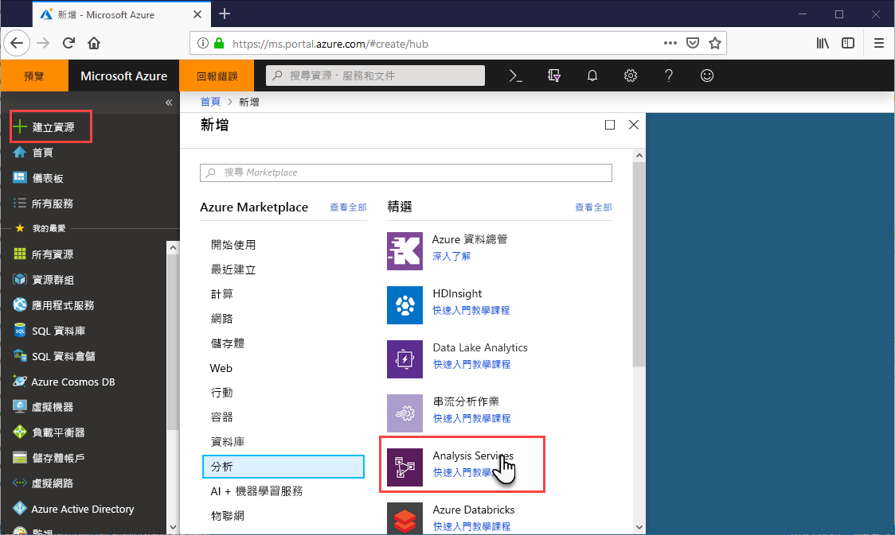

# 快速入門：建立伺服器 - 入口網站

本快速入門說明如何使用入口網站在 Azure 訂用帳戶中建立 Analysis Services 伺服器資源。

## 必要條件 

* **Azure 訂用帳戶**：瀏覽 [Azure 免費試用](https://azure.microsoft.com/offers/ms-azr-0044p/)來建立帳戶。
* **Azure Active Directory**：您的訂用帳戶必須與 Azure Active Directory 租用戶相關聯。 而且，您必須使用該 Azure Active Directory 中的帳戶來登入 Azure。 若要深入了解，請參閱[驗證和使用者權限](analysis-services-manage-users.md)。

## 登入 Azure 入口網站 

[登入入口網站](https://portal.azure.com)

## 建立伺服器

1. 按一下 [+ 建立資源]   > [資料]   > [Analysis Services]  。

    

2. 在 [Analysis Services]  中，填寫必要的欄位，然後按 [建立]  。
   
   * **伺服器名稱**：輸入用來參考伺服器的唯一名稱。 伺服器名稱必須以小寫字元開頭，並包含 3 到 128 個小寫字元和數字。 不允許使用空格和特殊字元。
   * 訂用帳戶  ：選取將要與此伺服器相關聯的訂用帳戶。
   * **資源群組**：建立新的資源群組，或選取您現有的資源群組。 資源群組是為了協助您管理 Azure 資源集合而設計。 若要深入了解，請參閱[資源群組](../azure-resource-manager/resource-group-overview.md)。
   * **位置**：此 Azure 資料中心位置會裝載伺服器。 請選擇最靠近最大使用者群體的位置。
   * **定價層**：選取定價層。 如果您在進行測試，而且想要安裝範例模型資料庫，請選取免費的 **D1** 層。 若要深入了解，請參閱 [Azure Analysis Services 定價](https://azure.microsoft.com/pricing/details/analysis-services/)。 
   * **系統管理員**：根據預設，這將是您用來登入的帳戶。 您可以從 Azure Active Directory 選擇不同的帳戶。
   * **備份儲存體設定**：選用。 如果您已經有[儲存體帳戶](../storage/common/storage-introduction.md)，您可以將它指定為模型資料庫備份的預設值。 您也可以稍後指定[備份和還原](analysis-services-backup.md)設定。
   * **儲存體金鑰到期日**：選用。 指定儲存體金鑰到期期間。

建立伺服器通常不到一分鐘即可完成。 如果您選取 [新增到入口網站]  ，請瀏覽至您的入口網站來查看新的伺服器。 或者，導覽至 [所有服務]   > [Analysis Services]  ，以查看您的伺服器是否就緒。 伺服器支援 1200 或更高相容性層級的表格式模型。 模型相容性層級指定於 SSDT 或 SSMS 中。

## 清除資源

若不再需要，請刪除您的伺服器。 在伺服器的 [概觀]  中，按一下 [刪除]  。 

 

## 後續步驟
在本快速入門中，您已了解如何在 Azure 訂用帳戶中建立伺服器。 既然您有伺服器，您可設定 (選擇性) 伺服器防火牆來協助保護其安全。 您也可以直接從入口網站，將基本範例資料模型新增到您的伺服器。 範例模型有助於您了解如何設定模型資料庫角色以及測試用戶端連線。 若要深入了解，請繼續進行新增範例模型的教學課程。

> [!div class="nextstepaction"]
> [快速入門：設定伺服器防火牆 - 入口網站](analysis-services-qs-firewall.md)   
> [!div class="nextstepaction"]
> [教學課程：將範例模型新增至您的伺服器](analysis-services-create-sample-model.md)
