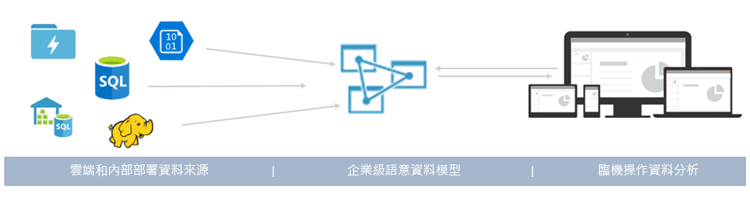
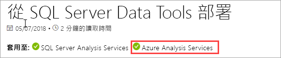
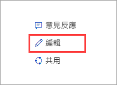

# 什麼是 Azure Analysis Services？

Azure Analysis Services 是完全受控的平台即服務 (PaaS)，可在雲端提供企業級資料模型。 使用進階的混搭與模型化功能，以結合來自多個資料來源的資料、定義計量，以及在單一受信任的表格式語意資料模型中保護您的資料。 資料模型可讓使用者更輕鬆快速地瀏覽要用於臨機操作資料分析的大量資料。

**影片：** 請觀看 [Azure Analysis Services 概觀](https://sec.ch9.ms/ch9/d6dd/a1cda46b-ef03-4cea-8f11-68da23c5d6dd/AzureASoverview_high.mp4)，以了解 Azure Analysis Services 有多麼適合 Microsoft 的整體 BI 功能。

## 快速啟動並執行

您可以在短短幾分鐘內，於 Azure 入口網站中[建立伺服器](analysis-services-create-server.md)。 此外，若是使用 Azure Resource Manager [範本](../azure-resource-manager/resource-manager-create-first-template.md)和 PowerShell，您可以使用宣告式範本來建立伺服器。 在單一範本中，您可以部署伺服器資源以及其他 Azure 元件 (例如儲存體帳戶和 Azure Functions)。 

**影片：** 請觀看[讓部署自動進行](https://channel9.msdn.com/series/Azure-Analysis-Services/AzureAnalysisServicesAutomation)，以深入了解如何使用 Azure 自動化來加快伺服器建立速度。

Azure Analysis Services 與許多 Azure 服務整合，讓您能建置複雜的分析解決方案。 與 [Azure Active Directory](../active-directory/fundamentals/active-directory-whatis.md) 整合可對重要資料提供安全的角色型存取。 納入可將資料載入模型中的活動，進而與 [Azure Data Factory](../data-factory/introduction.md) 管線整合。 [Azure 自動化](../automation/automation-intro.md)和 [Azure Functions](../azure-functions/functions-overview.md) 可用於使用自訂程式碼之模型的輕量型協調流程。 

## 當您需要時在右層

Azure Analysis Services 會以**開發人員**、**基本**及**標準**層提供。 每一層中的計劃成本會依據處理能力、QPU 及記憶體大小而有所不同。 當您建立伺服器時，可以選取一個層級內的計劃。 您可以在同一層內上下調動計劃，或升級為較高層，但是無法從較高層降級為較低層。

### 開發人員層

建議將此層用於評估、開發及測試案例。 單一方案包含與標準層相同的功能，但其處理能力、QPU 及記憶體大小有限。 此層無法使用查詢複本相應放大功能。 此層不提供 SLA。

|規劃  |QPU  |記憶體 (GB)  |
|---------|---------|---------|
|D1    |    20     |    3     |

### 基本層

此層建議用於具備小型表格式模型、使用者並行能力有限，且只需簡單資料重新整理功能的生產解決方案。 此層無法使用查詢複本相應放大功能。 此層不支援檢視方塊、多個分割區和 DirectQuery 表格式模型功能。  

|規劃  |QPU  |記憶體 (GB)  |
|---------|---------|---------|
|B1    |    40     |    10     |
|B2    |    80     |    20     |

### 標準層

對於需要靈活使用者並行且具備快速成長資料模型的任務關鍵性生產應用程式，適合使用此層。 此層支援進階的資料重新整理以提供近乎即時的資料模型更新，並支援所有表格式模型化功能。

|規劃  |QPU  |記憶體 (GB)  |
|---------|---------|---------|
|S1    |    40     |    10     |
|S2    |    100     |    25     |
|S3    |    200     |    50     |
|S4    |    400     |    100     |
|S8*    |    320     |    200     |
|S9*    |    640    |    400     |

\* 並非所有區域都有提供。  

## 依區域的可用性

世界各地的區域皆支援 Azure Analysis Services。 所支援的方案和查詢複本可用性取決於您所選擇的區域。 視每個區域的需求和可用資源而定，可以變更方案和查詢複本可用性。 

### 美洲

|區域  | 支援的方案 | 查詢複本 (僅限標準方案) |
|---------|---------|:---------:|
|巴西南部     |    B1, B2, S0, S1, S2, S4, D1     |     1    |
|加拿大中部    |     B1, B2, S0, S1, S2, S4, D1    |     1    |
|美國東部     |     B1, B2, S0, S1, S2, S4, D1    |    1     |
|美國東部 2     |     B1, B2, S0, S1, S2, S4, D1   S8, S9   |    7 1    |
|美國中北部     |     B1, B2, S0, S1, S2, S4, D1     |    1     |
|美國中部     |    B1, B2, S0, S1, S2, S4, D1     |    1     |
|美國中南部     |    B1, B2, S0, S1, S2, S4, D1     |    1     |
|美國中西部   |     B1, B2, S0, S1, S2, S4, D1    |    3     |
|美國西部     |    B1, B2, S0, S1, S2, S4, D1   S8, S9   |    7 2  |
|美國西部 2    |    B1, B2, S0, S1, S2, S4, D1    S8, S9  |    3 1     |

### 歐洲

|區域  | 支援的方案 | 查詢複本 (僅限標準方案) |
|---------|---------|:---------:|
|北歐     |    B1, B2, S0, S1, S2, S4, D1      |    7     |
|英國南部   |    B1, B2, S0, S1, S2, S4, D1      |     1    |
|西歐     |    B1, B2, S0, S1, S2, S4, D1    S8, S9    |    7 1     |

### 亞太地區 

|區域  | 支援的方案 | 查詢複本 (僅限標準方案) |
|---------|---------|:---------:|
|澳大利亞東南部     | B1, B2, S0, S1, S2, S4, D1       |    1     |
|澳洲東部     |    B1, B2, S0, S1, S2, S4     S8, S9    |    3 1     |
|日本東部  |   B1, B2, S0, S1, S2, S4, D1       |    1     |
|東南亞     |     B1, B2, S0, S1, S2, S4, S8, S9, D1     |   1      |
|印度西部     |    B1, B2, S0, S1, S2, S4, D1     |    1     |

## 調整您的需求

### 相應增加/減少、暫停與繼續

增加、減少或暫停您的伺服器。 使用 Azure 入口網站或使用 PowerShell 即時完全掌控各種狀況。 您只需依據使用量付費。  

### 相應放大資源以獲得快速的查詢回應

透相應放大，用戶端查詢會在查詢集區中分散到多個查詢複本。 查詢複本已同步處理您表格式模型的副本。 透過分配查詢工作負載，可以降低在高度查詢工作負載期間的回應時間。 模型處理作業可與查詢集區分開處理，確保用戶端查詢不會受到處理作業的不良影響。 

您可以建立一個多達七個額外查詢複本的查詢集區 (總共八個，包含您的伺服器)。 您可以在集區中擁有的查詢複本數目取決於您所選擇的方案和區域。 查詢複本無法分散到伺服器所在區域之外。 查詢複本會以相同的伺服器費率計費。

如同變更層級，您也可以根據您的需求將查詢複本相應放大。 在入口網站或使用 REST API 來設定相應放大。 若要深入了解，請參閱 [Azure Analysis Services 相應放大](analysis-services-scale-out.md)。

## 價格

總成本取決於許多因素；例如，您所選擇的區域、服務層、查詢複本和暫停/繼續。 請使用 [Azure Analysis Services 定價](https://azure.microsoft.com/pricing/details/analysis-services/)計算機來判斷您所在區域的一般定價。 此工具會計算單一區域單一伺服器執行個體的定價。 請記住，查詢複本會以相同的伺服器費率計費。 

## 建置在 SQL Server Analysis Services 上

Azure Analysis Services 與 SQL Server Analysis Services Enterprise Edition 中現有的許多優質功能相容。 Azure Analysis Services 支援 1200 或更高[相容性層級](analysis-services-compat-level.md)的表格式模型。 表格式模型屬於關聯式模型建構 (模型、資料表、資料行)，在表格式模型指令碼語言 (TMSL) 和表格式物件模型 (TOM) 程式碼中會以表格式中繼資料物件定義來加以聯結。 分割區、檢視方塊、資料列層級安全性、雙向關聯性和轉譯都有支援*。 多維度模型和 PowerPivot for Sharepoint 則不受 Azure Analysis Services 支援。

記憶體內部模式和 DirectQuery 模式皆支援表格式模型。 記憶體內部模式 (預設值) 的表格式模型支援多個資料來源。 因為模型資料經過高度壓縮，且會快取到記憶體內部，此模式可在資料量很大時提供最快的查詢回應速度。 針對複雜的資料集和查詢，它也可提供最大的彈性。 分割能實現累加式載入、增加平行處理能力，並降低記憶體耗用量。 其他進階的資料模型功能 (例如，導出的資料表和所有的 DAX 函式) 都可獲得支援。 記憶體內部模型必須經過重新整理 (處理)，才能從資料來源更新快取資料。 搭配 Azure 服務主體支援，使用 PowerShell、TOM、TMSL 和 REST 的自動重新整理作業可提供彈性，確保模型資料永遠是最新的。 

DirectQuery 模式* 會利用後端關聯式資料庫來提供儲存和查詢執行功能。 單一的 SQL Server、SQL Server 資料倉儲、Azure SQL Database、Azure SQL 資料倉儲、Oracle 和 Teradata 資料來源可支援超大型資料集。 後端資料集可超過可用的伺服器資源記憶體。 不需要複雜的資料模型重新整理案例。 此模式也有一些限制，例如，資料來源類型有限、DAX 公式限制，且不支援某些進階的資料模型化功能。 請先參閱[直接查詢模式](https://docs.microsoft.com/sql/analysis-services/tabular-models/directquery-mode-ssas-tabular)，再來判斷最適合您的模式。

\* 功能是否可用取決於服務層。

## 支援的資料來源

Azure Analysis Services 中的表格式模型可支援各種資料來源，從簡單的文字檔案到 Azure Data Lake Store 中的巨量資料都行。 若要深入了解，請參閱 [Azure Analysis Services 中所支援的資料來源](analysis-services-datasource.md)。

## 您的資料很安全

Azure Analysis Services 可為敏感性資料提供多種層級的安全性。 在伺服器層級：防火牆、Azure 驗證、伺服器系統管理員角色和伺服器端加密。 而在資料模型層級，使用者角色、資料列層級和物件層級的安全性可確保您的資料安全無虞，只有應該看到資料的使用者能看到資料。

### 防火牆

Azure Analysis Services 防火牆會封鎖規則中所指定 IP 位址以外的所有用戶端連線。 設定指定依個別用戶端 IP 或依範圍允許之 IP 位址的規則。 也可以允許或封鎖 Power BI (服務) 連線。 在入口網站中或藉由使用 PowerShell 來設定防火牆與規則。 若要深入了解，請參閱[設定伺服器防火牆](analysis-services-qs-firewall.md)。

### 驗證

使用者驗證是由 [Azure Active Directory (AAD)](../active-directory/fundamentals/active-directory-whatis.md) 負責處理的。 使用者在登入時會使用具有資料庫角色型存取權的組織帳戶身分識別。 使用者身分識別必須是伺服器所在訂用帳戶的預設 Azure Active Directory 成員。 若要深入了解，請參閱[驗證和使用者權限](analysis-services-manage-users.md)。

### 資料安全性

Azure Analysis Services 使用 Azure Blob 儲存體來保留 Analysis Services 資料庫的儲存體和中繼資料。 Blob 內的資料檔案是使用 [Azure Blob 伺服器端加密 (SSE)](../storage/common/storage-service-encryption.md) 來加密。 使用直接查詢模式時，只會儲存中繼資料。 查詢時，會從資料來源透過加密通訊協定來存取實際資料。

透過安裝和設定[內部部署資料閘道](analysis-services-gateway.md)，即可安全地存取您組織中的內部部署資料來源。 閘道提供 DirectQuery 和記憶體內部模式的資料存取。

### 角色

Analysis Services 會使用[角色型授權](https://docs.microsoft.com/sql/analysis-services/tabular-models/roles-ssas-tabular)，來授與伺服器和模型資料庫作業、物件與資料的存取權。 存取伺服器或資料庫的使用者都能使用其在所指派角色內的 Azure AD 使用者帳戶執行這項操作。 伺服器管理員角色位於伺服器資源層級。 根據預設，建立伺服器時所使用的帳戶會自動包含在伺服器管理員角色內。 使用入口網站、SSMS 或 PowerShell，即可新增其他使用者和群組帳戶。
  
查詢資料的非系統管理終端使用者會透過資料庫角色獲得存取權。 資料庫角色會建立為資料庫中的個別物件，而且只適用於該角色建立所在的資料庫。 資料庫角色是由 (資料庫) 系統管理員、讀取以及「讀取和處理」權限所定義的。 使用 SSMS 或 PowerShell 即可新增使用者和群組帳戶。

### 資料列層級安全性

所有相容性層級的表格式模型均支援資料列層級安全性。 資料列層級安全性是在模型中設定的，方法是使用 DAX 運算式，以定義資料表中的資料表，以及使用者可查詢的相關資料表中許多方向的任何資料列。 針對「讀取」以及「讀取和處理」權限，則定義了使用 DAX 運算式的資料列篩選條件。 

### 物件層級安全性 

1400 相容性層級的表格式模型可支援物件層級安全性，其中包括資料表層級安全性和資料行層級安全性。 物件層級安全性可使用 TMSL 或 TOM 在 Model.bim 檔案的 JSON 型中繼資料內進行設定。 若要深入了解，請參閱[物件層級安全性](https://docs.microsoft.com/sql/analysis-services/tabular-models/object-level-security)。

### 透過服務主體進行自動化

服務主體是您在租用戶內建立的 Azure Active Directory 應用程式資源，用來執行自動資源和服務層級作業。 服務主體可與 Azure 自動化、PowerShell 自動模式、自訂用戶端應用程式和 Web 應用程式搭配使用，來將資料重新整理、相應增加/減少以及暫停/繼續等一般工作自動化。 權限會透過角色成員資格指派給服務主體。 若要深入了解，請參閱[使用服務主體進行自動化](analysis-services-service-principal.md)。

### Azure 控管

Azure Analysis Services 受 [Microsoft Online Services 條款](http://www.microsoftvolumelicensing.com/DocumentSearch.aspx?Mode=3&DocumentTypeId=31)和 [Microsoft 隱私權聲明](https://privacy.microsoft.com/privacystatement)控管。
若要深入了解「Azure 資訊安全」，請參閱 [Microsoft 信任中心](https://www.microsoft.com/trustcenter)。

## 使用您已知的工具

### 適用於 Visual Studio 的 SQL Server Data Tools (SSDT)

包含免費 [適用於 Visual Studio 的 SQL Server Data Tools (SSDT)](https://msdn.microsoft.com/library/mt204009.aspx) 的開發和部署模型。 SSDT 包含可讓您快速啟動並執行的 Analysis Services 專案範本。 SSDT 現在包含適用於表格式 1400 模型的新式 Get Data 資料來源查詢和混搭功能。 如果您已熟悉 Power BI Desktop 和 Excel 2016 中的 Get Data，您就已經知道建立高度自訂的資料來源查詢有多輕鬆。 Microsoft Analysis Services 專案也可作為可安裝的套件 VSIX 供 Visual Studio 使用。 [從 Marketplace 下載](https://marketplace.visualstudio.com/items?itemName=ProBITools.MicrosoftAnalysisServicesModelingProjects)。

### Sql Server Management Studio

使用 [SQL Server Management Studio (SSMS)](https://docs.microsoft.com/sql/ssms/download-sql-server-management-studio-ssms) 來管理伺服器及建立資料庫模型。 連線到您在雲端中的伺服器。 從 XMLA 查詢視窗執行 TMSL 指令碼，並使用 TMSL 指令碼和 PowerShell 自動執行工作。 快速提供新特性與功能 - 每個月更新 SSMS。

### PowerShell

建立伺服器資源、暫停或繼續伺服器作業或變更服務層級 (層) 的伺服器資源管理工作會使用 Azure Resource Manager (AzureRM) Cmdlet。 其他用於管理資料庫的工作 (例如新增或移除角色成員、處理或執行 TMSL 指令碼) 會使用 SqlServer 模組中的 Cmdlet。 若要深入了解，請參閱[使用 PowerShell 管理 Azure Analysis Services](analysis-services-powershell.md)。

### 物件模型和編寫指令碼

表格式模型可供快速進行開發，並可高度自訂。 表格式模型包含可說明模型物件的[表格式物件模型](https://docs.microsoft.com/sql/analysis-services/tabular-model-programming-compatibility-level-1200/introduction-to-the-tabular-object-model-tom-in-analysis-services-amo) (TOM)。 TOM 會經由 [Microsoft.AnalysisServices.Tabular](https://msdn.microsoft.com/library/microsoft.analysisservices.tabular.aspx) 命名空間透過[表格式模型指令碼語言 (TMSL)](https://docs.microsoft.com/sql/analysis-services/tabular-model-scripting-language-tmsl-reference)和 AMO 資料定義語言以 JSON 公開。 

## 支援最新的用戶端工具

支援新式資料探索和視覺效果工具 (像是 Power BI、Excel、Reporting Services 和第三方工具)，並可讓使用者以高度互動和豐富的視覺化方式，深入了解您的模型資料。 

## 監視和診斷

Azure Analysis Services 會與 Azure 計量整合，以提供大量的資源特有計量，協助您監視伺服器的效能和健康情況。 若要深入了解，請參閱[監視伺服器計量](analysis-services-monitor.md)。 使用 [Azure 資源診斷記錄](../monitoring-and-diagnostics/monitoring-overview-of-diagnostic-logs.md)來記錄計量。 監視記錄並將記錄傳送至 [Azure 儲存體](https://azure.microsoft.com/services/storage/)、將記錄串流至 [Azure 事件中樞](https://azure.microsoft.com/services/event-hubs/)，並將記錄匯出至 [Log Analytics](https://azure.microsoft.com/services/log-analytics/) (這是一項 [Azure](https://www.microsoft.com/cloud-platform/operations-management-suite) 服務)。 若要深入了解，請參閱[設定診斷記錄](analysis-services-logging.md)。

Azure Analysis Services 也支援使用[動態管理檢視 (DMV)](https://docs.microsoft.com/sql/analysis-services/instances/use-dynamic-management-views-dmvs-to-monitor-analysis-services)。 根據 SQL 語法，DMV 介面結構描述資料列會傳回有關伺服器執行個體的中繼資料和監視資訊。

## 文件

這裡會有 Azure Analysis Services 專屬文件。 請使用瀏覽器畫面左側的目錄來尋找文章。 

由於 Azure Analysis Services 表格式模型與 SQL Server Analysis Services 中的表格式模型極為類似，因此 [SQL Server Analysis Services 文件](https://docs.microsoft.com/sql/analysis-services/analysis-services)中有收納了共用概念、程序、開發人員和參考文章的廣泛文件庫。 SQL Server Analysis Services 文件中的文章，會透過標題下方的「適用於」橫幅顯示其是否也適用於 Azure Analysis Services。

### 參與！

Analysis Services 文件 (如本文) 屬開放式來源。 如果您有 GitHub 帳戶，則可按一下瀏覽器畫面右上角的 [編輯] (鉛筆) 來編輯文章。 使用瀏覽器內編輯器，然後按一下 [建議檔案變更]。 

文件小組會檢閱您的參與，一經核准，您的 GitHub 帳戶名稱將會顯示為參與者。 若要深入了解，請參閱[文件參與者指南](https://docs.microsoft.com/contribute/)。

Azure Analysis Services 文件也會使用 [GitHub 問題](https://docs.microsoft.com/teamblog/a-new-feedback-system-is-coming-to-docs)。 您可以提供有關產品或文件的意見反應。 請使用文章底部的 [意見反應]。 SQL Server Analysis Services 文件還未啟用「GitHub 問題」。 

## 部落格

事情變化得很快。 請到 [Analysis Services 小組部落格](https://blogs.msdn.microsoft.com/analysisservices/)和 [Azure 部落格](https://azure.microsoft.com/blog/)取得最新資訊。

## 社群

Analysis Services 有活躍的使用者社群。 在 [Azure Analysis Services 論壇](https://aka.ms/azureanalysisservicesforum)的對話。

## 後續步驟

> [!div class="nextstepaction"]
> [申請 Azure 免費試用](https://azure.microsoft.com/offers/ms-azr-0044p/)   

> [!div class="nextstepaction"]
> [快速入門：建立伺服器 - 入口網站](analysis-services-create-server.md)   

> [!div class="nextstepaction"]
> [快速入門：建立伺服器 - PowerShell](analysis-services-create-powershell.md)  
