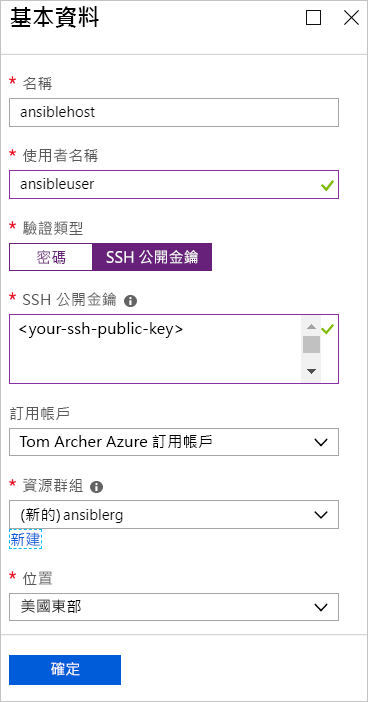
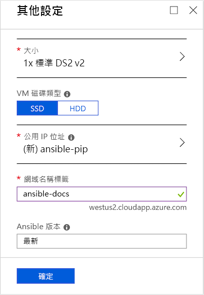

# 快速入門：將適用於 Azure 的 Ansible 解決方案範本部署至 CentOS

依設計，適用於 Azure 的 Ansible 解決方案範本會在 CentOS 虛擬機器上設定 Ansible 執行個體，以及 Ansible 和一套設定為與 Azure 搭配運作的工具。 這些工具包括：

- **適用於 Azure 的 Ansible 模組** - [適用於 Azure 的 Ansible 模組](./ansible-matrix.md)是一套可讓您在 Azure 上建立及管理基礎結構的模組。 系統預設會部署這些模組的最新版本。 不過，在部署解決方案範本的過程中，您也可以指定適用於您環境的版本號碼。
- **Azure 命令列介面 (CLI) 2.0** - [Azure CLI 2.0](/cli/azure/?view=azure-cli-latest) 是用來管理 Azure 資源的跨平台命令列體驗。 
- **適用於 Azure 資源的受控識別** - [適用於 Azure 資源的受控識別](/azure/active-directory/managed-identities-azure-resources/overview)功能可解決如何讓雲端應用程式認證保持安全的問題。

## 必要條件

[!INCLUDE [open-source-devops-prereqs-azure-subscription.md](../../includes/open-source-devops-prereqs-azure-subscription.md)]

## 部署 Ansible 解決方案範本

1. 瀏覽至 [Azure Marketplace 中的 Ansible 解決方案範本](https://azuremarketplace.microsoft.com/en-%20%20us/marketplace/apps/azure-oss.ansible?tab=Overview)。

1. 選取 [立即取得]  。

1. 隨即會出現視窗，詳述其使用規定、隱私權原則和 Azure Marketplace 條款的使用。 選取 [繼續]  。

1. 隨即會出現 Azure 入口網站，並顯示 Ansible 頁面以描述該解決方案範本。 選取 [建立]  。

1. 在 [建立 Ansible]  頁面上，您會看到數個索引標籤。 在 [基本]  索引標籤上，輸入必要資訊：

   - **名稱** - 指定 Ansible 執行個體的名稱。 為了進行示範，我們使用的名稱是 `ansiblehost`。
   - **使用者名稱：** - 指定將可存取 Ansible 執行個體的使用者名稱。 為了進行示範，我們使用的名稱是 `ansibleuser`。
   - **驗證類型：** - 選取 [密碼]  或 [SSH 公開金鑰]  。 為了進行示範，我們選取 [SSH 公開金鑰]  。
   - **密碼**和**確認密碼** - 如果您選取 [密碼]  作為 [驗證類型]  ，則請輸入您的密碼來作為這些值。
   - **SSH 公開金鑰** - 如果您選取 [SSH 公開金鑰]  作為 [驗證類型]  ，則請以單行格式輸入您的 RSA 公開金鑰 - 以 `ssh-rsa` 開頭。
   - **訂用帳戶** - 從下拉式清單中選取您的 Azure 訂用帳戶。
   - **資源群組** - 從下拉式清單中選取現有的資源群組，或選取 [新建]  並為新的資源群組指定名稱。 為了進行示範，我們使用名為 `ansiblerg` 的新資源群組。
   - **位置** - 從下拉式清單中選取適合您案例的位置。

     

1. 選取 [確定]  。

1. 在 [其他設定]  索引標籤中，輸入必要資訊：

   - **大小** - Azure 入口網站預設會使用標準大小。 若要指定不同大小以適應您的特定案例，請選取箭號來顯示不同大小的清單。
   - **VM 磁碟類型** - 選取 [SSD]  (進階固態硬碟) 或 [HDD]  (硬碟)。 為了進行示範，我們選取 [SSD]  以獲得其效能優勢。 如需這兩種磁碟儲存體各自的詳細資訊，請參閱下列文章：
       - [VM 高效能進階儲存體與受控磁碟](/azure/virtual-machines/windows/premium-storage)
       - [適用於 Azure 虛擬機器工作負載的標準 SSD 受控磁碟](/azure/virtual-machines/windows/disks-standard-ssd)
   - **公用 IP 位址** - 如果您想要從虛擬機器外部與虛擬機器通訊，請指定此設定。 預設值是名稱為 `ansible-pip` 的新公用 IP 位址。 若要指定不同的 IP 位址，請選取箭號以指定該 IP 位址的屬性 - 例如名稱、SKU 和指派。 
   - **網域名稱標籤** - 輸入虛擬機器的公開網域名稱。 此名稱必須是唯一的，且符合命名需求。 如需如何為虛擬機器指定名稱的詳細資訊，請參閱 [Azure 資源的命名慣例](/azure/architecture/best-practices/naming-conventions)。
   - **Ansible 版本** - 指定版本號碼，或指定 `latest` 值以部署最新版本。 選取 [Ansible 版本]  旁的資訊圖示，以查看可用版本的詳細資訊。

     

1. 選取 [確定]  。

1. 在 [Ansible 整合設定]  索引標籤中，指定驗證類型。 如需如何保護 Azure 資源的詳細資訊，請參閱[什麼是適用於 Azure 資源的受控識別？](/azure/active-directory/managed-identities-azure-resources/overview)。

    

1. 選取 [確定]  。

1. 隨即會顯示 [摘要]  頁面，其中會顯示出驗證程序，並列出 Ansible 部署的指定準則。 索引標籤底部的連結可讓您**下載範本和參數**以便與支援的 Azure 語言和平台搭配使用。 

     ![Ansible [摘要] 索引標籤的 Azure 入口網站索引標籤](./media/ansible-quick-deploy-solution-template/portal-ansible-setup-tab-4.png)

1. 選取 [確定]  。

1. 當 [建立]  索引標籤出現時，請選取 [確定]  來部署 Ansible。

1. 選取入口網站頁面頂端的 [通知]  圖示來追蹤 Ansible 部署。 部署完成後，請選取 [移至資源群組]  。 

     ![Ansible [摘要] 索引標籤的 Azure 入口網站索引標籤](./media/ansible-quick-deploy-solution-template/portal-ansible-setup-complete.png)

1. 在資源群組頁面上，取得您 Ansible 主機的 IP 位址，並隨即登入以使用 Ansible 來管理 Azure 資源。

## 後續步驟

> [!div class="nextstepaction"] 
> [快速入門：使用 Ansible 在 Azure 中設定 Linux 虛擬機器](/azure/virtual-machines/linux/ansible-create-vm)