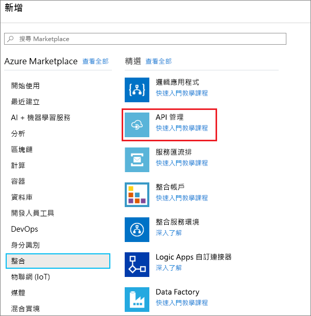
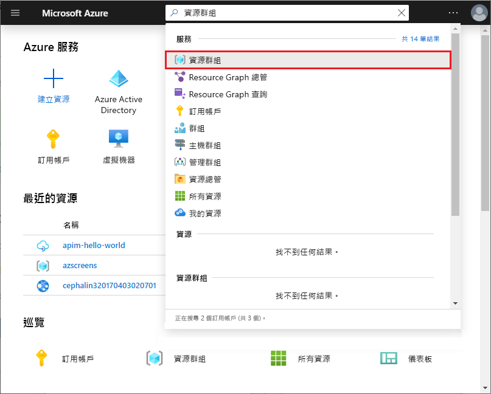
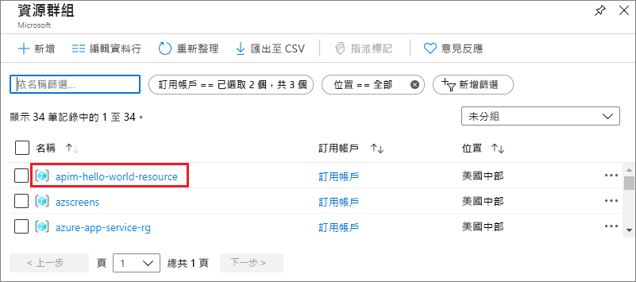
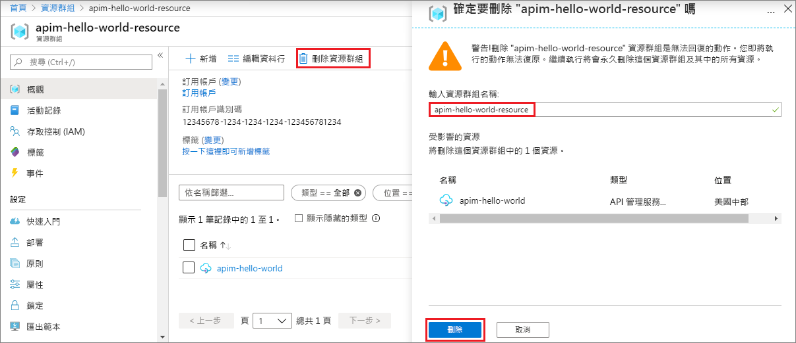

# 建立新的 Azure API 管理服務執行個體

「Azure API 管理 (APIM)」可協助組織將 API 發佈給外部、合作夥伴及內部開發人員，以發揮其資料與服務的潛力。 「API 管理」提供的核心專長認證，透過開發人員參與、商務洞察力、分析、安全性和保護，可確保 API 程式獲致成功。 APIM 可讓您為裝載於任何位置的現有後端服務，建立和管理新式 API 閘道。 如需詳細資訊，請參閱[概觀](api-management-key-concepts.md)主題。

此快速入門描述使用 Azure 入口網站建立新的 API 管理執行個體的步驟。

[!INCLUDE [quickstarts-free-trial-note](../../includes/quickstarts-free-trial-note.md)]

## 登入 Azure

登入 [Azure 入口網站](https://portal.azure.com)。

## 建立新的服務

1. 從 Azure 入口網站功能表選取 [建立資源]  。 您也可以在 Azure **首頁**上選取 [建立資源]  。 
   
   ![選取 [建立資源]](./media/get-started-create-service-instance/00-CreateResource-01.png)
   
1. 在 [新增]  畫面中，選取 [整合]  ，然後選取 [API 管理]  。
   
   
   
1. 在 [API 管理服務]  畫面中，輸入設定。
   
   
   
   | 設定                 | 建議的值                               | 描述                                                                                                                                                                                                                                                                                                                         |
|-------------------------|-----------------------------------------------|-------------------------------------------------------------------------------------------------------------------------------------------------------------------------------------------------------------------------------------------------------------------------------------------------------------------------------------|
| **名稱**                | API 管理服務的唯一名稱 | 此名稱無法在之後變更。 服務名稱用來產生預設網域名稱，格式為 *{name}.azure-api.net*。 如果您想要使用自訂網域名稱，請參閱[設定自訂網域](configure-custom-domain.md)。   服務名稱用來參考服務和對應的 Azure 資源。 |
| **訂用帳戶**        | 您的訂用帳戶                             | 將在其下建立這個新服務執行個體的訂用帳戶。 您可以從可存取的不同 Azure 訂用帳戶之中，選取一個訂用帳戶。                                                                                                                                                            |
| **資源群組**      | *apimResourceGroup*                           | 您可以選取新的或現有的資源。 資源群組是共用生命週期、權限及原則的資源集合。 [在此](../azure-resource-manager/management/overview.md#resource-groups)深入了解。                                                                                                  |
| **位置**            | *美國西部*                                    | 選取您附近的地理區域。 只有可用的 API 管理服務區域才會出現在下拉式清單方塊中。                                                                                                                                                                                                          |
| **組織名稱**   | 您的組織名稱                 | 此名稱會在有許多地方使用，包括開發人員入口網站的標題和通知電子郵件的傳送者。                                                                                                                                                                                                             |
| **管理員電子郵件** | *admin\@org.com*                               | 設定電子郵件地址以接收所有來自 **API 管理**的通知。                                                                                                                                                                                                                                              |
| **定價層**        | *開發人員*                                   | 設定 [開發人員]  層來評估服務。 此階層不適用於生產環境。 如需有關調整 API 管理層規模的詳細資訊，請參閱[升級和調整規模](upgrade-and-scale.md)。                                                                                                                                    |

3. 選擇 [建立]  。

    > [!TIP]
    > 建立 API 管理服務通常需要 20 到 30 分鐘。 選取 [釘選到儀表板]  以更輕鬆找到新建立的服務。

[!INCLUDE [api-management-navigate-to-instance](../../includes/api-management-navigate-to-instance.md)]

## 清除資源

若不再需要，您可以遵循下列步驟來移除資源群組和所有相關資源：

1. 在 Azure 入口網站中，搜尋並選取 [資源群組]  。 您也可以在**首頁**上選取 [資源群組]  。 

   

1. 在 [資源群組]  頁面中，選取您的資源群組。

   

1. 在 [資源群組] 頁面中，選取 [刪除資源群組]  。 
   
1. 輸入您的資源群組名稱，然後選取 [刪除]  。

   

## 後續步驟

> [!div class="nextstepaction"]
> [匯入和發佈您的第一個 API](import-and-publish.md)
