# <a name="create-an-aspnet-framework-web-app-in-azure"></a>在 Azure 中建立 ASP.NET Framework Web 應用程式

[Azure App Service](overview.md) 可提供可高度擴充、自我修復的 Web 主控服務。

本快速入門會顯示如何將第一個 ASP.NET Web 應用程式部署至 Azure App Service。 當您完成時，您將會有 App Service 方案。 您也會有一個具有已部署 Web 應用程式的 App Service 應用程式。

[!INCLUDE [quickstarts-free-trial-note](../../includes/quickstarts-free-trial-note.md)]

## <a name="prerequisites"></a>必要條件

若要完成此教學課程，請安裝 <a href="https://www.visualstudio.com/downloads/" target="_blank">Visual Studio 2019</a> 和 **ASP.NET 以及 Web 開發**工作負載。

若您已安裝 Visual Studio 2019：

- 選取 [說明]   > [檢查更新]  以安裝最新的 Visual Studio 更新。
- 選取 [工具]   > [取得工具及功能]  。

## 建立 ASP.NET Web 應用程式<a name="create-and-publish-the-web-app"></a>

請遵循下列步驟來建立 ASP.NET Web 應用程式：

1. 開啟 Visual Studio，然後選取 [建立新專案]  。

2. 在 [建立新專案]  中，尋找並選擇 [ASP.NET Web 應用程式 (.NET Framework)]  ，然後選取 [下一步]  。

3. 在 [設定新專案]  中，將應用程式命名為 myFirstAzureWebApp  ，然後選取 [建立]  。

   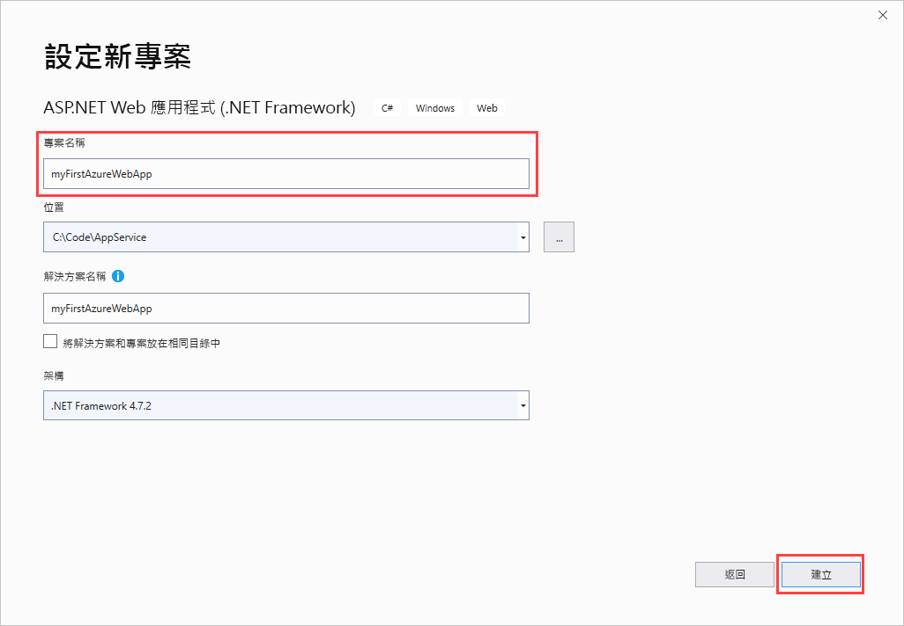

4. 您可以將任何類型的 ASP.NET web 應用程式部署至 Azure。 在本快速入門中，選擇 [MVC]  範本。

5. 確定驗證已設定為 [不需要驗證]  。 選取 [建立]  。

   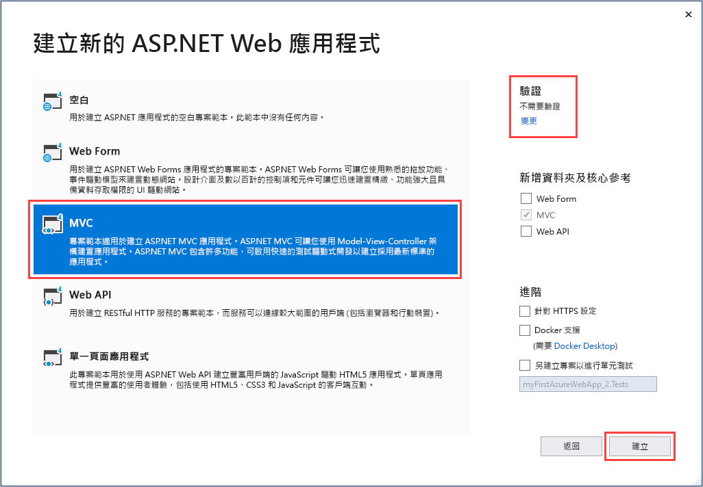

6. 從 Visual Studio 功能表中，選取 [偵錯]   > [啟動但不偵錯]  以在本機執行 Web 應用程式。

   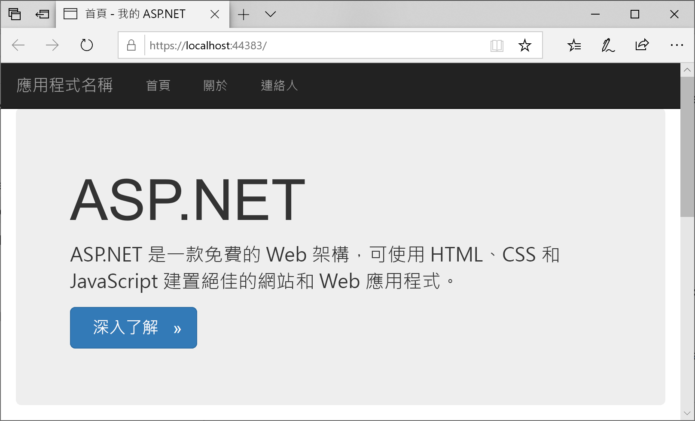

## 發佈 Web 應用程式<a name="launch-the-publish-wizard"></a>

1. 在 [方案總管]  中，以滑鼠右鍵按一下 **myFirstAzureWebApp** 專案，然後選取 [發佈]  。

1. 選擇 [App Service]  ，然後將 [建立設定檔]  變更為 [發佈]  。

   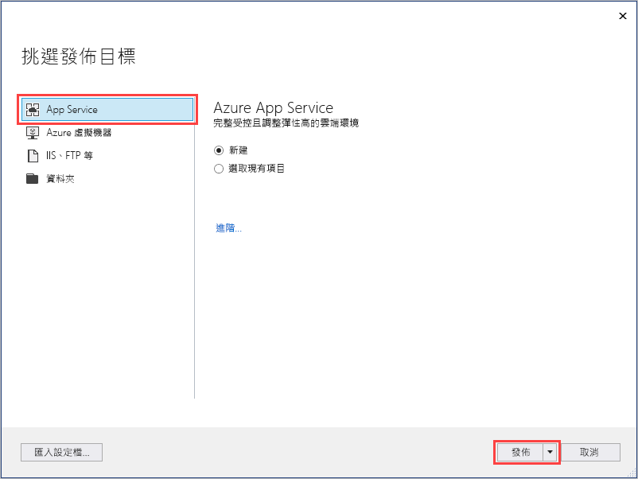

1. 在 [App Service 建立新的]  中，您的選項取決於您是否已登入 Azure，以及是否有將 Visual Studio 帳戶連結至 Azure 帳戶。 選取 [新增帳戶]  或 [登入]  來登入 Azure 訂用帳戶。 若您已經登入，請選取要使用的帳戶。

   > [!NOTE]
   > 如果您已經登入，請勿選取 [建立]  。
   >
   >

   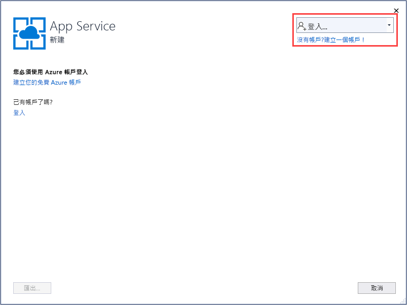

   [!INCLUDE [resource group intro text](../../includes/resource-group.md)]

1. 在 [資源群組]  中選取 [新增]  。

1. 在 [新增資源群組名稱]  中，輸入 myResourceGroup  ，然後選取 [確定]  。

   [!INCLUDE [app-service-plan](../../includes/app-service-plan.md)]

1. 在 [主控方案]  中選取 [新增]  。

1. 在 [設定主控方案]  對話方塊中，輸入下表中的值，然後選取 [確定]  。

   | 設定 | 建議的值 | 說明 |
   |-|-|-|
   |App Service 方案| myAppServicePlan | App Service 方案的名稱。 |
   | 位置 | 西歐 | 裝載 Web 應用程式的資料中心。 |
   | 大小 | 免費 | [定價層](https://azure.microsoft.com/pricing/details/app-service/?ref=microsoft.com&utm_source=microsoft.com&utm_medium=docs&utm_campaign=visualstudio)可決定裝載功能。 |

   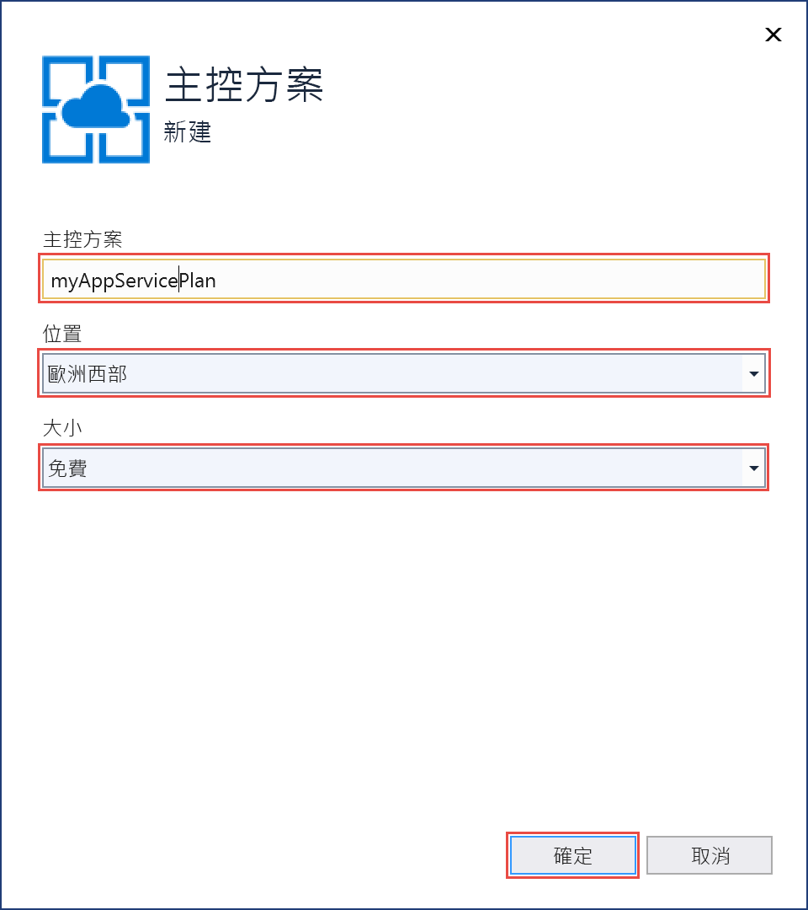

1. 在 [名稱]  中，輸入唯一的應用程式名稱 (只包含 `a-z`、`A-Z`、`0-9` 和 `-` 等有效字元)。 您可以接受自動產生的唯一名稱。 Web 應用程式的 URL 是 `http://<app_name>.azurewebsites.net`，其中 `<app_name>` 是您的應用程式名稱。

2. 選取 [建立]  開始建立 Azure 資源。

   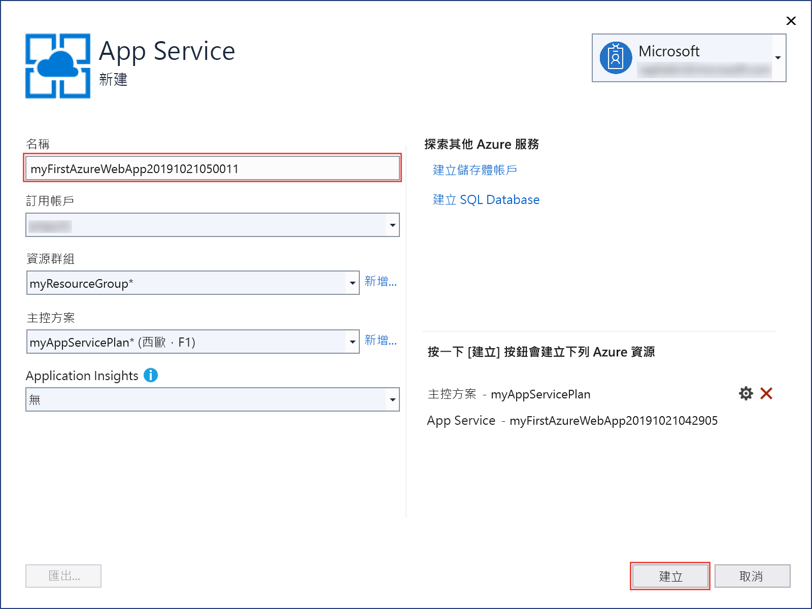

精靈完成後，它會將 ASP.NET Web 應用程式發佈至 Azure，然後在預設瀏覽器中啟動該應用程式。

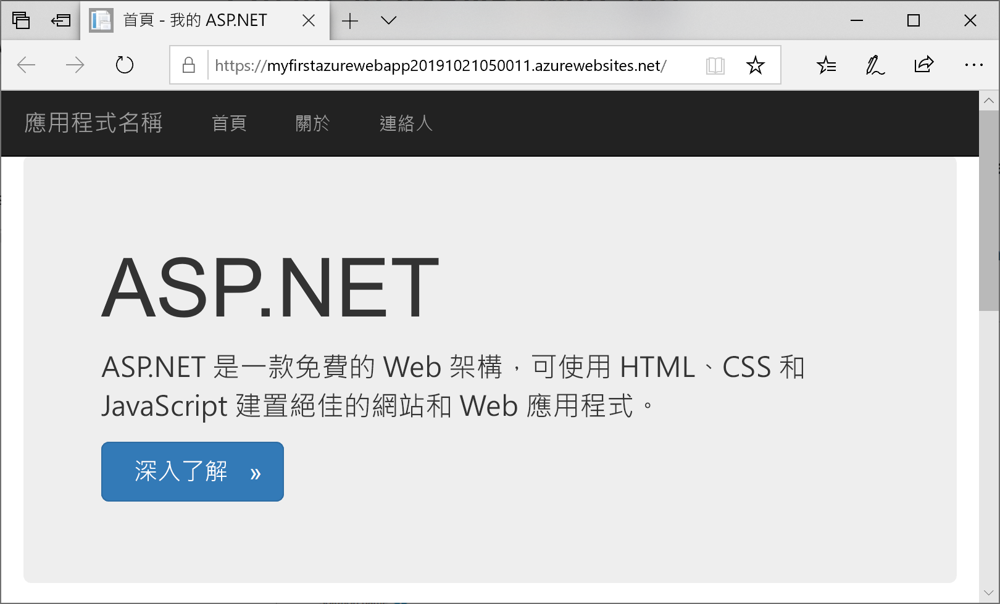

在 [App Service 建立新的]  頁面中指定的應用程式名稱，會作為格式 `http://<app_name>.azurewebsites.net` 中的 URL 前置詞。

**恭喜！** ASP.NET Web 應用程式已在 Azure App Service 中即時執行。

## <a name="update-the-app-and-redeploy"></a>更新應用程式並重新部署

1. 在 [方案總管]  的專案底下，開啟 [檢視]   > [主資料夾]   > [Index.cshtml]  。

1. 尋找頂端附近的 `<div class="jumbotron">` HTML 標籤，並以下列程式碼取代整個元素︰

   ```HTML
   <div class="jumbotron">
       <h1>ASP.NET in Azure!</h1>
       <p class="lead">This is a simple app that we’ve built that demonstrates how to deploy a .NET app to Azure App Service.</p>
   </div>
   ```

1. 若要重新部署至 Azure，請在 [方案總管]  中，以滑鼠右鍵按一下 **myFirstAzureWebApp** 專案，然後選取 [發佈]  。 然後，選取 [發佈]  。

發佈完成時，Visual Studio 會啟動瀏覽器以前往 Web 應用程式的 URL。

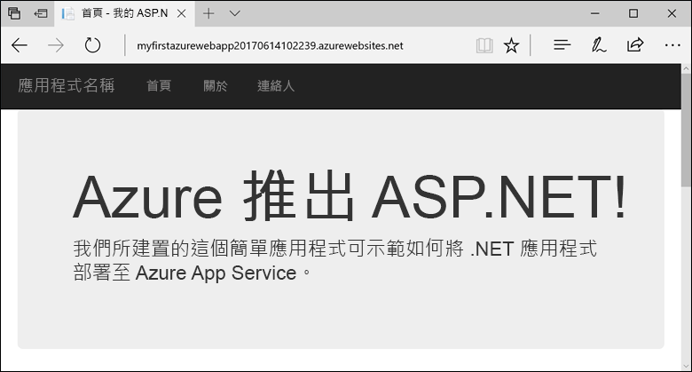

## <a name="manage-the-azure-app"></a>管理 Azure 應用程式

1. 請移至 <a href="https://portal.azure.com" target="_blank">Azure 入口網站</a>，以管理 Web 應用程式。

2. 從左側功能表，選取 [應用程式服務]  ，然後選取 Azure 應用程式的名稱。

   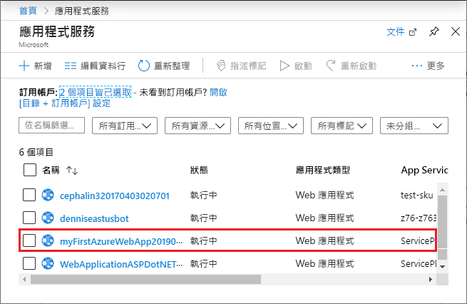

   您會看到 Web 應用程式的 [概觀] 頁面。 您可以在這裡進行基本管理，像是瀏覽、停止、啟動、重新啟動及刪除。

   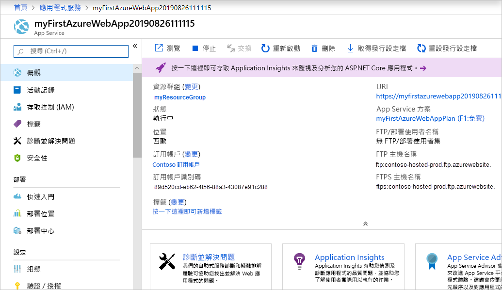

   左側功能表提供不同的頁面來設定您的應用程式。

## <a name="next-steps"></a>後續步驟

> [!div class="nextstepaction"]
> [ASP.NET 搭配 SQL Database](app-service-web-tutorial-dotnet-sqldatabase.md)
