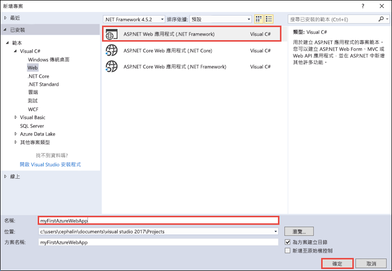
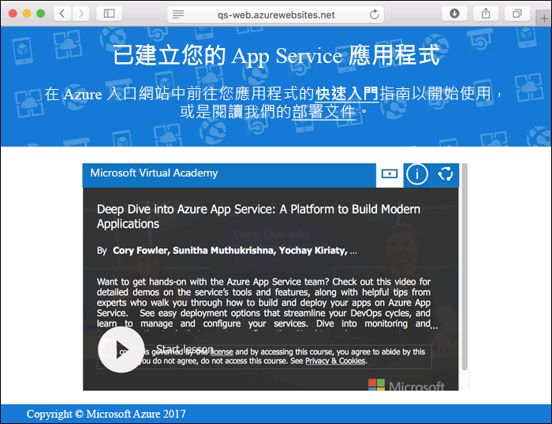
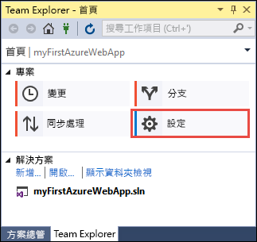
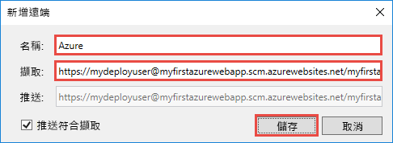
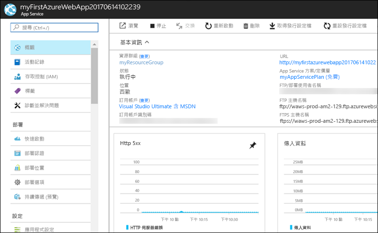

# <a name="create-an-aspnet-core-web-app-in-azure"></a>在 Azure 中建立 ASP.NET Core Web 應用程式

> [!NOTE]
> 本文會將應用程式部署至 Windows 上的 App Service。 若要部署至 _Linux_ 上的 App Service，請參閱[在 Linux 上的 App Service 中建立 NET Core Web 應用程式](./containers/quickstart-dotnetcore.md)。 
>
> 如果您要尋找 ASP.NET Framework 應用程式的步驟，請參閱[在 Azure 中建立 ASP.NET Framework Web 應用程式](app-service-web-get-started-dotnet-framework.md)。 
>

[Azure Web Apps](app-service-web-overview.md) 提供可高度擴充、自我修復的 Web 主機服務。  本快速入門會顯示如何將第一個 ASP.NET Core Web 應用程式部署至 Azure Web Apps。 當您完成時，您會有已部署 Web 應用程式的資源群，其中包含 App Service 方案和 Azure Web 應用程式。 您可以[觀看影片](#video)，該影片示範如何從 Visual Studio 2017 內完全執行這些步驟。

[!INCLUDE [quickstarts-free-trial-note](../../includes/quickstarts-free-trial-note.md)]

## <a name="prerequisites"></a>先決條件

若要完成本教學課程：

* 使用下列工作負載安裝 <a href="https://www.visualstudio.com/downloads/" target="_blank">Visual Studio 2017</a>：
    - **ASP.NET 和 Web 開發**
    - **Azure 開發**

    ![ASP.NET 和 Web 開發及 Azure 開發 (在 [Web 和雲端] 之下)](media/app-service-web-tutorial-dotnet-sqldatabase/workloads.png)

## <a name="create-an-aspnet-core-web-app"></a>建立 ASP.NET 核心 Web 應用程式

在 Visual Studio 中，選取 [檔案] > [新增] > [專案] 以建立專案。 

在 [新增專案] 對話方塊中，選取 [Visual C#] > [Web] > [ASP.NET Core Web 應用程式]。

將應用程式命名為 _myFirstAzureWebApp_、選取 [建立新的 Git 存放庫]，然後選取 [確定]。
   


您可以將任何類型的 ASP.NET Core Web 應用程式部署至 Azure。 在本快速入門中，選取 **Web 應用程式** 範本，並確定驗證設定為 [不需要驗證]。
      
選取 [確定] 。

![[新增 ASP.NET 專案] 對話方塊](./media/app-service-web-get-started-dotnet/razor-pages-aspnet-dialog.png)

ASP.NET Core 專案建立之後，ASP.NET Core 的歡迎頁面會隨即顯示，並提供許多可協助您開始使用的資源連結。 


從功能表中，選取 [偵錯] > [啟動但不偵錯]，以在本機執行 Web 應用程式。


[!INCLUDE [cloud-shell-try-it.md](../../includes/cloud-shell-try-it.md)]

[!INCLUDE [Configure deployment user](../../includes/configure-deployment-user.md)] 

[!INCLUDE [Create resource group](../../includes/app-service-web-create-resource-group.md)] 

[!INCLUDE [Create app service plan](../../includes/app-service-web-create-app-service-plan.md)] 

[!INCLUDE [Create web app](../../includes/app-service-web-create-web-app.md)] 



## <a name="push-to-azure-from-visual-studio"></a>從 Visual Studio 推送至 Azure

回到 Visual Studio，在 [檢視] 功能表中按一下 [Team Explorer]。 **Team Explorer** 隨即顯示。

在 [首頁] 檢視中，按一下 [設定] > [存放庫設定]。



在 [存放庫設定] 的 [遠端] 區段中，選取 [新增]。 [新增遠端] 對話方塊隨即顯示。

將 [名稱] 欄位設為 _Azure_，然後將 [提取] 欄位設為您從 [建立 Web 應用程式](#create-a-web-app) 儲存的 URL。 按一下 [檔案] 。



此設定相當於 Git 命令 `git remote add Azure <URL>`。

按一下位於頂端的 [首頁] 按鈕。

選取 [設定] > [全域設定]。 確認名稱和電子郵件地址皆已設定。 如有需要，請選取 [更新]。

Visual Studio 在建立專案時，所有檔案都已認可到 Git 存放庫中。 此時您只需要將檔案推送至 Azure 即可。

按一下位於頂端的 [首頁] 按鈕。 選取 [同步] > [動作] > [開啟命令提示字元]。 

在命令視窗中輸入下列命令，並在出現提示時輸入部署密碼：

```
git push Azure master
```

此命令可能會花數分鐘執行。 執行上述命令時，會顯示類似下列範例的資訊：

```
Counting objects: 4, done.
Delta compression using up to 8 threads.
Compressing objects: 100% (4/4), done.
Writing objects: 100% (4/4), 349 bytes | 349.00 KiB/s, done.
Total 4 (delta 3), reused 0 (delta 0)
remote: Updating branch 'master'.
remote: Updating submodules.
remote: Preparing deployment for commit id '9e20345e9c'.
remote: Generating deployment script.
remote: Project file path: .\myFirstAzureWebApp\myFirstAzureWebApp.csproj
remote: Solution file path: .\myFirstAzureWebApp.sln
remote: Generated deployment script files
remote: Running deployment command...
remote: Handling ASP.NET Core Web Application deployment.
remote:   Restoring packages for D:\home\site\repository\myFirstAzureWebApp\myFirstAzureWebApp.csproj...
remote:   Restoring packages for D:\home\site\repository\myFirstAzureWebApp\myFirstAzureWebApp.csproj...
...
remote: Finished successfully.
remote: Running post deployment command(s)...
remote: Deployment successful.
To https://<app_name>.scm.azurewebsites.net/<app_name>.git
 * [new branch]      master -> master
```

## <a name="browse-to-the-app"></a>瀏覽至應用程式

在瀏覽器中，瀏覽至 Azure Web 應用程式 URL：`http://<app_name>.azurewebsites.net`。

此頁面目前作為 Azure App Service Web 應用程式執行。


恭喜您，您的 ASP.NET Core Web 應用程式在 Azure App Service 中即時執行。

## <a name="update-the-app-and-redeploy"></a>更新應用程式並重新部署

從 [方案總管]，開啟 _Pages/Index.cshtml_。

尋找頂端附近的 `<div id="myCarousel" class="carousel slide" data-ride="carousel" data-interval="6000">` HTML 標籤，並以下列程式碼取代整個元素︰

```HTML
<div class="jumbotron">
    <h1>ASP.NET in Azure!</h1>
    <p class="lead">This is a simple app that we’ve built that demonstrates how to deploy a .NET app to Azure App Service.</p>
</div>
```

在 [方案總管] 中，以滑鼠右鍵按一下 _Pages/Index.cshtml_，然後按一下 [認可]。 輸入變更的認可訊息，然後按一下 [全部認可]。

回到命令提示字元視窗，將程式碼變更推送至 Azure。

```bash
git push Azure master
```

當部署完成後，請重新瀏覽至 `http://<app_name>.azurewebsites.net`。


## <a name="manage-the-azure-web-app"></a>管理 Azure Web 應用程式

請移至 <a href="https://portal.azure.com" target="_blank">Azure 入口網站</a>，以管理 Web 應用程式。

從左側功能表，選取 [應用程式服務]，然後選取 Azure Web 應用程式的名稱。


您會看到 Web 應用程式的 [概觀] 頁面。 您可以在這裡執行基本管理工作，像是瀏覽、停止、啟動、重新啟動及刪除。 



左側功能表提供不同的頁面來設定您的應用程式。 

[!INCLUDE [Clean-up section](../../includes/clean-up-section-portal.md)]

## <a name="video"></a>影片

> [!VIDEO https://www.youtube-nocookie.com/embed/AEfG9PWPAxg]

## <a name="next-steps"></a>後續步驟

> [!div class="nextstepaction"]
> [ASP.NET Core 搭配 SQL Database](app-service-web-tutorial-dotnetcore-sqldb.md)
