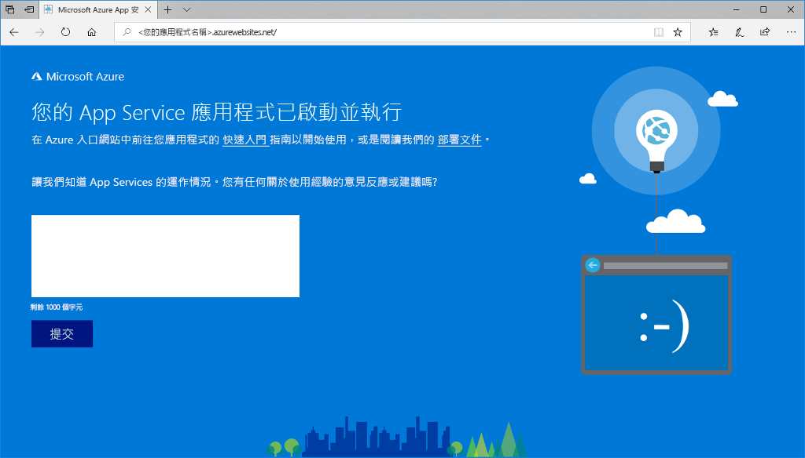
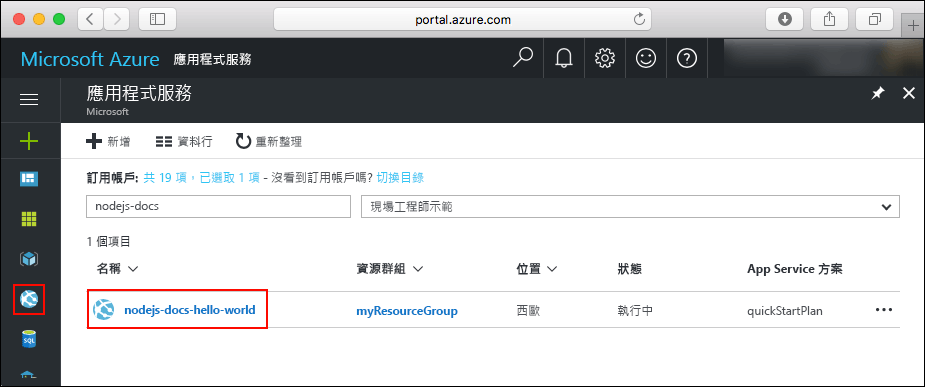
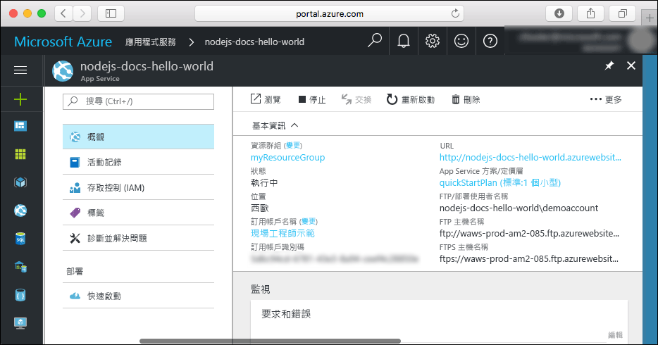

# <a name="create-a-nodejs-web-app-in-azure"></a>在 Azure 中建立 Node.js Web 應用程式

> [!NOTE]
> 本文會將應用程式部署至 Windows 上的 App Service。 若要部署至 _Linux_ 上的 App Service，請參閱[在 Linux 上的 Azure App Service 中建立 Node.js Web 應用程式](./containers/quickstart-nodejs.md)。
>

[Azure Web Apps](app-service-web-overview.md) 提供可高度擴充、自我修復的 Web 主機服務。  本快速入門會顯示如何將 Node.js 應用程式部署至 Azure Web Apps。 您可使用 [Azure CLI](https://docs.microsoft.com/cli/azure/get-started-with-azure-cli)建立 Web 應用程式，並使用 ZipDeploy 將範例 Node.js 程式碼部署至 Web 應用程式。


您可以使用 Mac、Windows 或 Linux 機器，依照此處的步驟操作。 安裝先決條件後，大約需要 5 分鐘才能完成這些步驟。   

[!INCLUDE [quickstarts-free-trial-note](../../includes/quickstarts-free-trial-note.md)]

## <a name="prerequisites"></a>必要條件

若要完成本快速入門：

* <a href="https://nodejs.org/" target="_blank">安裝 Node.js 和 NPM</a>

## <a name="download-the-sample"></a>下載範例

從 [https://github.com/Azure-Samples/nodejs-docs-hello-world/archive/master.zip](https://github.com/Azure-Samples/nodejs-docs-hello-world/archive/master.zip) 下載範例 Node.js 專案並將 ZIP 封存檔解壓縮。

開啟 _index.js_ 並找到下列這一行：

```javascript
var port = process.env.PORT || 1337;
```

App Service 會將 process.env.PORT 插入您的應用程式中，讓程式碼使用變數來知道要接聽哪個通訊埠。 

在終端機視窗中，瀏覽至 Node.js 專案範例的根目錄 (包含 _index.js_ 的目錄)。

## <a name="run-the-app-locally"></a>在本機執行應用程式

在本機執行應用程式，以便您查看它在部署至 Azure 時的樣貌。 開啟終端機視窗，並使用 `npm start` 指令碼啟動內建的 Node.js HTTP 伺服器。

```bash
npm start
```

開啟網頁瀏覽器，然後巡覽至位於 `http://localhost:1337` 的範例應用程式。

您會看到來自範例應用程式的 **Hello World** 訊息顯示在網頁中。


在終端機視窗中，按 **Ctrl+C** 結束 web 伺服器。

> [!NOTE]
> 在 Azure App Service 中，應用程式會使用 [iisnode](https://github.com/Azure/iisnode) 執行於 IIS 中。 為了讓應用程式可使用 iisnode 執行，應用程式的根目錄會包含 web.config 檔案。 此檔案可供 IIS 讀取，且 iisnode 相關設定記錄在 [iisnode GitHub 存放庫](https://github.com/Azure/iisnode/blob/master/src/samples/configuration/web.config)中。

[!INCLUDE [Create ZIP file](../../includes/app-service-web-create-zip.md)]

[!INCLUDE [cloud-shell-try-it.md](../../includes/cloud-shell-try-it.md)]

[!INCLUDE [Create resource group](../../includes/app-service-web-create-resource-group-scus.md)] 

[!INCLUDE [Create app service plan](../../includes/app-service-web-create-app-service-plan-scus.md)] 

## <a name="create-a-web-app"></a>建立 Web 應用程式

在 Cloud Shell 中，使用 [`az webapp create`](/cli/azure/webapp?view=azure-cli-latest#az-webapp-create) 命令，在 `myAppServicePlan` App Service 方案中建立 Web 應用程式。 

在下列範,了中，使用全域唯一的應用程式名稱 (有效的字元為 `a-z`、`0-9` 和 `-`) 取代 `<app_name>`。

```azurecli-interactive
# Bash and Powershell
az webapp create --resource-group myResourceGroup --plan myAppServicePlan --name <app_name>
```

建立 Web 應用程式後，Azure CLI 會顯示類似下列範例的輸出：

```json
{
  "availabilityState": "Normal",
  "clientAffinityEnabled": true,
  "clientCertEnabled": false,
  "cloningInfo": null,
  "containerSize": 0,
  "dailyMemoryTimeQuota": 0,
  "defaultHostName": "<app_name>.azurewebsites.net",
  "enabled": true,
  < JSON data removed for brevity. >
}
```

### <a name="set-nodejs-runtime"></a>設定 Node.js 執行階段

將 Node 執行階段設定為 8.11.1。 <!-- To see all supported runtimes, run [`az webapp list-runtimes`](/cli/azure/webapp?view=azure-cli-latest#az-webapp-list-runtimes). -->

```azurecli-interactive
# Bash and Powershell
az webapp config appsettings set --resource-group myResourceGroup --name <app_name> --settings WEBSITE_NODE_DEFAULT_VERSION=8.11.1
```

瀏覽至您剛建立的 Web 應用程式。 以唯一的應用程式名稱取代 _&lt;app name>_。

```bash
http://<app name>.azurewebsites.net
```

新的 Web 應用程式看起來應該像這樣：



[!INCLUDE [Deploy ZIP file](../../includes/app-service-web-deploy-zip.md)]

## <a name="browse-to-the-app"></a>瀏覽至應用程式

使用 web 瀏覽器瀏覽至已部署的應用程式。

```
http://<app_name>.azurewebsites.net
```

Node.js 範例程式碼正在 Azure App Service Web 應用程式中執行。


**恭喜！** 您已將第一個 Node.js 應用程式部署至 App Service。

## <a name="update-and-redeploy-the-code"></a>更新和重新部署程式碼

使用文字編輯器，開啟 Node.js 應用程式中的 `index.js` 檔案，並且對 `response.end` 呼叫中的文字進行小幅變更：

```nodejs
response.end("Hello Azure!");
```

在本機的終端機視窗中，瀏覽至應用程式的根目錄，然後為更新後的專案建立新的 ZIP 檔案。

```
# Bash
zip -r myUpdatedAppFiles.zip .

# PowerShell
Compress-Archive -Path * -DestinationPath myUpdatedAppFiles.zip
``` 

使用[部署 ZIP 檔案](#deploy-zip-file)中的相同步驟，將這個新的 ZIP 檔案部署至 App Service。

切換回在**瀏覽至應用程式**步驟中開啟的瀏覽器視窗，然後重新整理頁面。


## <a name="manage-your-new-azure-web-app"></a>管理新的 Azure Web 應用程式

請移至 <a href="https://portal.azure.com" target="_blank">Azure 入口網站</a>，以管理您所建立的 Web 應用程式。

按一下左側功能表中的 [應用程式服務]，然後按一下 Azure Web 應用程式的名稱。



您會看到 Web 應用程式的 [概觀] 頁面。 您可以在這裡執行基本管理工作，像是瀏覽、停止、啟動、重新啟動及刪除。 



左側功能表提供不同的頁面來設定您的應用程式。 

## <a name="video"></a>影片

觀賞影片可觀看本快速入門的動態版，然後自行遵循相關步驟，在 Azure 上發佈您的第一個 Node.js 應用程式。

> [!VIDEO https://channel9.msdn.com/Shows/Azure-for-Node-Developers/Create-a-Nodejs-app-in-Azure-Quickstart/player]   

[!INCLUDE [cli-samples-clean-up](../../includes/cli-samples-clean-up.md)]

## <a name="next-steps"></a>後續步驟

> [!div class="nextstepaction"]
> [Node.js with MongoDB](app-service-web-tutorial-nodejs-mongodb-app.md)
