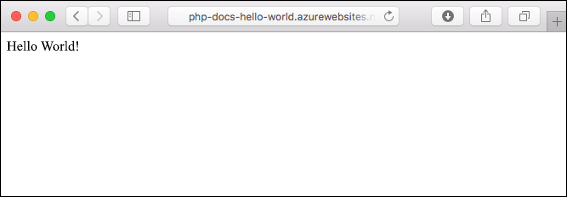
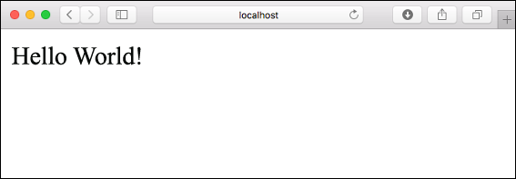
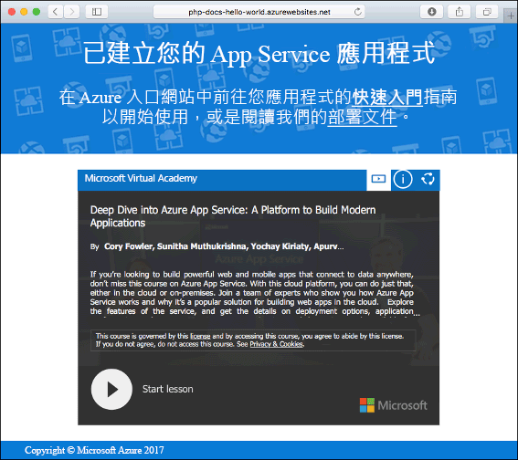
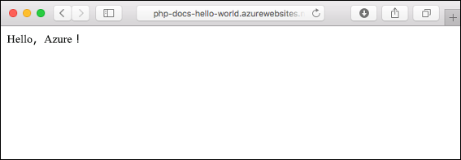
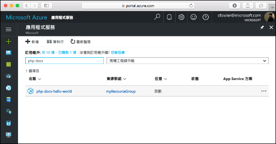
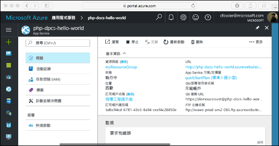

# <a name="create-a-php-web-app-in-azure"></a>在 Azure 中建立 PHP Web 應用程式

> [!NOTE]
> 本文會將應用程式部署至 Windows 上的 App Service。 若要部署至 _Linux_ 上的 App Service，請參閱[在 Linux 上的 App Service 中建立 PHP Web 應用程式](./containers/quickstart-php.md)。
>

[Azure Web Apps](app-service-web-overview.md) 提供可高度擴充、自我修復的 Web 主機服務。  本快速入門教學課程會顯示如何將 PHP 應用程式部署至 Azure Web Apps。 您將會在 Cloud Shell 中使用 [Azure CLI](https://docs.microsoft.com/cli/azure/get-started-with-azure-cli) 建立 Web 應用程式，並使用 Git 將範例 PHP 程式碼部署至 Web 應用程式。



您可以使用 Mac、Windows 或 Linux 機器，依照此處的步驟操作。 安裝先決條件後，大約需要 5 分鐘才能完成這些步驟。

[!INCLUDE [quickstarts-free-trial-note](../../includes/quickstarts-free-trial-note.md)]

## <a name="prerequisites"></a>必要條件

若要完成本快速入門：

* <a href="https://git-scm.com/" target="_blank">安裝 Git</a>
* <a href="http://php.net/manual/install.php" target="_blank">安裝 PHP</a>

## <a name="download-the-sample-locally"></a>將範例下載到本機

在終端機視窗中，執行下列命令。 這會將應用程式範例複製到本機電腦，並瀏覽至包含範例程式碼的目錄。 

```bash
git clone https://github.com/Azure-Samples/php-docs-hello-world
cd php-docs-hello-world
```

## <a name="run-the-app-locally"></a>在本機執行應用程式

在本機執行應用程式，以便您查看它在部署至 Azure 時的樣貌。 開啟終端機視窗，並使用 `php` 命令來啟動內建的 PHP Web 伺服器。

```bash
php -S localhost:8080
```

開啟網頁瀏覽器，然後巡覽至位於 `http://localhost:8080` 的範例應用程式。

您會看到來自範例應用程式的 **Hello World!** 訊息顯示在網頁中。



在終端機視窗中，按 **Ctrl+C** 結束 web 伺服器。

[!INCLUDE [cloud-shell-try-it.md](../../includes/cloud-shell-try-it.md)]

[!INCLUDE [Configure deployment user](../../includes/configure-deployment-user.md)]

[!INCLUDE [Create resource group](../../includes/app-service-web-create-resource-group.md)]

[!INCLUDE [Create app service plan](../../includes/app-service-web-create-app-service-plan.md)]

## <a name="create-a-web-app"></a>建立 Web 應用程式

在 Cloud Shell 中，使用 [`az webapp create`](/cli/azure/webapp?view=azure-cli-latest#az-webapp-create) 命令，在 `myAppServicePlan` App Service 方案中建立 Web 應用程式。 

在下列範,了中，使用全域唯一的應用程式名稱 (有效的字元為 `a-z`、`0-9` 和 `-`) 取代 `<app_name>`。 執行階段設定為 `PHP|7.0`。 若要查看所有支援的執行階段，請執行 [`az webapp list-runtimes`](/cli/azure/webapp?view=azure-cli-latest#az-webapp-list-runtimes)。 

```azurecli-interactive
# Bash
az webapp create --resource-group myResourceGroup --plan myAppServicePlan --name <app_name> --runtime "PHP|7.0" --deployment-local-git
# PowerShell
az --% webapp create --resource-group myResourceGroup --plan myAppServicePlan --name <app_name> --runtime "PHP|7.0" --deployment-local-git
```

建立 Web 應用程式後，Azure CLI 會顯示類似下列範例的輸出：

```json
Local git is configured with url of 'https://<username>@<app_name>.scm.azurewebsites.net/<app_name>.git'
{
  "availabilityState": "Normal",
  "clientAffinityEnabled": true,
  "clientCertEnabled": false,
  "cloningInfo": null,
  "containerSize": 0,
  "dailyMemoryTimeQuota": 0,
  "defaultHostName": "<app_name>.azurewebsites.net",
  "enabled": true,
  < JSON data removed for brevity. >
}
```
您已建立空的新 Web 應用程式，其中已啟用 Git 部署。

> [!NOTE]
> Git 遠端的 URL 會顯示在 `deploymentLocalGitUrl` 屬性中，其格式為 `https://<username>@<app_name>.scm.azurewebsites.net/<app_name>.git`。 儲存此 URL，稍後您會用到此資訊。
>

瀏覽至您剛建立的 Web 應用程式。 以您在先前步驟中建立的唯一應用程式名稱取代 _&lt;應用程式名稱 >_。

```bash
http://<app name>.azurewebsites.net
```

新的 Web 應用程式看起來應該像這樣：



[!INCLUDE [Push to Azure](../../includes/app-service-web-git-push-to-azure.md)] 

```bash
Counting objects: 2, done.
Delta compression using up to 4 threads.
Compressing objects: 100% (2/2), done.
Writing objects: 100% (2/2), 352 bytes | 0 bytes/s, done.
Total 2 (delta 1), reused 0 (delta 0)
remote: Updating branch 'master'.
remote: Updating submodules.
remote: Preparing deployment for commit id '25f18051e9'.
remote: Generating deployment script.
remote: Running deployment command...
remote: Handling Basic Web Site deployment.
remote: Kudu sync from: '/home/site/repository' to: '/home/site/wwwroot'
remote: Copying file: '.gitignore'
remote: Copying file: 'LICENSE'
remote: Copying file: 'README.md'
remote: Copying file: 'index.php'
remote: Ignoring: .git
remote: Finished successfully.
remote: Running post deployment command(s)...
remote: Deployment successful.
To https://<app_name>.scm.azurewebsites.net/<app_name>.git
   cc39b1e..25f1805  master -> master
```

## <a name="browse-to-the-app"></a>瀏覽至應用程式

使用 web 瀏覽器瀏覽至已部署的應用程式。

```
http://<app_name>.azurewebsites.net
```

PHP 範例程式碼正在 Azure App Service Web 應用程式中執行。


**恭喜！** 您已將第一個 PHP 應用程式部署至 App Service。

## <a name="update-locally-and-redeploy-the-code"></a>在本機更新和重新部署程式碼

使用本機文字編輯器，開啟 PHP 應用程式內的 `index.php` 檔案，並且對 `echo` 旁邊字串內的文字進行小幅變更：

```php
echo "Hello Azure!";
```

在本機終端機視窗中，在 Git 中認可您的變更，然後將程式碼變更推送至 Azure。

```bash
git commit -am "updated output"
git push azure master
```

部署完成後，返回在**瀏覽至應用程式**步驟中開啟的瀏覽器視窗，然後重新整理頁面。



## <a name="manage-your-new-azure-web-app"></a>管理新的 Azure Web 應用程式

請移至 <a href="https://portal.azure.com" target="_blank">Azure 入口網站</a>，以管理您所建立的 Web 應用程式。

按一下左側功能表中的 [應用程式服務]，然後按一下 Azure Web 應用程式的名稱。



Web 應用程式的 [概觀] 頁面會隨即顯示。 您可以在這裡執行基本管理工作，像是瀏覽、停止、啟動、重新啟動及刪除。



左側功能表提供不同的選項來設定您的應用程式。 

[!INCLUDE [cli-samples-clean-up](../../includes/cli-samples-clean-up.md)]

## <a name="next-steps"></a>後續步驟

> [!div class="nextstepaction"]
> [PHP with MySQL](app-service-web-tutorial-php-mysql.md)
