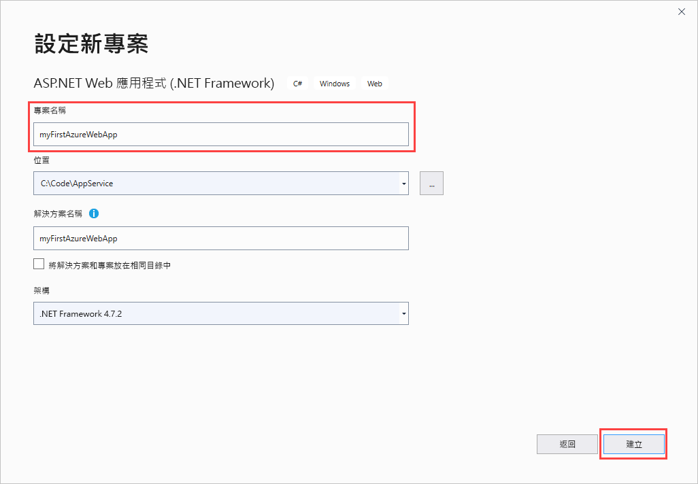
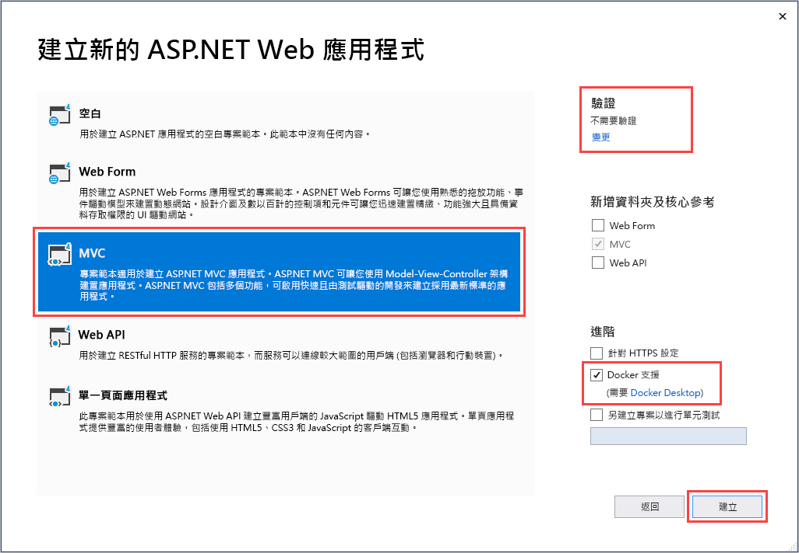
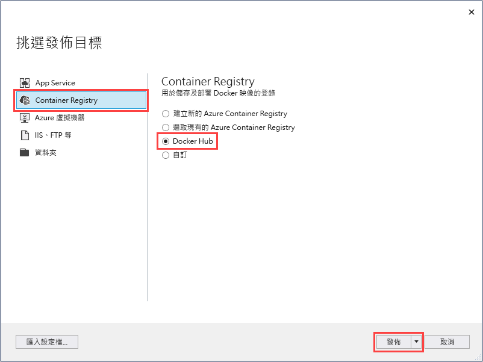
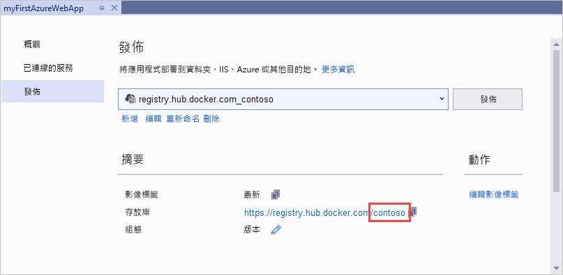
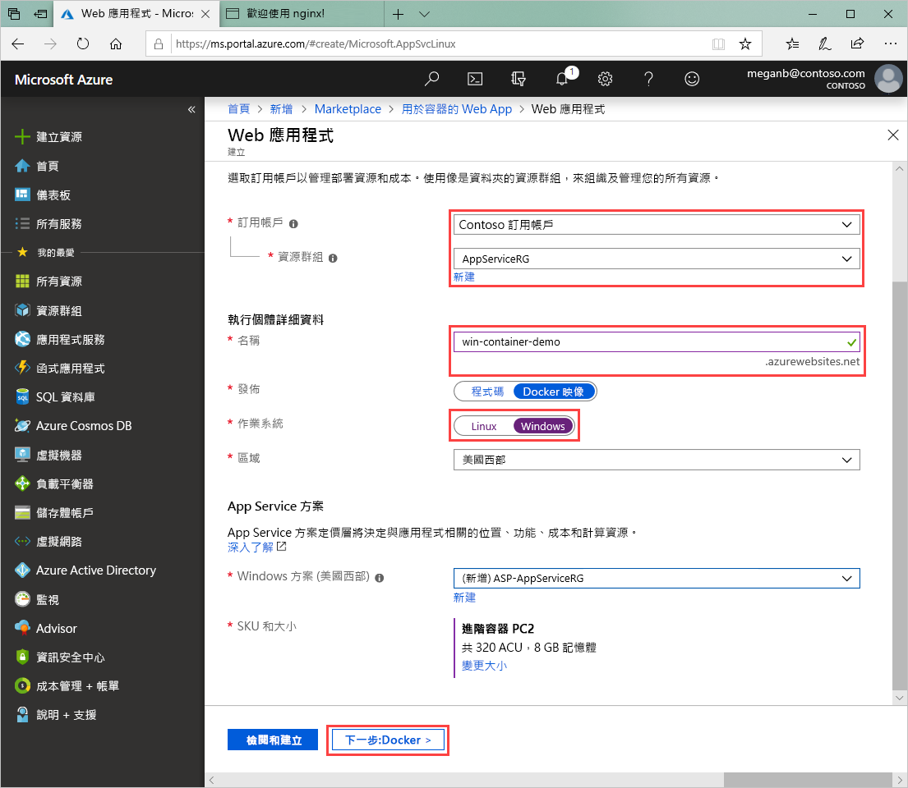

# <a name="run-a-custom-windows-container-in-azure-preview"></a>在 Azure (預覽) 中執行自訂 Windows 容器

[Azure App Service](overview.md) 會在 Windows 上提供預先定義的應用程式堆疊 (例如 ASP.NET 或 Node.js)，執行於 IIS 上。 預先設定的 Windows 環境會鎖定作業系統的系統管理存取、軟體安裝、對全域組件快取的變更等作業。 如需詳細資訊，請參閱 [Azure App Service 上的作業系統功能](operating-system-functionality.md)。 如果您的應用程式需要的存取超出預先設定的環境所允許的，您可以改為部署自訂 Windows 容器。

此快速入門說明如何將 Windows 映像中的 ASP.NET 應用程式從 Visual Studio 部署到至 [Docker Hub](https://hub.docker.com/)。 您可以在 Azure App Service 中於自訂容器內執行應用程式。

## <a name="prerequisites"></a>必要條件

若要完成本教學課程：

- <a href="https://hub.docker.com/" target="_blank">註冊 Docker Hub 帳戶</a>
- <a href="https://docs.docker.com/docker-for-windows/install/" target="_blank">安裝適用於 Windows 的 Docker</a>。
- <a href="https://docs.microsoft.com/virtualization/windowscontainers/quick-start/quick-start-windows-10" target="_blank">切換 Docker 以執行 Windows 容器</a>。
- <a href="https://www.visualstudio.com/downloads/" target="_blank">安裝 Visual Studio 2019</a>，記得包含 **ASP.NET 與網頁程式開發**與 **Azure 開發**工作負載。 若您已安裝 Visual Studio 2019：

    - 選取 [說明]   > [檢查更新]  以安裝最新的 Visual Studio 更新。
    - 選取 [工具]   > [取得工具與功能]  以在 Visual Studio 中新增工作負載。

## <a name="create-an-aspnet-web-app"></a>建立 ASP.NET Web 應用程式

請遵循下列步驟來建立 ASP.NET Web 應用程式：

1. 開啟 Visual Studio，然後選取 [建立新專案]  。

1. 在 [建立新專案]  中，針對 C# 尋找並選擇 [ASP.NET Web 應用程式 (.NET Framework)]  ，然後選取 [下一步]  。

1. 在 [設定新專案]  中，將應用程式命名為 myFirstAzureWebApp  ，然後選取 [建立]  。

   

1. 您可以將任何類型的 ASP.NET web 應用程式部署至 Azure。 在本快速入門中，選擇 [MVC]  範本。

1. 選取 [Docker 支援]  ，並確定驗證已設定為 [不需要驗證]  。 選取 [建立]  。

   

1. 如果 _Dockerfile_ 檔案沒有自動開啟，請從 [方案總管]  開啟它。

1. 您需要[支援的父映像](#use-a-different-parent-image)。 請使用下列程式碼取代 `FROM` 這一行以變更父映像，然後儲存檔案：

   ```Dockerfile
   FROM mcr.microsoft.com/dotnet/framework/aspnet:4.7.2-windowsservercore-ltsc2019
   ```

1. 從 Visual Studio 功能表中，選取 [偵錯]   > [啟動但不偵錯]  以在本機執行 Web 應用程式。

   

## <a name="publish-to-docker-hub"></a>發佈至 Docker Hub

1. 在 [方案總管]  中，以滑鼠右鍵按一下 **myFirstAzureWebApp** 專案，然後選取 [發佈]  。

1. 選擇 [App Service]  ，然後選取 [發佈]  。

1. 在 [挑選發佈目標]  中，選取 [Container Registry]  和 [Docker Hub]  ，然後按一下 [發佈]  。

   

1. 提供 Docker Hub 帳戶認證並選取 [儲存]  。

   等待部署完成。 [發佈]  頁面現在會顯示可供稍後使用的存放庫名稱。

   

1. 複製此存放庫名稱以便稍後使用。

## <a name="create-a-windows-container-app"></a>建立 Windows 容器應用程式

1. 登入 [Azure 入口網站]( https://portal.azure.com)。

1. 選擇 Azure 入口網站左上角的 [建立資源]  。

1. 在 Azure Marketplace 資源清單上方的搜尋方塊中，搜尋 [用於容器的 Web App]  ，然後選取 [建立]  。

1. 在 [Web 應用程式建立]  中，選擇您的訂用帳戶和 [資源群組]  。 如有需要，您可以建立新的資源群組。

1. 提供應用程式名稱 (例如 win-container-demo  )，然後選擇 [Windows]  作為 [作業系統]  。 完成時，選取 [下一步:  Docker] 以繼續。

   

1. 針對 [映像來源]  選擇 [Docker Hub]  ，然後針對 [映像和標籤]  輸入您在[發佈至 Docker Hub](#publish-to-docker-hub) 中複製的存放庫名稱。

   

    如果您在他處有用於 Web 應用程式的自訂映像 (例如，在 [Azure Container Registry](/azure/container-registry/) 中或任何其他私人存放庫中)，您可以在此處加以設定。

1. 選取 [檢閱並建立]  ，然後 [建立]  並等候 Azure 建立所需的資源。

## <a name="browse-to-the-container-app"></a>瀏覽至容器應用程式

Azure 作業完成時，會顯示通知方塊。


1. 按一下 [前往資源]  。

1. 在此資源的概觀中，遵循 [URL]  旁的連結。

新的瀏覽器頁面隨即開啟，並顯示下列頁面：


在幾分鐘後再試一次，直到您看到預設的 ASP.NET 首頁：


**恭喜！** 您正在 Azure App Service 中執行您的第一個自訂 Windows 容器。

## <a name="see-container-start-up-logs"></a>檢視容器啟動記錄

Windows 容器載入可能需要一些時間。 若要查看進度，請將 *\<app_name>* 取代為您的應用程式名稱，以瀏覽至下列 URL。
```
https://<app_name>.scm.azurewebsites.net/api/logstream
```

串流處理的記錄會如下所示：

```
2018-07-27T12:03:11  Welcome, you are now connected to log-streaming service.
27/07/2018 12:04:10.978 INFO - Site: win-container-demo - Start container succeeded. Container: facbf6cb214de86e58557a6d073396f640bbe2fdec88f8368695c8d1331fc94b
27/07/2018 12:04:16.767 INFO - Site: win-container-demo - Container start complete
27/07/2018 12:05:05.017 INFO - Site: win-container-demo - Container start complete
27/07/2018 12:05:05.020 INFO - Site: win-container-demo - Container started successfully
```

## <a name="update-locally-and-redeploy"></a>在本機更新和重新部署

1. 在 Visual Studio 的 [方案總管]  中，開啟 [檢視]   > [主資料夾]   > [Index.cshtml]  。

1. 尋找頂端附近的 `<div class="jumbotron">` HTML 標籤，並以下列程式碼取代整個元素︰

   ```HTML
   <div class="jumbotron">
       <h1>ASP.NET in Azure!</h1>
       <p class="lead">This is a simple app that we’ve built that demonstrates how to deploy a .NET app to Azure App Service.</p>
   </div>
   ```

1. 若要重新部署至 Azure，請在 [方案總管]  中，以滑鼠右鍵按一下 **myFirstAzureWebApp** 專案，然後選擇 [發佈]  。

1. 在 [發佈] 頁面上，選取 [發佈]  並等候發佈完成。

1. 若要告知 App Service 從 Docker Hub 提取新映像，請重新啟動應用程式。 返回入口網站的應用程式頁面，按一下 [重新啟動]   > [是]  。

   

再次[瀏覽至容器應用程式](#browse-to-the-container-app)。 當您重新整理網頁時，應用程式應該會先還原成 [啟動] 頁面，接著在幾分鐘後再次顯示更新的網頁。


## <a name="use-a-different-parent-image"></a>使用不同的父映象

您可以自由使用不同的自訂 Docker 映像來執行應用程式。 不過，您必須為您要的架構選擇正確的[父映像](https://docs.docker.com/develop/develop-images/baseimages/)：

- 若要部署 .NET Framework 應用程式，請根據 Windows Server Core 2019 [長期維護通道 (LTSC)](https://docs.microsoft.com/windows-server/get-started-19/servicing-channels-19#long-term-servicing-channel-ltsc) 版本使用正確的父映像。 
- 若要部署 .NET Core 應用程式，請根據 Windows Server Nano 1809 [半年維護通道 (SAC)](https://docs.microsoft.com/windows-server/get-started-19/servicing-channels-19#semi-annual-channel) 版本使用正確的父映像。 

在應用程式啟動期間，下載父映像需要一些時間。 不過，您可以使用下列其中一個已在 Azure App Service 中快取的父映像，以縮短啟動時間：

- [mcr.microsoft.com/dotnet/framework/aspnet](https://hub.docker.com/_/microsoft-dotnet-framework-aspnet/):4.7.2-windowsservercore-ltsc2019
- [mcr.microsoft.com/windows/nanoserver](https://hub.docker.com/_/microsoft-windows-nanoserver/):1809 - 此映像是跨 Microsoft [ASP.NET Core](https://hub.docker.com/_microsoft-dotnet-cores-aspnet) 使用的基底容器 Microsoft Windows Nano Server 映像。

## <a name="next-steps"></a>後續步驟

> [!div class="nextstepaction"]
> [在 Azure 中移轉至 Windows 容器](app-service-web-tutorial-windows-containers-custom-fonts.md)
