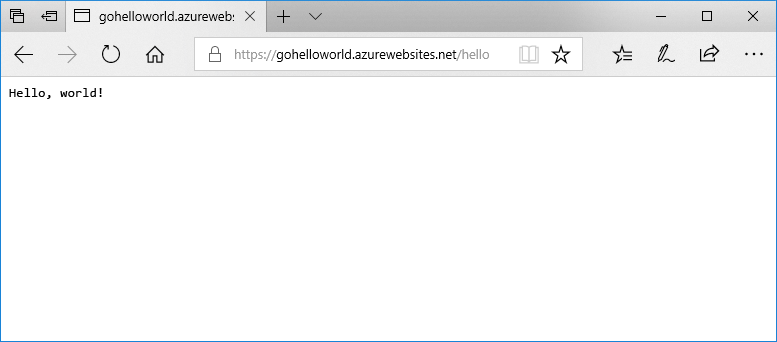

# <a name="deploy-a-dockergo-web-app-in-web-app-for-containers"></a>在 Web App for Containers 中部署 Docker/Go Web 應用程式

[App Service Linux](app-service-linux-intro.md) 可在 Linux 上提供預先定義的應用程式堆疊，且支援 .NET、PHP、Node.js 等其他語言。 您也可以使用自訂 Docker 映像，在尚未於 Azure 中定義的應用程式堆疊上執行 Web 應用程式。 本快速入門示範如何建立 Web 應用程式，以及從 Docker Hub 部署 Go 映像。 [使用 Azure CLI 建立 Web 應用程式](https://docs.microsoft.com/cli/azure/get-started-with-azure-cli)



[!INCLUDE [quickstarts-free-trial-note](../../../includes/quickstarts-free-trial-note.md)]

[!INCLUDE [cloud-shell-try-it.md](../../../includes/cloud-shell-try-it.md)]

[!INCLUDE [Configure deployment user](../../../includes/configure-deployment-user.md)]

[!INCLUDE [Create resource group](../../../includes/app-service-web-create-resource-group-linux.md)]

[!INCLUDE [Create app service plan](../../../includes/app-service-web-create-app-service-plan-linux.md)]

## <a name="create-a-web-app"></a>建立 Web 應用程式

使用 [az webapp create](/cli/azure/webapp?view=azure-cli-latest#az-webapp-create) 命令，在 `myAppServicePlan` App Service 方案中建立 [Web 應用程式](../app-service-web-overview.md)。 別忘了以全域唯一的應用程式名稱取代 `<app name>`。

```azurecli-interactive
az webapp create --resource-group myResourceGroup --plan myAppServicePlan --name <app name> --deployment-container-image-name microsoft/azure-appservices-go-quickstart
```

在上述命令中，`--deployment-container-image-name` 會指向公用 Docker Hub 映像 [microsoft/azure-appservices-go-quickstart](https://hub.docker.com/r/microsoft/azure-appservices-go-quickstart/)。

建立 Web 應用程式後，Azure CLI 會顯示類似下列範例的輸出：

```json
{
  "availabilityState": "Normal",
  "clientAffinityEnabled": true,
  "clientCertEnabled": false,
  "cloningInfo": null,
  "containerSize": 0,
  "dailyMemoryTimeQuota": 0,
  "defaultHostName": "<app name>.azurewebsites.net",
  "deploymentLocalGitUrl": "https://<username>@<app name>.scm.azurewebsites.net/<app name>.git",
  "enabled": true,
  < JSON data removed for brevity. >
}
```

## <a name="browse-to-the-app"></a>瀏覽至應用程式

```bash
http://<app_name>.azurewebsites.net/hello
```


**恭喜！** 您已將執行 Go 應用程式的自訂 Docker Hub 映像部署至 Web App for Containers。

[!INCLUDE [Clean-up section](../../../includes/cli-script-clean-up.md)]

## <a name="next-steps"></a>後續步驟

> [!div class="nextstepaction"]
> [使用自訂 Docker 映像](tutorial-custom-docker-image.md)
