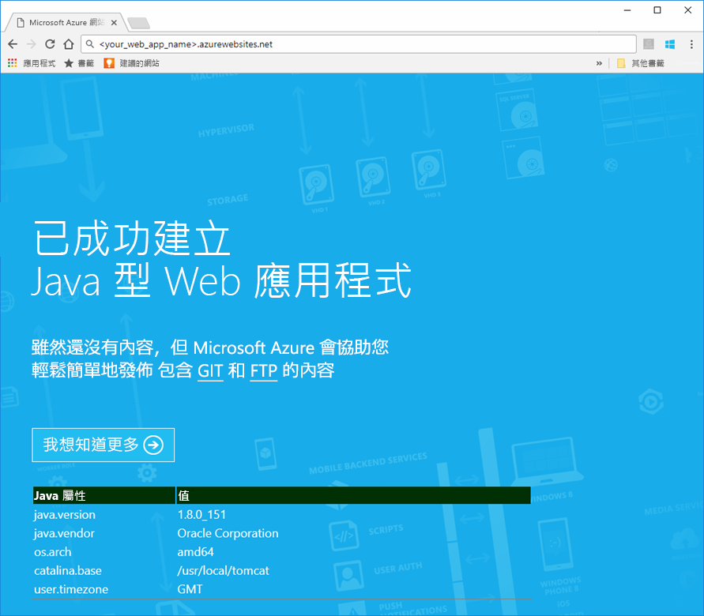
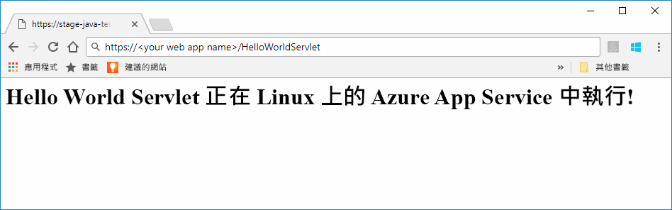
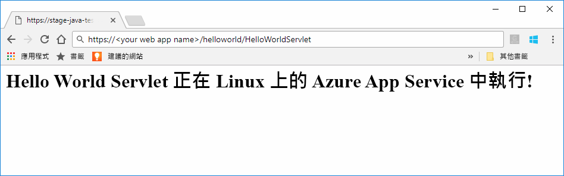

# <a name="preview-create-a-java-web-app-in-app-service-on-linux"></a>預覽：在 Linux 上的 App Service 中建立 Java Web 應用程式

Linux 上的 App Service 目前提供一項預覽功能來支援 Java web 應用程式。 如需預覽版的詳細資訊，請參閱 [Microsoft Azure 預覽版增補使用條款](https://azure.microsoft.com/support/legal/preview-supplemental-terms/)。 [使用 Azure Toolkit for IntelliJ 將 Java Web 應用程式部署至雲端的 Linux 容器](https://docs.microsoft.com/java/azure/intellij/azure-toolkit-for-intellij-hello-world-web-app-linux)是將 Java 應用程式部署到自己的容器的替代方法。

> [!NOTE]
> 本文會將 Java Web 應用程式部署至 Linux 上的 App Service。
>

[Linux 上的 App Service](app-service-linux-intro.md) 使用 Linux 作業系統提供可高度擴充、自我修復的 Web 主機服務。 本快速入門會說明如何使用內建映像，將 Java 應用程式部署至 Linux 上的 App Service。 您可使用 [Azure CLI](https://docs.microsoft.com/cli/azure/get-started-with-azure-cli) 透過內建映像建立 Web 應用程式，以及將 Java 應用程式部署至 Web 應用程式。


[!INCLUDE [quickstarts-free-trial-note](../../../includes/quickstarts-free-trial-note.md)]


## <a name="prerequisites"></a>先決條件

若要完成本快速入門： 

* 您必須擁有 Azure 訂用帳戶。 如果您沒有 Azure 訂用帳戶，請在開始前建立 [免費帳戶](https://azure.microsoft.com/free/?ref=microsoft.com&utm_source=microsoft.com&utm_medium=docs&utm_campaign=visualstudio) 。
* [安裝 Git](https://git-scm.com/)。
* 安裝 [Eclipse](https://www.eclipse.org/downloads/)。


[!INCLUDE [cloud-shell-try-it.md](../../../includes/cloud-shell-try-it.md)]

[!INCLUDE [Configure deployment user](../../../includes/configure-deployment-user.md)]

[!INCLUDE [Create resource group](../../../includes/app-service-web-create-resource-group-linux.md)]

[!INCLUDE [Create app service plan](../../../includes/app-service-web-create-app-service-plan-linux.md)]


## <a name="create-a-web-app"></a>建立 Web 應用程式

使用 Cloud Shell，在 `myAppServicePlan` App Service 方案中建立 [Web 應用程式](../app-service-web-overview.md)。 您可以使用 [`az webapp create`](/cli/azure/webapp?view=azure-cli-latest#az_webapp_create) 命令執行此工作。 在下列範例中，使用全域唯一的應用程式名稱 (有效的字元為 `a-z`、`0-9` 和 `-`) 取代 \<app_name>。 

```azurecli-interactive
# Bash
az webapp create --name <app_name> --resource-group myResourceGroup --plan myAppServicePlan --runtime "TOMCAT|8.5-jre8"
# PowerShell
az --% webapp create --name <app_name> --resource-group myResourceGroup --plan myAppServicePlan --runtime "TOMCAT|8.5-jre8"
```

對於 **runtime** 參數，請使用下列其中一個執行階段：
 * TOMCAT|8.5-jre8
 * TOMCAT|9.0-jre8


建立 Web 應用程式後，Azure CLI 會顯示類似下列範例的資訊：

```json
{
  "additionalProperties": {},
  "availabilityState": "Normal",
  "clientAffinityEnabled": true,
  "clientCertEnabled": false,
  "cloningInfo": null,
  "containerSize": 0,
  "dailyMemoryTimeQuota": 0,
  "defaultHostName": "<your web app name>.azurewebsites.net",
  "enabled": true,
  "enabledHostNames": [
    "<your web app name>.azurewebsites.net",
    "<your web app name>.scm.azurewebsites.net"
  ],
  "ftpPublishingUrl": "ftp://<your ftp URL>",  
  < JSON data removed for brevity. >
}
```

請複製 **ftpPublishingUrl** 的值。 如果您選擇 FTP 部署，您稍後會使用到此值。

瀏覽至新建立的 Web 應用程式。

```
http://<app_name>.azurewebsites.net
```

如果 Web 應用程式已啟動並執行，您應該取得類似下圖的預設畫面：




## <a name="download-the-sample-java-app"></a>下載範例 Java 應用程式

在您電腦的終端機視窗中執行下列命令，將範例應用程式存放庫複製到本機電腦。 您會在稍後的步驟中部署此範例應用程式。

```bash
git clone https://github.com/Azure-Samples/java-docs-hello-world
```


## <a name="deploying-the-java-app-to-app-service-on-linux"></a>將 Java 應用程式部署至 Linux 上的 App Service

開啟 [Eclipse](https://www.eclipse.org/downloads/) 中的範例專案，並[將 java 應用程式匯出成網頁封存 (WAR) 檔案](http://help.eclipse.org/kepler/index.jsp?topic=%2Forg.eclipse.wst.webtools.doc.user%2Ftopics%2Ftwcrewar.html) (名為`helloworld.war`)。

若要部署 Java 應用程式 WAR 檔案，您可以使用 WarDeploy (目前處於[預覽](https://azure.microsoft.com/support/legal/preview-supplemental-terms/)狀態)，或使用 FTP。

視您使用的部署方法而定，用於瀏覽至您的 Java Web 應用程式的相對路徑稍有不同。

### <a name="deploy-with-wardeploy"></a>使用 WarDeploy 部署 

若要使用 WarDeploy 部署 WAR 檔案，請使用下列 cURL 範例命令列將 POST 要求傳送至 https://<your app name>.scm.azurewebsites.net/api/wardeploy。 POST 要求必須在訊息本文中包含 .war 檔案。 系統會使用 HTTP 基本驗證，在要求中提供應用程式的部署認證。 如需 WarDeploy 的詳細資訊，請參閱[使用 ZIP 或 WAR 檔案將您的應用程式部署至 Azure App Service](../app-service-deploy-zip.md)。

```bash
curl -X POST -u <username> --data-binary @"<war_file_path>" https://<app_name>.scm.azurewebsites.net/api/wardeploy
```

更新下列各項：

* `username` - 使用您稍早建立的部署認證使用者名稱。
* `war_file_path` - 使用本機 WAR 檔案路徑。
* `app_name` - 使用您稍早建立的應用程式名稱。

執行命令。 當 cURL 顯示提示時，請輸入您部署認證的密碼。

在網頁瀏覽器中使用下列 URL，瀏覽至已部署的應用程式。

```bash
http://<app_name>.azurewebsites.net
```

Java 程式碼範例正在具有內建映像的 Web 應用程式中執行。


使用網頁瀏覽器瀏覽至 Servlet。

```bash
http://<app_name>.azurewebsites.net/HelloWorldServlet
```

Servlet 正在具有內建映像的 Web 應用程式中執行。




**恭喜！** 您已將第一個 Java 應用程式部署至 Linux 上的 App Service。


### <a name="ftp-deployment"></a>FTP 部署

或者，您也可以使用 FTP 部署 WAR 檔案。 

使用 FTP 將檔案傳送至您 Web 應用程式的 /home/site/wwwroot/webapps 目錄。 下列範例命令列使用 cURL：

```bash
curl -T war_file_path -u "app_name\username" ftp://webappFTPURL/site/wwwroot/webapps/
```

更新下列各項：

* `war_file_path` - 使用本機 WAR 檔案路徑。
* `app_name` - 使用您稍早建立的應用程式名稱。
* `username` - 使用您稍早建立的部署認證使用者名稱。
* `webappFTPURL` - 對您的 Web 應用程式使用稍早複製的 [FTP 主機名稱] 值。 FTP 主機名稱也會列在 [Azure 入口網站](https://portal.azure.com/)中您 Web 應用程式的 [概觀] 刀鋒視窗中。

執行命令。 當 cURL 顯示提示時，請輸入您部署認證的密碼。


在網頁瀏覽器中使用下列 URL，瀏覽至已部署的應用程式。

```bash
http://<app_name>.azurewebsites.net/helloworld
```

Java 程式碼範例正在具有內建映像的 Web 應用程式中執行。


使用網頁瀏覽器瀏覽至 Servlet。

```bash
http://<app_name>.azurewebsites.net/helloworld/HelloWorldServlet
```

Java 程式碼範例正在具有內建映像的 Web 應用程式中執行。




**恭喜！** 您已將第一個 Java 應用程式部署至 Linux 上的 App Service。


[!INCLUDE [cli-samples-clean-up](../../../includes/cli-samples-clean-up.md)]


## <a name="next-steps"></a>後續步驟

如需有關如何搭配 Azure 使用 Java 的詳細資訊，請參閱下列連結：

* [適用於 Java 開發人員的 Azure](https://docs.microsoft.com/java/azure/)
* [使用 Azure Toolkit for IntelliJ 將 Hello World Web 應用程式部署到雲端的 Linux 容器](https://docs.microsoft.com/java/azure/intellij/azure-toolkit-for-intellij-hello-world-web-app-linux)
* [適用於 Visual Studio Team Services 的 Java 工具](https://java.visualstudio.com/)
