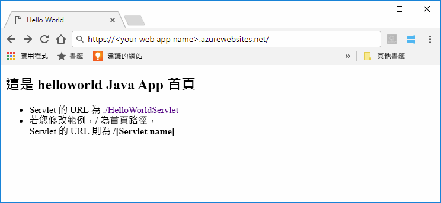
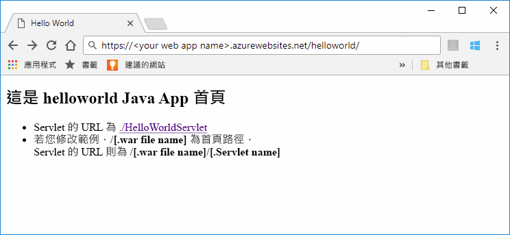

# <a name="quickstart-create-a-java-web-app-in-app-service-on-linux"></a>快速入門：在 Linux 上的 App Service 中建立 Java Web 應用程式

[Linux 上的 App Service](app-service-linux-intro.md) 使用 Linux 作業系統提供可高度擴充、自我修復的 Web 主機服務。 本快速入門說明如何使用 [Azure CLI](https://docs.microsoft.com/cli/azure/get-started-with-azure-cli) 搭配[適用於 Azure Web Apps 的 Maven 外掛程式 (預覽)](https://github.com/Microsoft/azure-maven-plugins/tree/develop/azure-webapp-maven-plugin)，部署 Java Web 應用程式的網頁封存 (WAR) 檔案。



[!INCLUDE [quickstarts-free-trial-note](../../../includes/quickstarts-free-trial-note.md)]

[!INCLUDE [cloud-shell-try-it.md](../../../includes/cloud-shell-try-it.md)]

## <a name="create-a-java-app"></a>建立 Java 應用程式

在 Cloud Shell 提示字元中執行下列 Maven 命令，以建立名為 `helloworld` 的新 Web 應用程式：

```bash
mvn archetype:generate -DgroupId=example.demo -DartifactId=helloworld -DarchetypeArtifactId=maven-archetype-webapp
```

## <a name="configure-the-maven-plugin"></a>設定 Maven 外掛程式

若要從 Maven 進行部署，請在 Cloud Shell 中使用程式碼編輯器，開啟 `helloworld` 目錄中的 `pom.xml` 專案檔案。 

```bash
code pom.xml
```

然後在 `pom.xml` 檔案的 `<build>` 元素內新增下列外掛程式定義。

```xml
<plugins>
    <!--*************************************************-->
    <!-- Deploy to Tomcat in App Service Linux           -->
    <!--*************************************************-->
      
    <plugin>
        <groupId>com.microsoft.azure</groupId>
        <artifactId>azure-webapp-maven-plugin</artifactId>
        <version>1.4.0</version>
        <configuration>
   
            <!-- Web App information -->
            <resourceGroup>${RESOURCEGROUP_NAME}</resourceGroup>
            <appName>${WEBAPP_NAME}</appName>
            <region>${REGION}</region>
   
            <!-- Java Runtime Stack for Web App on Linux-->
            <linuxRuntime>tomcat 8.5-jre8</linuxRuntime>
   
        </configuration>
    </plugin>
</plugins>
```    


> [!NOTE] 
> 在本文中，我們只會使用封裝在 WAR 檔案中的 JAVA 應用程式。 此外掛程式也支援 JAR Web 應用程式。 請對這些應用程式使用下列替代的外掛程式定義。 此組態將會在您本機檔案系統的 `${project.build.directory}/${project.build.finalName}.jar` 上部署由 Maven 所建置的 JAR。
>
>```xml
><plugin>
>            <groupId>com.microsoft.azure</groupId>
>            <artifactId>azure-webapp-maven-plugin</artifactId>
>            <version>1.4.0</version>
>            <configuration>
>                <deploymentType>jar</deploymentType>
>
>           <!-- Web App information -->
>            <resourceGroup>${RESOURCEGROUP_NAME}</resourceGroup>
>            <appName>${WEBAPP_NAME}</appName>
>            <region>${REGION}</region>  
>
>                <!-- Java Runtime Stack for Web App on Linux-->
>                <linuxRuntime>jre8</linuxRuntime>
>            </configuration>
>         </plugin>
>```    


更新外掛程式組態中的下列預留位置：

| Placeholder | 說明 |
| ----------- | ----------- |
| `RESOURCEGROUP_NAME` | 要在其中建立 Web 應用程式的新資源群組名稱。 將應用程式的所有資源放在群組中，藉此同時管理。 例如，刪除資源群組會刪除所有與應用程式相關聯的資源。 使用唯一的新資源群組名稱來更新此值，例如 TestResources。 您在下一節中會使用此資源群組名稱來清除所有的 Azure 資源。 |
| `WEBAPP_NAME` | 應用程式名稱會成為 Web 應用程式在部署至 Azure 時的部分主機名稱 (WEBAPP_NAME.azurewebsites.net)。 將此值更新為新 Azure Web 應用程式的唯一名稱 (例如 contoso)，它將會主控您的 Java 應用程式。 |
| `REGION` | 託管 Web 應用程式的 Azure 區域，例如 `westus2`。 您可以使用 `az account list-locations` 命令，從 Cloud Shell 或 CLI 取得區域清單。 |

## <a name="deploy-the-app"></a>部署應用程式

使用下列命令將您的 Java 應用程式部署至 Azure：

```bash
mvn package azure-webapp:deploy
```

完成部署後，在網頁瀏覽器中使用下列 URL，瀏覽至已部署的應用程式，例如 `http://<webapp>.azurewebsites.net/helloworld`。 



**恭喜！** 您已將第一個 Java 應用程式部署至 Linux 上的 App Service。


[!INCLUDE [cli-samples-clean-up](../../../includes/cli-samples-clean-up.md)]


## <a name="next-steps"></a>後續步驟

在本快速入門中，您可以使用 Maven 建立 Java Web 應用程式、設定[適用於 Azure Web Apps 的 Maven 外掛程式 (預覽)](https://github.com/Microsoft/azure-maven-plugins/tree/develop/azure-webapp-maven-plugin)，然後將以網頁封存封裝的 Java Web 應用程式部署至 Linux 上的 App Service。 若要深入了解如何使用 Java 搭配 Azure，請遵循下面的連結。

> [!div class="nextstepaction"]
> [適用於 Java 開發人員的 Azure](https://docs.microsoft.com/java/azure/)

