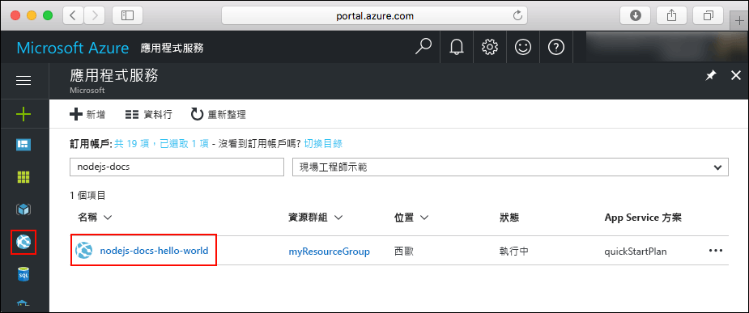
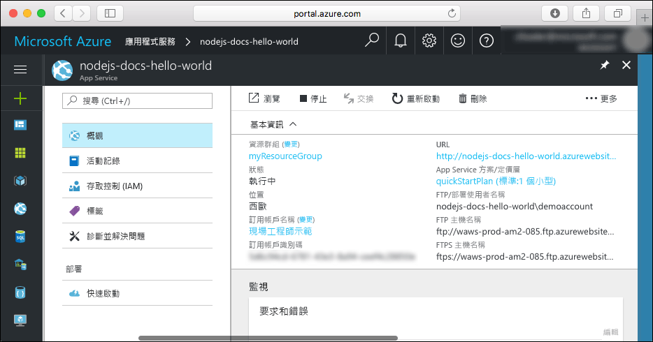

# <a name="create-a-nodejs-web-app-in-azure-app-service-on-linux"></a>在 Linux 上的 Azure App Service 中建立 Node.js Web 應用程式

> [!NOTE]
> 本文會將應用程式部署至 Linux 上的 App Service。 若要在 _Windows_ 上部署 App Service，請參閱[在 Azure 中建立 Node.js Web 應用程式](../app-service-web-get-started-nodejs.md)。
>

[Linux 上的 App Service](app-service-linux-intro.md) 使用 Linux 作業系統提供可高度擴充、自我修復的 Web 主機服務。 本快速入門會說明如何使用 [Cloud Shell](https://docs.microsoft.com/azure/cloud-shell/overview)，將 Node.js 應用程式部署至 Linux 上的 App Service。

您將會在 Cloud Shell 中完成此快速入門，但您也可以在本機使用 [Azure CLI](/cli/azure/install-azure-cli) 來執行這些命令。


[!INCLUDE [quickstarts-free-trial-note](../../../includes/quickstarts-free-trial-note.md)]

[!INCLUDE [cloud-shell-try-it.md](../../../includes/cloud-shell-try-it.md)]

## <a name="install-web-app-extension-for-cloud-shell"></a>為 Cloud Shell 安裝 Web 應用程式擴充功能

若要完成本快速入門，您必須新增 [az web app extension](https://docs.microsoft.com/cli/azure/extension?view=azure-cli-latest#az-extension-add)。 如果已安裝擴充功能，您應該將其更新至最新版本。 若要更新 Web 應用程式擴充功能，請輸入 `az extension update -n webapp`。

若要安裝 Web 應用程式擴充功能，請執行下列命令：

```bash
az extension add -n webapp
```

安裝好擴充功能後，Cloud Shell 會顯示下列範例中的資訊：

```bash
The installed extension 'webapp' is in preview.
```

## <a name="download-the-sample"></a>下載範例

在 Cloud Shell 中，建立快速入門目錄並變更為此目錄。

```bash
mkdir quickstart

cd quickstart
```

下一步，執行下列命令，將範例應用程式存放庫複製到您的快速入門目錄。

```bash
git clone https://github.com/Azure-Samples/nodejs-docs-hello-world
```

執行上述命令時，會顯示類似下列範例的資訊：

```bash
Cloning into 'nodejs-docs-hello-world'...
remote: Counting objects: 40, done.
remote: Total 40 (delta 0), reused 0 (delta 0), pack-reused 40
Unpacking objects: 100% (40/40), done.
Checking connectivity... done.
````

## <a name="create-a-web-app"></a>建立 Web 應用程式

變更為包含範例程式碼的目錄，並執行 `az webapp up` 命令。

在下列範例中，使用唯一的應用程式名稱取代 <app_name>。

```bash
cd nodejs-docs-hello-world

az webapp up -n <app_name>
```

此命令可能會花數分鐘執行。 執行上述命令時，會顯示類似下列範例的資訊：

```json
Creating Resource group 'appsvc_rg_Linux_CentralUS' ...
Resource group creation complete
Creating App service plan 'appsvc_asp_Linux_CentralUS' ...
App service plan creation complete
Creating app '<app_name>' ....
Webapp creation complete
Updating app settings to enable build after deployment
Creating zip with contents of dir /home/username/quickstart/nodejs-docs-hello-world ...
Preparing to deploy and build contents to app.
Fetching changes.

Generating deployment script.
Generating deployment script.
Generating deployment script.
Running deployment command...
Running deployment command...
Running deployment command...
Deployment successful.
All done.
{
  "app_url": "https://<app_name>.azurewebsites.net",
  "location": "Central US",
  "name": "<app_name>",
  "os": "Linux",
  "resourcegroup": "appsvc_rg_Linux_CentralUS ",
  "serverfarm": "appsvc_asp_Linux_CentralUS",
  "sku": "STANDARD",
  "src_path": "/home/username/quickstart/nodejs-docs-hello-world ",
  "version_detected": "6.9",
  "version_to_create": "node|6.9"
}
```

`az webapp up` 命令會執行下列動作：

- 建立預設的資源群組。

- 建立預設的 App Service 方案。

- 建立具有所指定名稱的應用程式。

- [以 Zip 檔進行部署](https://docs.microsoft.com/azure/app-service/app-service-deploy-zip)，將目前工作目錄中的檔案部署到 Web 應用程式。

## <a name="browse-to-the-app"></a>瀏覽至應用程式

使用 web 瀏覽器瀏覽至已部署的應用程式。 以您的 Web 應用程式名稱取代 <app_name>。

```bash
http://<app_name>.azurewebsites.net
```

Node.js 範例程式碼正在具有內建映像的 Web 應用程式中執行。


**恭喜！** 您已將第一個 Node.js 應用程式部署至 Linux 上的 App Service。

## <a name="update-and-redeploy-the-code"></a>更新和重新部署程式碼

在 Cloud Shell 中，輸入 `nano index.js`，以開啟 nano 文字編輯器。


 在呼叫 `response.end` 時，對文字進行小幅變更：

```nodejs
response.end("Hello Azure!");
```

儲存您的變更並結束 nano。 使用 `^O` 命令進行儲存，以及使用 `^X` 來結束作業。

您現在將重新部署應用程式。 使用 Web 應用程式替代 `<app_name>`。

```bash
az webapp up -n <app_name>
```

部署完成後，切換回在**瀏覽至應用程式**步驟中開啟的瀏覽器視窗，然後重新整理頁面。


## <a name="manage-your-new-azure-web-app"></a>管理新的 Azure Web 應用程式

請移至 <a href="https://portal.azure.com" target="_blank">Azure 入口網站</a>，以管理您所建立的 Web 應用程式。

按一下左側功能表中的 [應用程式服務]，然後按一下 Azure Web 應用程式的名稱。



您會看到 Web 應用程式的 [概觀] 頁面。 您可以在這裡完成基本管理工作，像是瀏覽、停止、啟動、重新啟動及刪除。



左側功能表提供不同的頁面來設定您的應用程式。

## <a name="clean-up-resources"></a>清除資源

在前述步驟中，您在資源群組中建立了 Azure 資源。 如果您認為未來不需要這些資源，可從 Cloud Shell 中刪除資源群組。 如果您已修改區域，請將資源群組名稱 `appsvc_rg_Linux_CentralUS` 更新為您應用程式專用的特定資源群組。

```azurecli-interactive
az group delete --name appsvc_rg_Linux_CentralUS
```

此命令可能會花一分鐘執行。

## <a name="next-steps"></a>後續步驟

> [!div class="nextstepaction"]
> [Node.js with MongoDB](tutorial-nodejs-mongodb-app.md)
