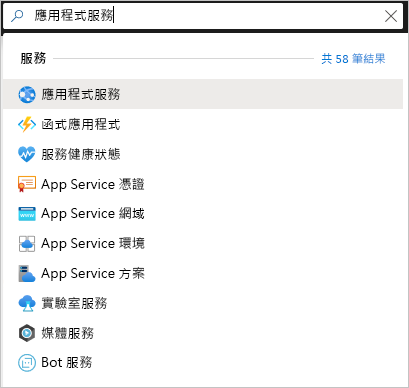
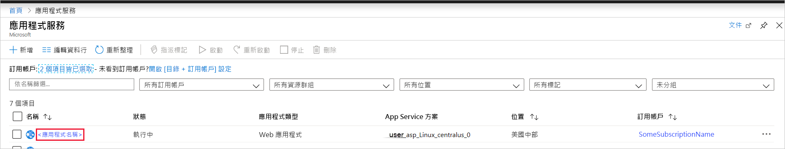

# <a name="quickstart-create-a-python-app-in-azure-app-service-on-linux"></a>快速入門：在 Linux 上的 Azure App Service 中建立 Python 應用程式

在本快速入門中，您會將 Python 應用程式部署到 [Linux 上的 App Service](app-service-linux-intro.md)，這是 Azure 可高度擴充、自我修復的 Web 裝載服務。 您會在 Mac、Linux 或 Windows 電腦上使用本機 [Azure 命令列介面 (CLI)](/cli/azure/install-azure-cli)。 您設定的 Web 應用程式會使用免費的 App Service 層，因此在本文過程中不會產生任何費用。

如果您想要透過 IDE 部署應用程式，請參閱[從 Visual Studio Code 將 Python 應用程式部署至 App Service](/azure/python/tutorial-deploy-app-service-on-linux-01)。

## <a name="prerequisites"></a>Prerequisites

- Azure 訂用帳戶 - [建立免費帳戶](https://azure.microsoft.com/free/?ref=microsoft.com&utm_source=microsoft.com&utm_medium=docs&utm_campaign=visualstudio)
- <a href="https://www.python.org/downloads/" target="_blank">Python 3.7</a> (也支援 Python 3.6)
- <a href="https://git-scm.com/downloads" target="_blank">Git</a>
- <a href="https://docs.microsoft.com/cli/azure/install-azure-cli" target="_blank">Azure CLI</a>

## <a name="download-the-sample"></a>下載範例

在終端機視窗中執行下列命令，將範例應用程式複製到本機電腦。 

```terminal
git clone https://github.com/Azure-Samples/python-docs-hello-world
```

然後移至該資料夾中：

```terminal
cd python-docs-hello-world
```

存放庫包含 *application.py* 檔案，該檔案會向 App Service 指出程式碼包含 Flask 應用程式。 如需詳細資訊，請參閱[容器的啟動程序和自訂項目](how-to-configure-python.md)。

## <a name="sign-in-to-azure"></a>登入 Azure

Azure CLI 提供給您許多可從本機終端機使用的便利命令，以便從命令列佈建和管理 Azure 資源。 您可以使用這些命令來完成您在瀏覽器中透過 Azure 入口網站執行的相同工作。 您也可以在指令碼中使用 CLI 命令，將管理程序自動化。

若要在 Azure CLI 中執行 Azure 命令，您必須先使用 `az login` 命令進行登入。 此命令會開啟瀏覽器來收集您的認證。

```terminal
az login
```

## <a name="deploy-the-sample"></a>部署範例

[`az webapp up`](/cli/azure/webapp#az-webapp-up) 命令會在 App Service 上建立 Web 應用程式並部署您的程式碼。

在包含範例程式碼的 *python-docs-hello-world* 資料夾中，執行下列 `az webapp up` 命令。 將 `<app-name>` 取代為全域唯一的應用程式名稱 (有效字元為 `a-z`、`0-9` 和 `-`  )。 同時將 `<location-name>` 取代為 Azure 區域，例如 **centralus**、**eastasia**、**westeurope**、**koreasouth**、**brazilsouth**、**centralindia** 等等。 (您可藉由執行 [`az account locations-list`](/cli/azure/appservice?view=azure-cli-latest.md#az-appservice-list-locations) 命令，擷取 Azure 帳戶的允許區域清單。)


```terminal
az webapp up --sku F1 -n <app-name> -l <location-name>
```

此命令可能需要數分鐘才能完成執行。 執行上述命令時，會顯示類似下列範例的資訊：

```output
The behavior of this command has been altered by the following extension: webapp
Creating Resource group 'appsvc_rg_Linux_centralus' ...
Resource group creation complete
Creating App service plan 'appsvc_asp_Linux_centralus' ...
App service plan creation complete
Creating app '<app-name>' ....
Webapp creation complete
Creating zip with contents of dir /home/username/quickstart/python-docs-hello-world ...
Preparing to deploy contents to app.
All done.
{
  "app_url": "https:/<app-name>.azurewebsites.net",
  "location": "Central US",
  "name": "<app-name>",
  "os": "Linux",
  "resourcegroup": "appsvc_rg_Linux_centralus ",
  "serverfarm": "appsvc_asp_Linux_centralus",
  "sku": "BASIC",
  "src_path": "/home/username/quickstart/python-docs-hello-world ",
  "version_detected": "-",
  "version_to_create": "python|3.7"
}
```

[!INCLUDE [AZ Webapp Up Note](../../../includes/app-service-web-az-webapp-up-note.md)]

## <a name="browse-to-the-app"></a>瀏覽至應用程式

使用網頁瀏覽器瀏覽至已部署的應用程式 (URL 為 `http://<app-name>.azurewebsites.net`)。

Python 範例程式碼目前使用內建映像在 App Service 中執行 Linux 容器。


**恭喜！** 您已將 Python 應用程式部署至 Linux 上的 App Service。

## <a name="run-the-sample-app-locally"></a>在本機執行範例應用程式

在終端機視窗中，使用下列命令 (適用於您的作業系統) 安裝必要的相依性，然後啟動內建的開發伺服器。 

# <a name="bashtabbash"></a>[Bash](#tab/bash)

```bash
python3 -m venv venv
source venv/bin/activate
pip install -r requirements.txt
FLASK_APP=application.py
flask run
```

# <a name="powershelltabpowershell"></a>[PowerShell](#tab/powershell)

```powershell
py -3 -m venv env
env\scripts\activate
pip install -r requirements.txt
Set-Item Env:FLASK_APP ".\application.py"
flask run
```

# <a name="cmdtabcmd"></a>[Cmd](#tab/cmd)

```cmd
py -3 -m venv env
env\scripts\activate
pip install -r requirements.txt
SET FLASK_APP=application.py
flask run
```

---

開啟網頁瀏覽器，然後移至位於 `http://localhost:5000/` 的範例應用程式。 應用程式會顯示 **Hello World!** 訊息。


在終端機視窗中，按 **Ctrl**+**C** 結束網頁伺服器。

## <a name="redeploy-updates"></a>重新部署更新

在您慣用的程式碼編輯器中，開啟 *application.py* 並且變更最後一行上的 `return` 陳述式，以符合下列程式碼。 這裡包含 `print` 陳述式，以產生您在下一節中使用的記錄輸出。 

```python
print("Handling request to home page.")
return "Hello Azure!"
```

儲存您的變更並結束編輯器。 

使用下列 `az webapp up` 命令來重新部署應用程式，使用您第一次用來部署應用程式的相同命令，以您之前使用的相同名稱取代 `<app-name>` 和 `<location-name>`。 

```terminal
az webapp up --sku F1 -n <app-name> -l <location-name>
```

完成部署後，切換回開啟至 `http://<app-name>.azurewebsites.net` 的瀏覽器視窗並重新整理頁面，這應會顯示修改過的訊息：


> [!TIP]
> Visual Studio Code 針對 Python 和 Azure App Service 提供強大的擴充功能，以簡化將 Python Web 應用程式部署至 App Service 的程序。 如需詳細資訊，請參閱[從 Visual Studio Code 將 Python 應用程式部署至 App Service](/azure/python/tutorial-deploy-app-service-on-linux-01)。

## <a name="stream-logs"></a>串流記錄

您可以存取從應用程式及其執行所在的容器產生的主控台記錄。 記錄包含使用 `print` 陳述式產生的任何輸出。

首先，在終端機中執行下列命令來開啟容器記錄功能，將 `<app-name>` 取代為您的應用程式名稱，並將 `<resource-group-name>`取代為您所用 `az webapp up` 命令的輸出中所顯示的資源群組名稱 (例如 "appsvc_rg_Linux_centralus")：

```terminal
az webapp log config --name <app-name> --resource-group <resource-group-name> --docker-container-logging filesystem
```

開啟容器記錄後，請執行下列命令來顯示記錄資料流：

```terminal
az webapp log tail --name <app-name> --resource-group <resource-group-name>
```

在瀏覽器中重新整理應用程式以產生主控台記錄，其中應包含類似以下文字的文字行。 如果您沒有立即看到輸出，請在 30 秒後再試一次。

```output
2019-10-23T12:40:03.815574424Z Handling request to home page.
2019-10-23T12:40:03.815602424Z 172.16.0.1 - - [23/Oct/2019:12:40:03 +0000] "GET / HTTP/1.1" 200 12 "-" "Mozilla/5.0 (Windows NT 10.0; Win64; x64) AppleWebKit/537.36 (KHTML, like Gecko) Chrome/78.0.3904.63 Safari/537.36 Edg/78.0.276.19"
```

您也可以在瀏覽器中的 `https://<app-name>.scm.azurewebsites.net/api/logs/docker` 檢查記錄檔。

若要隨時停止記錄資料流，請輸入 `Ctrl`+`C`。

## <a name="manage-the-azure-app"></a>管理 Azure 應用程式

移至 <a href="https://portal.azure.com" target="_blank">Azure 入口網站</a>，以管理您所建立的應用程式。 搜尋並選取 [應用程式服務]  。



選取您 Azure 應用程式的名稱。



您會看到應用程式的 [概觀] 頁面。 您可以在這裡執行基本管理工作，像是瀏覽、停止、啟動、重新啟動及刪除。

![在 Azure 入口網站的 [概觀] 頁面中管理您的 Python 應用程式](./media/quickstart-python/manage-an-app-in-app-services-in-the-azure-portal.png)

App Service 功能表提供不同的頁面來設定您的應用程式。

## <a name="clean-up-resources"></a>清除資源

在前述步驟中，您在資源群組中建立了 Azure 資源。 視您的位置而定，資源群組的名稱類似於 "appsvc_rg_Linux_CentralUS"。 如果您使用免費 F1 層以外的 App Service SKU，這些資源會產生持續成本。

如果您未來不需要這些資源，請執行下列命令來刪除資源群組，並將 `<resource-group-name>` 取代為 `az webapp up` 命令輸出中所顯示的資源群組，例如 "appsvc_rg_Linux_centralus"。 此命令可能需要一分鐘才能完成。

```terminal
az group delete -n <resource-group-name>
```

## <a name="next-steps"></a>後續步驟

> [!div class="nextstepaction"]
> [教學課程：採用 PostgreSQL 的 Python (Django) Web 應用程式](tutorial-python-postgresql-app.md)

> [!div class="nextstepaction"]
> [設定 Python 應用程式](how-to-configure-python.md)

> [!div class="nextstepaction"]
> [教學課程：在自訂容器中執行 Python 應用程式](tutorial-custom-docker-image.md)
