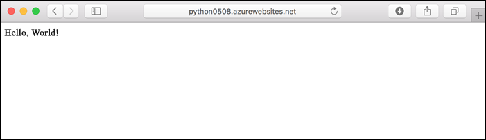
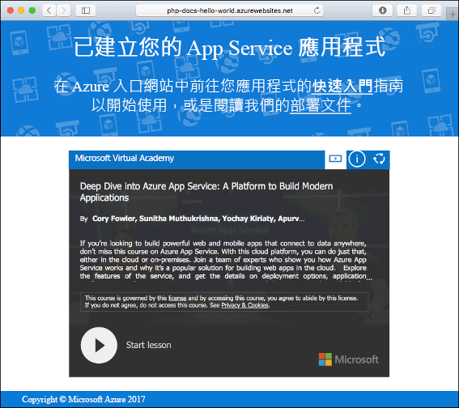
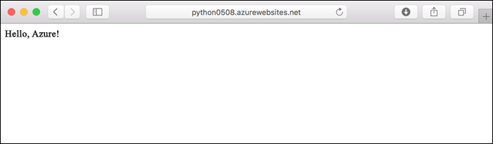
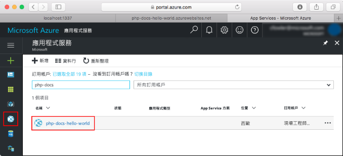
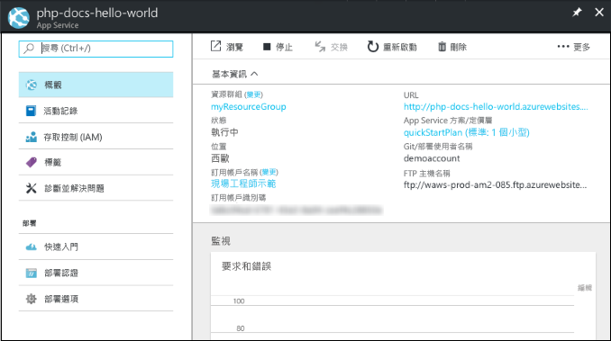

# <a name="create-a-python-web-app-in-azure-app-service-on-linux-preview"></a>在 Linux 上的 Azure App Service 中建立 Python Web 應用程式 (預覽)

[Linux 上的 App Service](app-service-linux-intro.md) 使用 Linux 作業系統提供可高度擴充、自我修復的 Web 主機服務。 本快速入門說明如何使用 [Azure CLI](/cli/azure/install-azure-cli) 在 Linux 上的 App Service 中將 Python 應用程式部署於內建的 Python 映像 (預覽) 之上。

您可以使用 Mac、Windows 或 Linux 機器，依照本文中的步驟操作。



[!INCLUDE [quickstarts-free-trial-note](../../../includes/quickstarts-free-trial-note.md)]

## <a name="prerequisites"></a>必要條件

若要完成本快速入門：

* <a href="https://www.python.org/downloads/" target="_blank">安裝 Python 3.7</a>
* <a href="https://git-scm.com/" target="_blank">安裝 Git</a>

## <a name="download-the-sample"></a>下載範例

在終端機視窗中執行下列命令，將應用程式範例複製到本機電腦，並瀏覽至包含範例程式碼的目錄。

```bash
git clone https://github.com/Azure-Samples/python-docs-hello-world
cd python-docs-hello-world
```

## <a name="run-the-app-locally"></a>在本機執行應用程式

在本機執行應用程式，以便您查看它在部署至 Azure 時的樣貌。 開啟終端機視窗，並使用下列命令安裝必要的相依性，然後啟動內建的開發伺服器。 

```bash
# In Bash
python3 -m venv venv
source venv/bin/activate
pip install -r requirements.txt
FLASK_APP=application.py flask run

# In PowerShell
py -3 -m venv env
env\scripts\activate
pip install -r requirements.txt
Set-Item Env:FLASK_APP ".\application.py"
flask run
```

開啟網頁瀏覽器，然後巡覽至位於 `http://localhost:5000/` 的範例應用程式。

您會看到來自範例應用程式的 **Hello World!** 訊息顯示在網頁中。


在終端機視窗中，按 **Ctrl+C** 結束 web 伺服器。

[!INCLUDE [cloud-shell-try-it.md](../../../includes/cloud-shell-try-it.md)]

[!INCLUDE [Configure deployment user](../../../includes/configure-deployment-user.md)]

[!INCLUDE [Create resource group](../../../includes/app-service-web-create-resource-group-linux.md)]

[!INCLUDE [Create app service plan](../../../includes/app-service-web-create-app-service-plan-linux.md)]

## <a name="create-a-web-app"></a>建立 Web 應用程式

[!INCLUDE [Create app service plan](../../../includes/app-service-web-create-web-app-python-linux-no-h.md)]

瀏覽至網站以查看您使用內建映像新建立的 Web 應用程式。 以您的 Web 應用程式名稱取代 _&lt;app name>_。

```bash
http://<app_name>.azurewebsites.net
```

新的 Web 應用程式看起來應該像這樣：



[!INCLUDE [Push to Azure](../../../includes/app-service-web-git-push-to-azure.md)] 

```bash
Counting objects: 42, done.
Delta compression using up to 8 threads.
Compressing objects: 100% (39/39), done.
Writing objects: 100% (42/42), 9.43 KiB | 0 bytes/s, done.
Total 42 (delta 15), reused 0 (delta 0)
remote: Updating branch 'master'.
remote: Updating submodules.
remote: Preparing deployment for commit id 'c40efbb40e'.
remote: Generating deployment script.
remote: Generating deployment script for python Web Site
.
.
.
remote: Finished successfully.
remote: Running post deployment command(s)...
remote: Deployment successful.
remote: App container will begin restart within 10 seconds.
To https://user2234@cephalin-python.scm.azurewebsites.net/cephalin-python.git
 * [new branch]      master -> master
 ```

## <a name="browse-to-the-app"></a>瀏覽至應用程式

使用 web 瀏覽器瀏覽至已部署的應用程式。

```bash
http://<app_name>.azurewebsites.net
```

Python 程式碼範例正在具有內建映像的 Web 應用程式中執行。


**恭喜！** 您已將第一個 Python 應用程式部署至 Linux 上的 App Service。

## <a name="update-locally-and-redeploy-the-code"></a>在本機更新和重新部署程式碼

在本機存放庫中開啟 `application.py` 檔案，並且對最後一行中的文字進行小幅變更：

```python
return "Hello Azure!"
```

在 Git 中認可您的變更，然後將程式碼變更推送至 Azure。

```bash
git commit -am "updated output"
git push azure master
```

部署完成後，切換回在**瀏覽至應用程式**步驟中開啟的瀏覽器視窗，然後重新整理頁面。



## <a name="manage-your-new-azure-web-app"></a>管理新的 Azure Web 應用程式

請移至 <a href="https://portal.azure.com" target="_blank">Azure 入口網站</a>，以管理您所建立的 Web 應用程式。

按一下左側功能表中的 [應用程式服務]，然後按一下 Azure Web 應用程式的名稱。



您會看到 Web 應用程式的 [概觀] 頁面。 您可以在這裡執行基本管理工作，像是瀏覽、停止、啟動、重新啟動及刪除。



左側功能表提供不同的頁面來設定您的應用程式。 

[!INCLUDE [cli-samples-clean-up](../../../includes/cli-samples-clean-up.md)]

## <a name="next-steps"></a>後續步驟

在 Linux 上的 App Service 中，內建的 Python 映像目前處於預覽狀態，您可以自訂用來啟動應用程式的命令。 您也可以改用自訂容器來建立生產 Python 應用程式。

> [!div class="nextstepaction"]
> [Python with PostgreSQL](tutorial-python-postgresql-app.md)

> [!div class="nextstepaction"]
> [設定自訂啟動命令](how-to-configure-python.md#custom-startup-command)

> [!div class="nextstepaction"]
> [使用自訂映像](tutorial-custom-docker-image.md)
