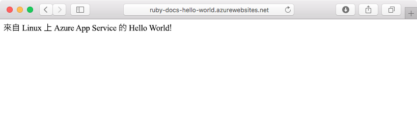
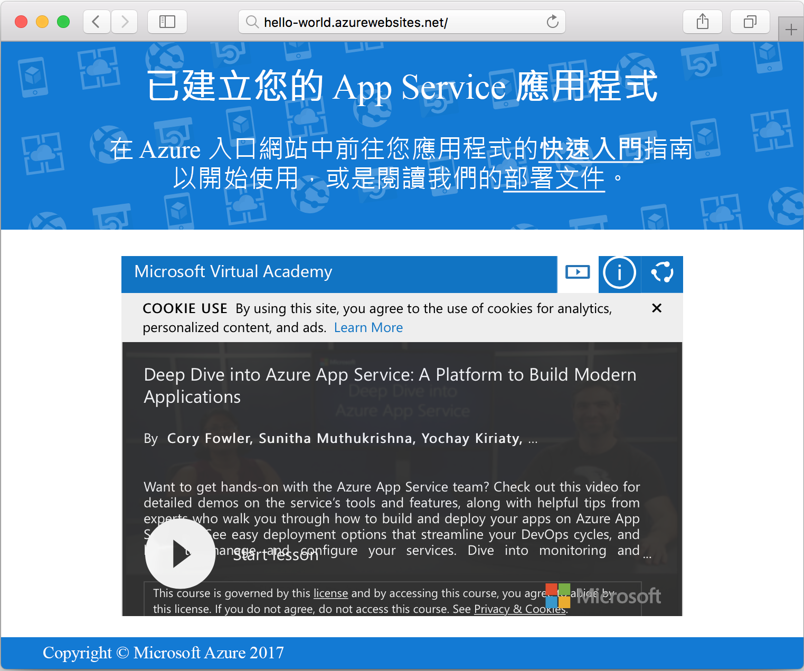

# <a name="create-a-ruby-on-rails-app-in-app-service-on-linux"></a>在 Linux 上的 App Service 中建立 Ruby on Rails 應用程式

[Linux 上的 Azure App Service](app-service-linux-intro.md) 提供可高度擴充、自我修復的 Web 主機服務。 本快速入門示範如何建立基本的 [Ruby on Rails](https://rubyonrails.org/) 應用程式，然後將它當作 Linux 上的 Web 應用程式部署至 Azure。

> [!NOTE]
> Ruby 開發堆疊目前僅支援 Ruby on Rails。 如果您想要使用不同的平台 (例如 Sinatra)，請參閱[用於容器的 Web App](https://docs.microsoft.com/azure/app-service/containers/) 的快速入門。


[!INCLUDE [quickstarts-free-trial-note](../../../includes/quickstarts-free-trial-note.md)]

## <a name="prerequisites"></a>必要條件

* <a href="https://www.ruby-lang.org/en/documentation/installation/#rubyinstaller" target="_blank">安裝 Ruby 2.3 或更高版本</a>
* <a href="https://git-scm.com/" target="_blank">安裝 Git</a>

## <a name="download-the-sample"></a>下載範例

在終端機視窗中執行下列命令，將範例應用程式存放庫複製到本機電腦：

```bash
git clone https://github.com/Azure-Samples/ruby-docs-hello-world
```

## <a name="run-the-application-locally"></a>在本機執行應用程式

在本機執行應用程式，以便您查看它在部署至 Azure 時的樣貌。 開啟終端機視窗，切換至 `hello-world` 目錄，然後使用 `rails server` 命令啟動伺服器。

第一個步驟是安裝必要的 Gem。 範例中包含 `Gemfile`，因此您不需要指定要安裝的 Gem。 為此我們將使用搭配程式：

```
bundle install
```

在 Gem 安裝完成後，我們將使用搭配程式來啟動應用程式：

```bash
bundle exec rails server
```

使用網頁瀏覽器，瀏覽至 `http://localhost:3000`，在本機測試應用程式。



[!INCLUDE [Try Cloud Shell](../../../includes/cloud-shell-try-it.md)]

[!INCLUDE [Configure deployment user](../../../includes/configure-deployment-user.md)]

[!INCLUDE [Create resource group](../../../includes/app-service-web-create-resource-group-linux.md)]

[!INCLUDE [Create app service plan](../../../includes/app-service-web-create-app-service-plan-linux.md)]

## <a name="create-a-web-app"></a>建立 Web 應用程式

[!INCLUDE [Create web app](../../../includes/app-service-web-create-web-app-ruby-linux-no-h.md)] 

瀏覽至網站以查看您使用內建映像新建立的 Web 應用程式。 以您的 Web 應用程式名稱取代 _&lt;app name>_。

```bash
http://<app_name>.azurewebsites.net
```

新的 Web 應用程式看起來應該像這樣：



## <a name="deploy-your-application"></a>部署應用程式

執行下列命令，將本機應用程式部署至您的 Azure 網站：

```bash
git remote add azure <Git deployment URL from above>
git add -A
git commit -m "Initial deployment commit"
git push azure master
```

確認遠端部署作業報告成功。 此命令會產生類似下列文字的輸出：

```bash
remote: Using sass-rails 5.0.6
remote: Updating files in vendor/cache
remote: Bundle gems are installed into ./vendor/bundle
remote: Updating files in vendor/cache
remote: ~site/repository
remote: Finished successfully.
remote: Running post deployment command(s)...
remote: Deployment successful.
To https://<your web app name>.scm.azurewebsites.net/<your web app name>.git
  579ccb....2ca5f31  master -> master
myuser@ubuntu1234:~workspace/<app name>$
```

一旦部署完成後，使用 [`az webapp restart`](/cli/azure/webapp?view=azure-cli-latest#az-webapp-restart) 命令來重新啟動 Web 應用程式，部署才會生效，如下所示：

```azurecli-interactive
az webapp restart --name <app name> --resource-group myResourceGroup
```

瀏覽至您的網站並確認結果。

```bash
http://<app name>.azurewebsites.net
```


> [!NOTE]
> 當應用程式重新啟動時，嘗試瀏覽網站會導致 HTTP 狀態碼 `Error 503 Server unavailable`。 可能需要幾分鐘才能完全重新啟動。
>

[!INCLUDE [Clean-up section](../../../includes/cli-script-clean-up.md)]

## <a name="next-steps"></a>後續步驟

> [!div class="nextstepaction"]
> [Ruby on Rails with MySQL](tutorial-ruby-postgres-app.md)
