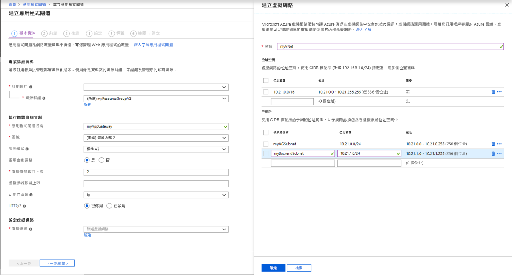
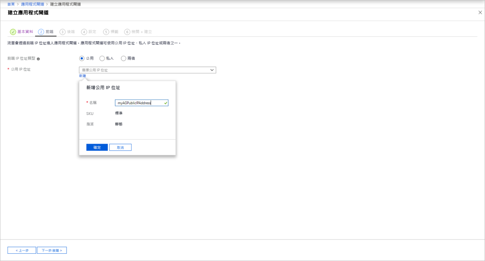
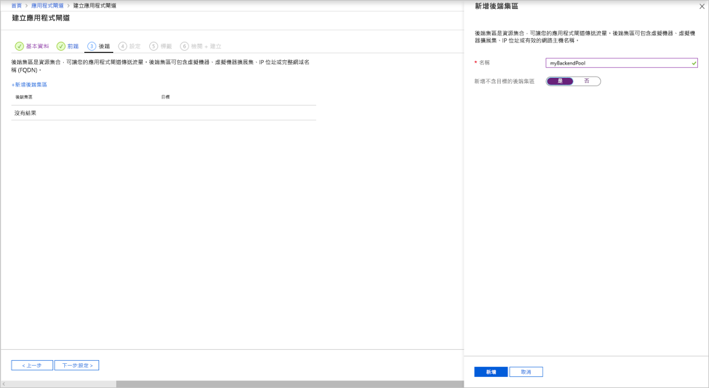
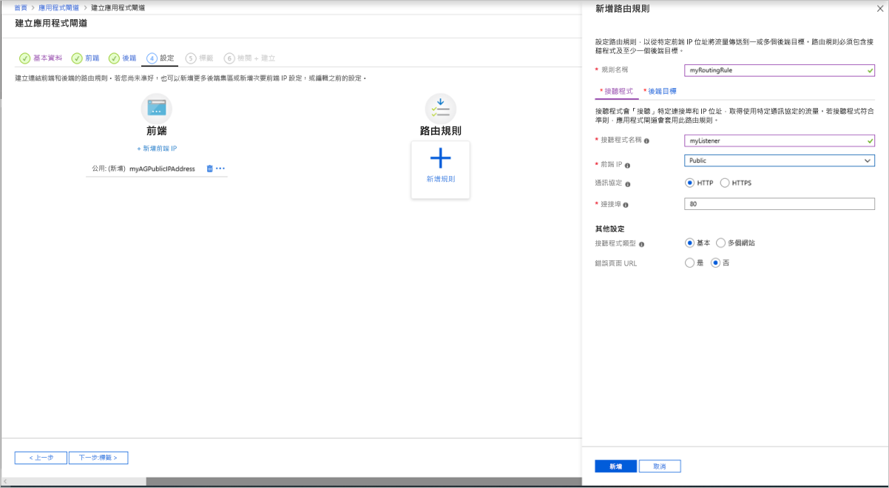
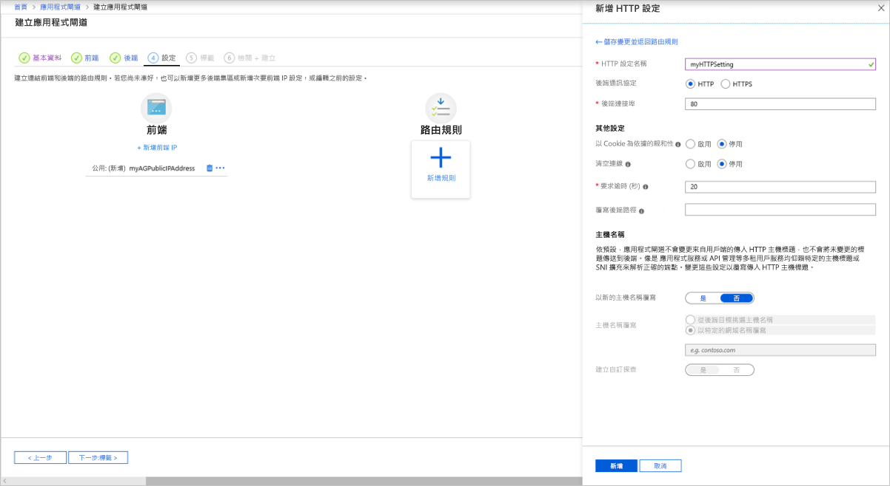
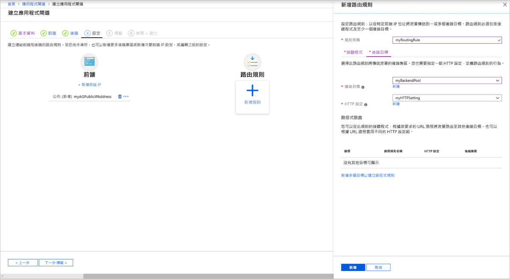

# <a name="tutorial-configure-an-application-gateway-with-ssl-termination-using-the-azure-portal"></a>教學課程：使用 Azure 入口網站設定包含 SSL 終止的應用程式閘道

您可以使用 Azure 入口網站來設定[應用程式閘道](overview.md)，當中包含使用虛擬機器作為後端伺服器的 SSL 終止憑證。

在本教學課程中，您了解如何：

> [!div class="checklist"]
> * 建立自我簽署憑證
> * 建立包含憑證的應用程式閘道
> * 建立用來作為後端伺服器的虛擬機器
> * 測試應用程式閘道

如果您沒有 Azure 訂用帳戶，請在開始前建立 [免費帳戶](https://azure.microsoft.com/free/?WT.mc_id=A261C142F) 。

[!INCLUDE [updated-for-az](../../includes/updated-for-az.md)]

## <a name="sign-in-to-azure"></a>登入 Azure

在 [https://portal.azure.com](https://portal.azure.com) 登入 Azure 入口網站

## <a name="create-a-self-signed-certificate"></a>建立自我簽署憑證

在此節中，您將使用 [New-SelfSignedCertificate](https://docs.microsoft.com/powershell/module/pkiclient/new-selfsignedcertificate) 來建立自我簽署的憑證。 當您為應用程式閘道建立接聽程式時，須將憑證上傳至 Azure 入口網站。

在您的本機電腦上，以系統管理員身分開啟 Windows PowerShell 視窗。 執行下列命令來建立憑證：

```powershell
New-SelfSignedCertificate `
  -certstorelocation cert:\localmachine\my `
  -dnsname www.contoso.com
```

您應該會看到類似這個回應的內容：

```
PSParentPath: Microsoft.PowerShell.Security\Certificate::LocalMachine\my

Thumbprint                                Subject
----------                                -------
E1E81C23B3AD33F9B4D1717B20AB65DBB91AC630  CN=www.contoso.com
```

使用 [Export-PfxCertificate](https://docs.microsoft.com/powershell/module/pkiclient/export-pfxcertificate) 搭配系統所傳回的指紋，以將 pfx 檔案從憑證匯出：

> [!NOTE]
> 請勿在 .pfx 檔案密碼中使用任何特殊字元。 僅支援英數位元。

```powershell
$pwd = ConvertTo-SecureString -String "Azure123456!" -Force -AsPlainText
Export-PfxCertificate `
  -cert cert:\localMachine\my\E1E81C23B3AD33F9B4D1717B20AB65DBB91AC630 `
  -FilePath c:\appgwcert.pfx `
  -Password $pwd
```

## <a name="create-an-application-gateway"></a>建立應用程式閘道

1. 在 Azure 入口網站的左側功能表上選取 [建立資源]  。 [新增]  視窗隨即出現。

2. 在 [精選]  清單中選取 [網路]  ，然後選取 [應用程式閘道]  。

### <a name="basics-tab"></a>[基本] 索引標籤

1. 在 [基本]  索引標籤上，為下列應用程式閘道設定輸入這些值：

   - **資源群組**：選取 **myResourceGroupAG** 作為資源群組。 如果資源群組不存在，請選取 [新建]  加以建立。
   - **應用程式閘道名稱**：輸入 myAppGateway  作為應用程式閘道的名稱。

     

2.  Azure 需要虛擬網路才能在您所建立的資源之間進行通訊。 您可以建立新的虛擬網路，或使用現有的虛擬網路。 在此範例中，您將會在建立應用程式閘道時，同時建立新的虛擬網路。 在不同的子網路中，建立應用程式閘道執行個體。 在此範例中您會建立兩個子網路：一個用於應用程式閘道，另一個用於後端伺服器。

    在 [設定虛擬網路]  底下，選取 [新建]  以建立新的虛擬網路。 在隨即開啟的 [建立虛擬網路]  視窗中，輸入下列值以建立虛擬網路和兩個子網路：

    - **名稱**：輸入 myVNet  作為虛擬網路的名稱。

    - **子網路名稱** (應用程式閘道子網路)：[子網路]  方格將會顯示名為 *Default* 的子網路。 將此子網路的名稱變更為 *myAGSubnet*。<br>應用程式閘道子網路只能包含應用程式閘道。 不允許任何其他資源。

    - **子網路名稱** (後端伺服器子網路)：在 [子網路]  方格的第二列中，於 [子網路名稱]  欄中輸入 *myBackendSubnet*。

    - **位址範圍** (後端伺服器子網路)：在 [子網路]  方格的第二列中，輸入沒有與 *myAGSubnet* 的位址範圍重疊的位址範圍。 例如，如果 *myAGSubnet* 的位址範圍是 10.0.0.0/24，請針對 *myBackendSubnet* 的位址範圍輸入 *10.0.1.0/24*。

    選取 [確定]  以關閉 [建立虛擬網路]  視窗並儲存虛擬網路設定。

     
    
3. 在 [基本]  索引標籤上，接受其他設定的預設值，然後選取 [下一步:  前端]。

### <a name="frontends-tab"></a>[前端] 索引標籤

1. 在 [前端]  索引標籤上，確認 [前端 IP 位址類型]  已被設為 [公用]  。 <br>您可以根據自己的使用案例，設定為公用或私人前端 IP。 在此範例中，您會選擇公用前端 IP。
   > [!NOTE]
   > 對於應用程式閘道 v2 SKU，您只能選擇 [公用]  前端 IP 組態。 目前未針對此 v2 SKU 啟用私人前端 IP 設定。

2. 針對 [公用 IP 位址]  選擇 [新建]  ，然後針對公用 IP 位址名稱輸入 *myAGPublicIPAddress*，然後選取 [確定]  。 

     

3. 完成時，選取 [下一步:  後端]。

### <a name="backends-tab"></a>[後端] 索引標籤

後端集區用於將要求路由傳送至可為要求提供服務的後端伺服器。 後端集區可以包含 NIC、虛擬機器擴展集、公用 IP、內部 IP、完整的網域名稱 (FQDN)，以及如 Azure App Service 的多租用戶後端。 在此範例中，您將會搭配應用程式閘道建立空的後端集區，然後將後端目標新增至該後端集區。

1. 在 [後端]  索引標籤上，選取 [+新增後端集區]  。

2. 在隨即開啟的 [新增後端集區]  視窗中，輸入下列值以建立空的後端集區：

    - **名稱**：輸入 *myBackendPool* 作為後端集區的名稱。
    - **新增不含目標的後端集區**：選取 [是]  以建立不含目標的後端集區。 您將會在建立應用程式閘道之後再新增後端目標。

3. 在 [新增後端集區]  視窗中，選取 [新增]  以儲存後端集區設定，並返回 [後端]  索引標籤。

     

4. 在 [後端]  索引標籤上，選取 [下一步:  設定]。

### <a name="configuration-tab"></a>組態索引標籤

在 [設定]  索引標籤上，您將會連線至您使用路由規則所建立的前端和後端集區。

1. 選取 [路由規則]  欄中的 [新增規則]  。

2. 在隨即開啟的 [新增路由規則]  視窗中，針對 [規則名稱]  輸入 *myRoutingRule*。

3. 路由規則需要接聽程式。 在 [新增路由規則]  視窗內的 [接聽程式]  索引標籤上，針對接聽程式輸入下列值：

    - **接聽程式名稱**：輸入 *myListener* 作為接聽程式的名稱。
    - **前端 IP**：選取 [公用]  以選擇您針對前端所建立的公用 IP。
    - **通訊協定**：選取 [HTTPS]  。
    - **連接埠**：確認已輸入 443 作為連接埠。

   在 [HTTPS 憑證]  底下:

   - **PFX 憑證檔案** - 流覽至您稍早建立的 c:\appgwcert.pfx 檔案並加以選取。
   - **憑證名稱** - 輸入 mycert1*mycert1* 作為憑證的名稱。
   - **密碼** - 輸入 *Azure123456!* 作為密碼。
  
      接受 [接聽程式]  索引標籤上其他設定的預設值，然後選取 [後端目標]  索引標籤以設定其餘的路由規則。

   

4. 在 [後端目標]  索引標籤上，針對 [後端目標]  選取 [myBackendPool]  。

5. 針對 [HTTP 設定]  ，選取 [新建]  以建立新的 HTTP 設定。 HTTP 設定將會決定路由規則的行為。 在隨即開啟的 [新增 HTTP 設定]  視窗中，針對 [HTTP 設定名稱]  輸入 *myHTTPSetting*。 接受 [新增 HTTP 設定]  視窗中其餘設定的預設值，然後選取 [新增]  以返回 [新增路由規則]  視窗。 

     

6. 在 [新增路由規則]  視窗上，選取 [新增]  以儲存路由規則，並返回 [設定]  索引標籤。

     

7. 完成時，選取 [下一步:  標籤]，然後選取 [下一步:  檢閱 + 建立]。

### <a name="review--create-tab"></a>[檢閱 + 建立] 索引標籤

檢閱 [檢閱 + 建立]  索引標籤上的設定，然後選取 [建立]  以建立虛擬網路、公用 IP 位址和應用程式閘道。 Azure 建立應用程式閘道可能需要幾分鐘的時間。 請等候部署成功完成後，再繼續進行至下一節。

## <a name="add-backend-targets"></a>新增後端目標

在此範例中，您會使用虛擬機器作為目標後端。 您可以使用現有的虛擬機器，或建立新的虛擬機器。 您會建立兩個虛擬機器，供 Azure 作為應用程式閘道的後端伺服器。

若要這麼做，您將：

1. 建立 2 個新的 VM (*myVM* 與 *myVM2*)，以作為後端伺服器。
2. 在虛擬機器上安裝 IIS，以確認成功建立應用程式閘道。
3. 將後端伺服器新增至後端集區。

### <a name="create-a-virtual-machine"></a>建立虛擬機器

1. 在 Azure 入口網站上，選取 [建立資源]  。 [新增]  視窗隨即出現。
2. 選取 [熱門]  清單中的 [Windows Server 2016 Datacenter]  。 [建立虛擬機器]  頁面隨即出現。

   應用程式閘道可將流量路由至其後端集區中所用任何類型的虛擬機器。 在此範例中，您會使用 Windows Server 2016 Datacenter。

1. 在 [基本]  索引標籤中，為下列虛擬機器設定輸入這些值：

    - **資源群組**：選取 **myResourceGroupAG** 作為資源群組名稱。
    - **虛擬機器名稱**：輸入 myVM  作為虛擬機器的名稱。
    - **使用者名稱**：輸入 azureuser  作為系統管理員使用者名稱。
    - **密碼**：輸入Azure123456!  作為系統管理員密碼。
4. 接受其他預設值，然後選取 [下一步：**磁碟]** 。  
5. 接受 [磁碟]  索引標籤的預設值，然後選取 [下一步：  網路功能]。
6. 在 [網路]  索引標籤上，確認已選取 [myVNet]  作為[虛擬網路]  ，且 [子網路]  設為 [myBackendSubnet]  。 接受其他預設值，然後選取 [下一步：**管理]** 。

   「應用程式閘道」可與其虛擬網路外的執行個體進行通訊，但您需要確保具有 IP 連線能力。
1. 在 [管理]  索引標籤上，將 [開機診斷]  設為 [關閉]  。 接受其他預設值，然後選取 [檢閱 + 建立]  。
2. 在 [檢閱 + 建立]  索引標籤上檢閱設定，並更正任何驗證錯誤，然後選取 [建立]  。
3. 等待部署完成，再繼續進行。

### <a name="install-iis-for-testing"></a>安裝 IIS 進行測試

在此範例中，您在虛擬機器上安裝 IIS，只為了驗證 Azure 已成功建立應用程式閘道。

1. 開啟 [Azure PowerShell](https://docs.microsoft.com/azure/cloud-shell/quickstart-powershell)。 若要這樣做，請從 Azure 入口網站的頂端導覽列中選取 [Cloud Shell]  ，然後從下拉式清單中選取 [PowerShell]  。 

    

2. 執行下列命令以在虛擬機器上安裝 IIS： 

    ```azurepowershell-interactive
    Set-AzVMExtension `
      -ResourceGroupName myResourceGroupAG `
      -ExtensionName IIS `
      -VMName myVM `
      -Publisher Microsoft.Compute `
      -ExtensionType CustomScriptExtension `
      -TypeHandlerVersion 1.4 `
      -SettingString '{"commandToExecute":"powershell Add-WindowsFeature Web-Server; powershell Add-Content -Path \"C:\\inetpub\\wwwroot\\Default.htm\" -Value $($env:computername)"}' `
      -Location EastUS
    ```

3. 建立第二個虛擬機器，並使用您先前完成的步驟來安裝 IIS。 請使用 myVM2  作為虛擬機器名稱，並作為 **Set-AzVMExtension** Cmdlet 的 **VMName** 設定。

### <a name="add-backend-servers-to-backend-pool"></a>將後端伺服器新增至後端集區

1. 選取 [所有資源]  ，然後選取 [myAppGateway]  。

2. 從左側功能表中中選取 [後端集區]  。

3. 選取 [myBackendPool]  。

4. 在 [目標]  下方，從下拉式清單中選取 [虛擬機器]  。

5. 在 [虛擬機器]  和 [網路介面]  下方，從下拉式清單中選取 **myVM** 和 **myVM2** 虛擬機器及其相關聯的網路介面。

    

6. 選取 [ **儲存**]。

7. 等候部署完成，再繼續進行下一個步驟。

## <a name="test-the-application-gateway"></a>測試應用程式閘道

1. 選取 [所有資源]  ，然後選取 [myAGPublicIPAddress]  。

    

2. 在瀏覽器的網址列中，輸入 *https://\<您的應用程式閘道 ip 位址\>* 。

   若要在使用自我簽署憑證時接受安全性警告，請選取 [詳細資料]  (或在 Chrome 上選取 [進階]  )，然後繼續瀏覽網頁：

    

    接著會顯示受保護的 IIS 網站，如下列範例所示：

    

## <a name="next-steps"></a>後續步驟

> [!div class="nextstepaction"]
> [深入了解應用程式閘道 SSL 支援](ssl-overview.md)