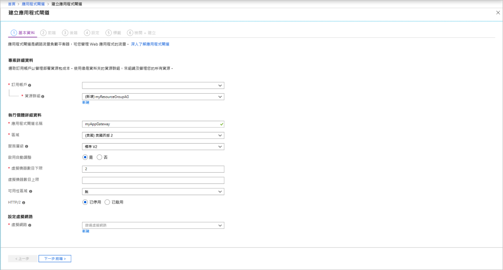

# <a name="tutorial-create-an-application-gateway-with-path-based-routing-rules-using-the-azure-portal"></a>教學課程：使用 Azure 入口網站建立包含 URL 路徑型路由規則的應用程式閘道

您可以使用 Azure 入口網站，在建立[應用程式閘道](application-gateway-introduction.md)時設定 [URL 路徑型路由規則](application-gateway-url-route-overview.md)。 在本教學課程中，您可以使用虛擬機器建立後端集區。 然後，您可以建立路由規則，確保 Web 流量會抵達集區中的適當伺服器。

在本文中，您將了解：

> [!div class="checklist"]
> * 建立應用程式閘道
> * 建立後端伺服器的虛擬機器
> * 建立包含後端伺服器的後端集區
> * 建立後端接聽程式
> * 建立路徑型路由規則


如果您沒有 Azure 訂用帳戶，請在開始前建立 [免費帳戶](https://azure.microsoft.com/free/?WT.mc_id=A261C142F) 。

[!INCLUDE [updated-for-az](../../includes/updated-for-az.md)]

## <a name="sign-in-to-azure"></a>登入 Azure

在 [https://portal.azure.com](https://portal.azure.com) 登入 Azure 入口網站

## <a name="create-virtual-machines"></a>建立虛擬機器

在此範例中，您要建立三個虛擬機器，作為應用程式閘道的後端伺服器。 您也可以在虛擬機器上安裝 IIS，以確認應用程式閘道如預期般運作。

1. 在 Azure 入口網站上，選取 [建立資源]  。
2. 選取 [熱門] 清單中的 [Windows Server 2016 Datacenter]  。
3. 針對虛擬機器，請輸入這些值：

    - 針對 [資源群組]  ，選取 [新建]  ，然後輸入 myResourceGroupAG  。
    - **虛擬機器名稱**：myVM1 
    - **區域**：(美國) 美國東部 
    - **使用者名稱**：azureuser 
    - **密碼**：*Azure123456!*


4. 選取 [下一步：磁碟]  。
5. 選取 [下一步: 網路功能]  。
6. 針對 [虛擬網路]  ，選取 [新建]  ，然後針對虛擬網路輸入這些值：

   - myVNet  - 作為虛擬網路的名稱。
   - 10.0.0.0/16  - 作為虛擬網路位址空間。
   - [myBackendSubnet]  作為第一個子網路名稱。
   - *10.0.1.0/24* - 作為子網路位址空間。
   - myAGSubnet  - 作為第二個子網路名稱。
   - 10.0.0.0/24  - 作為子網路位址空間。
7. 選取 [確定]  。

8. 確定在 [網路介面]  下，已針對子網選取 [myBackendSubnet]  ，然後選取 [下一步:  管理]。
9. 選取 [關閉]  來停用開機診斷。
10. 按遺下 [檢閱 + 建立]  ，檢閱 [摘要] 頁面上的設定，然後選取 [建立]  。
11. 建立兩部以上的虛擬機器：myVM2  和 myVM3  ，並將它們放在 MyVNet  虛擬網路和 myBackendSubnet 子網路  中。

### <a name="install-iis"></a>安裝 IIS

1. 開啟互動式殼層，並確定它是設定為 **PowerShell**。

    

2. 執行下列命令以在虛擬機器上安裝 IIS： 

    ```azurepowershell
         $publicSettings = @{ "fileUris" = (,"https://raw.githubusercontent.com/Azure/azure-docs-powershell-samples/master/application-gateway/iis/appgatewayurl.ps1");  "commandToExecute" = "powershell -ExecutionPolicy Unrestricted -File appgatewayurl.ps1" }

        Set-AzVMExtension `
         -ResourceGroupName myResourceGroupAG `
         -Location eastus `
         -ExtensionName IIS `
         -VMName myVM1 `
         -Publisher Microsoft.Compute `
         -ExtensionType CustomScriptExtension `
         -TypeHandlerVersion 1.4 `
         -Settings $publicSettings
    ```

3. 再多建立兩個虛擬機器，並使用您剛完成的步驟來安裝 IIS。 輸入 myVM2  和 myVM3  作為名稱，及作為 Set-AzVMExtension 中的 VMName 值。

## <a name="create-an-application-gateway"></a>建立應用程式閘道

1. 在 Azure 入口網站的左側功能表上選取 [建立資源]  。 [新增]  視窗隨即出現。

2. 在 [精選]  清單中選取 [網路]  ，然後選取 [應用程式閘道]  。

### <a name="basics-tab"></a>[基本] 索引標籤

1. 在 [基本]  索引標籤上，為下列應用程式閘道設定輸入這些值：

   - **資源群組**：選取 **myResourceGroupAG** 作為資源群組。
   - **應用程式閘道名稱**：輸入 myAppGateway  作為應用程式閘道的名稱。
   - **區域** - 選取 [(美國) 美國東部]  。

        

2.  在 [設定虛擬網路]  下，選取 [myVNet]  作為虛擬網路的名稱。
3. 選取 [myAGSubnet]  作為子網路。
3. 接受其他設定的預設值，然後選取 [下一步:  前端]。

### <a name="frontends-tab"></a>[前端] 索引標籤

1. 在 [前端]  索引標籤上，確認 [前端 IP 位址類型]  已被設為 [公用]  。

   > [!NOTE]
   > 對於應用程式閘道 v2 SKU，您只能選擇 [公用]  前端 IP 組態。 目前未針對此 v2 SKU 啟用私人前端 IP 設定。

2. 針對 [公用 IP 位址]  選擇 [新建]  ，然後針對公用 IP 位址名稱輸入 *myAGPublicIPAddress*，然後選取 [確定]  。 
3. 完成時，選取 [下一步:  後端]。

### <a name="backends-tab"></a>[後端] 索引標籤

後端集區用於將要求路由傳送至可為要求提供服務的後端伺服器。 後端集區可以包含 NIC、虛擬機器擴展集、公用 IP、內部 IP、完整的網域名稱 (FQDN)，以及如 Azure App Service 的多租用戶後端。

1. 在 [後端]  索引標籤上，選取 [+新增後端集區]  。

2. 在隨即開啟的 [新增後端集區]  視窗中，輸入下列值以建立空的後端集區：

    - **名稱**：輸入 *myBackendPool* 作為後端集區的名稱。
3. 在 [後端目標]  下，針對 [目標類型]  ，從下拉式清單中選取 [虛擬機器]  。

5. 在 [目標]  之下，選取用於 [myVM1]  的網路介面。
6. 選取 [新增]  。
7. 重複上述步驟，新增以 myVM2  作為目標的 *Images* 後端集區，以及以 myVM3  作為目標的 *Video* 後端集區。
8. 選取 [新增]  以儲存後端集區組態，並返回 [後端]  索引標籤。

4. 在 [後端]  索引標籤上，選取 [下一步:  設定]。

### <a name="configuration-tab"></a>組態索引標籤

在 [設定]  索引標籤上，您將會連線至您使用路由規則所建立的前端和後端集區。

1. 選取 [路由規則]  欄中的 [新增規則]  。

2. 在隨即開啟的 [新增路由規則]  視窗中，針對 [規則名稱]  輸入 *myRoutingRule*。

3. 路由規則需要接聽程式。 在 [新增路由規則]  視窗內的 [接聽程式]  索引標籤上，針對接聽程式輸入下列值：

    - **接聽程式名稱**：輸入 *myListener* 作為接聽程式的名稱。
    - **前端 IP**：選取 [公用]  以選擇您針對前端所建立的公用 IP。
    - **連接埠**：輸入 *8080*
  
        接受 [接聽程式]  索引標籤上其他設定的預設值，然後選取 [後端目標]  索引標籤以設定其餘的路由規則。

4. 在 [後端目標]  索引標籤上，針對 [後端目標]  選取 [myBackendPool]  。

5. 針對 [HTTP 設定]  ，選取 [新建]  以建立新的 HTTP 設定。 HTTP 設定將會決定路由規則的行為。 

6. 在隨即開啟的 [新增 HTTP 設定]  視窗中，針對 [HTTP 設定名稱]  輸入 *myHTTPSetting*。 接受 [新增 HTTP 設定]  視窗中其餘設定的預設值，然後選取 [新增]  以返回 [新增路由規則]  視窗。
7. 在 [路徑型路由]  底下，選取 [新增多個目標以建立路徑型規則]  。
8. 針對 [路徑]  ，輸入 */images/* \*。
9. 針對 [路徑規則名稱]  ，輸入 *Images*。
10. 針對 [HTTP 設定]  ，選取 [myHTTPSetting]  。
11. 針對 [後端目標]  ，選取 [影像]  。
12. 選取 [新增]  以儲存路徑規則，並返回 [新增路由規則]  索引標籤。
13. 重複上述步驟，針對影片新增另一個規則。
14. 選取 [新增]  以新增路由規則，並返回 [設定]  索引標籤。
15. 完成時，選取 [下一步:  標籤]，然後選取 [下一步:  檢閱 + 建立]。

> [!NOTE]
> 您不需要新增自訂 */* * 路徑規則來處理預設案例。 預設後端集區會自動處理這種情況。

### <a name="review--create-tab"></a>[檢閱 + 建立] 索引標籤

檢閱 [檢閱 + 建立]  索引標籤上的設定，然後選取 [建立]  以建立虛擬網路、公用 IP 位址和應用程式閘道。 Azure 建立應用程式閘道可能需要幾分鐘的時間。 請等候部署成功完成後，再繼續進行至下一節。


## <a name="test-the-application-gateway"></a>測試應用程式閘道

1. 選取 [所有資源]  ，然後選取 [myAppGateway]  。

    

2. 將公用 IP 位址複製並貼到您瀏覽器的網址列。 例如，http:\//52.188.72.175:8080。

    

   連接埠 8080 上的接聽程式會將此要求路由傳送至預設後端集區。

3. 將 URL 變更為 *http://&lt;ip-address&gt;:8080/images/test.htm*，將 &lt;ip-address&gt; 取代為您的 IP 位址，然後您會看到類似下列的範例：

    

   連接埠 8080 上的接聽程式會將此要求路由傳送至 [Images]  後端集區。

4. 將 URL 變更為 *http://&lt;ip-address&gt;:8080/video/test.htm*，將 &lt;ip-address&gt; 取代為您的 IP 位址，然後您會看到類似下列的範例：

    

   連接埠 8080 上的接聽程式會將此要求路由傳送至 [Video]  後端集區。


## <a name="next-steps"></a>後續步驟

- [在 Azure 應用程式閘道上啟用端對端 SSL](application-gateway-backend-ssl.md)
