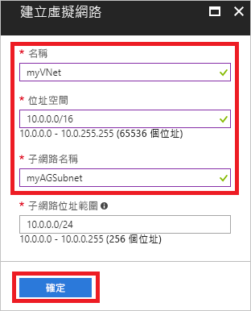
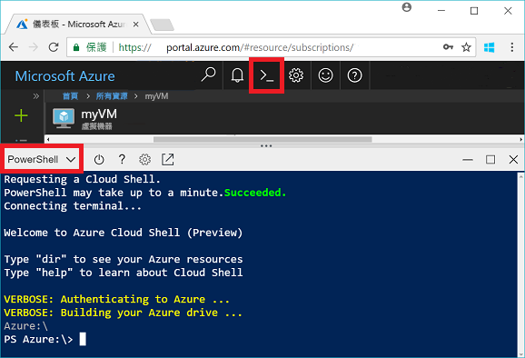
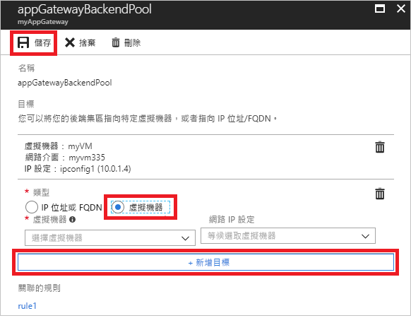
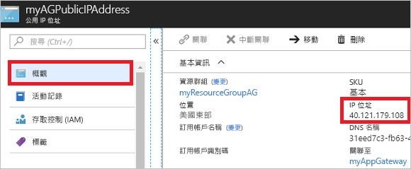

# <a name="quickstart-direct-web-traffic-with-azure-application-gateway---azure-portal"></a>快速入門：使用 Azure 應用程式閘道引導網路流量 - Azure 入口網站

您可以使用 Azure 應用程式閘道，將接聽程式指派給連接埠、建立規則以及將資源新增至後端集區，來將應用程式網路流量導向至特定資源。

本快速入門示範如何使用 Azure 入口網站，快速建立在其後端集區中具有兩部虛擬機器的應用程式閘道。 然後進行測試以確定它正常運作。

如果您沒有 Azure 訂用帳戶，請在開始前建立 [免費帳戶](https://azure.microsoft.com/free/?WT.mc_id=A261C142F) 。

## <a name="log-in-to-azure"></a>登入 Azure

在 [http://portal.azure.com](http://portal.azure.com) 上登入 Azure 入口網站

## <a name="create-an-application-gateway"></a>建立應用程式閘道

您必須為應用程式閘道建立虛擬網路，應用程式閘道才能與其他資源通訊。 您建立應用程式閘道時，可以同時建立虛擬網路。 這個範例中會建立兩個子網路：一個用於應用程式閘道，另一個用於虛擬機器。 

1. 按一下 Azure 入口網站左上角的 [建立資源]。
2. 在 [精選] 清單中選取 [網路]，然後選取 [應用程式閘道]。
3. 針對應用程式閘道輸入這些值：

    - myAppGateway - 作為應用程式閘道的名稱。
    - myResourceGroupAG - 作為新資源群組。

    

4. 接受其他設定的預設值，然後按一下 [確定]。
5. 按一下 [選擇虛擬網路]  >  [新建]，然後針對虛擬網路輸入這些值：

    - myVNet - 作為虛擬網路的名稱。
    - 10.0.0.0/16 - 作為虛擬網路位址空間。
    - myAGSubnet - 作為子網路名稱。
    - 10.0.0.0/24 - 作為子網路位址空間。

    

6. 按一下 [確定] 以建立虛擬網路和子網路。
6. 按一下 [選擇公用 IP 位址]  >  [新建]，然後輸入公用 IP 位址的名稱。 在此範例中，公用 IP 位址名為 myAGPublicIPAddress。 接受其他設定的預設值，然後按一下 [確定]。
8. 接受接聽程式組態的預設值，將 Web 應用程式防火牆保持為停用，然後按一下 [確定]。
9. 檢閱 [摘要] 分頁上的設定，然後按一下 [確定] 以建立網路資源、公用 IP 位址和應用程式閘道。 建立應用程式閘道最多需要 30 分鐘，請等候部署成功完成後，再繼續進行至下一節。

### <a name="add-a-subnet"></a>新增子網路

1. 按一下左側功能表中的 [所有資源]，然後從 [資源] 清單中按一下 [myVNet]。
2. 按一下 [子網路]  >  [子網路]。

    

3. 輸入 myBackendSubnet 作為子網路的名稱，然後按一下 [確定]。

## <a name="create-backend-servers"></a>建立後端伺服器

在此範例中，您要建立兩個虛擬機器，作為應用程式閘道的後端伺服器。 

### <a name="create-a-virtual-machine"></a>建立虛擬機器

1. 按一下 [新增] 。
2. 選取 [計算]，然後選取 [精選] 清單中的 [Windows Server 2016 Datacenter]。
3. 針對虛擬機器，請輸入這些值：

    - myVM - 作為虛擬機器的名稱。
    - azureuser - 作為系統管理員使用者名稱。
    - *Azure123456!* 作為密碼。
    - 選取 [使用現有的]，然後選取 [myResourceGroupAG]。

4. 按一下 [確定]。
5. 選取 [DS1_V2] 作為虛擬機器的大小，然後按一下 [選取]。
6. 確定您已選取 [myVNet] 作為虛擬網路，而且子網路是 [myBackendSubnet]。 
7. 按一下 [停用] 來停用開機診斷。
8. 按一下 [確定]，檢閱 [摘要] 頁面上的設定，然後按一下 [建立]。

### <a name="install-iis"></a>安裝 IIS

您可以在虛擬機器上安裝 IIS，以確認成功建立應用程式閘道。

1. 開啟互動式殼層，並確定它是設定為 **PowerShell**。

    

2. 執行下列命令以在虛擬機器上安裝 IIS： 

    ```azurepowershell-interactive
    Set-AzureRmVMExtension `
      -ResourceGroupName myResourceGroupAG `
      -ExtensionName IIS `
      -VMName myVM `
      -Publisher Microsoft.Compute `
      -ExtensionType CustomScriptExtension `
      -TypeHandlerVersion 1.4 `
      -SettingString '{"commandToExecute":"powershell Add-WindowsFeature Web-Server; powershell Add-Content -Path \"C:\\inetpub\\wwwroot\\Default.htm\" -Value $($env:computername)"}' `
      -Location EastUS
    ```

3. 建立第二個虛擬機器，並使用您剛完成的步驟來安裝 IIS。 輸入 myVM2 作為其名稱，及作為 Set-AzureRmVMExtension 中的 VMName。

### <a name="add-backend-servers"></a>新增後端伺服器

建立虛擬機器之後，您需要將它們新增到應用程式閘道中的後端集區。

1. 按一下 [所有資源]  >  [myAppGateway]。
2. 按一下 [後端集區]。 已自動建立具有應用程式閘道的預設集區。 按一下 [appGatewayBackendPool]。
3. 按一下 [新增目標]  >  [虛擬機器]，然後選取 [myVM]。 選取 [新增目標]  >  [虛擬機器]，然後選取 [myVM2]。

    

4. 按一下 [檔案] 。

## <a name="test-the-application-gateway"></a>測試應用程式閘道

安裝 IIS 不是建立應用程式閘道的必要條件，但是在本快速入門中，您已安裝 IIS 來確認應用程式閘道是否已成功建立。

1. 在 [概觀] 畫面上尋找應用程式閘道的公用 IP 位址。 按一下 [所有資源]  >  [myAGPublicIPAddress]。

    

2. 將公用 IP 位址複製並貼到您瀏覽器的網址列。

    

當您重新整理瀏覽器時，您應該會看到其他虛擬機器的名稱出現。

## <a name="clean-up-resources"></a>清除資源

首先探索使用應用程式閘道建立的資源，之後若不再需要，您可以刪除資源群組、應用程式閘道和所有相關資源。 若要這樣做，請選取包含應用程式閘道的資源群組，然後按一下 [刪除]。

## <a name="next-steps"></a>後續步驟

> [!div class="nextstepaction"]
> [使用 Azure CLI 以應用程式閘道管理網路流量](./tutorial-manage-web-traffic-cli.md)
