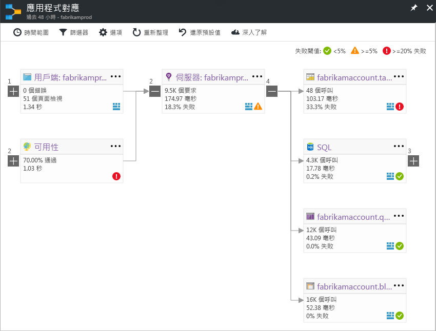

# 應用程式對應：對分散式應用程式進行分級
應用程式對應可協助您找出分散式應用程式所有元件的效能瓶頸或失敗熱點。 對應上的每個節點各代表應用程式元件或其相依性；並具有健康情況 KPI 和警示狀態。 您可以從任何元件逐一點選至更詳細的診斷，例如 Application Insights 事件。 如果您的應用程式使用 Azure 服務，您也可以逐一點選 Azure 診斷，例如 SQL 資料庫建議程式的建議。

## 什麼是元件？

元件是分散式/微服務應用程式中可獨立部署的組件。 開發人員和作業小組能在程式碼層級檢視或存取這些應用程式元件所產生的遙測資料。 

* 元件不同於 SQL、EventHub 等小組/組織可能無法存取的「可觀察」外部相依性 (程式碼或遙測資料)。
* 元件能在任何數量的伺服器/角色/容器執行個體上執行。
* 元件可以是不同的 Application Insights 檢測金鑰 (即使訂用帳戶不同)，也可以是回報給單一 Application Insights 檢測金鑰的不同角色。 預覽對應體驗會顯示元件 (不論元件的設定方式為何)。

## 複合應用程式對應 (預覽)
*這是早期預覽，我們將會在此對應中新增更多功能。歡迎您提出有關新體驗的意見反應。您可以輕鬆地在預覽和傳統體驗之間進行切換。*

請從[預覽清單](app-insights-previews.md)啟用「複合應用程式對應」，或按一下右上角開關中的 [預覽對應]。 若要切換回傳統體驗，請使用此開關。

>[!Note]
此預覽會取代先前的「多角色應用程式對應」預覽。 目前，請使用此預覽來檢視跨應用程式元件相依性多個層級的完整拓撲。 請提供您的意見反應，我們將會新增更多和傳統對應所支援功能類似的功能。

您可以查看跨相關應用程式元件多個層級的完整應用程式拓撲。 元件可以是不同的 Application Insights 資源，或是單一資源中的不同角色。 應用程式對應會尋找元件，方法是遵循已安裝 Application Insights SDK 之伺服器之間所發出的 HTTP 相依性呼叫。 

這項體驗一開始會漸進地探索元件。 首次載入預覽時會觸發一組查詢，以探索與此元件相關的元件。 在探索到應用程式中的元件時，左上角的按鈕會依探索到的元件數目進行更新。 

當您按一下 [更新對應元件] 時，系統便會使用目前為止所探索的所有元件來重新整理對應。

如果所有元件都是單一 Application Insights 資源內的角色，則不需要進行此探索步驟。 這類應用程式一開始會載入所有元件。

新體驗的重要目標之一，是要能夠以視覺化方式顯示含有數百個元件的複雜拓撲。 新體驗支援縮放，並可在放大時新增詳細資料。 您可以縮小以便速覽多個元件，而且仍可找出具有較高失敗率的元件。 

按一下任何元件，即可查看相關深入資訊，並前往該元件的效能和失敗分級體驗。

## 傳統應用程式對應

此對應會顯示︰

* 可用性集合
* 用戶端元件 (使用 JavaScript SDK 監視)
* 伺服器端元件
* 用戶端和伺服器元件的相依性

您可以展開與摺疊相依性連結群組︰

如果您有某種類型 (SQL、HTTP 等) 的許多相依性，它們可能會以群組方式出現。 

## 找出問題
每個節點都有相關的效能指標，例如該元件的負載、效能和失敗率。 

警告圖示會點出可能的問題。 橘色的警告表示要求、頁面檢視或相依性呼叫發生失敗。 紅色表示失敗率大於 5 %。 如果您想要調整這些閾值，請開啟 [選項]。

也會出現作用中警示︰ 

如果您使用 SQL Azure，當系統有如何改善效能的建議時，便會出現圖示。 

按一下任何圖示即可取得詳細資料：

## 診斷點選連結
對應上的每個節點都會提供以診斷做為目標的點選連結。 這些選項會隨節點類型而有所不同。

對於裝載在 Azure 中的元件，這些選項包括元件的直接連結。

## 篩選和時間範圍
根據預設，對應中會摘要列出選定時間範圍內的所有可用資料。 但是，您可以透過篩選，使其只包含特定作業名稱或相依性。

* 作業名稱︰這包括頁面檢視和伺服器端要求類型。 使用此選項時，對應中只會顯示伺服器端/用戶端節點上所選作業的 KPI。 它會顯示在這些特定作業內容中呼叫的相依性。
* 相依性基底名稱︰這包括 AJAX 瀏覽器相依性和伺服器端相依性。 如果您使用 TrackDependency API 來報告自訂相依性遙測，這些資料也會在此出現。 您可以選取要顯示在對應中的相依性。 此選取項目目前不會篩選伺服器端要求或用戶端頁面檢視。

## 儲存篩選
若要儲存您已套用的篩選，請將篩選後的檢視釘選到 [儀表板](app-insights-dashboards.md)。

## 錯誤窗格
當您按一下對應中的節點時，會在右側顯示錯誤窗格，將該節點的失敗進行彙總。 失敗會先依作業識別碼群組，然後再依問題識別碼群組。

按一下失敗可前往該失敗的最新範例。

## 資源健康情況
對於某些資源類型，資源健康狀態會顯示在 [錯誤] 窗格的頂端。 例如，按一下 SQL 節點會顯示資料庫的健康狀態和所發出的任何警示。

您可以按一下資源名稱來檢視該資源的標準概觀計量。

## 影片

> [!VIDEO https://channel9.msdn.com/events/Connect/2016/112/player] 

## 意見反應
請透過入口網站的意見反應選項提供意見反應。

## 後續步驟

* [Azure 入口網站](https://portal.azure.com)
