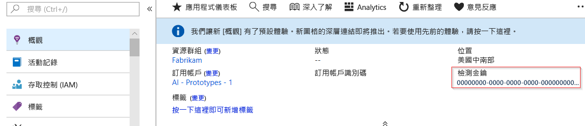
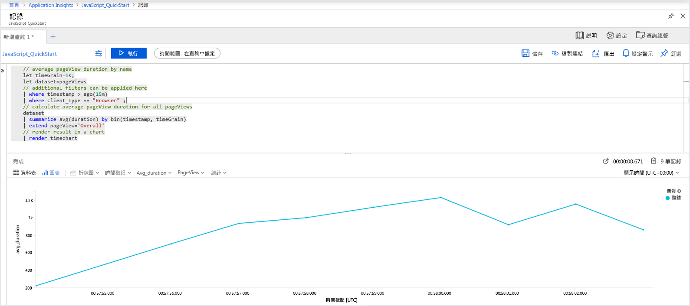
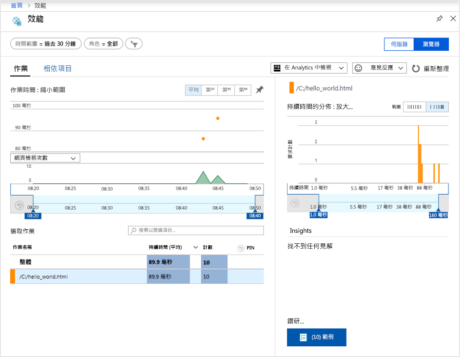
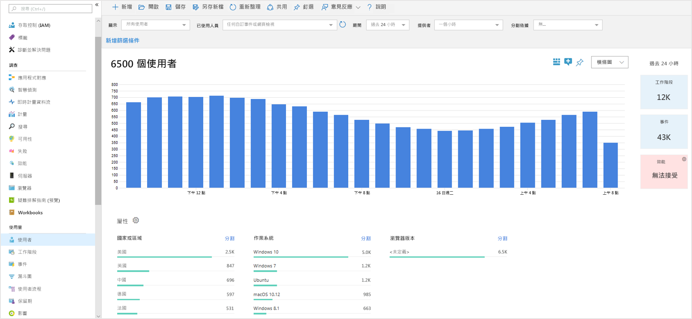
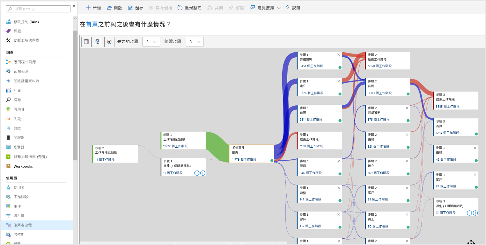

# <a name="start-monitoring-your-website"></a>開始監視您的網站

Azure Monitor Application Insights 可讓您輕鬆監視網站的可用性、效能和使用情形。 還可讓您快速識別並診斷應用程式的錯誤，不必等使用者回報。 Application Insights 提供伺服器端監視功能，以及用戶端/瀏覽器端監視功能。

本快速入門引導您新增[開放原始碼 Application Insight JavaScript SDK](https://github.com/Microsoft/ApplicationInsights-JS)，讓您了解您網站訪客的用戶端/瀏覽器端體驗。

## <a name="prerequisites"></a>必要條件

若要完成本快速入門：

- 您需要 Azure 訂用帳戶。

如果您沒有 Azure 訂用帳戶，請在開始前建立[免費帳戶](https://azure.microsoft.com/free/)。

## <a name="sign-in-to-the-azure-portal"></a>登入 Azure 入口網站

登入 [Azure 入口網站](https://portal.azure.com/)。

## <a name="enable-application-insights"></a>啟用 Application Insights

Application Insights 可以從任何連上網際網路的應用程式 (不論是在內部部署環境或雲端執行) 收集遙測資料。 請使用下列步驟來開始檢視此資料。

1. 選取 [建立資源] > [管理工具] > [Application Insights]。

   設定方塊隨即出現，請使用下表來填寫輸入欄位。

    | 設定        | 值           | 說明  |
   | ------------- |:-------------|:-----|
   | **名稱**      | 通用唯一值 | 此名稱可識別您要監視的應用程式 |
   | **應用程式類型** | 一般應用程式 | 您要監視的應用程式類型 |
   | **資源群組**     | myResourceGroup      | 用於裝載 App Insights 資料之新資源群組的名稱 |
   | **位置** | 美國東部 | 選擇您附近或接近應用程式裝載位置的地點 |

2. 按一下頁面底部的 [新增] 。

## <a name="create-an-html-file"></a>建立 HTML 檔案

1. 在本機電腦上，建立名為 ``hello_world.html`` 的檔案。 在此範例中，該檔案會放在 C: 磁碟機的根目錄 ``C:\hello_world.html``。
2. 將以下指令碼複製到 ``hello_world.html``：

    ```html
    <!DOCTYPE html>
    <html>
    <head>
    <title>Azure Monitor Application Insights</title>
    </head>
    <body>
    <h1>Azure Monitor Application Insights Hello World!</h1>
    <p>You can use the Application Insights JavaScript SDK to perform client/browser-side monitoring of your website. To learn about more advanced JavaScript SDK configurations visit the <a href="https://github.com/Microsoft/ApplicationInsights-JS/blob/master/API-reference.md" title="API Reference">API reference</a>.</p>
    </body>
    </html>
    ```

## <a name="configure-app-insights-sdk"></a>設定 App Insights SDK

1. 選取 [概觀] > **[程式集]** > 複製應用程式的 [檢測金鑰]。

   

2. 將下列指令碼新增到 ``hello_world.html`` 中右邊 ``</head>`` 標記之前：

   ```javascript
      <script type="text/javascript">
        var appInsights=window.appInsights||function(a){
            function b(a){c[a]=function(){var b=arguments;c.queue.push(function(){c[a].apply(c,b)})}}var c={config:a},d=document,e=window;setTimeout(function(){var b=d.createElement("script");b.src=a.url||"https://az416426.vo.msecnd.net/scripts/a/ai.0.js",d.getElementsByTagName("script")[0].parentNode.appendChild(b)});try{c.cookie=d.cookie}catch(a){}c.queue=[];for(var f=["Event","Exception","Metric","PageView","Trace","Dependency"];f.length;)b("track"+f.pop());if(b("setAuthenticatedUserContext"),b("clearAuthenticatedUserContext"),b("startTrackEvent"),b("stopTrackEvent"),b("startTrackPage"),b("stopTrackPage"),b("flush"),!a.disableExceptionTracking){f="onerror",b("_"+f);var g=e[f];e[f]=function(a,b,d,e,h){var i=g&&g(a,b,d,e,h);return!0!==i&&c["_"+f](a,b,d,e,h),i}}return c
        }({
            instrumentationKey: "xxxxxxxx-xxxx-xxxx-xxxx-xxxxxxxx"
        });
        
        window.appInsights=appInsights,appInsights.queue&&0===appInsights.queue.length&&appInsights.trackPageView();
</script>
   ```

3. 編輯 ``hello_world.html`` 檔案並新增檢測金鑰。

4. 在本機瀏覽器工作階段中開啟 ``hello_world.html``。 這會建立單一頁面檢視。 您可以重新整理您的瀏覽器，以產生多個測試頁面檢視。

## <a name="start-monitoring-in-the-azure-portal"></a>在 Azure 入口網站中開始監視

1. 現在，您可以在 Azure 入口網站中重新開啟 Application Insights [概觀] 頁面 (您先前在此擷取檢測金鑰)，以檢視目前執行中應用程式的詳細資料。 概觀頁面上的四個預設圖表都只限於伺服器端應用程式資料。 因為我們會檢測用戶端/瀏覽器端與 JavaScript SDK 的互動，所以此特定檢視就不適用，除非我們也安裝了用戶端 SDK。

2. 按一下  **Analytics**。  這會開啟 **Analytics**，它可提供一種豐富查詢語言，可用於分析 Application Insights 收集的所有資料。 若要檢視用戶端瀏覽器要求相關資料，請執行下列查詢：

    ```kusto
    // average pageView duration by name
    let timeGrain=1s;
    let dataset=pageViews
    // additional filters can be applied here
    | where timestamp > ago(15m)
    | where client_Type == "Browser" ;
    // calculate average pageView duration for all pageViews
    dataset
    | summarize avg(duration) by bin(timestamp, timeGrain)
    | extend pageView='Overall'
    // render result in a chart
    | render timechart
    ```

   

3. 請返回 [概觀] 頁面。 按一下 [調查] 標頭底下的 [瀏覽器]，然後選取 [效能]。您會在此找到您的網站效能相關計量。 另外還有對應的檢視，可供分析網站的失敗和例外狀況。 您可以按一下 [範例] 向下鑽研個別的交易詳細資料。 您可以從這裡存取[端對端交易詳細資料](app-insights-transaction-diagnostics.md)體驗。

   

4. 若要開始探索[使用者行為分析工具](app-insights-usage-overview.md)，請從主要 Application Insights 功能表，選取 [使用量] 標頭下的[**使用者**](app-insights-usage-segmentation.md)。 因為我們會從單一機器進行測試，所以只會看到一位使用者的資料。 對於即時網站，使用者的分布情形可能如下所示：

     

5. 如果已檢測了具有多重頁面的更複雜網站，另一個實用工具為[**使用者流程**](app-insights-usage-flows.md)。 您可以透過 [使用者流程]，追蹤訪客造訪您網站各個部分的路徑。

  

若要深入了解用於監視網站的進階組態，請參閱 [JavaScript SDK API 參考](https://github.com/Microsoft/ApplicationInsights-JS/blob/master/API-reference.md)。

## <a name="clean-up-resources"></a>清除資源

如果您打算繼續進行後續的快速入門或教學課程，請勿清除在此快速入門中建立的資源。 否則，如果您不打算繼續，請使用下列步驟，在 Azure 入口網站中刪除本快速入門所建立的所有資源。

1. 從 Azure 入口網站的左側功能表中，依序按一下 [資源群組] 和 [myResourceGroup]。
2. 在資源群組頁面上，按一下 [刪除]，在文字方塊中輸入 **myResourceGroup**，然後按一下 [刪除]。

## <a name="next-steps"></a>後續步驟

> [!div class="nextstepaction"]
> [尋找並診斷效能問題](https://docs.microsoft.com/azure/application-insights/app-insights-analytics)
