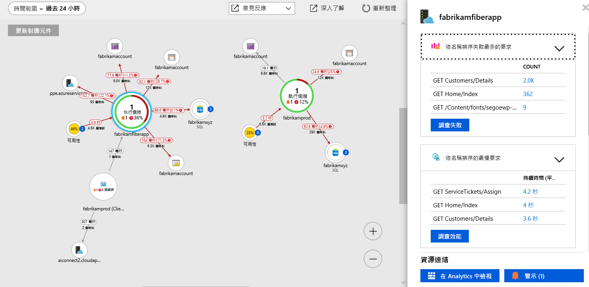

# <a name="collect-distributed-traces-from-python-preview"></a>從 Python 收集分散式追蹤 (預覽)

透過整合 [OpenCensus](https://opencensus.io) 與新的[本機轉送工具](./opencensus-local-forwarder.md)，Application Insights 現在支援 Python 應用程式的分散式追蹤。 本文將逐步引導您完成程序，以設定適用於 Python 的 OpenCensus，以及將追蹤資料傳入 Application Insights。

## <a name="prerequisites"></a>必要條件

- 您需要 Azure 訂用帳戶。
- 應該安裝 Python，本文使用 [Python 3.7.0](https://www.python.org/downloads/)，但舊版可能只需要稍微調整即可運作。
- 請遵循下列指示來安裝[本機轉送工具作為 Windows 服務](./opencensus-local-forwarder.md#windows-service)

如果您沒有 Azure 訂用帳戶，請在開始前建立[免費帳戶](https://azure.microsoft.com/free/)。

## <a name="sign-in-to-the-azure-portal"></a>登入 Azure 入口網站

登入 [Azure 入口網站](https://portal.azure.com/)。

## <a name="create-application-insights-resource"></a>建立 Application Insights 資源

首先，您必須建立會產生檢測金鑰 (ikey) 的 Application Insights 資源。 接著，ikey 會用來設定本機轉送工具，將分散式追蹤從 OpenCensus 所檢測的應用程式傳送到 Application Insights。   

1. 選取 [建立資源] > [開發人員工具] > [Application Insights]。

   

   設定方塊隨即出現，請使用下表來填寫輸入欄位。

    | 設定        | 值           | 說明  |
   | ------------- |:-------------|:-----|
   | **名稱**      | 通用唯一值 | 此名稱可識別您要監視的應用程式 |
   | **應用程式類型** | 一般 | 您要監視的應用程式類型 |
   | **資源群組**     | myResourceGroup      | 用於裝載 App Insights 資料之新資源群組的名稱 |
   | **位置** | 美國東部 | 選擇您附近或接近應用程式裝載位置的地點 |

2. 按一下頁面底部的 [新增] 。

## <a name="configure-local-forwarder"></a>設定本機轉送工具

1. 選取 [概觀] > **[程式集]** > 複製應用程式的 [檢測金鑰]。

   

2. 編輯 `LocalForwarder.config` 檔案並新增檢測金鑰。 如果您遵循了[必要條件](./opencensus-local-forwarder.md#windows-service)中的指示，檔案會位於 `C:\LF-WindowsServiceHost`

    ```xml
      <OpenCensusToApplicationInsights>
        <!--
          Instrumentation key to track telemetry to.
          -->
        <InstrumentationKey>{enter-instrumentation-key}</InstrumentationKey>
      </OpenCensusToApplicationInsights>
    
      <!-- Describes aspects of processing Application Insights telemetry-->
      <ApplicationInsights>
        <LiveMetricsStreamInstrumentationKey>{enter-instrumentation-key}</LiveMetricsStreamInstrumentationKey>
      </ApplicationInsights>
    </LocalForwarderConfiguration>
    ```

3. 重新啟動應用程式的**本機轉送工具**服務。

## <a name="opencensus-python-package"></a>OpenCensus Python 套件

1. 從命令列中使用 pip 或 pipenv，安裝適用於 Python 的 OpenCensus 套件：

    ```python
    python -m pip install opencensus
    # pip env install opencensus
    ```

    > [!NOTE]
    > `python -m pip install opencensus` 假設您已設定 Python 安裝的 PATH 環境變數。 如果您尚未設定此變數，則可能需要提供 Python 可執行檔所在的完整目錄路徑，其會造成如下命令：`C:\Users\Administrator\AppData\Local\Programs\Python\Python37-32\python.exe -m pip install opencensus`。

2. 首先，讓我們在本機產生一些追蹤資料。 在 Python IDLE 或您選擇的編輯器中，輸入下列程式碼：

    ```python
    from opencensus.trace.tracer import Tracer
    
    def main():
        while True:
            valuePrompt()
    
    def valuePrompt():
        tracer = Tracer()
        with tracer.span(name="test") as span:
            line = input("Enter a value: ")
            print(line)
    
    if __name__ == "__main__":
        main()
    
    ```

3. 執行程式碼會重複提示您輸入值。 隨著每次輸入，值會列印至殼層，並由 OpenCensus Python 模組產生對應的 **SpanData**。 OpenCensus 專案會[_將追蹤定義為範圍樹狀結構_](https://opencensus.io/core-concepts/tracing/)。
    
    ```python
    Enter a value: 4
    4
    [SpanData(name='test', context=SpanContext(trace_id=1f07f062ac394c50925f2ae61e635e14, span_id=None, trace_options=TraceOptions(enabled=True), tracestate=None), span_id='5c17a4ad6ba14299', parent_span_id=None, attributes={}, start_time='2018-09-15T20:42:15.847292Z', end_time='2018-09-15T20:42:17.615664Z', child_span_count=0, stack_trace=None, time_events=[], links=[], status=None, same_process_as_parent_span=None, span_kind=0)]
    Enter a value: 25
    25
    [SpanData(name='test', context=SpanContext(trace_id=c71b4e88a22a495da61df52ce3eee3e1, span_id=None, trace_options=TraceOptions(enabled=True), tracestate=None), span_id='51547c0af5f046eb', parent_span_id=None, attributes={}, start_time='2018-09-15T20:42:17.615664Z', end_time='2018-09-15T20:48:11.160314Z', child_span_count=0, stack_trace=None, time_events=[], links=[], status=None, same_process_as_parent_span=None, span_kind=0)]
    Enter a value: 100
    100
    [SpanData(name='test', context=SpanContext(trace_id=b4cdcc9e6df44a8fbb6e8ddeccc1351c, span_id=None, trace_options=TraceOptions(enabled=True), tracestate=None), span_id='f2caacf7892744d1', parent_span_id=None, attributes={}, start_time='2018-09-15T20:48:11.175931Z', end_time='2018-09-15T20:48:12.629178Z', child_span_count=0, stack_trace=None, time_events=[], links=[], status=None, same_process_as_parent_span=None, span_kind=0)]
    ```

4. 這麼做雖有助於示範，但最終我們想要的 SpanData 發出方式，是要讓其可由**本機轉送工具服務**挑選出來，再傳送至 Application Insights。 將上一個步驟的程式碼修改如下：

    ```python
    from opencensus.trace.tracer import Tracer
    from opencensus.trace import config_integration
    from opencensus.trace.exporters.ocagent import trace_exporter
    from opencensus.trace import tracer as tracer_module
    
    import os
    
    def main():        
        while True:
            valuePrompt()
    
    def valuePrompt():
        export_LocalForwarder = trace_exporter.TraceExporter(
        service_name=os.getenv('SERVICE_NAME', 'python-service'),
        endpoint=os.getenv('OCAGENT_TRACE_EXPORTER_ENDPOINT'))
        
        tracer = Tracer(exporter=export_LocalForwarder)
        with tracer.span(name="test") as span:
            line = input("Enter a value: ")
            print(line)
    
    if __name__ == "__main__":
        main()
    ```

5. 如果您儲存並嘗試執行上述模組，可能會收到 `grpc` 的 `ModuleNotFoundError`。 如果發生這種情況，請執行下列命令來安裝 [grpcio 套件](https://pypi.org/project/grpcio/)：

    ```
    python -m pip install grpcio
    ```

6. 現在當您執行上述的 Python 指令碼時，系統應該仍會提示您輸入值，但現在只有值會列印在殼層中。

7. 若要確認**本機轉送工具**會挑出追蹤，請檢查 `LocalForwarder.config` 檔案。 如果您遵循了[必要條件](https://docs.microsoft.com/azure/application-insights/local-forwarder#windows-service)中的步驟，該檔案會位於 `C:\LF-WindowsServiceHost`。

    在下列記錄檔影像中，您可以看到在執行第二個指令碼 (我們在此新增了匯出工具) 之前，`OpenCensus input BatchesReceived` 為 0。 一旦我們開始執行更新後的指令碼，遞增的 `BatchesReceived` 就等於我們所輸入數量的值：
    
    

## <a name="start-monitoring-in-the-azure-portal"></a>在 Azure 入口網站中開始監視

1. 現在，您可以在 Azure 入口網站中重新開啟 Application Insights 的 [概觀] 頁面，以檢視目前執行中應用程式的詳細資料。 選取 [即時計量串流]。

   ![紅色方塊中選取了 [即時計量串流] 的 [概觀] 窗格螢幕擷取畫面](./media/opencensus-python/0005-overview-live-metrics-stream.png)

2. 如果您再次執行第二個 Python 指令碼並開始輸入值，則當即時追蹤資料從本機轉送工具服務抵達 Application Insights 時，您便會看到該資料。

   

3. 瀏覽回到 [概觀] 頁面，然後選取 [應用程式對應]，以顯示應用程式元件之間相依性關係和呼叫計時的視覺化配置。

    

    因為我們只追蹤一個方法呼叫，所以應用程式對應並不有趣。 但是，應用程式對應經過調整後，即可顯示更多的分散式應用程式：

   

4. 選取 [調查效能] 以執行詳細的效能分析，並判斷效能緩慢的根本原因。

    

5. 選取 [範例]，然後按一下出現在右窗格中的任何範例，就會啟動端對端交易詳細資料體驗。 儘管應用程式範例只會向我們顯示單一事件，但更複雜的應用程式將可讓您瀏覽到個別事件呼叫堆疊層級的端對端交易。

     

## <a name="opencensus-trace-for-python"></a>適用於 Python 的 OpenCensus 追蹤

我們只說明了使用本機轉送工具和 Application Insights 來接通「適用於 Python 的 OpenCensus」的基本概念。 官方使用指引會說明更進階的主題，例如：

* [取樣器](https://opencensus.io/api/python/trace/usage.html#samplers)
* [Flask 整合](https://opencensus.io/api/python/trace/usage.html#flask)
* [Django 整合](https://opencensus.io/api/python/trace/usage.html#django)
* [MySQL 整合](https://opencensus.io/api/python/trace/usage.html#service-integration)
* [PostgreSQL](https://opencensus.io/api/python/trace/usage.html#postgresql)
  
## <a name="next-steps"></a>後續步驟

* [OpenCensus Python 使用指南](https://opencensus.io/api/python/trace/usage.html)
* [應用程式對應](./app-insights-app-map.md)
* [端對端效能監視](./app-insights-tutorial-performance.md)