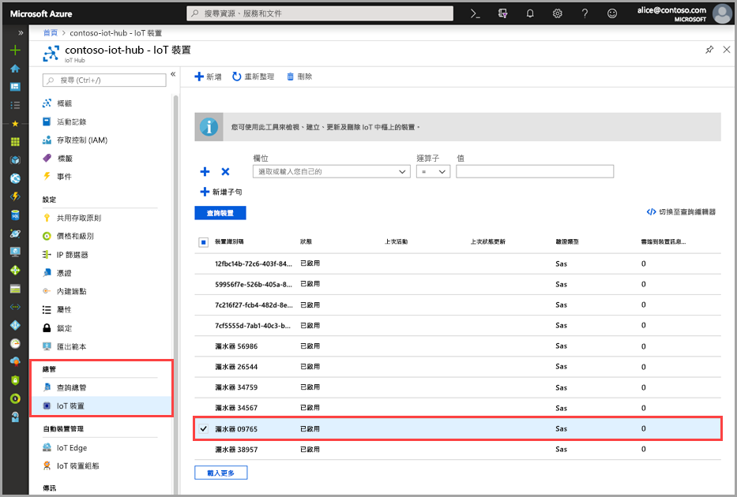
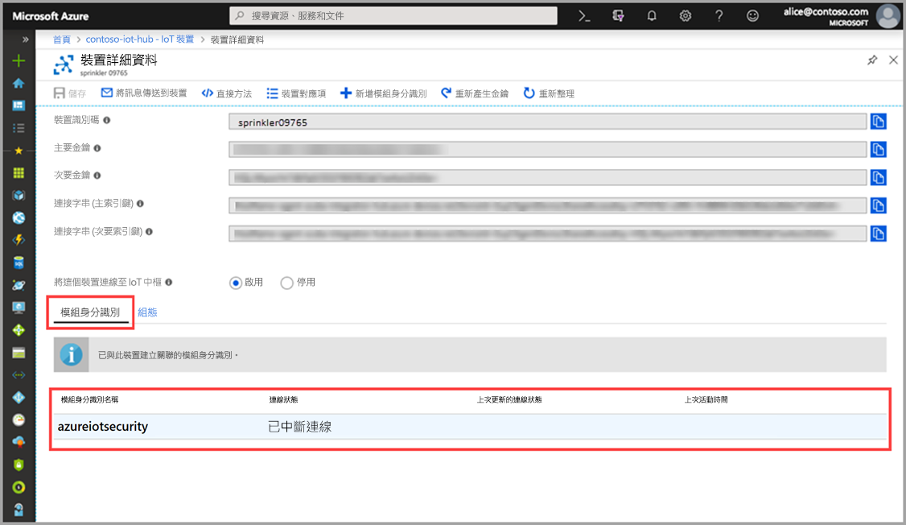

# 快速入門：建立 azureiotsecurity 模組對應項

本快速入門說明如何為新的裝置建立個別的 azureiotsecurity  模組對應項，或是如何為 IoT 中樞內的所有裝置批次建立模組對應項。  

## 了解 azureiotsecurity 模組對應項 

對 Azure 內所建置的 IoT 解決方案來說，裝置對應項在裝置管理和程序自動化中同時扮演重要的角色。 

適用於 IoT 的 Azure 資訊安全中心可與您現有的 IoT 裝置管理平台完全整合，讓您能夠管理裝置的安全性狀態，以及利用現有的裝置控制功能。
利用 IoT 中樞的對應項機制，即可實現適用於 IoT 的 Azure 資訊安全中心整合。  

若要深入了解 Azure IoT 中樞內模組對應項的一般概念，請參閱 [IoT 中樞模組對應項](https://docs.microsoft.com/azure/iot-hub/iot-hub-devguide-module-twins)。 
 
適用於 IoT 的 Azure 資訊安全中心會利用模組對應項機制，並為您的每個裝置保留名為 azureiotsecurity  的安全性模組對應項。

安全性模組對應項會保存與每個裝置的裝置安全性相關的所有資訊。 
 
若要充分利用適用於 IoT 的 Azure 資訊安全中心功能，您必須在服務中為每個裝置建立、設定和使用這些安全性模組對應項。  

## 建立 azureiotsecurity 模組對應項 

_azureiotsecurity_ 模組對應項可透過兩種方式來建立：
1. [模組批次指令碼](https://aka.ms/iot-security-github-create-module) - 會自動使用預設組態為新裝置或沒有模組對應項的裝置建立模組對應項。
2. 以手動方式使用特定組態為每個裝置個別編輯每個模組對應項。

>[!NOTE] 
> 使用批次方法並不會覆寫現有的 azureiotsecurity 模組對應項。 使用批次方法「只會」為還沒有安全性模組對應項的裝置建立新的模組對應項。 

若要了解如何修改或變更現有模組對應項的組態，請參閱[代理程式組態](how-to-agent-configuration.md)。 

若要手動為裝置建立新的 azureiotsecurity  模組對應項，請使用下列指示： 

1. 在 IoT 中樞內，找出並選取您想要為其建立安全性模組對應項的裝置。
1. 按一下裝置，然後按一下 [新增模組 ID]  。
1. 在 [模組 ID 名稱]  欄位中，輸入 **azureiotsecurity**。

1. 按一下 [檔案]  。 

## 確認模組對應項的建立

若要確認特定裝置是否已有安全性模組對應項：

1. 在 Azure IoT 中樞內，從 [總管]  功能表選取 [IoT 裝置]  。    
1. 輸入裝置識別碼，或選取 [查詢裝置欄位]  中的選項，然後按一下 [查詢裝置]  。 
    
1. 選取該裝置，或對其按兩下以開啟 [裝置詳細資料] 頁面。 
1. 選取 [模組身分識別]  功能表，然後確認與裝置相關聯的模組身分識別清單中是否存在 **azureiotsecurity** 模組。 
    

若要深入了解如何自訂適用於 IoT 的 Azure 資訊安全中心模組對應項的屬性，請參閱[代理程式設定](how-to-agent-configuration.md)。

## 後續步驟

請前往下一篇文章，以了解如何設定自訂警示...

> [!div class="nextstepaction"]
> [設定自訂警示](quickstart-create-custom-alerts.md)
