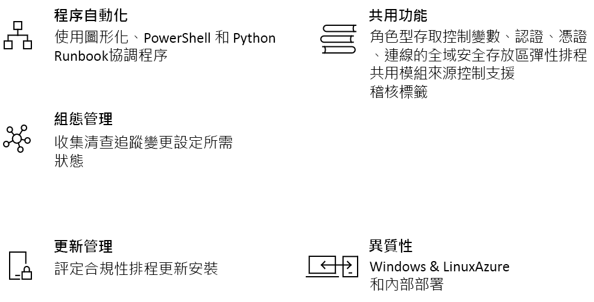

# Azure 自動化簡介

Azure 自動化會提供以雲端為基礎的自動化和設定服務，在您的 Azure 和非 Azure 環境之間提供一致的管理。 它包含程序自動化、更新管理和設定功能。 Azure 自動化會在部署、作業和解除委任工作負載與資源期間，提供完整的控制權。
本文提供 Azure 自動化的簡短概觀，並回答一些常見問題。 如需不同功能的詳細資訊，請瀏覽本概觀的所有連結。

## Azure 自動化功能

### 程序自動化

Azure 自動化能讓您將頻繁、費時且容易產生錯誤的雲端管理工作自動化。 這項自動化有助於您專注在可增加商務價值的工作。 減少錯誤並提高效率，也有助於降低營運成本。 您可以將 Azure 服務與部署、設定及管理您端對端程序所需的其他公用系統進行整合。 服務可讓您在 PowerShell 或 Python 中，以圖形方式[撰寫 Runbook](automation-runbook-types.md)。 您可以使用混合式 Runbook 背景工作角色，在內部部署環境之間協調，從而整合管理。 [Webhook](automation-webhooks.md) 提供的方法，能透過從 ITSM、DevOps 和監視系統觸發自動化來滿足要求，並確保持續傳遞和作業。

### 設定管理

Azure 自動化 [Desired State Configuration](automation-dsc-overview.md) 是適用於 PowerShell DSC 的以雲端為基礎架構解決方案，可提供企業環境所需的服務。 在 Azure 自動化中管理 DSC 資源，並從 Azure 雲端中的 DSC 提取伺服器將設定套用至虛擬或實體機器。 它會提供豐富的報告，可通知您重要的事件，例如當節點偏離其指派的組態時。 您可以在位於雲端或內部部署的 Windows 或 Linux 實體及虛擬機器上，監視及自動更新機器設定。

您可以取得有關客體資源的清查，看見已安裝的應用程式和其他設定項目。 豐富的報告和搜尋功能可用來快速找出詳細資訊，協助您了解作業系統內已設定的項目。 您可以跨服務、精靈、軟體、登錄和檔案追蹤變更，快速找出可能造成問題的項目。 此外，DSC 可在您環境中發生不必要的變更時，協助您進行診斷及發出警示。

### 更新管理

使用 Azure 自動化跨混合式環境更新 Windows 和 Linux 系統。 您可以看見 Azure、內部部署和其他雲端之間的更新相容性。 您可以建立排程部署，在協調定義維護時間內的更新安裝。 如果電腦上不應該安裝更新，您可以從部署中排除這些更新。

### 共用功能

Azure 自動化包含一組共用資源，讓您能更輕鬆地自動化，並大量設定您的環境。

* **[角色型存取控制](automation-role-based-access-control.md)** - 使用自動化操作員角色來控制帳戶的存取權，使工作在不提供撰寫功能的情況下執行。
* **[變數](automation-variables.md)** - 提供一個方式來保存可在 Runbook 和設定之間使用的內容。 您不必修改任何參考它們的 Runbook 及設定就可以變更值。
* **[認證](automation-credentials.md)** - 安全地儲存可供 Runbook 和設定在執行階段使用的機密資訊。
* **[憑證](automation-certificates.md)** - 在執行階段儲存並提供使用，讓它們可以用於驗證及保護部署的資源。
* **[連線](automation-connections.md)** - 儲存資訊的名稱 / 值組，當中包含在連線資源中連線到系統時的通用資訊。 連線是由模組建立者所定義，可在執行階段中用於 Runbook 和設定。
* **[排程](automation-schedules.md)** - 用來在服務中於預先定義的時間觸發自動化。
* **[與原始檔控制整合](automation-source-control-integration.md)** - 將設定升階為程式碼，Runbook 或設定可在其中簽入原始檔控制系統。
* **[PowerShell 模組](automation-integration-modules.md)** - 模組可用來管理 Azure 和其他系統。 匯入適用於 Microsoft、第三方、社群或自訂定義 Cmdlet 和 DSC 資源的自動化帳戶中。

### Windows 和 Linux

Azure 自動化旨在讓您可跨混合式雲端環境運作，並適用於 Windows 和 Linux。 它會提供一致的方式，將部署的工作負載和其所執行的作業系統進行自動化及設定。

### 社群資源庫

瀏覽 Runbook 和模組的[自動化資源庫](automation-runbook-gallery.md)，快速開始從 PowerShell 資源庫和 Microsoft 指令碼中心整合及撰寫您的程序。

## 自動化的常見情節

Azure 自動化可跨基礎結構和應用程式的生命週期進行管理。 將組織傳遞和維護工作負載方式的知識傳送到系統。 以常用語言 (例如 PowerShell)、Desired State Configuration、Python 和圖形化 Runbook 撰寫。 取得已部署資源的完整清查，以了解目標、報告與相容性。 識別可能造成設定不正確的變更，並且改善作業相容性。

* **建置 / 部署資源** - 使用 Runbook 和 Azure Resource Manager 範本，跨混合式環境部署 VM。 整合至諸如 Jenkins 和 Azure DevOps 等開發工具。
* **設定 VM** - 使用基礎結構和應用程式的所需設定，評估及設定 Windows 和 Linux 電腦。
* **監視** - 識別電腦上造成問題的變更，並加以修復或向管理系統呈報。
* **保護** - 如果產生安全性警示，就隔離 VM。 設定客體需求。
* **控管** - 設定小組的角色型存取控制。 復原未使用的資源。

## 自動化的定價

您可以在 [[定價]](https://azure.microsoft.com/pricing/details/automation/) 頁面上檢閱 Azure 自動化的價格。

## 後續步驟

> [!div class="nextstepaction"]
> [建立自動化帳戶](automation-quickstart-create-account.md)
