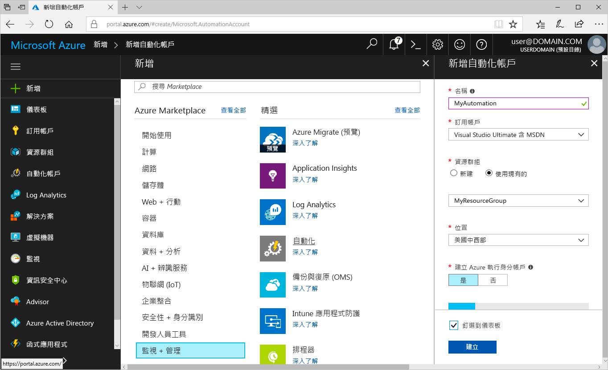
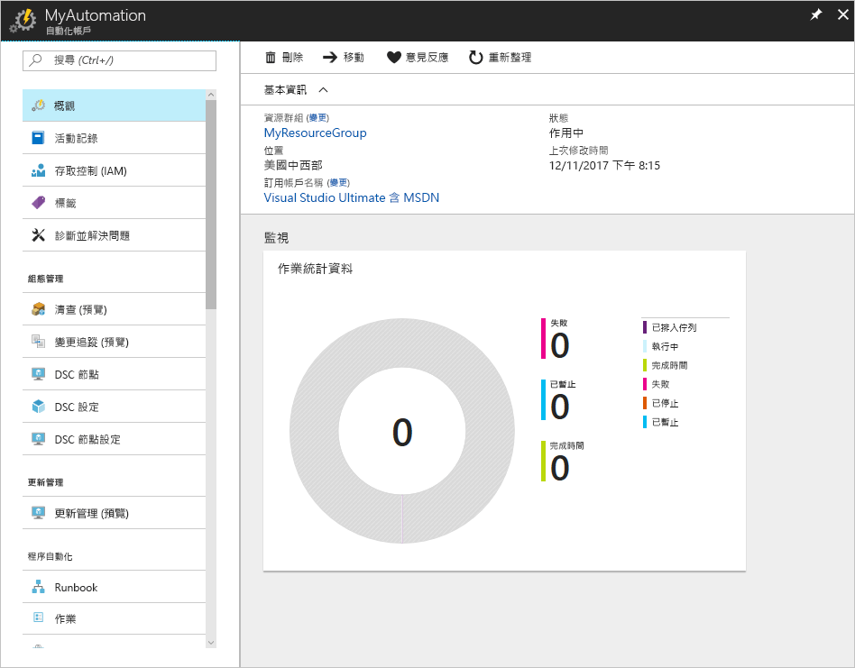
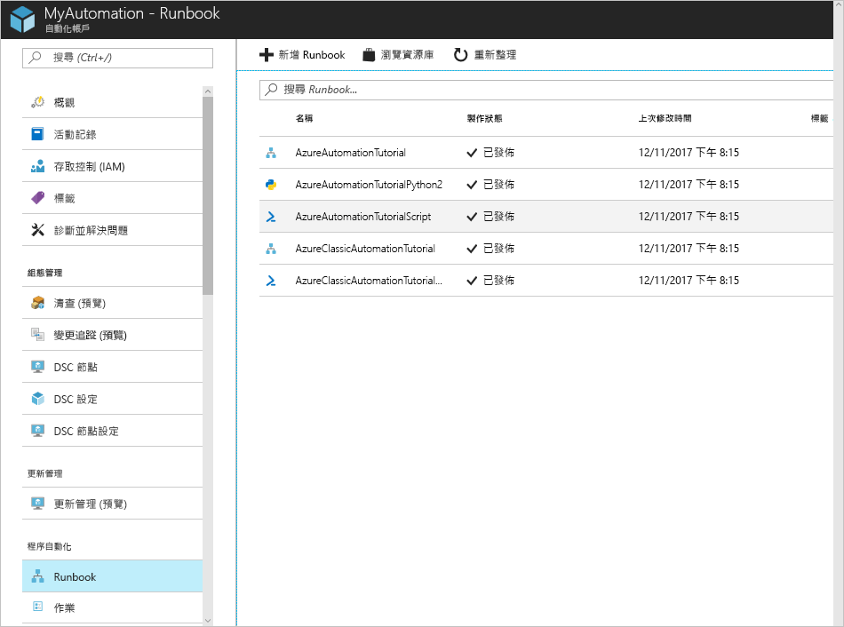
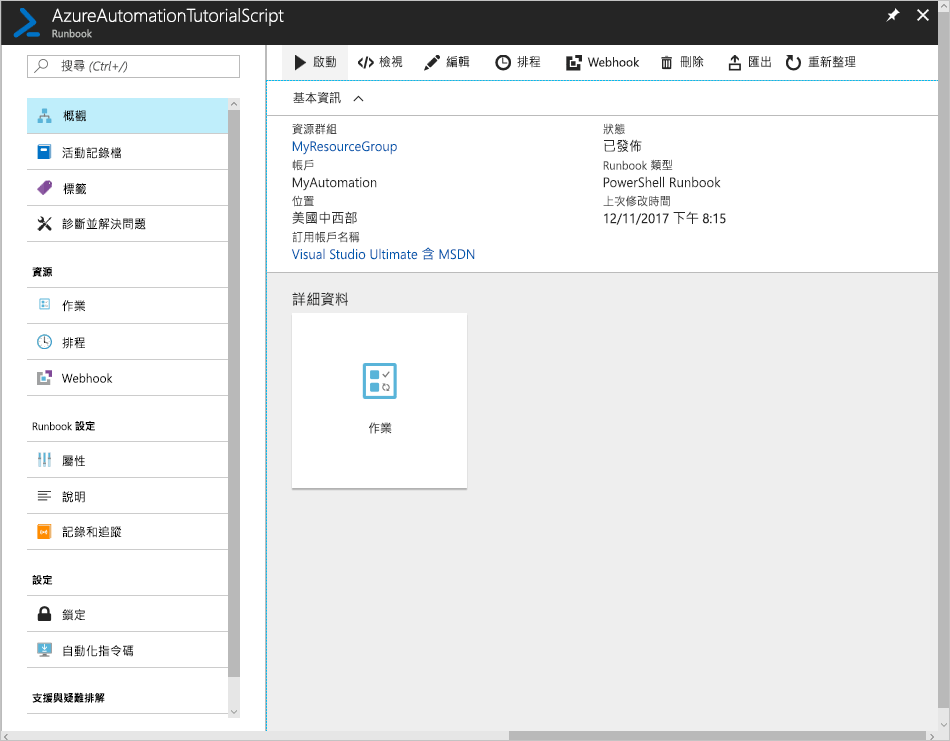
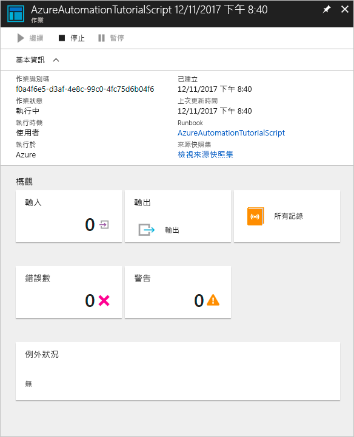

# 建立 Azure 自動化帳戶

您可以透過 Azure 建立 Azure 自動化帳戶。 此方法可提供以瀏覽器為基礎的使用者介面，從而建立和設定自動化帳戶以及相關的資源。 本快速入門會逐步引導您建立自動化帳戶，並在帳戶中執行 Runbook。

如果您沒有 Azure 訂用帳戶，請在開始前建立[免費 Azure 帳戶](https://azure.microsoft.com/free/?WT.mc_id=A261C142F)。

## 登入 Azure

在 https://portal.azure.com 登入 Azure

## 建立自動化帳戶

1. 按一下 Azure 左上角的 [建立資源] 按鈕。

1. 選取 [監視 + 管理]，然後選取 [自動化]。

1. 輸入帳戶資訊。 針對 [建立 Azure 執行身分帳戶] 選擇 [是]，就會自動啟用簡化對 Azure 進行驗證的構件。 完成後，按一下 [建立] 可啟動自動化帳戶部署。

      

1. 自動化帳戶已釘選到 Azure 儀表板。 完成部署之後，會自動開啟自動化帳戶概觀。

    

## 執行 Runbook

執行其中一個教學課程 Runbook。

1. 按一下 [程序自動化] 下的 [Runbook]。 隨即顯示 Runbook 的清單。 根據預設，會啟用帳戶中的幾個教學課程 Runbook。

    

1. 選取 **AzureAutomationTutorialScript** Runbook。 這個動作會開啟 [Runbook 概觀] 頁面。

    

1. 按一下 [啟動]，然後在 [啟動 Runbook] 頁面上，按一下 [確定] 來啟動 Runbook。

    

1. [作業狀態] 變成 [執行] 之後，按一下 [輸出] 或 [所有記錄] 可檢視 Runbook 作業輸出。 在本教學課程的 Runbook 中，輸出就是您 Azure 資源的清單。

## 清除資源

若不再需要，可刪除資源群組、自動化帳戶和所有相關資源。 若要這樣做，請選取自動化帳戶的資源群組，然後按一下 [刪除]。

## 後續步驟

在本快速入門中，您已部署自動化帳戶、啟動 Runbook 作業，並檢視作業結果。 若要深入了解 Azure 自動化，請繼續閱讀快速入門來建立您的第一個 Runbook。

> [!div class="nextstepaction"]
> [自動化快速入門 - 建立 Runbook](./automation-quickstart-create-runbook.md)
