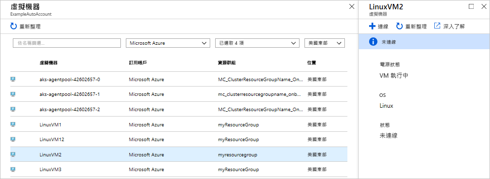
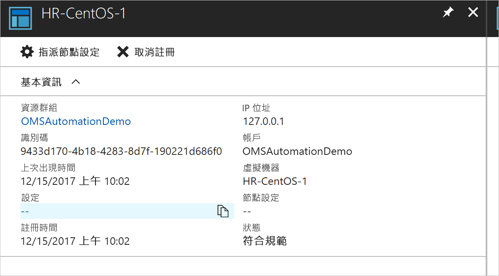
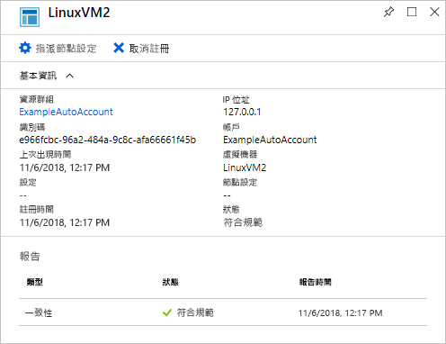
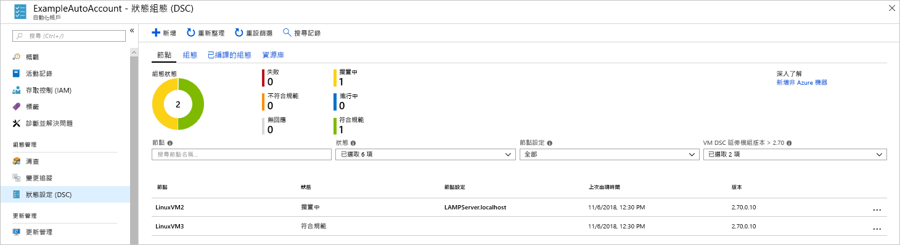

# <a name="configure-a-linux-virtual-machine-with-desired-state-configuration"></a>使用 Desired State Configuration 來設定 Linux 虛擬機器

您可以啟用 Desired State Configuration (DSC) 來管理和監視您 Windows 和 Linux 伺服器的設定。 可以識別或自動更正漂移自所需設定的設定。 本快速入門逐步說明 DSC 將 Linux VM 上架及使用部署 LAMP 堆疊。

## <a name="prerequisites"></a>先決條件

若要完成本快速入門，您需要：

* Azure 訂用帳戶。 如果您沒有 Azure 訂用帳戶，請[建立免費帳戶](https://azure.microsoft.com/free/)。
* Azure 自動化帳戶。 如需建立 Azure 自動化執行身分帳戶的指示，請參閱 [Azure 執行身分帳戶](automation-sec-configure-azure-runas-account.md)。
* 執行 Red Hat Enterprise Linux、CentOS 或 Oracle Linux 的 Azure Resource Manager VM (非傳統)。 如需建立 VM 的指示，請參閱 [在 Azure 入口網站中建立第一個 Linux 虛擬機器](../virtual-machines/linux/quick-create-portal.md)

## <a name="log-in-to-azure"></a>登入 Azure
在 https://portal.azure.com 登入 Azure

## <a name="onboard-a-virtual-machine"></a>將虛擬機器上架
有許多不同的方法可將電腦上架及啟用 Desired State Configuration。 本快速入門涵蓋透過自動化帳戶進行上架。 您可以閱讀[上架](https://docs.microsoft.com/azure/automation/automation-dsc-onboarding)文章，深入了解將您的電腦上架至 Desired State Configuration 的不同方法。

1. 在 Azure 入口網站的左側窗格中，選取 [自動化帳戶]。 如果未顯示在左窗格中，請按一下 [所有服務]，然後在產生的檢視中加以搜尋。
1. 在清單中，選取自動化帳戶。
1. 在自動化帳戶的左側窗格中，選取 [DSC 節點]。
1. 按一下功能表選項可 [新增 Azure VM]
1. 尋找您需要啟用 DSC 的虛擬機器。 若要尋找特定的虛擬機器，您可以使用搜尋欄位和篩選選項。
1. 按一下虛擬機器，然後選取 [連線]
1. 選取適用於虛擬機器的 DSC 設定。 如果您已經備妥設定，可以將它指定為「節點設定名稱」。 您可以設定[設定模式](https://docs.microsoft.com/powershell/dsc/metaconfig)來控制電腦的設定行為。
1. 按一下 [檔案] &gt; [新增] &gt; [專案] 



雖然 Desired State Configuration 延伸模組是部署到虛擬機器，但它會顯示為連線。

## <a name="import-modules"></a>匯入模組

模組包含 DSC 資源，當中有許多可以在 [PowerShell 資源庫](https://www.powershellgallery.com)上找到。 您設定中所使用的任何資源在編譯之前，都必須匯入自動化帳戶中。 在本教學課程中，需要名為 **nx** 的模組。

1. 在自動化帳戶的左窗格中，選取**模組資源庫** (在共用資源下)。
1. 搜尋您需要匯入的模組，方法是輸入其部分名稱：nx
1. 按一下您需要匯入的模組
1. 按一下 [匯入]。


## <a name="import-the-configuration"></a>匯入設定

本快速入門所使用的 DSC 設定會設定電腦上的 Apache HTTP Server、MySQL 和 PHP。

如需 DSC 設定的詳細資訊，請參閱 [DSC 設定](https://docs.microsoft.com/powershell/dsc/configurations)。

在文字編輯器中輸入下列項目，並將其本機儲存為 `LAMPServer.ps1`。

```powershell-interactive
configuration LAMPServer {
   Import-DSCResource -module "nx"

   Node localhost {

        $requiredPackages = @("httpd","mod_ssl","php","php-mysql","mariadb","mariadb-server")
        $enabledServices = @("httpd","mariadb")

        #Ensure packages are installed
        ForEach ($package in $requiredPackages){
            nxPackage $Package{
                Ensure = "Present"
                Name = $Package
                PackageManager = "yum"
            }
        }

        #Ensure daemons are enabled
        ForEach ($service in $enabledServices){
            nxService $service{
                Enabled = $true
                Name = $service
                Controller = "SystemD"
                State = "running"
            }
        }
   }
}
```

若要匯入設定：

1. 在自動化帳戶的左側窗格中，選取 [DSC 設定]。
1. 按一下功能表選項可 [新增設定]
1. 選取您在先前步驟中儲存的組態檔
1. 按一下 [檔案] &gt; [新增] &gt; [專案] 

## <a name="compile-a-configuration"></a>編譯設定

DSC 設定必須先編譯成節點設定 (MOF 文件)，才可以指派至節點。 編譯程式會驗證設定，並允許輸入參數值。 若要深入了解編譯設定，請參閱：[編譯 Azure 自動化 DSC 中的設定](https://docs.microsoft.com/azure/automation/automation-dsc-compile)

若要編譯設定：

1. 在自動化帳戶的左側窗格中，選取 [DSC 設定]。
1. 選取您在先前步驟中匯入的設定 "LAMPServer"
1. 從功能表選項中，按一下 [編譯]，然後按一下 [是]
1. 在 [設定] 檢視中，您會看到新的 [編譯作業] 排入佇列。 當作業順利完成時，即準備好進行下一個步驟。 如果發生任何失敗，您可以按一下 [編譯作業] 來取得詳細資料。



## <a name="assign-a-node-configuration"></a>指派節點設定

可以將編譯的節點設定指派給 DSC 節點。 指派會將設定套用至電腦，並監視 (或自動更正) 該設定中的任何漂移。

1. 在自動化帳戶的左側窗格中，選取 [DSC 節點]
1. 選取您需要指派設定的節點
1. 按一下 [指派節點設定]
1. 選取 [節點設定] - **LAMPServer.localhost** - 來指派，並按一下 [確定]
1. 已編譯的設定現在已指派給節點，且節點狀態變更為 [擱置]。 下一次定期檢查時，節點會擷取設定、加以套用，然後回報狀態。 節點可能需要 30 分鐘的時間才能擷取設定，根據節點的設定而定。 若要強制立即檢查，您可以在 Linux 虛擬機器上本機執行下列命令：`sudo /opt/microsoft/dsc/Scripts/PerformRequiredConfigurationChecks.py`



## <a name="viewing-node-status"></a>檢視節點狀態

您可以在自動化帳戶的 **DSC 節點**檢視中，找到所有受控節點的狀態。 您可以依狀態、節點設定或名稱搜尋來篩選顯示。 



## <a name="next-steps"></a>後續步驟

在本快速入門中，您已將 Linux VM 上架至 DSC、建立 LAMP 堆疊的設定，並將它部署到 VM。 若要了解如何使用 Automation DSC 來啟用持續部署，請繼續閱讀以下文章：

> [!div class="nextstepaction"]
> [使用 DSC 和 Chocolatey 持續部署至 VM](./automation-dsc-cd-chocolatey.md)

* 若要深入了解 PowerShell Desired State Configuration，請參閱 [PowerShell Desired State Configuration 概觀](https://docs.microsoft.com/powershell/dsc/overview)。
* 若要深入了解從 PowerShell 管理 Automation DSC，請參閱 [Azure PowerShell](https://docs.microsoft.com/powershell/module/azurerm.automation/?view=azurermps-5.0.0)
* 若要了解如何將 DSC 報告轉寄給 Log Analytics 以進行報告及警示，請參閱[將 DSC 報告轉寄給 Log Analytics](https://docs.microsoft.com/azure/automation/automation-dsc-diagnostics) 
