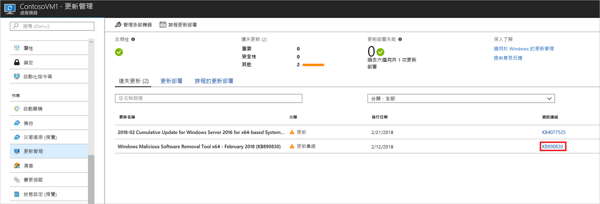
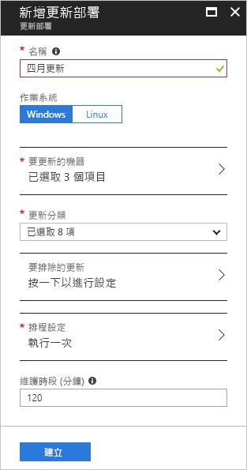
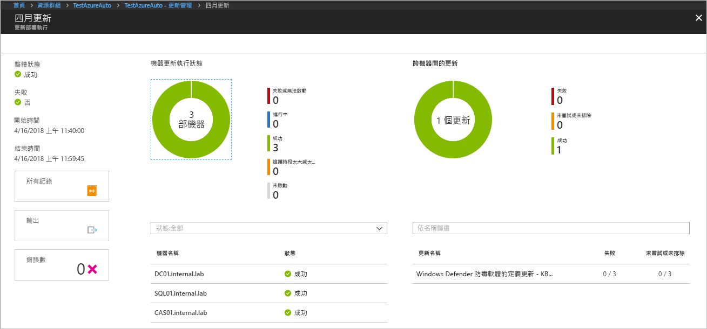

# <a name="manage-windows-updates-by-using-azure-automation"></a>使用 Azure 自動化來管理 Windows 更新

您可以使用更新管理解決方案來管理虛擬機器的更新和修補程式。 在本教學課程中，您會了解如何快速評估可用更新的狀態、排程何時安裝必要的更新、檢閱部署結果，以及建立警示以確認更新已成功套用。

如需價格資訊，請參閱[更新管理的自動化定價](https://azure.microsoft.com/pricing/details/automation/)。

在本教學課程中，您了解如何：

> [!div class="checklist"]
> * 將 VM 上架以進行更新管理
> * 檢視更新評估
> * 設定警示
> * 排定更新部署
> * 檢視部署的結果

## <a name="prerequisites"></a>必要條件

若要完成本教學課程，您需要：

* Azure 訂用帳戶。 如果您還沒有這類帳戶，可以[啟用 Visual Studio 訂閱者的每月 Azure 點數](https://azure.microsoft.com/pricing/member-offers/msdn-benefits-details/)，或註冊[免費帳戶](https://azure.microsoft.com/free/?WT.mc_id=A261C142F)。
* [Azure 自動化帳戶](automation-offering-get-started.md)可保存監看員和動作 Runbook，以及監看員工作。
* 要上架的[虛擬機器](../virtual-machines/windows/quick-create-portal.md)。

## <a name="sign-in-to-azure"></a>登入 Azure

在 https://portal.azure.com 登入 Azure 入口網站。

## <a name="enable-update-management"></a>啟用更新管理

首先，在本教學課程中啟用 VM 的更新管理：

1. 在 Azure 入口網站的左側窗格中，選取 [虛擬機器]。 從清單中選取 VM。
2. 在 VM 頁面的 [作業] 區段下，選取 [更新管理]。 [啟用更新管理] 頁面隨即開啟。

執行驗證來判斷此 VM 是否已啟用更新管理。 此驗證包括檢查 Azure Log Analytics 工作區及連結的自動化帳戶，以及更新管理解決方案是否在工作區中。

[Log Analytics](../log-analytics/log-analytics-overview.md?toc=%2fazure%2fautomation%2ftoc.json) 工作區可用來收集功能和服務 (例如更新管理) 所產生的資料。 工作區提供單一位置來檢閱和分析來自多個來源的資料。

驗證程序也會查看 VM 是否以 Microsoft Monitoring Agent (MMA) 和自動化混合式 Runbook 背景工作角色佈建。 此代理程式可用來與 Azure 自動化通訊，以及取得更新狀態的相關資訊。 此代理程式需要以開啟的連接埠 443 與 Azure 自動化服務通訊，以及下載更新。

如果在上線期間遺漏下列任何必要條件，就會自動新增：

* [Log Analytics](../log-analytics/log-analytics-overview.md?toc=%2fazure%2fautomation%2ftoc.json) 工作區
* [自動化帳戶](./automation-offering-get-started.md)
* [混合式 Runbook 背景工作角色](./automation-hybrid-runbook-worker.md) (已在 VM 上啟用)

在 [更新管理] 之下，設定位置、Log Analytics 工作區以及要使用的自動化帳戶。 接著選取 [啟用]。 如果無法使用這些選項，則表示已為 VM 啟用另一個自動化解決方案。 在此情況下，必須使用相同的工作區以及自動化帳戶。

![啟用 [更新管理] 解決方案視窗](./media/automation-tutorial-update-management/manageupdates-update-enable.png)

啟用解決方案可能需要幾分鐘的時間。 在此期間，請勿關閉瀏覽器視窗。 啟用解決方案之後，有關在 VM 上遺漏更新的相關資訊會流向 Log Analytics。 可能需要 30 分鐘到 6 小時，資料才可供分析。

## <a name="view-update-assessment"></a>檢視更新評估

啟用 [更新管理] 之後，[更新管理] 窗格隨即開啟。 如果遺失任何更新，[遺失更新] 索引標籤上會顯示遺失的更新清單。

在 [資訊連結] 之下，選取更新連結即可在新視窗中開啟更新的支援文章。 您可以在此視窗中了解關於更新的重要資訊。



按一下更新的任何其他地方，即可開啟所選更新的 [記錄搜尋] 窗格。 記錄搜尋的查詢已針對該特定更新預先定義。 您可以修改此查詢或建立您自己的查詢，以檢視部署的更新或您環境中遺失項目的詳細資訊。


## <a name="configure-alerts"></a>設定警示

在此步驟中，您將了解如何透過 Log Analytics 查詢來設定警示，以得知更新已成功部署，或藉由追蹤更新管理的主要 Runbook 得知失敗的部署。

### <a name="alert-conditions"></a>警示條件

每個類型的警示各有不同的警示條件需要定義。

#### <a name="log-analytics-query-alert"></a>Log Analytics 查詢警示

針對成功的部署，您可以根據 Log Analytics 查詢來建立警示。 針對失敗的部署，您可以使用 [Runbook 警示](#runbook-alert)步驟，在負責協調更新部署的主要 Runbook 失敗時發出警示。 您可以為其他警示撰寫自訂查詢，以涵蓋許多不同的案例。

在 Azure 入口網站中，移至 [監視器]，然後選取 [建立警示]。

在 [1. 定義警示條件] 下，按一下 [選取目標]。 在 [依資源類型篩選] 下，選取 [Log Analytics]。 選取您的 Log Analytics 工作區，然後選取 [完成]。


選取 [新增準則]。

在 [設定訊號邏輯] 之下的資料表中，選取 [自訂記錄檔搜尋]。 在 [搜尋查詢] 文字方塊中，輸入下列查詢：

```loganalytics
UpdateRunProgress
| where InstallationStatus == 'Succeeded'
| where TimeGenerated > now(-10m)
| summarize by UpdateRunName, Computer
```
此查詢會傳回在指定的時間範圍內完成的電腦和更新執行名稱。

在 [警示邏輯] 之下，針對 [閾值]，輸入 **1**。 完成之後，選取 [完成]。


#### <a name="runbook-alert"></a>Runbook 警示

針對失敗的部署，您必須在主要 Runbook 失敗時發出警示。
在 Azure 入口網站中，移至 [監視器]，然後選取 [建立警示]。

在 [1. 定義警示條件] 下，按一下 [選取目標]。 在 [依資源類型篩選] 下方，選取 [自動化帳戶]。 選取您的自動化帳戶，然後選取 [完成]。

針對 [Runbook 名稱]，按一下 **\+** 號，然後輸入 **Patch-MicrosoftOMSComputers** 作為自訂名稱。 針對 [狀態] 選擇 [失敗]，或按一下 **\+** 號以輸入 [失敗]。


在 [警示邏輯] 之下，針對 [閾值]，輸入 **1**。 完成之後，選取 [完成]。

### <a name="alert-details"></a>警示詳細資料

在 **2.** 定義警示詳細資料 之下，輸入警示的名稱和描述。 將執行成功的 [嚴重性] 設定為 [資訊 (嚴重性 2)]，或將執行失敗的嚴重性設定為 [資訊 (嚴重性 1)]。


在 [3. 定義動作群組] 之下，選取 [新增動作群組]。 動作群組是一組可讓您跨多個警示使用的動作。 這些動作可包括 (但不限於) 電子郵件通知、Runbook、Webhook 和等多種項目。 若要深入了解動作群組，請參閱[建立及管理動作群組](../monitoring-and-diagnostics/monitoring-action-groups.md)。

在 [動作群組名稱] 方塊中，輸入警示名稱和簡短名稱。 使用這個群組傳送通知時，會使用簡短名稱來取代完整的動作群組名稱。

在 [動作] 底下，輸入動作的名稱，像是 [電子郵件通知]。 在 [動作類型] 之下，選取 [電子郵件/簡訊/推播/語音]。 在 [詳細資料] 下，選取 [編輯詳細資料]。

在 [電子郵件/簡訊/推播/語音] 窗格中，輸入名稱。 選取 [電子郵件] 核取方塊，然後輸入有效的電子郵件地址。


在 [電子郵件/簡訊/推播/語音] 窗格中，選取 [確定]。 在 [新增動作群組] 中，選取 [確定]。

若要自訂警示電子郵件的主旨，請在 [建立規則] 的 [自訂動作] 之下，選取 [電子郵件主旨]。 當您完成時，選取 [建立警示規則]。 警示會在更新部署成功時，告知您有哪些機器包含在該更新部署執行中。

## <a name="schedule-an-update-deployment"></a>排定更新部署

接下來，將部署安排在發行排程和服務時間範圍之後，以便安裝更新。 您可以選擇要在部署中包含的更新類型。 例如，您可以包含重大更新或安全性更新，並排除更新彙總套件。

若要為 VM 安排新的更新部署，請移至 [更新管理]，然後選取 [排程更新部署]。

在 [新增更新部署] 之下，指定下列資訊：

* **名稱**：輸入更新部署的唯一名稱。

* **作業系統**：選取要進行更新部署的目標 OS。

* **要更新的群組 (預覽)**：根據訂用帳戶、資源群組、位置及標記的組合來定義查詢，以建立要包含在您部署中的動態 Azure VM 群組。 若要深入了解，請參閱[動態群組](automation-update-management.md#using-dynamic-groups)

* **要更新的機器**：選取已儲存的搜尋、已匯入的群組，或從下拉式清單中選擇 [機器]，然後選取個別的機器。 如果您選擇 [機器]，機器的整備程度會顯示於 [更新代理程式整備程度] 欄中。 若要深入了解在 Log Analytics 中建立電腦群組的不同方法，請參閱 [Log Analytics 中的電腦群組](../log-analytics/log-analytics-computer-groups.md)

* **更新分類**：選取更新部署在部署中包含的軟體類型。 此教學課程中，將所有類型保留選取。

  分類類型包括：

   |作業系統  |類型  |
   |---------|---------|
   |Windows     | 重大更新</br>安全性更新</br>更新彙總套件</br>Feature Pack</br>Service Pack</br>定義更新</br>工具</br>更新        |
   |Linux     | 重大更新和安全性更新</br>其他更新       |

   如需分類類型的說明，請參閱[更新分類](automation-update-management.md#update-classifications)。

* **要包含/排除的更新** - 這會開啟 [包含]/[排除] 頁面。 要包含或排除的更新會在個別的索引標籤上。 如需有關如何處理包含的額外資訊，請參閱[包含行為](automation-update-management.md#inclusion-behavior)

* **排程設定**：[排程設定] 窗格隨即開啟。 預設開始時間為目前時間之後的 30 分鐘。 您可以將開始時間設為 10 分鐘以後的任何時間。

   您也可以指定部署是否為發生一次，或設定週期性排程。 在 [週期性] 下選取 [一次]。 將預設值保留為 1 天，然後選取 [確定]。 這樣會設定週期性的排程。

* **前置指令碼 + 後置指令碼**：選取在部署前和部署後要執行的指令碼。 若要深入了解，請參閱[管理前置和後置指令碼](pre-post-scripts.md)。
* **維護時間範圍 (分鐘)**：保留預設值。 您可以設定您希望發生更新部署的時間範圍。 此設定有助於確保在您定義的服務時段內執行變更。

* **重新開機選項**：此設定會決定應該如何處理重新開機。 可用選項包括：
  * 在必要時重新開機 (預設值)
  * 一律重新開機
  * 永不重新開機
  * 僅重新開機 - 將不會安裝更新

排程設定完成後，請選取 [建立]。



您會回到狀態儀表板。 選取 [排程更新部署] 可顯示您所建立的部署排程。

## <a name="view-results-of-an-update-deployment"></a>檢視更新部署的結果

已排程的部署開始之後，您就可以在 [更新管理] 之下的 [更新部署] 索引標籤上看到該部署的狀態。 目前正在執行部署時，其狀態會是 [進行中]。 部署順利完成時，狀態會變更為 [成功]。 當部署中發生一或多個更新失敗時，狀態就會是 [部分失敗]。

選取已完成的更新部署，即可查看該更新部署的儀表板。



在 [更新結果] 之下，會有摘要提供 VM 上的更新總數和部署結果。 右邊的表格會顯示每個更新的詳細明細及安裝結果。

下列清單會顯示可用的值：

* **未嘗試**：未安裝更新，因為根據所定義的維護時間範圍持續時間，可用的時間不足。
* **成功**：更新成功。
* **失敗**：更新失敗。

若要查看部署已建立的所有記錄項目，請選取 [所有記錄]。

選取 [輸出]，以查看負責在目標 VM 上管理更新部署的 Runbook 作業串流。

若要查看部署所傳回的任何錯誤詳細資訊，請選取 [錯誤]。

更新部署成功時，系統會傳送類似於以下範例的電子郵件，指出部署成功：


## <a name="next-steps"></a>後續步驟

在本教學課程中，您已了解如何：

> [!div class="checklist"]
> * 將 VM 上架以進行更新管理
> * 檢視更新評估
> * 設定警示
> * 排定更新部署
> * 檢視部署的結果

繼續閱讀更新管理解決方案的概觀。

> [!div class="nextstepaction"]
> [更新管理解決方案](../operations-management-suite/oms-solution-update-management.md?toc=%2fazure%2fautomation%2ftoc.json)
