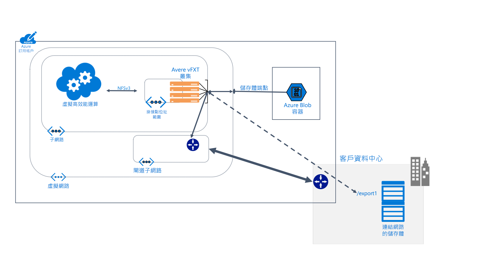

# 什麼是 Avere vFXT for Azure？ 

Avere vFXT for Azure 是一個適用於資料密集高效能運算 (HPC) 工作的檔案系統快取解決方案。 它可讓您充分利用雲端運算的延展性，讓您的資料隨時隨地可供存取 - 即使資料儲存在您自己的內部部署硬體中，仍是如此。

Avere vFXT 支援下列常見的運算案例： 

* 混合式雲端架構：Avere vFXT for Azure 可與硬體儲存系統搭配運作，因此不需要移動檔案即可發揮雲端運算的優勢。 
* 雲端負載平衡：Avere vFXT for Azure 可協助您將單一專案的資料移至雲端，或永久性地「隨即轉移」整個工作流程。 

Avere vFXT for Azure 最適合用於下列情況： 

* HPC 工作負載的大量讀取作業
* 使用一般 NFS 通訊協定的應用程式
* 具有 1000 到 40,000 個 CPU 核心的計算伺服器陣列
* 與內部部署硬體 NAS 和 (或) Azure Blob 儲存體的整合

如需詳細資訊，請瀏覽 <https://azure.microsoft.com/services/storage/avere-vfxt/>

## Avere vFXT for Azure 的適用對象為何？ 

Avere vFXT 有助於執行各種讀取密集的運算工作：

### 視覺效果轉譯 

在媒體和娛樂的領域中，Avere vFXT 叢集可加快資料存取速度，以支援講求時效性的轉譯專案。 您可以在 Azure 中新增更多的快取空間和更多的計算節點，因此有足夠的彈性可有效率地處理大型專案。 

### 生命科學 

Avere vFXT 可以讓研究人員在 Azure 計算中執行其次級分析工作流程，以及隨處存取基因資料。

在醫藥研究的領域中，Avere vFXT 叢集可用來協助研究人員預測藥物與標的的交互作用及分析研究資料，進而加速藥物開發的進程。

### 金融服務分析

Avere vFXT 叢集有助於加速量化分析計算，為金融服務公司提供更精準的深入解析，以利制定決策。 

## 功能和規格

Avere vFXT 系統由三個或更多設定於叢集中的虛擬邊緣檔案管理工具節點組成。 此系統可設置在用戶端電腦附近，因此能夠掛接叢集，而不是直接掛接儲存體。 

Avere vFXT 叢集可應要求快取檔案。 重複的要求超過八成 (以時間計算) 都可由快取支應。

### 相容性 

* 與 NetApp 或 Dell EMC Isilon 的硬體 NAS 系統相容
* 與 Azure Blob 相容
* 使用 NFSv3 或 SMB2 通訊協定

Avere vFXT 會使用下列 Azure 資源： 

|Azure 元件|   |
|----------|-----------|
|虛擬機器|3 個或更多 D16s_v3 或 E32s_v3|
|進階 SSD 儲存體|200 GB 的 OS 空間，外加每個節點 1 TB 到 4 TB 的快取空間 |
|儲存體帳戶 (選擇性) |v2|
|資料後端儲存體 (選擇性) | 一個空的 LRS Blob 容器 |

## 後續步驟

以下是一些可讓您開始自行建立 Avere vFXT 部署的連結。 

* [規劃您的系統](avere-vfxt-deploy-plan.md)
* [部署概觀](avere-vfxt-deploy-overview.md)
* [建立 vFXT](avere-vfxt-deploy.md)
