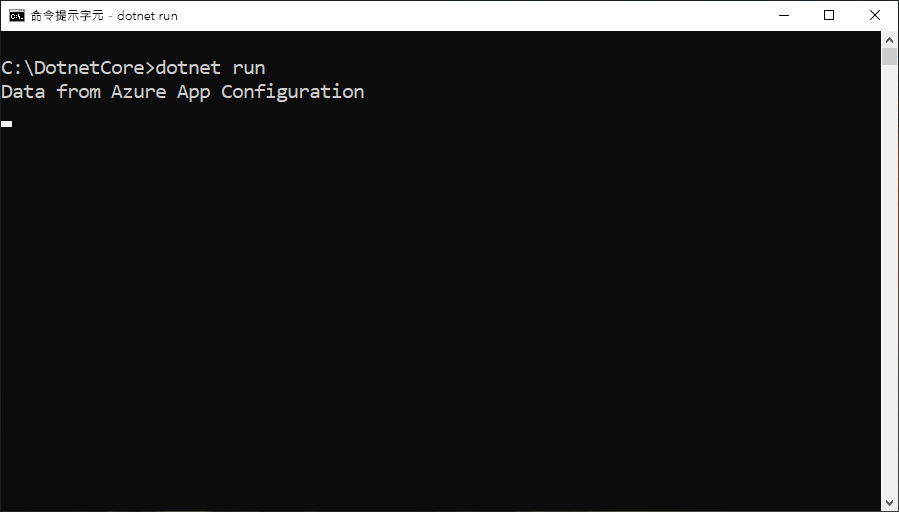

# <a name="tutorial-use-dynamic-configuration-in-a-net-core-app"></a>教學課程：使用 .NET Core 應用程式中的動態設定

應用程式設定 .NET Core 用戶端程式庫可支援依需求更新一組組態設定，而不會造成應用程式重新啟動。 若要實作此功能，請先從組態提供者的選項取得 `IConfigurationRefresher` 的執行個體，然後在程式碼任意處對該執行個體呼叫 `Refresh`。

若要讓設定持續更新，並避免設定存放區有太多呼叫，每一項設定會使用一個快取。 在設定的快取值到期前，重新整理作業都不會更新值，即使值在設定存放區中已變更也是如此。 每個要求的預設到期時間為 30 秒，但您可以視需要加以覆寫。

本教學課程會示範如何在程式碼中實作動態設定更新。 本文會以快速入門中介紹的應用程式作為基礎。 繼續進行之前，請先完成[使用應用程式設定建立 .NET Core 應用程式](./quickstart-dotnet-core-app.md)。

您可以使用任何程式碼編輯器來進行本教學課程中的步驟。 Windows、macOS 及 Linux 平台上都有提供的 [Visual Studio Code](https://code.visualstudio.com/) 是一個絕佳的選項。

在本教學課程中，您會了解如何：

> [!div class="checklist"]
> * 將應用程式設定為可依需求使用應用程式設定存放區來更新其設定。
> * 在您應用程式的控制器中插入最新的設定。

## <a name="prerequisites"></a>必要條件

若要進行本教學課程，請安裝 [.NET Core SDK](https://dotnet.microsoft.com/download)。

[!INCLUDE [quickstarts-free-trial-note](../../includes/quickstarts-free-trial-note.md)]

## <a name="reload-data-from-app-configuration"></a>從應用程式設定重新載入資料

開啟 Program.cs  ，並更新該檔案來將參考新增至 `System.Threading.Tasks` 命名空間，以在 `AddAzureAppConfiguration` 方法中指定重新整理組態，並使用 `Refresh` 方法觸發手動重新整理。

```csharp
using System;
using System.Threading.Tasks;

namespace TestConsole
{
class Program
{
    private static IConfiguration _configuration = null;
    private static IConfigurationRefresher _refresher = null;

    static void Main(string[] args)
    {
        IConfigurationRefresher refresher = null;

        var builder = new ConfigurationBuilder();
        builder.AddAzureAppConfiguration(options =>
        {
            options.Connect(Environment.GetEnvironmentVariable("ConnectionString"))
                    .ConfigureRefresh(refresh =>
                    {
                        refresh.Register("TestApp:Settings:Message")
                               .SetCacheExpiration(TimeSpan.FromSeconds(10));
                    });
                    
                    _refresher = options.GetRefresher();
        });

        _configuration = builder.Build();
        PrintMessage().Wait();
    }

    private static async Task PrintMessage()
    {
        Console.WriteLine(_configuration["TestApp:Settings:Message"] ?? "Hello world!");

        // Wait for the user to press Enter
        Console.ReadLine();

        await _refresher.Refresh();
        Console.WriteLine(_configuration["TestApp:Settings:Message"] ?? "Hello world!");
    }
}
}
```

`ConfigureRefresh` 方法可用來指定相關設定，以用來在系統觸發重新整理作業時，使用應用程式設定存放區來更新組態資料。 您可以藉由在提供給 `AddAzureAppConfiguration` 方法的選項上呼叫 `GetRefresher` 方法來擷取 `IConfigurationRefresher` 的執行個體，而且此執行個體上的 `Refresh` 方法可用來在程式碼任意處觸發重新整理作業。
    
> [!NOTE]
> 組態設定的預設快取到期時間為 30 秒，但可加以複寫，方法是在以引數形式傳遞至 `ConfigureRefresh` 方法的選項初始設定式上呼叫 `SetCacheExpiration` 方法。

## <a name="build-and-run-the-app-locally"></a>於本機建置並執行應用程式

1. 設定名為 **ConnectionString** 的環境變數，並將其設定為應用程式設定存放區的存取金鑰。 如果您使用 Windows 命令提示字元，請執行下列命令，然後重新啟動命令提示字元以讓變更生效：

        setx ConnectionString "connection-string-of-your-app-configuration-store"

    如果您使用 Windows PowerShell，請執行下列命令：

        $Env:ConnectionString = "connection-string-of-your-app-configuration-store"

    如果您使用 macOS 或 Linux，請執行下列命令：

        export ConnectionString='connection-string-of-your-app-configuration-store'

1. 執行下列命令來建置主控台應用程式：

        dotnet build

1. 建置成功完成後，請執行下列命令以於本機執行應用程式：

        dotnet run

    

1. 登入 [Azure 入口網站](https://portal.azure.com)。 選取 [所有資源]  ，然後選取您在快速入門中建立的應用程式組態存放區執行個體。

1. 選取 [組態總管]  ，然後更新下列索引鍵的值：

    | Key | 值 |
    |---|---|
    | TestApp:Settings:Message | Azure 應用程式設定的值 - 已更新 |

1. 按 Enter 鍵來觸發重新整理，並在命令提示字元或 PowerShell 視窗中印出更新後的值。

    
    
    > [!NOTE]
    > 快取到期時間已使用 `SetCacheExpiration` 方法設定為 10 秒，並已指定重新整理作業的設定，因此，只有在該設定自上次重新整理後已經過至少 10 秒才會更新該組態設定的值。

## <a name="clean-up-resources"></a>清除資源

[!INCLUDE [azure-app-configuration-cleanup](../../includes/azure-app-configuration-cleanup.md)]

## <a name="next-steps"></a>後續步驟

在本教學課程中，您已新增 Azure 受控服務識別來簡化應用程式設定的存取，以及改善您應用程式的認證管理。 若要深入了解「應用程式組態」的使用方式，請繼續進行 Azure CLI 範例。

> [!div class="nextstepaction"]
> [CLI 範例](./cli-samples.md)
