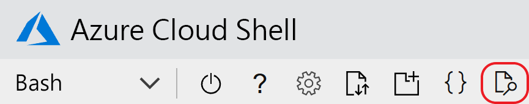

# <a name="quickstart-create-an-aspnet-core-app-with-azure-app-configuration"></a>快速入門：使用 Azure 應用程式設定建立 ASP.NET Core 應用程式

在本快速入門中，您將使用 Azure 應用程式組態集中儲存和管理 ASP.NET Core 應用程式的應用程式設定。 ASP.NET Core 會使用應用程式所指定一或多個資料來源中的設定，來建置一個以索引鍵/值為基礎的組態物件。 這些資料來源稱為「設定提供者」  。 因為應用程式組態的 .NET Core 用戶端會實作為組態提供者，服務看來就像其他資料來源。

## <a name="prerequisites"></a>Prerequisites

- Azure 訂用帳戶 - [建立免費帳戶](https://azure.microsoft.com/free/)
- [.NET Core SDK](https://dotnet.microsoft.com/download)

>[!TIP]
> Azure Cloud Shell 是免費的互動式 Shell，可讓您用來執行本文中的命令列指令。  其中已預先安裝常用的 Azure 工具，包括 .NET Core SDK。 如果您已登入 Azure 訂用帳戶，請從 shell.azure.com 啟動您的 [Azure Cloud Shell](https://shell.azure.com) \(英文\)。  您可以[閱讀我們的文件](../cloud-shell/overview.md)，以深入了解 Azure Cloud Shell

## <a name="create-an-app-configuration-store"></a>建立應用程式組態存放區

[!INCLUDE [azure-app-configuration-create](../../includes/azure-app-configuration-create.md)]

6. 選取 [組態總管]   > [建立]  以新增下列索引鍵/值組：

    | Key | 值 |
    |---|---|
    | TestApp:Settings:BackgroundColor | 白色 |
    | TestApp:Settings:FontSize | 24 |
    | TestApp:Settings:FontColor | 黑色 |
    | TestApp:Settings:Message | Azure 應用程式設定的值 |

    目前先讓 [標籤]  和 [內容類型]  保持空白。

## <a name="create-an-aspnet-core-web-app"></a>建立 ASP.NET Core Web 應用程式

使用 [.NET Core 命令列介面 (CLI)](https://docs.microsoft.com/dotnet/core/tools/) 建立新的 ASP.NET Core MVC Web 應用程式專案。 [Azure Cloud Shell](https://shell.azure.com) 會為您提供這些工具。  這些工具在 Windows、macOS 及 Linux 平台上也都可使用。

1. 為您的專案建立新資料夾。 在本快速入門中，會將其命名為 *TestAppConfig*。

1. 在新的資料夾中，執行下列命令以建立新的 ASP.NET Core MVC Web 應用程式專案：

```dotnetcli
dotnet new mvc --no-https
```

## <a name="add-secret-manager"></a>新增祕密管理員

若要使用秘密管理員，請將 `UserSecretsId` 元素新增至 .csproj  檔案。

開啟 .csproj  檔案。 新增 `UserSecretsId` 元素，如下所示。 您可以使用相同的 GUID，也可以將此值取代為您自己的值。 儲存檔案。

> [!IMPORTANT]
> `CreateHostBuilder` 會取代 .NET Core 3.0 中的 `CreateWebHostBuilder`。  根據您的環境選取正確的語法。

#### <a name="net-core-2xtabcore2x"></a>[.NET Core 2.x](#tab/core2x)

```xml
<Project Sdk="Microsoft.NET.Sdk.Web">

    <PropertyGroup>
        <TargetFramework>netcoreapp2.1</TargetFramework>
        <UserSecretsId>79a3edd0-2092-40a2-a04d-dcb46d5ca9ed</UserSecretsId>
    </PropertyGroup>

    <ItemGroup>
        <PackageReference Include="Microsoft.AspNetCore.App" />
        <PackageReference Include="Microsoft.AspNetCore.Razor.Design" Version="2.1.2" PrivateAssets="All" />
    </ItemGroup>

</Project>
```

#### <a name="net-core-3xtabcore3x"></a>[.NET Core 3.x](#tab/core3x)

```xml
<Project Sdk="Microsoft.NET.Sdk.Web">
    
    <PropertyGroup>
        <TargetFramework>netcoreapp3.1</TargetFramework>
        <UserSecretsId>79a3edd0-2092-40a2-a04d-dcb46d5ca9ed</UserSecretsId>
    </PropertyGroup>

</Project>
```
---

祕密管理員工具能儲存專案樹狀結構外開發工作的敏感性資料。 此作法能協助避免於原始程式碼內意外共用應用程式祕密。 如需秘密管理員的詳細資訊，請參閱[在 ASP.NET Core 中的開發中安全儲存應用程式秘密](https://docs.microsoft.com/aspnet/core/security/app-secrets)

## <a name="connect-to-an-app-configuration-store"></a>連線至應用程式組態存放區

1. 透過執行下列命令，將參考新增至 `Microsoft.Azure.AppConfiguration.AspNetCore` NuGet 套件：

    ```dotnetcli
    dotnet add package Microsoft.Azure.AppConfiguration.AspNetCore --version 3.0.0-preview-010560002-1165
    ```
1. 執行下列命令以還原您專案的套件：

    ```dotnetcli
    dotnet restore
    ```
1. 將名為 ConnectionStrings:AppConfig  的祕密新增至祕密管理員。

    此祕密會包含用來存取應用程式組態存放區的連接字串。 請將下列命令中的值取代為應用程式組態存放區的連接字串。

    此命令必須在和 *.csproj* 檔案相同的目錄中執行。

    ```dotnetcli
    dotnet user-secrets set ConnectionStrings:AppConfig <your_connection_string>
    ```

    > [!IMPORTANT]
    > 請以引號括住連接字串，否則某些殼層會截斷連接字串。 請確定 `dotnet user-secrets` 命令的輸出會顯示整個連接字串。 如果不是，請重新執行命令，並以引號括住連接字串。

    祕密管理員僅可用於在本機測試 Web 應用程式。 例如，當應用程式部署至 [Azure App Service](https://azure.microsoft.com/services/app-service/web) 時，您會使用 App Service 中的**連接字串**應用程式設定 (而不是秘密管理員) 來儲存連接字串。

    您可以使用組態 API 來存取此秘密。 在所有支援的平台上，組態 API 的組態名稱中都適用冒號 (:)。 請參閱[取決於環境的組態](https://docs.microsoft.com/aspnet/core/fundamentals/configuration/index?tabs=basicconfiguration&view=aspnetcore-2.0)。

1. 開啟 Program.cs  ，並將參考新增至 .NET Core 應用程式組態提供者。

    ```csharp
    using Microsoft.Extensions.Configuration.AzureAppConfiguration;
    ```

1. 藉由呼叫 `config.AddAzureAppConfiguration()` 方法將 `CreateWebHostBuilder` 方法更新為使用應用程式設定。
    
    > [!IMPORTANT]
    > `CreateHostBuilder` 會取代 .NET Core 3.0 中的 `CreateWebHostBuilder`。  根據您的環境選取正確的語法。

    #### <a name="net-core-2xtabcore2x"></a>[.NET Core 2.x](#tab/core2x)

    ```csharp
    public static IWebHostBuilder CreateWebHostBuilder(string[] args) =>
        WebHost.CreateDefaultBuilder(args)
            .ConfigureAppConfiguration((hostingContext, config) =>
            {
                var settings = config.Build();
                config.AddAzureAppConfiguration(settings["ConnectionStrings:AppConfig"]);
            })
            .UseStartup<Startup>();
    ```

    #### <a name="net-core-3xtabcore3x"></a>[.NET Core 3.x](#tab/core3x)
    
    ```csharp
    public static IHostBuilder CreateHostBuilder(string[] args) =>
        Host.CreateDefaultBuilder(args)
        .ConfigureWebHostDefaults(webBuilder =>
        webBuilder.ConfigureAppConfiguration((hostingContext, config) =>
        {
            var settings = config.Build();
            config.AddAzureAppConfiguration(settings["ConnectionStrings:AppConfig"]);
        })
        .UseStartup<Startup>());
    ```
    ---

1. 瀏覽至 *<app root>/Views/Home* 並開啟 *Index.cshtml*。 以下列程式碼取代其內容：

    ```HTML
    @using Microsoft.Extensions.Configuration
    @inject IConfiguration Configuration

    <style>
        body {
            background-color: @Configuration["TestApp:Settings:BackgroundColor"]
        }
        h1 {
            color: @Configuration["TestApp:Settings:FontColor"];
            font-size: @Configuration["TestApp:Settings:FontSize"];
        }
    </style>

    <h1>@Configuration["TestApp:Settings:Message"]</h1>
    ```

1. 瀏覽至 *<app root>/Views/Shared* 並開啟 *_Layout.cshtml*。 以下列程式碼取代其內容：

    ```HTML
    <!DOCTYPE html>
    <html>
    <head>
        <meta charset="utf-8" />
        <meta name="viewport" content="width=device-width, initial-scale=1.0" />
        <title>@ViewData["Title"] - hello_world</title>

        <link rel="stylesheet" href="~/lib/bootstrap/dist/css/bootstrap.css" />
        <link rel="stylesheet" href="~/css/site.css" />
    </head>
    <body>
        <div class="container body-content">
            @RenderBody()
        </div>

        <script src="~/lib/jquery/dist/jquery.js"></script>
        <script src="~/lib/bootstrap/dist/js/bootstrap.js"></script>
        <script src="~/js/site.js" asp-append-version="true"></script>

        @RenderSection("Scripts", required: false)
    </body>
    </html>
    ```

## <a name="build-and-run-the-app-locally"></a>於本機建置並執行應用程式

1. 若要使用 .NET Core CLI 建置應用程式，請瀏覽至應用程式的根目錄，然後在命令殼層中執行下列命令：

    ```dotnetcli
    dotnet build
    ```

1. 建置成功完成後，請執行下列命令以在本機執行 Web 應用程式：

    ```dotnetcli
    dotnet run
    ```

1. 如果您是在本機電腦上工作，請使用瀏覽器瀏覽至 `http://localhost:5000`。 這是本機裝載的 Web 應用程式的預設 URL。  

如果您在 Azure Cloud Shell 中工作，請選取 [Web 預覽]  按鈕，然後選取 [設定]  。  



系統提示您設定預覽的連接埠時，請輸入 '5000'，並選取 [開啟並瀏覽]  。  網頁會顯示「Azure 應用程式組態中的值」。

## <a name="clean-up-resources"></a>清除資源

[!INCLUDE [azure-app-configuration-cleanup](../../includes/azure-app-configuration-cleanup.md)]

## <a name="next-steps"></a>後續步驟

在本快速入門中，您已建立新的應用程式組態存放區，並透過[應用程式組態提供者](https://go.microsoft.com/fwlink/?linkid=2074664)將其與 ASP.NET Core Web 應用程式搭配使用。 若要了解如何將 ASP.NET Core 應用程式設定為以動態方式重新整理組態設定，請繼續進行下一個教學課程。

> [!div class="nextstepaction"]
> [啟用動態組態](./enable-dynamic-configuration-aspnet-core.md)
