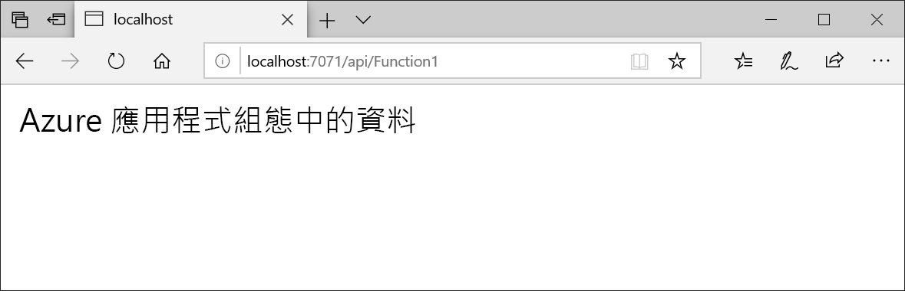

# <a name="quickstart-create-an-azure-function-with-app-configuration"></a>快速入門：使用應用程式設定建立 Azure 函式

Azure 應用程式設定是 Azure 中的受控設定服務。 您能用以輕鬆地在與程式碼分開的單一位置，儲存和管理您所有的應用程式設定。 本快速入門會示範如何將該服務納入 Azure 函式中。 

您可以使用任何程式碼編輯器來進行本快速入門中的步驟。 於 Windows、macOS 和 Linux 平台上所提供的 [Visual Studio Code](https://code.visualstudio.com/) 是項不錯的選擇。



## <a name="prerequisites"></a>必要條件

若要進行本快速入門，請安裝 [Visual Studio 2017](https://visualstudio.microsoft.com/vs)。 確定也已經安裝 **Azure 開發**工作負載。 還要安裝[最新的 Azure Functions 工具](../azure-functions/functions-develop-vs.md#check-your-tools-version)。

[!INCLUDE [quickstarts-free-trial-note](../../includes/quickstarts-free-trial-note.md)]

## <a name="create-an-app-configuration-store"></a>建立應用程式設定存放區

[!INCLUDE [azure-app-configuration-create](../../includes/azure-app-configuration-create.md)]

## <a name="create-a-function-app"></a>建立函數應用程式

[!INCLUDE [Create a project using the Azure Functions template](../../includes/functions-vstools-create.md)]

## <a name="connect-to-an-app-configuration-store"></a>連線至應用程式設定存放區

1. 以滑鼠右鍵按一下專案，然後選取 [管理 NuGet 套件]。 在 [瀏覽] 索引標籤上，搜尋下列 NuGet 套件並新增至您的專案。 如果您找不到它們，請選取 [包括發行前版本] 核取方塊。

    ```
    Microsoft.Extensions.Configuration.AzureAppConfiguration 1.0.0 preview or later
    ```

2. 開啟 *Function1.cs*，並新增應用程式設定 .NET Core 設定提供者的參考。

    ```csharp
    using Microsoft.Extensions.Configuration.AzureAppConfiguration;
    ```

3. 藉由呼叫 `builder.AddAzureAppConfiguration()` 將 `Run` 方法更新為使用應用程式設定。

    ```csharp
    public static async Task<IActionResult> Run(
        [HttpTrigger(AuthorizationLevel.Anonymous, "get", "post", Route = null)] HttpRequest req, ILogger log)
    {
        log.LogInformation("C# HTTP trigger function processed a request.");

        var builder = new ConfigurationBuilder();
        builder.AddAzureAppConfiguration(Environment.GetEnvironmentVariable("ConnectionString"));
        var config = builder.Build();
        string message = config["TestApp:Settings:Message"];
        message = message ?? req.Query["message"];

        string requestBody = await new StreamReader(req.Body).ReadToEndAsync();
        dynamic data = JsonConvert.DeserializeObject(requestBody);
        message = message ?? data?.message;

        return message != null
            ? (ActionResult) new OkObjectResult(message)
            : new BadRequestObjectResult("Please pass a message from a configuration store, on the query string or in the request body");
    }
    ```

## <a name="test-the-function-locally"></a>在本機測試函式

1. 設定名為 **ConnectionString** 的環境變數，並將其設定為應用程式設定存放區的存取金鑰。 如果您使用 Windows 命令提示字元，請執行下列命令，然後重新啟動命令提示字元以讓變更生效：

        setx ConnectionString "connection-string-of-your-app-configuration-store"

    如果您使用 Windows PowerShell，請執行下列命令：

        $Env:ConnectionString = "connection-string-of-your-app-configuration-store"

    如果您使用 macOS 或 Linux，請執行下列命令：

        export ConnectionString='connection-string-of-your-app-configuration-store'

2. 若要測試您的函式，請按 F5。 如果出現提示，請接受 Visual Studio 所發出要下載及安裝 **Azure Functions Core (CLI)** 工具的要求。 您可能也需要啟用防火牆例外狀況，工具才能處理 HTTP 要求。

3. 從 Azure Functions 執行階段輸出複製函式的 URL。

    

4. 將 HTTP 要求的 URL 貼到瀏覽器的網址列。 下圖顯示瀏覽器中對於函式傳回之本機 GET 要求所做出的回應。

    

## <a name="clean-up-resources"></a>清除資源

[!INCLUDE [azure-app-configuration-cleanup](../../includes/azure-app-configuration-cleanup.md)]

## <a name="next-steps"></a>後續步驟

在本快速入門中，您已建立新的應用程式設定存放區，並將其與 Azure 函式搭配使用。 若要深入了解如何使用應用程式設定，請繼續進行下一個示範驗證的教學課程。

> [!div class="nextstepaction"]
> [適用於 Azure 資源整合的受控識別](./integrate-azure-managed-service-identity.md)
